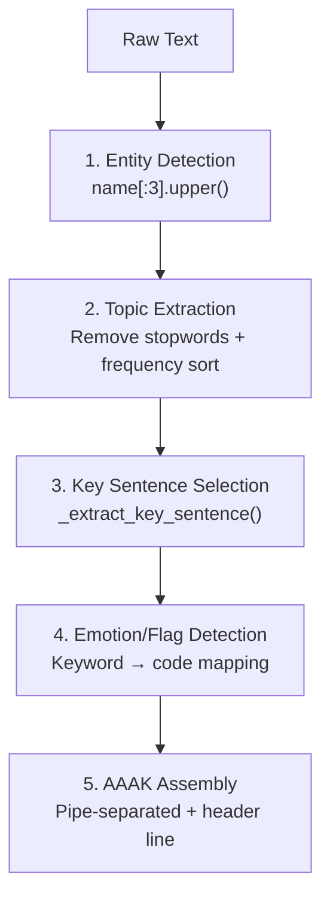

# Appendix C: AAAK Dialect Complete Reference

> This appendix consolidates the `AAAK_SPEC` constant from `mcp_server.py` and the complete
> encoding tables from `dialect.py`, providing a searchable reference for the AAAK dialect.
> Source baseline: the current MemPalace source snapshot discussed in this book.

---

## Overview

AAAK is a compressed shorthand format designed for AI agents. It is not meant for human reading -- it is meant for LLMs. Any model that can read English (Claude, GPT, Gemini, Llama, Mistral) can understand AAAK directly, without a decoder or fine-tuning.

---

## Format Structure

### Line Types

| Prefix | Meaning | Format |
|--------|---------|--------|
| `0:` | Header line | `FILE_NUM\|PRIMARY_ENTITY\|DATE\|TITLE` |
| `Z` + number | Zettel entry | `ZID:ENTITIES\|topic_keywords\|"key_quote"\|WEIGHT\|EMOTIONS\|FLAGS` |
| `T:` | Tunnel (cross-entry link) | `T:ZID<->ZID\|label` |
| `ARC:` | Emotion arc | `ARC:emotion->emotion->emotion` |

### Field Separators

- **Pipe** `|` separates different fields within the same line
- **Arrow** `→` denotes causal or transformational relationships
- **Stars** `★` to `★★★★★` indicate importance (1--5 scale)

---

## Entity Encoding

Entity names are encoded as the first three letters in uppercase:

| Name | Code | Rule |
|------|------|------|
| Alice | ALC | `name[:3].upper()` |
| Jordan | JOR | |
| Riley | RIL | |
| Max | MAX | |
| Ben | BEN | |
| Priya | PRI | |
| Kai | KAI | |
| Soren | SOR | |

Source location: `dialect.py:367-379` (`encode_entity` method)

---

## Emotion Encoding Table

AAAK uses standardized short codes to represent emotional states.

### Core Emotion Codes

| English | Code | Meaning |
|---------|------|---------|
| vulnerability | `vul` | Vulnerability |
| joy | `joy` | Joy |
| fear | `fear` | Fear |
| trust | `trust` | Trust |
| grief | `grief` | Grief |
| wonder | `wonder` | Wonder |
| rage | `rage` | Rage |
| love | `love` | Love |
| hope | `hope` | Hope |
| despair | `despair` | Despair |
| peace | `peace` | Peace |
| humor | `humor` | Humor |
| tenderness | `tender` | Tenderness |
| raw_honesty | `raw` | Raw honesty |
| self_doubt | `doubt` | Self-doubt |
| relief | `relief` | Relief |
| anxiety | `anx` | Anxiety |
| exhaustion | `exhaust` | Exhaustion |
| conviction | `convict` | Conviction |
| quiet_passion | `passion` | Quiet passion |
| warmth | `warmth` | Warmth |
| curiosity | `curious` | Curiosity |
| gratitude | `grat` | Gratitude |
| frustration | `frust` | Frustration |
| confusion | `confuse` | Confusion |
| satisfaction | `satis` | Satisfaction |
| excitement | `excite` | Excitement |
| determination | `determ` | Determination |
| surprise | `surprise` | Surprise |

Source location: `dialect.py:47-88` (`EMOTION_CODES` dictionary)

### Shorthand Markers in the MCP Server

The `AAAK_SPEC` in `mcp_server.py` uses `*marker*` format to annotate emotional context:

| Marker | Meaning |
|--------|---------|
| `*warm*` | Warmth / Joy |
| `*fierce*` | Determination / Resolve |
| `*raw*` | Vulnerability / Raw honesty |
| `*bloom*` | Tenderness / Blossoming |

---

## Emotion Signal Detection

`dialect.py` automatically detects emotions in text via keyword matching:

| Keyword | Mapped Code |
|---------|-------------|
| decided | `determ` |
| prefer | `convict` |
| worried | `anx` |
| excited | `excite` |
| frustrated | `frust` |
| confused | `confuse` |
| love | `love` |
| hate | `rage` |
| hope | `hope` |
| fear | `fear` |
| happy | `joy` |
| sad | `grief` |
| surprised | `surprise` |
| grateful | `grat` |
| curious | `curious` |
| anxious | `anx` |
| relieved | `relief` |
| concern | `anx` |

Source location: `dialect.py:91-114` (`_EMOTION_SIGNALS` dictionary)

---

## Semantic Flags

Flags mark the type of factual assertion, aiding retrieval and classification.

| Flag | Meaning | Trigger Keywords |
|------|---------|-----------------|
| `DECISION` | Explicit decision or choice | decided, chose, switched, migrated, replaced, instead of, because |
| `ORIGIN` | Origin moment | founded, created, started, born, launched, first time |
| `CORE` | Core belief or identity pillar | core, fundamental, essential, principle, belief, always, never forget |
| `PIVOT` | Emotional turning point | turning point, changed everything, realized, breakthrough, epiphany |
| `TECHNICAL` | Technical architecture or implementation detail | api, database, architecture, deploy, infrastructure, algorithm, framework, server, config |
| `SENSITIVE` | Content requiring careful handling | (manually annotated) |
| `GENESIS` | Directly led to the creation of something that still exists | (inferred from context) |

Source location: `dialect.py:117-152` (`_FLAG_SIGNALS` dictionary)

---

## Palace Structure Identifiers

| Element | Format | Example |
|---------|--------|---------|
| Wing | `wing_` + name | `wing_user`, `wing_code`, `wing_myproject` |
| Hall | `hall_` + type | `hall_facts`, `hall_events`, `hall_discoveries`, `hall_preferences`, `hall_advice` |
| Room | Hyphenated slug | `chromadb-setup`, `gpu-pricing`, `auth-migration` |

---

## Full Example

### Original English (~70 tokens)

```
Priya manages the Driftwood team: Kai (backend, 3 years), Soren (frontend),
Maya (infrastructure), and Leo (junior, started last month). They're building
a SaaS analytics platform. Current sprint: auth migration to Clerk.
Kai recommended Clerk over Auth0 based on pricing and DX.
```

### AAAK Encoding (~35 tokens)

```
TEAM: PRI(lead) | KAI(backend,3yr) SOR(frontend) MAY(infra) LEO(junior,new)
PROJ: DRIFTWOOD(saas.analytics) | SPRINT: auth.migration→clerk
DECISION: KAI.rec:clerk>auth0(pricing+dx) | ★★★★
```

### Factual Assertion Verification

| # | Assertion | AAAK Counterpart | Preserved |
|---|-----------|-----------------|-----------|
| 1 | Priya is the team lead | `PRI(lead)` | Yes |
| 2 | Kai does backend | `KAI(backend,3yr)` | Yes |
| 3 | Kai has 3 years of experience | `KAI(backend,3yr)` | Yes |
| 4 | Soren does frontend | `SOR(frontend)` | Yes |
| 5 | Maya does infrastructure | `MAY(infra)` | Yes |
| 6 | Leo is a junior engineer | `LEO(junior,new)` | Yes |
| 7 | Leo started last month | `LEO(junior,new)` | Yes |
| 8 | The project is called Driftwood | `DRIFTWOOD` | Yes |
| 9 | It is a SaaS analytics platform | `saas.analytics` | Yes |
| 10 | Current sprint is auth migration | `SPRINT: auth.migration→clerk` | Yes |
| 11 | Migration target is Clerk | `→clerk` | Yes |
| 12 | Kai recommended Clerk | `KAI.rec:clerk` | Yes |
| 13 | Reasons are pricing and developer experience | `pricing+dx` | Yes |

For this short structured example, all 13/13 factual assertions are preserved. Compression ratio ~2x (this example is short and information-dense).

---

## AAAK_SPEC in the MCP Server

The following is the complete specification passed to the AI via the `mempalace_status` tool, found at `mcp_server.py:102-119`:

```
AAAK is a compressed memory dialect that MemPalace uses for efficient storage.
It is designed to be readable by both humans and LLMs without decoding.

FORMAT:
  ENTITIES: 3-letter uppercase codes. ALC=Alice, JOR=Jordan, RIL=Riley, MAX=Max, BEN=Ben.
  EMOTIONS: *action markers* before/during text. *warm*=joy, *fierce*=determined,
            *raw*=vulnerable, *bloom*=tenderness.
  STRUCTURE: Pipe-separated fields. FAM: family | PROJ: projects | ⚠: warnings/reminders.
  DATES: ISO format (2026-03-31). COUNTS: Nx = N mentions (e.g., 570x).
  IMPORTANCE: ★ to ★★★★★ (1-5 scale).
  HALLS: hall_facts, hall_events, hall_discoveries, hall_preferences, hall_advice.
  WINGS: wing_user, wing_agent, wing_team, wing_code, wing_myproject,
         wing_hardware, wing_ue5, wing_ai_research.
  ROOMS: Hyphenated slugs representing named ideas (e.g., chromadb-setup, gpu-pricing).

EXAMPLE:
  FAM: ALC→♡JOR | 2D(kids): RIL(18,sports) MAX(11,chess+swimming) | BEN(contributor)

Read AAAK naturally — expand codes mentally, treat *markers* as emotional context.
When WRITING AAAK: use entity codes, mark emotions, keep structure tight.
```

Under the current protocol, the AI receives this specification when it explicitly calls `mempalace_status` and a palace already exists. This is not an out-of-band automatic injection path.

---

## Compression Pipeline

The `compress()` method in `dialect.py` performs five-stage processing:



For the current `dialect.compress()` plain-text path, a more accurate description is that all five stages contain heuristic selection, not only Stage 3. Entities, topics, emotions, and flags are all detected and truncated; `key_sentence` is simply the most obvious selection step. The current pipeline is closer to a high-compression index generator than to a strictly lossless encoder.

The "lossless AAAK" discussed elsewhere in the README and book is best understood as a design goal: truly preserving fact-by-fact structure would require a stronger alignment between the compressor and the original text than the current heuristic plain-text pipeline provides.

Source location: `dialect.py:539-602` (`compress` method)

---

## AAAK Dialect Completeness Assessment

### Implemented Capabilities

| Capability | Source Location | Completeness |
|-----------|----------------|-------------|
| Entity encoding | `encode_entity()` :367-379 | Complete — `name[:3].upper()`, supports pre-defined mappings and auto-coding |
| Emotion encoding | `EMOTION_CODES` :47-88 | Complete — 28 emotions → short code mapping |
| Emotion detection | `_EMOTION_SIGNALS` :91-114 | Basic — 24 keyword triggers, simple `in` matching, no context |
| Flag detection | `_FLAG_SIGNALS` :117-152 | Basic — 7 flag types, 36 keywords, simple matching |
| Topic extraction | `_extract_topics()` :430-455 | Basic — word frequency + capitalization/camelCase weighting, top-3 |
| Key sentence | `_extract_key_sentence()` :457-508 | Basic — 18 decision words scored, short sentences weighted, truncated to 55 chars |
| Entity detection | `_detect_entities_in_text()` :510-537 | Basic — known entity matching + capitalized word fallback, top-3 |
| Compression assembly | `compress()` :539-602 | Complete — pipe-separated output format |
| Stop words | `_STOP_WORDS` :155-289 | Complete — ~135 English stop words |
| Config persistence | `from_config()` / `save_config()` | Complete |
| Zettel format | `encode_zettel()` / `compress_file()` | Complete — backward-compatible with legacy format |
| Layer1 generation | `generate_layer1()` | Complete — batch compression + aggregation |
| Compression stats | `compression_stats()` | Complete — original/compressed token counting |

### Missing Critical Capabilities

As a "language," AAAK lacks key linguistic infrastructure:

| Missing | Impact | Severity |
|---------|--------|----------|
| **No formal grammar definition** | No BNF/EBNF/PEG specification; "grammar" exists only in `compress()` code logic | High |
| **No decoder/decompressor** | Only encoding direction; no `decompress()` method to verify reversibility | High |
| **No roundtrip tests** | No `assert decompress(compress(text)) ≈ text` verification | High |
| **No token-level precision** | `count_tokens()` uses `len(text)//3` estimation, not a real tokenizer | Medium |
| **No multilingual support** | Stop words, signal words, entity detection all hardcoded for English | Medium |
| **No versioning** | Encoding format has no version marker; cannot distinguish between different AAAK output versions | Medium |
| **Truncation is irrecoverable** | `key_sentence` truncated to 55 chars (`:506-507`), topics capped at top-3, emotions capped at top-3 — anything beyond is discarded | High |

### Core Qualitative Judgment

**AAAK is not a language — it is a compression function.**

A true language requires three elements:

1. **Syntax** — what constitutes a valid AAAK string. AAAK partially has this (pipe separation, header line format), but without formal definition.
2. **Semantics** — the meaning definition of each symbol. AAAK has this (emotion code table has clear semantics).
3. **Roundtrip capability** — information is preserved after encode→decode. AAAK completely lacks this.

`compress()` is a **one-way function** — it compresses text into AAAK format, but there is no corresponding `decompress()` to verify whether information was actually preserved. The README's "lossless" claim relies on "LLMs can read AAAK" — this delegates verification responsibility to the model's reasoning capability rather than the format's own reversibility guarantee.

### In Fairness

1. **The design intuition is correct** — "extremely abbreviated English, let the LLM be the decoder" genuinely works, because LLM language understanding can fill in omitted information.
2. **Engineering-sufficient** — as a Closet-layer index (not the sole storage), AAAK does not need strict losslessness — Drawers preserve the originals.
3. **Cross-model readability is real** — any English-capable model can indeed understand `KAI(backend,3yr)`; this property does not depend on AAAK's formal completeness.
4. **950 lines of code achieved usability** — for a v3.0.0 project, this implementation sufficiently supports the benchmark results.

### Overall Ratings

| Dimension | Score | Notes |
|-----------|-------|-------|
| Design concept | 8/10 | "LLM as decoder" is an original and effective insight |
| Implementation completeness | 5/10 | Encoder is complete, but lacks decoder and roundtrip verification |
| Formal language completeness | 3/10 | No BNF, no versioning, no formal semantics |
| Engineering utility | 7/10 | Sufficient as an index layer with Drawer as safety net |
| "30x lossless" claim | 3/10 | Over-promises — actually lossy index generation |

**The most honest positioning**: AAAK is an AI-oriented shorthand index format that enables any LLM to quickly understand context summaries through extremely abbreviated English, while relying on the Drawer layer to preserve complete original text as a safety net. Its core value lies not in "lossless compression" but in "cross-model-readable efficient indexing."
