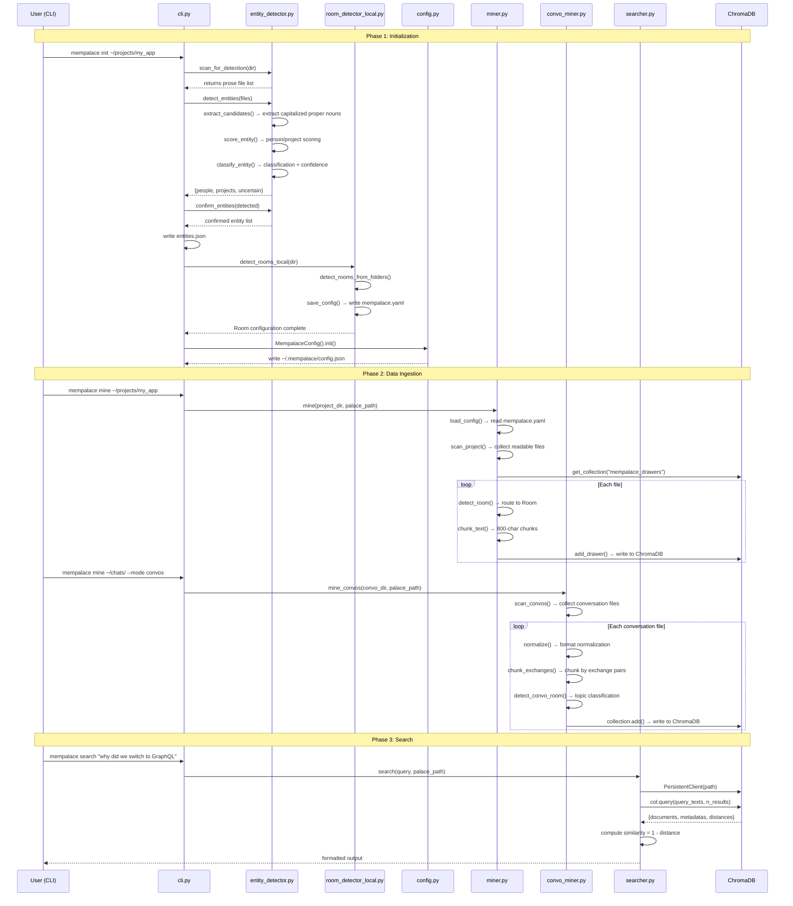

# Appendix A: E2E Trace — From mempalace init to First Search

> This appendix traces a complete user journey: from `pip install mempalace` to the first search returning results. Every step is annotated with source code locations, and every data flow can be verified in the codebase.
> Related chapters: Chapter 5 (Wing-Hall-Room structure), Chapters 16-18 (normalization-entity detection-chunking pipeline), Chapters 14-15 (memory layers and hybrid search).

## Scenario

User Alex has a project directory `~/projects/my_app` containing frontend code (`components/`), backend code (`api/`), documentation (`docs/`), and several Claude Code conversation export files. He wants to:

1. Have MemPalace automatically identify the project structure and generate Room classifications
2. Ingest both project files and conversation records into the memory palace
3. Search for "why did we switch to GraphQL" and find the decision conversation from that time

The entire flow involves three commands: `mempalace init`, `mempalace mine`, `mempalace search`.

## Sequence Diagram



## Phase 1: Initialization (mempalace init)

Initialization is the most critical step in the entire system — it determines how data is organized, and that organization is baked in at write time. Initialization does two things: detect entities (who and what) and detect Rooms (how to classify).

### 1.1 Entry Point: CLI Parsing

The user runs `mempalace init ~/projects/my_app`, and `argparse` passes the `dir` argument to the `cmd_init` function (`cli.py:37`). This function is the orchestrator for the entire initialization flow, calling the entity detection and Room detection subsystems in sequence.

### 1.2 Entity Detection: Pass 1 — File Scanning

`cmd_init` first calls `scan_for_detection(args.dir)` (`cli.py:45`). This function is defined at `entity_detector.py:813`, and its job is to collect files suitable for entity detection.

Key design decision: **prioritize prose files**. `PROSE_EXTENSIONS` (`entity_detector.py:400-405`) includes only `.txt`, `.md`, `.rst`, `.csv`, because capitalized identifiers in code files (class names, function names) would produce a large number of false positives. Only when fewer than 3 prose files are found does it fall back to including code files (`entity_detector.py:834`). Each scan processes at most 10 files (`max_files` parameter), reading only the first 5KB of each file (`entity_detector.py:652`) — this is not laziness, but because if an entity is important enough to remember, it will appear repeatedly near the beginning of files.

### 1.3 Entity Detection: Pass 2 — Extraction and Scoring

`detect_entities(files)` (`entity_detector.py:632`) executes a three-step pipeline:

**Candidate extraction**: `extract_candidates()` (`entity_detector.py:443`) uses the regex `r"\b([A-Z][a-z]{1,19})\b"` to find all capitalized words, filters out a stopword list (`STOPWORDS`, approximately 200 common English words, `entity_detector.py:92-396`), and retains only words appearing 3 or more times. It also uses `r"\b([A-Z][a-z]+(?:\s+[A-Z][a-z]+)+)\b"` to extract multi-word proper nouns (e.g., "Memory Palace", "Claude Code").

**Signal scoring**: For each candidate, `score_entity()` (`entity_detector.py:486`) scores using two sets of regex patterns:

- Person signals (`PERSON_VERB_PATTERNS`, `entity_detector.py:27-48`): action patterns like `{name} said`, `{name} asked`, `hey {name}`. Dialogue markers (`DIALOGUE_PATTERNS`) carry the highest weight, with each match scoring +3. Pronoun proximity detection checks whether `she`/`he`/`they` and other pronouns appear within 3 lines before or after the name.
- Project signals (`PROJECT_VERB_PATTERNS`, `entity_detector.py:72-89`): technical patterns like `building {name}`, `import {name}`, `{name}.py`. Version number markers and code references carry the highest weight, with each match scoring +3.

**Classification**: `classify_entity()` (`entity_detector.py:562`) makes a judgment based on the person/project score ratio. An important safeguard: even if the person score exceeds 70%, if only one signal type is present (e.g., only pronoun matches), the entity is downgraded to "uncertain" (`entity_detector.py:605-609`). This prevents words like "Click" from being misclassified as a person name due to frequent occurrence in `Click said` patterns.

### 1.4 Entity Confirmation and Saving

`confirm_entities()` (`entity_detector.py:717`) lets the user interactively review detection results. If the `--yes` flag is passed, all detected people and projects are automatically accepted, and uncertain items are skipped (`entity_detector.py:739-744`). Confirmed entities are saved as `entities.json` (`cli.py:54-56`) for use by the subsequent miner.

### 1.5 Room Detection

After entity detection completes, `cmd_init` calls `detect_rooms_local(project_dir)` (`cli.py:62`). This function is defined at `room_detector_local.py:270` and performs the following steps:

**Folder scanning**: `detect_rooms_from_folders()` (`room_detector_local.py:97`) traverses the project's top-level and second-level directories, matching folder names against `FOLDER_ROOM_MAP` (`room_detector_local.py:20-94`). This mapping table covers 40+ common folder naming conventions: `frontend/client/ui/components` all map to the "frontend" Room, `backend/server/api/routes/models` all map to the "backend" Room.

For our scenario, `components/` would match to "frontend", `api/` to "backend", and `docs/` to "documentation". If a top-level folder is not in the mapping table but looks like a valid name (length > 2, starts with a letter), it is used directly as the Room name (`room_detector_local.py:128-130`).

**Fallback strategy**: If the folder structure produces only a single "general" Room, the system calls `detect_rooms_from_files()` (`room_detector_local.py:168`) to detect Rooms through keywords in filenames.

**Configuration saving**: `save_config()` (`room_detector_local.py:255`) writes the Wing name (derived from the directory name) and Room list to `mempalace.yaml` in the project directory. For `~/projects/my_app`, the generated configuration looks roughly like:

```yaml
wing: my_app
rooms:
  - name: frontend
    description: Files from components/
  - name: backend
    description: Files from api/
  - name: documentation
    description: Files from docs/
  - name: general
    description: Files that don't fit other rooms
```

### 1.6 Global Configuration

Finally, `MempalaceConfig().init()` (`cli.py:63`) creates the global configuration file `config.json` under `~/.mempalace/` (`config.py:126-138`), containing the palace path (default `~/.mempalace/palace`), collection name (`mempalace_drawers`), topic Wing list, and keyword mappings.

### Initialization Output Summary

| File | Location | Purpose |
|------|----------|---------|
| `entities.json` | `~/projects/my_app/` | Confirmed list of people and projects |
| `mempalace.yaml` | `~/projects/my_app/` | Wing name + Room definitions |
| `config.json` | `~/.mempalace/` | Global configuration (palace path, etc.) |

## Phase 2: Data Ingestion (mempalace mine)

### 2.1 Project File Ingestion

Running `mempalace mine ~/projects/my_app`, `cmd_mine` (`cli.py:66`) calls `mine()` (`miner.py:315`) in the default `projects` mode.

**Configuration loading**: `load_config()` (`miner.py:66`) reads `mempalace.yaml` from the project directory, obtaining the Wing name and Room list.

**File scanning**: `scan_project()` (`miner.py:287`) recursively traverses the project directory, collecting the 20 file types defined in `READABLE_EXTENSIONS` (`miner.py:19-40`) (`.py`, `.js`, `.ts`, `.md`, etc.), skipping directories listed in `SKIP_DIRS` (`miner.py:42-54`) (`.git`, `node_modules`, `__pycache__`, etc.).

**Obtaining the ChromaDB collection**: `get_collection()` (`miner.py:183`) connects to ChromaDB in `PersistentClient` mode and creates or retrieves the collection named `mempalace_drawers`. ChromaDB uses the default `all-MiniLM-L6-v2` model to automatically generate embedding vectors — no API key required.

**Per-file processing**: `process_file()` (`miner.py:233`) executes a three-step pipeline for each file:

1. **Deduplication check**: `file_already_mined()` (`miner.py:192`) queries ChromaDB, and if the source file has already been ingested, skips it immediately.
2. **Room routing**: `detect_room()` (`miner.py:89`) matches by priority: folder path -> filename -> content keywords -> fallback to "general". For `components/Header.tsx`, the first priority (path contains "components", matching the "frontend" Room) hits immediately.
3. **Chunking**: `chunk_text()` (`miner.py:135`) splits file content into 800-character chunks (`CHUNK_SIZE`, `miner.py:56`) with 100-character overlap between adjacent chunks (`CHUNK_OVERLAP`, `miner.py:57`). Split points prefer paragraph boundaries (`\n\n`), followed by line boundaries (`\n`), ensuring no breaks in the middle of sentences. The minimum chunk size is 50 characters (`MIN_CHUNK_SIZE`, `miner.py:58`); shorter fragments are discarded.

**Writing to ChromaDB**: `add_drawer()` (`miner.py:201`) generates a unique ID for each chunk (`drawer_{wing}_{room}_{md5_hash}`) and writes it along with six metadata fields:

```python
{
    "wing": wing,           # project name
    "room": room,           # Room name
    "source_file": source,  # original file path
    "chunk_index": index,   # chunk sequence number within the file
    "added_by": agent,      # ingestion agent
    "filed_at": timestamp,  # ISO 8601 timestamp
}
```

These metadata fields are determined at write time — the filtering capabilities available during search depend entirely on the completeness of annotations at this stage.

### 2.2 Conversation File Ingestion

Running `mempalace mine ~/chats/ --mode convos`, `cmd_mine` (`cli.py:69`) calls `mine_convos()` (`convo_miner.py:252`). Conversation ingestion shares the same ChromaDB collection as project ingestion, but uses a different chunking strategy.

**Format normalization**: Each file first passes through `normalize()` (`convo_miner.py:302`), which unifies different formats from Claude Code, ChatGPT, Slack, and others into a canonical format of `> user question\n AI answer`.

**Exchange-pair chunking**: `chunk_exchanges()` (`convo_miner.py:52`) detects the number of `>` markers in the file. If more than 3 `>` markers are found, it identifies the file as conversation format and calls `_chunk_by_exchange()` (`convo_miner.py:66`) — a user question (`>` line) plus the immediately following AI answer forms an indivisible chunk. If the file is not in conversation format, it falls back to `_chunk_by_paragraph()` (`convo_miner.py:102`) for paragraph-based chunking.

**Topic Room detection**: `detect_convo_room()` (`convo_miner.py:194`) scores the first 3000 characters of the content against `TOPIC_KEYWORDS` (`convo_miner.py:127-191`). Five topic Rooms — technical, architecture, planning, decisions, problems — each have 10-13 keywords. The highest-scoring topic becomes the Room for that conversation. For a GraphQL discussion containing "switched", "chose", and "alternative", the "decisions" Room would receive the highest score.

**Additional metadata at write time**: Conversation chunks include two extra metadata fields beyond project chunks — `"ingest_mode": "convos"` and `"extract_mode": "exchange"` (`convo_miner.py:368-369`). This allows distinguishing between project knowledge and conversation memories during search.

## Phase 3: Search (mempalace search)

### 3.1 Search Entry Point

Running `mempalace search "why did we switch to GraphQL"`, `cmd_search` (`cli.py:94`) calls `search()` (`searcher.py:15`).

### 3.2 Connecting to the Palace

`search()` first connects to ChromaDB using `PersistentClient` and obtains the `mempalace_drawers` collection (`searcher.py:21-22`). If the palace does not exist, it immediately returns an error and suggests the user run `init` and `mine` first (`searcher.py:24-26`).

### 3.3 Building Filters

If the user specifies `--wing` or `--room`, `search()` builds a ChromaDB `where` filter (`searcher.py:29-35`). When both are specified, it uses an `$and` compound query:

```python
where = {"$and": [{"wing": wing}, {"room": room}]}
```

This is the core of MemPalace's hybrid search: first use metadata for exact filtering (narrowing the search scope), then perform vector similarity search on the filtered subset. For the query "why did we switch to GraphQL", if the user adds `--wing my_app --room decisions`, the search space might shrink from thousands of Drawers to a few dozen.

### 3.4 Executing the Query

`col.query()` (`searcher.py:46`) vectorizes the query text (ChromaDB internally uses the `all-MiniLM-L6-v2` model), then finds the `n_results` nearest neighbor vectors in the collection. It returns three parallel arrays: `documents` (original text), `metadatas` (metadata), and `distances` (vector distances).

### 3.5 Result Formatting

`searcher.py:68-83` formats the output. Similarity is calculated as `1 - distance` (`searcher.py:69`), since ChromaDB uses cosine distance by default. The output includes:

```
  [1] my_app / decisions
      Source: graphql-migration.md
      Match:  0.847

      > Why did we switch from REST to GraphQL?
      We discussed this on Tuesday. The main reasons were...
```

Each result is annotated with Wing (which project it came from), Room (which classification it belongs to), source (original filename), and match (similarity score), along with the full original text — not a summary, not a paraphrase, but the exact words the user wrote at the time.

### 3.6 Programmatic Search Interface

Beyond CLI output, `search_memories()` (`searcher.py:87`) provides a dictionary-returning programmatic interface for use by the MCP server and other callers. Return format:

```python
{
    "query": "why did we switch to GraphQL",
    "filters": {"wing": "my_app", "room": "decisions"},
    "results": [
        {
            "text": "original text...",
            "wing": "my_app",
            "room": "decisions",
            "source_file": "graphql-migration.md",
            "similarity": 0.847,
        }
    ],
}
```

## What This Trace Reveals

Looking back at the complete data flow, three design principles emerge:

**Structure before content.** The `init` phase determines the palace's skeleton — Wing name, Room list, entity mappings — before any data is ingested. This is not engineering laziness but a deliberate choice: if you do not know who and what exists in your world, no amount of vector embeddings will help you. The two signal pattern categories in entity detection (person verbs vs. project verbs) and the dual-signal safeguard mechanism (`entity_detector.py:601`) are all designed to get classification right before data enters the palace.

**Metadata is determined at write time.** Each Drawer's Wing, Room, and source_file are fixed at the moment `add_drawer()` is called. The filtering capabilities available during search derive entirely from the annotation quality at write time. This means that if the routing logic in `detect_room()` is wrong, the error is permanently preserved — but it also means that search requires no additional classification computation and is extremely fast. The six metadata fields in `miner.py:201-225` represent the upper bound of MemPalace's search capabilities.

**Same palace, different ingestion strategies.** Project files and conversation files are both written to the same `mempalace_drawers` collection (`miner.py:188`, `convo_miner.py:217`), but their chunking logic is entirely different: project files are split by a fixed 800-character window (`miner.py:56`), while conversation files are split at semantic boundaries defined by exchange pairs (`convo_miner.py:66`). Both strategies serve the same type of query — when you search for "why did we switch to GraphQL", results from code comments and conversation memories appear side by side, ranked by a unified similarity score. This is the practical effect of the Wing-Hall-Room structure from Chapter 5: structure provides classification, vectors provide association, and the two do not interfere with each other.
