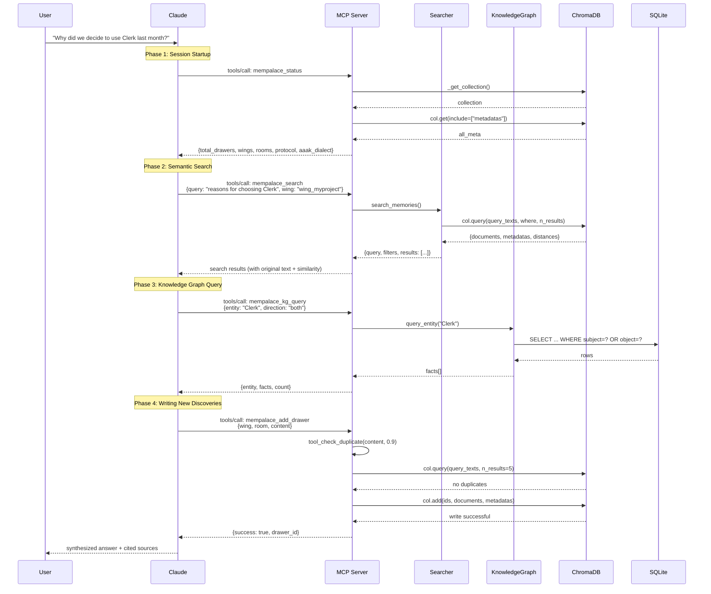

# Appendix B: E2E Trace — MCP Tool Call Lifecycle

> This appendix traces a real AI-to-MemPalace interaction, from user question to final answer, showing the data flow under the MCP protocol frame by frame.
> Related chapters: Chapter 19 (MCP server), Chapter 11 (knowledge graph), Chapter 9 (AAAK).

## Scenario

The user opens Claude Code and types what seems like a simple question:

> "Why did we decide to use Clerk last month?"

This question implicitly contains three layers of requirements: time filtering ("last month"), decision tracing ("why"), and entity identification ("Clerk"). Claude cannot guess from thin air — it needs to check the palace. Over the next few hundred milliseconds, the MCP protocol will drive four phases of tool calls, each with precise input/output boundaries.

## Sequence Diagram: Complete Lifecycle



## Phase 1: Session Startup (mempalace_status)

Every time Claude interacts with MemPalace, the first call is always `mempalace_status`. This is not optional — the first rule of `PALACE_PROTOCOL` states:

> "ON WAKE-UP: Call mempalace_status to load palace overview + AAAK spec."

(`mcp_server.py:94`)

### Request

The MCP client sends a JSON-RPC request:

```json
{
  "jsonrpc": "2.0",
  "id": 1,
  "method": "tools/call",
  "params": {
    "name": "mempalace_status",
    "arguments": {}
  }
}
```

This request is routed by `handle_request()` to the `tools/call` branch (`mcp_server.py:719`), then dispatched through the `TOOLS` dictionary to the `tool_status()` function (`mcp_server.py:63`).

### Execution Path

`tool_status()` first calls `_get_collection()` (`mcp_server.py:41-49`) to obtain the ChromaDB collection. If the collection does not exist — for example, if the user has never run `mempalace init` — the function returns `_no_palace()` (`mcp_server.py:52-57`), providing clear remediation guidance:

```python
def _no_palace():
    return {
        "error": "No palace found",
        "palace_path": _config.palace_path,
        "hint": "Run: mempalace init <dir> && mempalace mine <dir>",
    }
```

When the palace exists, `tool_status()` iterates over all metadata, tallying Wing and Room distributions (`mcp_server.py:70-78`), then returns a dictionary with six fields.

### Triple Payload

The return value of `tool_status()` is more than just statistics. It carries a triple payload (`mcp_server.py:79-86`):

```python
return {
    "total_drawers": count,          # Payload 1: Palace overview
    "wings": wings,
    "rooms": rooms,
    "palace_path": _config.palace_path,
    "protocol": PALACE_PROTOCOL,     # Payload 2: Behavioral protocol
    "aaak_dialect": AAAK_SPEC,       # Payload 3: AAAK specification
}
```

**Payload 1: Palace overview.** `total_drawers`, `wings`, `rooms` tell the AI how large this palace is and what domains it covers. The AI uses this to decide which Wing to constrain subsequent searches to.

**Payload 2: Behavioral protocol.** `PALACE_PROTOCOL` (`mcp_server.py:93-100`) consists of five behavioral rules, the most critical being the second and third:

> "BEFORE RESPONDING about any person, project, or past event: call mempalace_kg_query or mempalace_search FIRST. Never guess — verify."
>
> "IF UNSURE about a fact: say 'let me check' and query the palace. Wrong is worse than slow."

These two rules switch the AI from "generation mode" to "verification mode". Without this protocol, the AI would simply fabricate answers.

**Payload 3: AAAK specification.** `AAAK_SPEC` (`mcp_server.py:102-119`) teaches the AI how to read and write the AAAK compression format — entity codes (`ALC=Alice`), sentiment markers (`*warm*=joy`), structural delimiters (pipe-separated fields). This means the AI can directly understand AAAK-formatted text returned by subsequent searches.

The design intent behind this triple payload is: in a single call, the AI acquires all the context needed to operate the palace. No configuration files to read, no additional initialization steps required.

## Phase 2: Search (mempalace_search)

After receiving the status, Claude parses the user's question and constructs a search request. It knows "Clerk" is most likely related to project decisions, so it constrains the search to `wing_myproject`.

### Request

```json
{
  "jsonrpc": "2.0",
  "id": 2,
  "method": "tools/call",
  "params": {
    "name": "mempalace_search",
    "arguments": {
      "query": "reasons for choosing Clerk",
      "wing": "wing_myproject",
      "limit": 5
    }
  }
}
```

### Execution Path

`tool_search()` (`mcp_server.py:173-180`) is a thin proxy — it passes parameters directly through to `search_memories()`:

```python
def tool_search(query: str, limit: int = 5, wing: str = None, room: str = None):
    return search_memories(
        query,
        palace_path=_config.palace_path,
        wing=wing,
        room=room,
        n_results=limit,
    )
```

The actual search logic resides in the `search_memories()` function at `searcher.py:87-142`. This function does three things:

**Step 1: Build the where filter** (`searcher.py:100-107`). When both Wing and Room are specified, it uses ChromaDB's `$and` compound condition; when only one is specified, it passes a single condition directly. This branching logic may appear simple, but it determines whether the search spans the entire palace or is constrained to a specific area:

```python
where = {}
if wing and room:
    where = {"$and": [{"wing": wing}, {"room": room}]}
elif wing:
    where = {"wing": wing}
elif room:
    where = {"room": room}
```

**Step 2: Execute the semantic query** (`searcher.py:109-118`). When calling `col.query()`, it passes `query_texts` (the vectorized query), `n_results` (number of results to return), `include` (fields to return), and the optional `where` filter. ChromaDB internally embeds the query text as a vector, computes cosine distances against all Drawer vectors, and returns the N nearest results.

**Step 3: Assemble the return value** (`searcher.py:126-142`). Each search result contains five fields: `text` (original text), `wing`, `room`, `source_file` (source filename), and `similarity` (similarity score, computed as `1 - distance`).

```python
hits.append({
    "text": doc,
    "wing": meta.get("wing", "unknown"),
    "room": meta.get("room", "unknown"),
    "source_file": Path(meta.get("source_file", "?")).name,
    "similarity": round(1 - dist, 3),
})
```

### Example Return Value

```json
{
  "query": "reasons for choosing Clerk",
  "filters": {"wing": "wing_myproject", "room": null},
  "results": [
    {
      "text": "AUTH.DECISION:2026-03|chose.Clerk→Auth0.rejected|*pragmatic*...",
      "wing": "wing_myproject",
      "room": "decisions",
      "source_file": "meeting-2026-03-12.md",
      "similarity": 0.847
    }
  ]
}
```

Note that the returned `text` is in AAAK format. Because Phase 1 already loaded the AAAK specification into Claude's context, Claude can directly expand `AUTH.DECISION:2026-03|chose.Clerk→Auth0.rejected` into natural language.

## Phase 3: Knowledge Graph Query (mempalace_kg_query)

The search returned the original record of "choosing Clerk", but Claude wants to know more: what is Clerk's relationship to other project components? Did it replace a previous solution? These kinds of relationship queries are exactly where the knowledge graph excels.

### Request

```json
{
  "jsonrpc": "2.0",
  "id": 3,
  "method": "tools/call",
  "params": {
    "name": "mempalace_kg_query",
    "arguments": {
      "entity": "Clerk",
      "direction": "both"
    }
  }
}
```

### Execution Path

`tool_kg_query()` (`mcp_server.py:309-312`) forwards the request to `KnowledgeGraph.query_entity()`:

```python
def tool_kg_query(entity: str, as_of: str = None, direction: str = "both"):
    results = _kg.query_entity(entity, as_of=as_of, direction=direction)
    return {"entity": entity, "as_of": as_of, "facts": results, "count": len(results)}
```

`query_entity()` (`knowledge_graph.py:186-241`) is the core query method of the knowledge graph. It accepts three parameters: `name` (entity name), `as_of` (time-point filter), and `direction` (query direction).

**Entity ID normalization.** First, `_entity_id()` (`knowledge_graph.py:92-93`) converts the entity name to lowercase-underscore format: `"Clerk"` becomes `"clerk"`. This ensures case-insensitive matching.

**Bidirectional query.** When `direction="both"`, the function executes two SQL queries. The first queries outgoing relationships (`knowledge_graph.py:198-217`) — "what does Clerk point to":

```sql
SELECT t.*, e.name as obj_name
FROM triples t JOIN entities e ON t.object = e.id
WHERE t.subject = ?
```

The second queries incoming relationships (`knowledge_graph.py:219-238`) — "what points to Clerk":

```sql
SELECT t.*, e.name as sub_name
FROM triples t JOIN entities e ON t.subject = e.id
WHERE t.object = ?
```

**Time filtering.** If an `as_of` parameter is provided, both queries append a time window condition (`knowledge_graph.py:201-203`):

```sql
AND (t.valid_from IS NULL OR t.valid_from <= ?)
AND (t.valid_to IS NULL OR t.valid_to >= ?)
```

This means only facts that are still valid at the `as_of` point in time are returned. Facts that have been marked expired by `invalidate()` (`valid_to` is not NULL) are automatically excluded.

### Return Value Structure

Each fact includes full timestamps and validity markers:

```json
{
  "entity": "Clerk",
  "as_of": null,
  "facts": [
    {
      "direction": "outgoing",
      "subject": "Clerk",
      "predicate": "replaces",
      "object": "Auth0",
      "valid_from": "2026-03-12",
      "valid_to": null,
      "confidence": 1.0,
      "source_closet": "drawer_wing_myproject_decisions_a3f2...",
      "current": true
    },
    {
      "direction": "incoming",
      "subject": "MyProject",
      "predicate": "uses",
      "object": "Clerk",
      "valid_from": "2026-03-12",
      "valid_to": null,
      "confidence": 1.0,
      "source_closet": null,
      "current": true
    }
  ],
  "count": 2
}
```

`current: true` indicates this fact is still valid (`valid_to` is NULL). If `source_closet` is present, it points to the original source of the knowledge graph fact — a Drawer ID in ChromaDB, forming a back-link from the knowledge graph to the vector store.

## Phase 4: Memory Writing (mempalace_add_drawer)

Claude synthesized the search results and knowledge graph query to answer the user. The conversation may have produced new information — for example, the user adds "Right, Auth0's pricing went up 40% at that time, which was also a factor." Claude decides to store this new discovery in the palace.

### Request

```json
{
  "jsonrpc": "2.0",
  "id": 4,
  "method": "tools/call",
  "params": {
    "name": "mempalace_add_drawer",
    "arguments": {
      "wing": "wing_myproject",
      "room": "decisions",
      "content": "AUTH.COST:2026-03|Auth0.price↑40%→triggered.Clerk.eval|★★★",
      "added_by": "mcp"
    }
  }
}
```

### Execution Path

The first thing `tool_add_drawer()` (`mcp_server.py:250-287`) does is not write — it checks for duplicates.

**Idempotency protection.** The function calls `tool_check_duplicate(content, threshold=0.9)` at line 259. `tool_check_duplicate()` (`mcp_server.py:183-215`) performs a semantic search on the incoming content, returning any existing Drawers with similarity at or above 0.9. If a duplicate is found, the write is aborted immediately:

```python
dup = tool_check_duplicate(content, threshold=0.9)
if dup.get("is_duplicate"):
    return {
        "success": False,
        "reason": "duplicate",
        "matches": dup["matches"],
    }
```

This design addresses a practical problem: an AI may repeatedly attempt to write the same content across multiple conversation turns, or two agents in the same session may independently discover the same fact. The 0.9 threshold allows minor variations in wording but blocks semantic duplicates.

**ID generation.** A unique ID is generated via an MD5 hash of the first 100 characters of content plus the current timestamp (`mcp_server.py:267`):

```python
drawer_id = f"drawer_{wing}_{room}_{hashlib.md5(
    (content[:100] + datetime.now().isoformat()).encode()
).hexdigest()[:16]}"
```

The ID format `drawer_{wing}_{room}_{hash}` is self-describing — the Wing and Room that a Drawer belongs to can be determined from its ID alone.

**Writing to ChromaDB.** The final step calls `col.add()` (`mcp_server.py:270-284`), writing the document (original text) and metadata (wing, room, source_file, chunk_index, added_by, filed_at). ChromaDB automatically computes the document's embedding vector at write time, making it discoverable by subsequent searches.

### Metadata Design

The metadata written (`mcp_server.py:276-283`) is worth noting:

```python
{
    "wing": wing,
    "room": room,
    "source_file": source_file or "",
    "chunk_index": 0,
    "added_by": added_by,        # "mcp" indicates AI-written
    "filed_at": datetime.now().isoformat(),
}
```

The `added_by` field distinguishes the source of memories: `"mcp"` indicates the AI wrote it via MCP, while `"mine"` indicates it was extracted from files by the `mempalace mine` command. `filed_at` is the write time, not the event time — the event time is encoded in the AAAK content itself (e.g., `AUTH.COST:2026-03`).

## What This Trace Reveals

### The Triple Payload of Status Is Deliberate Design

Embedding the behavioral protocol and AAAK specification in the return value of `tool_status()`, rather than as separate tools, is an architectural decision. It leverages a behavioral characteristic of AI: the AI reads the entire content returned by a tool. By "piggybacking" the rules on the status query, it ensures the AI knows which protocol to follow before performing any operations. If the protocol and specification were split into separate tools, the AI might forget to call them.

However, this also implies a precondition: the palace must already be initialized. When `_get_collection()` returns `None`, `tool_status()` returns `_no_palace()` (`mcp_server.py:64-65`), which does not include the `protocol` and `aaak_dialect` fields. In other words, an AI without a palace does not receive the behavioral protocol — this serves as both a defense (preventing the protocol from acting on an empty palace) and a prompt (the AI sees the `hint` field and guides the user to initialize).

### Search Metadata Filtering Is a Layered Architecture

The `where` filter construction logic in `searcher.py` (`searcher.py:100-107`) implements three levels of search granularity: full-palace search (no Wing/Room specified), Wing-level search (only Wing specified), and Room-level search (both Wing and Room specified). This corresponds to the spatial metaphor of the memory palace — you can search the entire palace, or only within a specific Room of a specific Wing.

Semantic search operates in ChromaDB's vector space; metadata filtering operates in the SQLite index. Their combination means that even if the user's query semantically matches content across multiple Wings, the Wing filter ensures only results from the relevant domain are returned.

### Write Idempotency Compensates for AI Behavior

A known issue with AI is repetitive operations — across multiple conversation turns, it may forget that it has already written a particular memory and attempt to write it again. The `tool_check_duplicate()` call in `tool_add_drawer()` (`mcp_server.py:259`) is precisely an engineering compensation for this problem. The 0.9 similarity threshold is an empirical value: high enough to allow wording variants ("Auth0 raised prices" vs. "Auth0's pricing increased"), yet strict enough to catch substantive duplicates.

Note that deduplication and writing use the same ChromaDB collection, and deduplication itself is a vector search. This means the cost of deduplication is comparable to a regular search — at the typical scale of a personal knowledge base (thousands to tens of thousands of records), this overhead is negligible.

### Transparency of the MCP Protocol Layer

Throughout the entire interaction chain, `handle_request()` (`mcp_server.py:691-743`) plays an extremely simple role: parse JSON-RPC, route to the corresponding handler, and wrap the return value as a JSON-RPC response. It performs no business logic. All tool handlers are ordinary Python functions that accept basic-type parameters and return dictionaries. This means these functions can be called directly (e.g., in tests), without depending on the MCP protocol layer.

The transparency of the MCP protocol layer is also reflected in error handling: if a handler throws an exception, `handle_request()` catches it and returns a JSON-RPC error object (`mcp_server.py:735-737`), containing error code `-32000` and the exception message. Upon receiving this error, the AI can decide whether to retry, try a different query approach, or simply tell the user something went wrong.

---

These four phases — startup, search, graph query, write — constitute the basic cycle of MemPalace MCP interactions. Not every conversation will go through all phases (sometimes search alone is sufficient, with no need for graph queries or writes), but the Phase 1 status call is the mandatory starting point. The triple payload it loads determines all of the AI's behavioral boundaries for that session.
