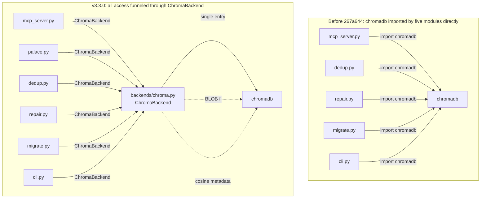

# Appendix E: Storage Backend Abstraction

> **Positioning**: This appendix dissects the `backends/` directory introduced in v3.3.0 — a thin abstraction that funnels all ChromaDB access through a single seam. It is not a "completed pluggable storage layer" but rather "**the minimum necessary refactor to prepare for future pluggability**." Understanding this layer helps judge how far MemPalace is from escaping ChromaDB, and how the v3.0.0 legacy of "every module directly imports chromadb" was unwound.

---

## Why This Abstraction Arrives Only in v3.3.0

Pre-v3.3.0 MemPalace carried a problem that any long-lived codebase will encounter: **the data-store dependency was directly referenced by every consuming module**. Chapter 14 and Appendix D hint at this, but neither drills down to the module level.

Before the `267a644` refactor, the call graph looked roughly like this:

- `mcp_server.py` `import chromadb` and built its own `PersistentClient`
- `dedup.py` `import chromadb` itself
- `repair.py` `import chromadb` itself
- `migrate.py` `import chromadb` itself
- `cli.py` had at least two independent `import chromadb` sites

Five modules, each configuring the client in slightly different ways: some passed `settings`, some didn't; some handled the chromadb 0.6→1.5 BLOB `seq_id` migration bug, some didn't; some explicitly set `hnsw:space=cosine`, some didn't. This is exactly the phenomenon Appendix D points at — "the underlying behavior of a single palace may differ across code paths."

Issue #807 in v3.2 is a textbook product of this inconsistency: some collection-creation sites had `{"hnsw:space": "cosine"}`, others didn't. With ChromaDB silently falling back to L2, the "0.9 cosine similarity threshold for dedup" that Chapter 15 depends on was **not actually running the same distance** across code paths.

Commit `267a644` in v3.3.0 ("refactor: route all chromadb access through ChromaBackend") cut this at the root: **all ChromaDB access must flow through `ChromaBackend`**. None of the five modules listed above still `import chromadb` directly — they all switched to `from .backends.chroma import ChromaBackend`. Together with `palace.py` (introduced in v3.2 and already using `ChromaBackend` from day one), this forms v3.3.0's "all access funneled through a single seam" structure. This is the quietest but highest-leverage structural change in v3.3.0.

---

## BaseCollection: Minimizing the Contract

`backends/base.py` is only 49 lines and defines the entire storage abstraction — `BaseCollection` (`backends/base.py:7-49`):

```python
class BaseCollection(ABC):
    """Smallest collection contract the rest of MemPalace relies on."""

    @abstractmethod
    def add(self, *, documents, ids, metadatas=None): ...

    @abstractmethod
    def upsert(self, *, documents, ids, metadatas=None): ...

    @abstractmethod
    def update(self, **kwargs): ...

    @abstractmethod
    def query(self, **kwargs): ...

    @abstractmethod
    def get(self, **kwargs): ...

    @abstractmethod
    def delete(self, **kwargs): ...

    @abstractmethod
    def count(self): ...
```

Seven methods. Two things about this list are unusual:

**First, there is no `embed` or `create_index` method.** Embedding is done inside ChromaDB — you `add` text, it automatically runs the configured embedding function. `BaseCollection` doesn't surface this, which means the implicit assumption of "swap the backend" is that **the new backend must also handle its own embeddings**, or MemPalace must add an `embedder` abstraction at the call-site layer. The latter has not been done yet.

**Second, `query` / `get` / `update` / `delete` all use `**kwargs`.** This looks permissive — but actually it's an admission that **this contract is not a clean database abstraction; it is a strip-down of ChromaDB's API shape**. The keyword arguments `query` expects (`query_texts`, `n_results`, `where`, `include`) are all ChromaDB native names.

The implication is very specific: **the point of `BaseCollection` is not to be compatible with many vector databases — it is to put a replaceable seam on top of ChromaDB's call semantics**. To plug in Qdrant or LanceDB for real, each concrete backend would still need to translate those `**kwargs` into its native API.

This is a common but underappreciated stance on abstraction: **don't over-generalize prematurely**. v3.3.0 chose "first unify the ChromaDB call surface" over "abstract a universal vector store in one pass." The latter is more seductive, but it's also easier to get the contract wrong when you don't yet know what Qdrant or LanceDB's actual shape will demand.

---

## ChromaCollection: The Thin Adapter

`backends/chroma.py:46-71` defines `ChromaCollection` — the only implementation of `BaseCollection`. It is extremely thin: 26 lines of code, doing exactly one thing — **forwarding method calls to the underlying chromadb collection object**.

```python
class ChromaCollection(BaseCollection):
    """Thin adapter over a ChromaDB collection."""

    def __init__(self, collection):
        self._collection = collection

    def add(self, *, documents, ids, metadatas=None):
        self._collection.add(documents=documents, ids=ids, metadatas=metadatas)

    def query(self, **kwargs):
        return self._collection.query(**kwargs)

    # ... upsert / update / get / delete / count all pass through identically
```

This "almost-non-existent" adapter has a clear engineering purpose: **making the refactor semantically free**.

If `ChromaCollection` normalized parameters in `add`, reshaped results in `query`, or added extra audit in `delete`, then switching from v3.0.0's direct `collection.add(...)` to v3.3.0's `ChromaCollection.add(...)` would not be an "equivalent replacement" but a "behavior change." That would require regression tests to accompany the `267a644` mass refactor.

Pure pass-through turns `267a644` into a **zero-behavior-change rewiring**. Every call site keeps the same semantics; only the path changes. That makes the refactor about as risky as "moving code," without needing to re-run benchmarks to prove behavioral equivalence.

**What is the cost?** `ChromaCollection` now has almost no "abstraction value" — it is just `chromadb.Collection` with one extra layer of indirection. If in the future we want to add cross-backend logic (audit logging, write throttling, metrics), this will need to be upgraded from "pass-through" to "decorator." v3.3.0 does not go that far — this is **a deliberately deferred decision**.

---

## ChromaBackend: Palace-Level Lifecycle Management

The `ChromaBackend` class (`backends/chroma.py:74-152`) is much heavier than `ChromaCollection`, handling four categories of work:

**1. Client caching.** Each `palace_path` caches a single `chromadb.PersistentClient`. Multiple calls to `get_collection` won't repeatedly open the same palace directory, avoiding HNSW index state drift caused by concurrent or duplicate opens in ChromaDB.

```python
def _client(self, palace_path: str):
    if palace_path not in self._clients:
        _fix_blob_seq_ids(palace_path)
        self._clients[palace_path] = chromadb.PersistentClient(path=palace_path)
    return self._clients[palace_path]
```

Note that `_fix_blob_seq_ids(palace_path)` is called **before** `PersistentClient` is created. This is the next category.

**2. ChromaDB 0.6→1.5 BLOB migration fix.** The `_fix_blob_seq_ids` function introduced by v3.2's PR `#664` (`backends/chroma.py:14-43`) is now collapsed into this layer — before any client is opened, it directly operates on `chroma.sqlite3` to convert rows in the `embeddings` and `max_seq_id` tables where `typeof(seq_id) = 'blob'` into integers.

```python
updates = [(int.from_bytes(blob, byteorder="big"), rowid) for rowid, blob in rows]
conn.executemany(f"UPDATE {table} SET seq_id = ? WHERE rowid = ?", updates)
```

This code's presence matters because it illustrates **why this abstraction must exist**. In v3.0.0, this fix was scattered across every `import chromadb` site — meaning some code paths triggered the fix, others didn't. v3.3.0 pins the fix at the **single client-creation entry point**: pass through `ChromaBackend`, and BLOB fixing is guaranteed.

**3. Enforced cosine distance metric.** `get_collection(create=True)` (`backends/chroma.py:115-133`) hardcodes `metadata={"hnsw:space": "cosine"}`. `create_collection` (`backends/chroma.py:145-152`) exposes a `hnsw_space` parameter, but defaults to `cosine`. This is the landing point of issue #807's fix — no longer relying on callers to remember to pass the metadata.

**4. Palace directory permissions.** `os.makedirs(palace_path, exist_ok=True)` followed by `os.chmod(palace_path, 0o700)` — only the owner can read/write/execute. This is a small privacy bastion, consistent with Chapter 24's "local-first is not a compromise": palace contents don't just stay on the machine physically, they don't open up to other local users at the filesystem permission layer either.

---

## The Call Graph Shift

The Mermaid diagram below contrasts the call graphs before and after `267a644`.



Left: five modules each directly call `chromadb`, with BLOB fixing and cosine metadata configuration scattered across different code paths. Right: six modules (including `palace.py` added in v3.2) all route through `ChromaBackend`, with client caching, migration fix, and distance metric guaranteed at a single point.

The concrete import changes can be read from grep results (`mempalace/*.py`):

- `mcp_server.py:35`: `from .backends.chroma import ChromaBackend, ChromaCollection`
- `mcp_server.py:180`: `_client_cache = ChromaBackend.make_client(_config.palace_path)` (a dedicated path for the long-lived MCP process — see below)
- `palace.py:11`: `from .backends.chroma import ChromaBackend`
- `palace.py:39`: `_DEFAULT_BACKEND = ChromaBackend()` — module-level singleton
- `dedup.py:133`, `dedup.py:165`: `col = ChromaBackend().get_collection(...)`
- `cli.py:196`, `cli.py:321`: `backend = ChromaBackend()`
- `migrate.py:155`: `target_version = ChromaBackend.backend_version()`
- `migrate.py:211`: `fresh_backend = ChromaBackend()`
- `repair.py:93`, `repair.py:176`, `repair.py:223`: three independent usages

Worth noting is `palace.py:39`'s `_DEFAULT_BACKEND = ChromaBackend()` — a **module-level singleton**. Meanwhile `dedup.py` / `repair.py` / `cli.py` create **a new instance per call**. Coexistence of these two patterns signals that v3.3.0 has not fully unified backend lifecycle policy. For long-running processes (MCP server, direct consumers of the `palace` module), a singleton is sensible — client caches get reused across requests. For one-shot scripts (`cli.py`'s subcommands, `dedup.py`'s ops calls), a new instance is fine — the process exits immediately afterward.

---

## The Special Path in mcp_server.py: `make_client`

`ChromaBackend` also exposes a static method `make_client` (`backends/chroma.py:96-104`):

```python
@staticmethod
def make_client(palace_path: str):
    """Create and return a fresh PersistentClient (fix BLOB seq_ids first).

    Intended for long-lived callers (e.g. mcp_server) that keep their own
    inode/mtime-based client cache.
    """
    _fix_blob_seq_ids(palace_path)
    return chromadb.PersistentClient(path=palace_path)
```

The comment is unusually direct: "For long-lived callers that manage their own client caching." This corresponds to `mcp_server.py:180`'s usage — the MCP server maintains its own inode+mtime-based client cache (PR `#757`'s bug fix: detect mtime changes to keep the HNSW index in sync with external CLI modifications).

The existence of such a special path signals: **`ChromaBackend` is not an airtight façade**. It lets callers "pierce through" to the underlying `chromadb.PersistentClient` when they have legitimate reasons. For scenarios willing to accept coupling cost in exchange for fine-grained control (the MCP server's stale index detection), there is a sanctioned hatch.

This compromise is pragmatic. An airtight abstraction offers formal elegance but pushes problems like `#757` into "worse places to fix" — for example, adding a generic inode/mtime-aware caching interface to `ChromaBackend` that the other five call sites don't need. **Exposing `make_client` as an acknowledged escape hatch is more honest than designing a bloated universal interface.**

---

## What Has Not Yet Been Done: Truly Pluggable Backends

`backends/__init__.py` only exports `BaseCollection` / `ChromaBackend` / `ChromaCollection`. No `register_backend`, no `load_backend_from_config`, no `BackendRegistry`. **The abstraction in v3.3.0 is "there is a seam," not "there is a pluggable registry."**

Additional things needed to actually swap backends:

1. **A `BaseBackend` abstraction** (there's only `BaseCollection` today). `ChromaBackend`'s methods have no `abstractmethod` signature — it is directly the chromadb factory. Swapping backends would first require lifting `get_collection / get_or_create_collection / delete_collection / create_collection / backend_version` into a `BaseBackend` ABC.
2. **An embedding model abstraction.** Today embeddings are handled by ChromaDB itself. Swapping to a backend that doesn't bring its own embeddings (Qdrant, LanceDB, custom SQLite + sqlite-vec) requires a separate embedder. The "local model" discussion in Chapter 21 is currently coupled to ChromaDB.
3. **A metadata / where-clause translation layer.** Each vector DB has its own filter syntax: ChromaDB uses Python dicts (`{"wing": "wing_user"}`), Qdrant uses `Filter` objects, LanceDB uses SQL-like strings. `BaseCollection.query(**kwargs)`'s `where` currently assumes ChromaDB's dict format — swapping backends requires translation in the adapter.
4. **HNSW parameter semantic alignment.** `hnsw:space=cosine` is ChromaDB's proprietary metadata key. Other backends have analogous concepts with different names.
5. **A config layer.** `config.py` has no `backend` field. What to read, what to write, what default to use for backend selection — all hardcoded today.

This unfinished list is not a criticism of v3.3.0's work. On the contrary, it **tells you clearly how far is left to go**. The value of moving from "all modules directly `import chromadb`" to "there is a seam" is not "we can swap backends now" but:

- The next ChromaDB configuration tweak (like another #807-style fix) only requires touching one file
- When we eventually do swap backends, there's a clear starting point instead of six scattered call sites
- Part 10's mempal (Rust reforge) uses SQLite + sqlite-vec instead of ChromaDB — in this direction MemPalace has a loose coupling point, even if incomplete

Put differently: **v3.3.0's `backends/` is not a "completed pluggable storage layer" — it is a "necessary down payment on decoupling."** It funnels the implicit dependency scattered across five modules (roughly a dozen `import chromadb` sites in total) into one explicit seam in one module. This is a phase most long-maintained software goes through; MemPalace just took three minor versions to get here.

---

## Impact on Other Chapters

The existence of this abstraction slightly shifts several chapters' framings:

- **Chapter 14 (L0-L3 Layering)**: The L3 storage layer has a single entry point in v3.3.0, providing unified handling for cross-process consistency (the MCP server's stale index problem).
- **Chapter 15 (Hybrid Retrieval)**: Issue #807's cosine distance fix is now one hardcoded line in `ChromaBackend.get_collection`, not six call sites each remembering to pass metadata — see that chapter's version-evolution note.
- **Chapter 19 (MCP Server)**: The client cache in `mcp_server.py:180` now goes through the "acknowledged escape hatch" `ChromaBackend.make_client` rather than directly `import chromadb`.
- **Chapters 22-23 (Benchmarks / Competitive Analysis)**: Any cross-ChromaDB-version behavioral comparison now assumes BLOB fixing and cosine landing as v3.3.0 defaults — v3.0.0 historical numbers must be annotated as "measured under L2 and possibly-unfixed BLOB."
- **Part 10 (mempal)**: Chapter 27's "SQLite + sqlite-vec replaces ChromaDB" gains a new comparison point under v3.3.0 — MemPalace itself has started to funnel the ChromaDB dependency into a replaceable position, just more slowly than mempal. This **weakens** the reader-side narrative that "the Python version has stalled" — v3.3.0 proves the Python version is still undergoing structural refactors. Chapter 26 itself does not claim "cannot be patched"; it claims "patching would not produce the shape coding agents need" — that claim is unaffected.

---

## Summary

`backends/` is the smallest in code volume but **largest in structural impact** among v3.3.0's changes: three files, about 200 lines of code, zero new features. Its value lies not in providing new capabilities but in taking the technical debt of "every module directly coupled to ChromaDB" accumulated across earlier versions, and transforming it from "an implicit dependency scattered across five modules" into "an explicit seam in one file."

The abstraction is still incomplete — no `BaseBackend` ABC, no embedder abstraction, no where-clause translation layer, no config-layer support. But for a 3-year-old Python project, reaching this point is already a clear inflection: **the next ChromaDB fix only requires touching one file, and considering a storage swap next has a clear starting point**.

That is the full significance of this abstraction layer. It did not try to go all the way in one step, nor to pre-design for every future scenario. It did one thing: funnel existing coupling into a manageable location, then leave "the next step" to the next step.

For anyone maintaining code in a similarly scaled Python project, `backends/base.py`'s 49 lines of restraint and `backends/chroma.py`'s 152 lines of thin pass-through are both worth studying — a **demonstration of temperance in abstraction**.
