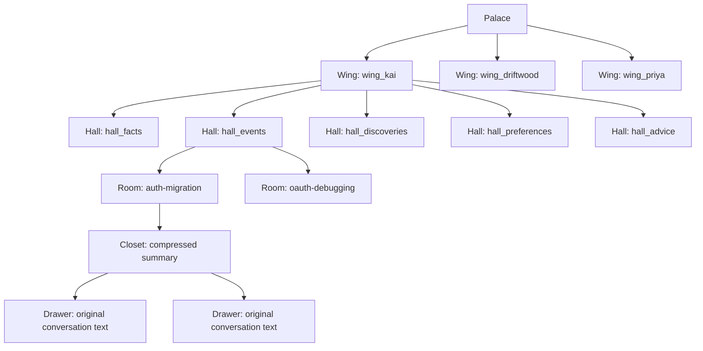
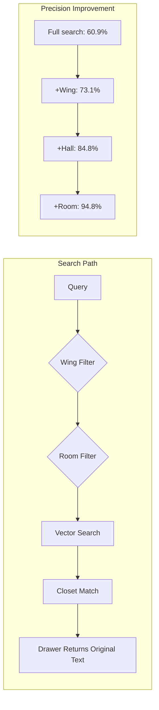

# Chapter 5: Wing / Hall / Room / Closet / Drawer

> **Positioning**: The design motivations, implementation details, and engineering trade-offs of MemPalace's five-tier structure --- understanding from the source code why each tier exists and why it takes this shape.

---

## Five Tiers, No More, No Less

The previous chapter established the core argument: spatial structure as a retrieval prior can significantly improve information retrieval precision. But "spatial structure" is an abstract concept --- it could be two tiers (partition/document), ten tiers (deeply nested classification hierarchies), or entirely flat (a large vector space with metadata tags). MemPalace chose five tiers. This choice is not arbitrary.

The five-tier structure is: **Wing** -> **Hall** -> **Room** -> **Closet** -> **Drawer**. Each tier corresponds to a different granularity of semantic partitioning, and each tier addresses a different retrieval failure mode.

Before entering the tier-by-tier analysis, here is the overall architecture:



This diagram shows the complete path from Palace to Drawer. A query like "what did Kai do on the auth migration last week" navigates along this path: first entering `wing_kai` (scoping to person), then entering `hall_events` (scoping memory type to events), then reaching `auth-migration` (scoping to the specific concept), and finally finding the Drawers containing original text within the Closet.

Every step does the same thing: **narrow the search space while maintaining semantic coherence.**

---

## Tier One: Wing --- Semantic Boundaries

### What a Wing Is

Wing is the coarsest-grained organizational unit. Each person, project, or subject area has its own Wing. In MemPalace's AAAK specification, predefined Wings include:

```
wing_user, wing_agent, wing_team, wing_code,
wing_myproject, wing_hardware, wing_ue5, wing_ai_research
```

(`mcp_server.py:112`)

But Wings are not limited to these predefined names. The configuration system in `config.py` allows users to define arbitrary Wings:

```python
DEFAULT_TOPIC_WINGS = [
    "emotions", "consciousness", "memory",
    "technical", "identity", "family", "creative",
]
```

(`config.py:14-22`)

At the search layer, a Wing is a ChromaDB `where` filter condition. When you specify `wing="wing_kai"` for a search, `searcher.py` constructs the following filter:

```python
where = {"wing": wing}
```

(`searcher.py:33`)

This means vector retrieval is performed only among documents belonging to `wing_kai` --- documents from other Wings do not participate in distance calculations at all.

### Why It Is Designed This Way

Wing's design motivation is to solve the **cross-domain semantic interference** problem.

Consider a concrete scenario. You discussed "auth migration to Clerk" in one project (Driftwood) and also discussed auth-related topics in another project (Orion). Without Wing separation, searching "why did we choose Clerk" might return results from both projects --- because in vector space, two discussions about auth are indeed semantically close. But your intent clearly points to Driftwood.

Wing eliminates this interference through hard filtering (not soft weighting). This is a design choice with a cost --- if the user genuinely wants to search all auth-related content across projects, they need to omit the Wing filter. But MemPalace's benchmarks show that in the vast majority of real queries, users are indeed interested only in information within a specific domain.

### Trade-offs

Wing uses hard filtering rather than soft weighting, which means:

**Advantage**: The reduction in search space is deterministic. If the Palace has 8 Wings, specifying a Wing reduces the search space to roughly 1/8. At the scale of 22,000 memories, this means shrinking from 22,000 to approximately 2,750 --- vector retrieval precision improves significantly on a smaller candidate set.

**Cost**: If Wing assignment is wrong, the target document is completely excluded. This is not a "ranking drops" problem --- it is a "completely invisible" problem. This is why Wing assignment must be a high-confidence decision, typically based on explicit metadata (which project directory a file comes from, which person's name is mentioned in the conversation), rather than fuzzy semantic inference.

---

## Tier Two: Hall --- Cognitive Classification

### What a Hall Is

Hall is the second-level partition within a Wing, classified by the **cognitive type of the memory**. MemPalace defines five fixed Hall types:

```
hall_facts       — established facts and decisions
hall_events      — events, meetings, milestones
hall_discoveries — breakthroughs, new findings, insights
hall_preferences — preferences, habits, opinions
hall_advice      — suggestions, recommendations, solutions
```

(`mcp_server.py:111`)

These five Hall types exist in every Wing. They are "corridors" --- connecting different Rooms within the same Wing while tagging memories by cognitive type.

In the palace graph, Halls appear as edge attributes. `palace_graph.py` associates each Room with its Hall when constructing the graph:

```python
room_data[room]["halls"].add(hall)
```

(`palace_graph.py:60`)

In the graph's edges, a Hall describes the "corridor type" traversed by a tunnel connecting two Wings:

```python
edges.append({
    "room": room,
    "wing_a": wa,
    "wing_b": wb,
    "hall": hall,
    "count": data["count"],
})
```

(`palace_graph.py:75-84`)

### Why Five Fixed Types

The choice of five Hall types is not arbitrary --- it reflects an assumption about human cognitive classification: **people tend to classify memories using a relatively fixed set of modes.**

Everything you remember roughly falls into one of these categories: it is a fact ("we use PostgreSQL"), an event ("yesterday's deployment had issues"), a discovery ("it turns out the connection pool was set too small"), a preference ("I prefer Terraform over Pulumi"), or a piece of advice ("next time this happens, check the logs first").

The key characteristic of this classification system is that it is **mutually exclusive and exhaustive**. A single memory typically belongs to only one type --- "we decided to use Clerk" is a fact, not an event; "Kai recommended Clerk" is advice, not a preference. A few edge cases may be ambiguous (a discovery might also be a fact), but the classification of the vast majority of memories is clear.

Why not three types? Because three types (e.g., facts/events/opinions) are too coarse --- "Kai recommended Clerk" and "I prefer Clerk" would both be "opinions" under three categories, but their query intents are entirely different. One is about "who said what" (tracing the source of advice); the other is about "what is my position" (confirming a preference).

Why not ten types? Because the finer the classification, the lower the classification accuracy. Five is a balance point between discriminative power and classification accuracy. Each Hall has sufficiently clear semantic boundaries that automatic classification (whether keyword-based or LLM-based) can achieve high accuracy.

### Trade-offs

The fixedness of Halls is both their strength and their limitation.

**Advantage**: Because Hall types are predefined, all Wings have a consistent internal structure. This makes cross-Wing comparison possible --- you can compare `wing_kai/hall_advice` with `wing_priya/hall_advice` to see what advice different people gave on the same topic. If each Wing had a different internal classification scheme, such comparisons would be impossible.

**Limitation**: Five Halls may not cover all types of memory. For instance, "emotional memory" ("I felt very anxious about that decision") and "metacognitive memory" ("that debugging session made me realize my understanding of connection pools was wrong") may not fit neatly into any existing Hall. The `DEFAULT_HALL_KEYWORDS` in `config.py` actually defines a set of classification dimensions different from the five Halls (emotions, consciousness, memory, etc.), hinting that the system considered different classification schemes during its evolution.

---

## Tier Three: Room --- Named Concept Nodes

### What a Room Is

Room is the most important semantic unit in the palace. Each Room represents a **named concept** --- an idea specific enough, independent enough, and significant enough to deserve its own space.

Rooms use slug-format naming: hyphen-separated lowercase English strings. For example:

```
auth-migration
chromadb-setup
gpu-pricing
riley-college-apps
```

(`mcp_server.py:113`)

At the search layer, Room is another filter dimension parallel to Wing. When both Wing and Room are specified, `searcher.py` constructs a combined filter:

```python
if wing and room:
    where = {"$and": [{"wing": wing}, {"room": room}]}
```

(`searcher.py:30-31`)

In the palace graph, Rooms are the graph's nodes. The `build_graph()` function in `palace_graph.py` iterates over all metadata in ChromaDB, constructing a node record for each Room:

```python
room_data = defaultdict(lambda: {
    "wings": set(), "halls": set(),
    "count": 0, "dates": set()
})
```

(`palace_graph.py:47`)

Each Room node records which Wings it appears in, which Halls it belongs to, how many memories it contains, and the most recent date. When a Room appears in multiple Wings, it forms a Tunnel --- the subject of the next chapter.

### Why Slugs

Room names use slug format (`auth-migration` rather than "Auth Migration" or `auth_migration_2026`) for three engineering reasons:

**First, slugs are unambiguous identifiers.** They contain no spaces, uppercase letters, special characters, or date suffixes. This means the same concept has exactly the same Room name string across different Wings --- `auth-migration` is `auth-migration`, and tunnel detection will not fail because one Wing wrote "Auth Migration" while another wrote "auth_migration."

**Second, slugs are human-readable.** Unlike hash values or numeric IDs, slugs carry semantic information. When you see the Room name `gpu-pricing`, you immediately know it is about GPU pricing. This is crucial for debugging, log analysis, and user interface display.

**Third, slugs are composable.** In ChromaDB's metadata system, slugs can be used directly as `where` filter condition values without any encoding or escaping. In the file system, slugs can serve directly as directory names. In URLs, slugs can appear directly in the path. This universality reduces friction when passing Room identifiers between different systems.

### The Emergent Nature of Rooms

A key design decision is that Rooms are not predefined but emerge from the data. There is no "Room list" dictating which Rooms you may have. When MemPalace mines your conversations, it creates Rooms based on conversation content --- if you discussed a GraphQL migration, a `graphql-switch` Room appears; if you discussed Riley's college applications, a `riley-college-apps` Room appears.

This contrasts sharply with Hall's design: Halls are predefined, fixed, and globally consistent; Rooms are dynamic, data-driven, and can differ across Wings. This contrast reflects a deep design intuition: **the types of memory are finite, but the content of memory is infinite.** Halls encode type (what kind of thing you are remembering); Rooms encode content (what thing you are remembering). Types can be predefined; content must grow from the data.

---

## Tier Four: Closet --- The Compression Gateway

### What a Closet Is

Closet is an intermediate tier between Room and Drawer. It contains compressed summaries of original content --- enough for the AI to judge "does this Drawer contain the information I need," but without the full detail of the original text.

In the current implementation, Closet functionality is primarily realized implicitly through ChromaDB's embedding vectors and metadata system. Each memory's embedding vector is the "label on the closet door" --- the search engine decides whether to "open this closet" and examine its Drawers by comparing embedding vectors. The `search_memories()` function in `searcher.py` returns results containing both original text (Drawer content) and metadata (Closet information):

```python
hits.append({
    "text": doc,           # Drawer: original text
    "wing": meta.get("wing", "unknown"),
    "room": meta.get("room", "unknown"),
    "source_file": ...,    # Closet: source information
    "similarity": ...,     # Closet: match score
})
```

(`searcher.py:128-134`)

The README mentions that AAAK compression will be introduced to the Closet tier in a future version: "In our next update, we'll add AAAK directly to the closets, which will be a real game changer --- the amount of info in the closets will be much bigger, but it will take up far less space and far less reading time for your agent."

### Why an Intermediate Tier Is Needed

The existence of Closet solves a classic problem in information retrieval: **you need to find a balance between "reading all content" and "reading only titles."**

If the AI needs to read the full content of every Drawer in a Room to judge relevance, then when a Room contains hundreds of memories, token consumption becomes unacceptable. But if the AI judges based only on the Room name, precision is insufficient --- the `auth-migration` Room might contain entirely different content about migration reasons, migration process, bugs encountered during migration, and post-migration retrospectives.

Closet provides a mid-precision view: it tells the AI "roughly what is in this closet," letting the AI decide whether to open the Drawer and read the original text. Once AAAK compression is introduced, this intermediate tier will become even more efficient --- 30x compression means a Closet can encode a large amount of content overview in very few tokens.

---

## Tier Five: Drawer --- The Original Truth

### What a Drawer Is

Drawer is the lowest-level unit in MemPalace, storing original content. Each Drawer contains a piece of raw text --- a fragment of conversation, a chapter of a document, a code comment. MemPalace's core promise is: **content in a Drawer is always original, verbatim, and unmodified by any summarization.**

In the MCP server, the tool function for adding a Drawer explicitly requires content to be "verbatim":

```python
"content": {
    "type": "string",
    "description": "Verbatim content to store "
                   "--- exact words, never summarized",
},
```

(`mcp_server.py:626-629`)

When adding a new Drawer, the system first performs a duplicate check --- if the content's similarity to an existing Drawer exceeds 90%, the addition is rejected:

```python
dup = tool_check_duplicate(content, threshold=0.9)
if dup.get("is_duplicate"):
    return {
        "success": False,
        "reason": "duplicate",
        "matches": dup["matches"],
    }
```

(`mcp_server.py:259-265`)

Each Drawer's ID includes the Wing, Room, and content hash, ensuring uniqueness:

```python
drawer_id = f"drawer_{wing}_{room}_{hashlib.md5(
    (content[:100] + datetime.now().isoformat()
).encode()).hexdigest()[:16]}"
```

(`mcp_server.py:267`)

### Why It Must Be Original

This is one of MemPalace's most central design decisions and the fundamental point of divergence from the vast majority of competing systems.

The typical practice of mainstream AI memory systems is to have the LLM extract "important information" at the storage stage. Mem0 uses an LLM to extract facts; Mastra uses GPT to observe conversations and generate structured records. These systems make an irreversible decision at the storage stage --- what is "important."

The problem is that "importance" is context-dependent. A detail that seems unimportant at storage time ("Kai mentioned he previously worked at a company that used Auth0") may become critical in a future query ("who has actual Auth0 experience?"). Once the storage stage discards this detail, it can never be retrieved.

MemPalace's stance is: **store everything, and let the retrieval stage decide what is important.** Drawers preserve original text, Closets provide rapid navigation, and Wing/Hall/Room provide structured filtering --- but the information itself is never modified or discarded.

---

## The Five-Tier Structure in the MCP API

In the MCP server, the five-tier structure is exposed to AI agents through a set of tools:

```
mempalace_list_wings     — list all Wings (tier one)
mempalace_list_rooms     — list Rooms within a Wing (tier three)
mempalace_get_taxonomy   — complete Wing -> Room -> count tree
mempalace_search         — search, with optional Wing/Room filtering
mempalace_add_drawer     — add original content to a specified Wing/Room
```

(`mcp_server.py:441-637`)

The `tool_get_taxonomy()` function builds the complete hierarchical view:

```python
for m in all_meta:
    w = m.get("wing", "unknown")
    r = m.get("room", "unknown")
    if w not in taxonomy:
        taxonomy[w] = {}
    taxonomy[w][r] = taxonomy[w].get(r, 0) + 1
```

(`mcp_server.py:163-168`)

The returned taxonomy object is a nested dictionary: `{wing: {room: count}}`. This allows an AI agent to understand the entire palace's structure in a single call, then decide which Wing and Room to search in.

Note a subtle design decision: the MCP API directly exposes Wings and Rooms but does not separately expose Halls. Halls exist as metadata within Drawers but are not an independent filter dimension. This reflects a pragmatic judgment: in current usage patterns, the Wing + Room combination already provides sufficient search precision (+34%), while Hall's additional filtering benefit is relatively small but would increase API complexity and classification error risk.

---

## The Complete Design Picture



The five-tier structure's retrieval effect is cumulative --- each additional tier of structural constraint incrementally raises R@10 from 60.9% to 94.8%, a total of +34 percentage points (see Chapter 7 for the complete benchmark analysis). This is not because each tier performs "finer filtering" --- it is because each tier eliminates a specific class of interference. Wings eliminate cross-domain interference, Halls eliminate cross-type interference, and Rooms eliminate cross-concept interference.

These three types of interference manifest differently in vector space. Cross-domain interference is the strongest (auth discussions from two different projects are highly semantically similar); cross-type interference is moderate (facts about auth and advice about auth within the same project are semantically related but not identical); cross-concept interference is the weakest (auth discussions and billing discussions within the same project have lower semantic similarity). This explains why each tier's improvement diminishes: 12% -> 12% -> 10%. The easier an interference source is to distinguish, the less structural constraint is needed to eliminate it.

---

## Back to Ancient Greece

The five-tier structure's design can be understood as a high-fidelity translation of Simonides' Method of Loci.

In the Method of Loci, you first choose a building (Wing), then enter a floor or functional area (Hall), then arrive at a specific room (Room), then notice a particular object in the room (Closet), and finally retrieve the information you need from the object (Drawer).

MemPalace did not try to "improve" the Method of Loci --- it tried to translate the Method of Loci's structure into computable form as faithfully as possible. A Wing is not a "database partition" --- it is "a wing of a building." A Room is not a "folder" --- it is "a specific location you pass through as you walk through your mind." These names are not decorative metaphors --- they constrain design decisions.

When an engineer hears "database partition," they pursue uniform data distribution. When they hear "a wing of a building," they accept that different wings have different sizes --- because in a real building, the kitchen and the bedroom do not need to be the same size. This subtle difference in cognitive framing influences dozens of subsequent design choices, ultimately leading to a system significantly different from one driven by pure engineering considerations.

The next chapter will discuss the most distinctive emergent property of the five-tier structure --- Tunnels: the cross-domain connections that automatically form when the same Room appears in multiple Wings.
