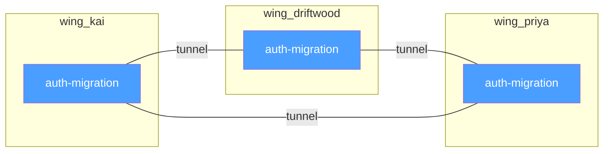

# Chapter 6: Tunnels --- Cross-Domain Discovery

> **Positioning**: The design and implementation of the Tunnel mechanism --- how a zero-cost graph construction strategy automatically surfaces cross-domain knowledge connections from ChromaDB's metadata.

---

## Same Room, Different Wings

The previous chapter described how Wing, Hall, and Room progressively narrow the search space at the concept level. But these hierarchical structures have an inherent side effect: they tend to create silos. If all searches are confined to a single Wing, you can never discover the connection between "Kai's experience with the auth migration" and "the Driftwood project's auth migration decision" --- because they belong to different Wings.

MemPalace solves this problem with an extraordinarily simple mechanism: **Tunnels.**

The definition of a tunnel is a single sentence: **when the same Room appears in two or more Wings, a tunnel is automatically formed between those Wings.** No manual linking required, no additional index construction, no LLM reasoning. Same name means connected.



In this example, the `auth-migration` Room appears in three Wings --- `wing_kai` (Kai's personal experience and work records), `wing_driftwood` (project-level decisions and progress), and `wing_priya` (Priya's approvals and recommendations as tech lead). Three Wings automatically form three tunnels through this shared Room.

The README example clearly illustrates the semantic meaning of these connections:

```
wing_kai       / hall_events / auth-migration
    -> "Kai debugged the OAuth token refresh"
wing_driftwood / hall_facts  / auth-migration
    -> "team decided to migrate auth to Clerk"
wing_priya     / hall_advice / auth-migration
    -> "Priya approved Clerk over Auth0"
```

Same topic (auth migration), three perspectives (implementer, project, decision-maker), three memory types (event, fact, advice). Tunnels connect these perspectives, allowing you to start from any one entry point and discover other related memories.

---

## The Graph Is Built from Metadata

The tunnel implementation relies on the `build_graph()` function in `palace_graph.py`. This function is the core of the entire tunnel mechanism, and its design embodies a key engineering insight: **no additional graph database is needed.**

`build_graph()` works by iterating over all document metadata in ChromaDB, extracting Room, Wing, and whatever Hall metadata happens to exist, then constructing a graph in memory. The code:

```python
room_data = defaultdict(lambda: {
    "wings": set(), "halls": set(),
    "count": 0, "dates": set()
})
```

(`palace_graph.py:47`)

For each memory record, the function extracts its metadata and updates the corresponding Room's node information:

```python
for meta in batch["metadatas"]:
    room = meta.get("room", "")
    wing = meta.get("wing", "")
    hall = meta.get("hall", "")
    if room and room != "general" and wing:
        room_data[room]["wings"].add(wing)
        if hall:
            room_data[room]["halls"].add(hall)
        room_data[room]["count"] += 1
```

(`palace_graph.py:52-63`)

Note that `room_data[room]["wings"]` is a `set`. When the same Room is added from different Wings, this set naturally accumulates all Wings that Room spans. Tunnel detection is simply checking whether this set's size is greater than 1:

```python
for room, data in room_data.items():
    wings = sorted(data["wings"])
    if len(wings) >= 2:
        for i, wa in enumerate(wings):
            for wb in wings[i + 1:]:
                for hall in data["halls"]:
                    edges.append({
                        "room": room,
                        "wing_a": wa, "wing_b": wb,
                        "hall": hall,
                        "count": data["count"],
                    })
```

(`palace_graph.py:70-84`)

This code's logic warrants close examination. For each Room spanning two or more Wings, the function generates edges for all pairwise Wing combinations. If a Room appears in 3 Wings, it generates 3 edges (A-B, A-C, B-C). Each edge is also associated with all Halls that Room belongs to, along with the Room's memory count --- this count is later used as a sorting weight during graph traversal.

**Zero additional storage cost.** This is the most noteworthy aspect of the design. The graph is not stored in ChromaDB or in any external database. It is dynamically constructed from ChromaDB's metadata each time it is needed. The important caveat is that the current main write paths reliably populate `wing` and `room`, while `hall` is a richer optional metadata layer rather than a guaranteed field on every stored memory. So the graph always has a room-and-wing backbone, and Hall becomes an enhancement when that metadata is present.

The trade-off of this design is obvious: every query requires rebuilding the graph. At the scale of 22,000 memories, `build_graph()` needs to read all metadata in batches (1,000 per batch), meaning at least 22 ChromaDB calls. For real-time interactive scenarios, this may introduce perceptible latency. But MemPalace's choice is to accept this latency in exchange for zero additional storage and zero data consistency maintenance cost.

---

## BFS Traversal: Starting from a Room

Knowing the graph exists is not enough --- you need to be able to walk through it. The `traverse()` function in `palace_graph.py` implements a breadth-first search (BFS) traversal, allowing you to start from a given Room and discover all reachable related Rooms.

```python
def traverse(start_room, col=None, config=None,
             max_hops=2):
```

(`palace_graph.py:99`)

The traversal logic is standard BFS, but the connection relationship is unique: two Rooms are connected if and only if they share at least one Wing.

```python
frontier = [(start_room, 0)]
while frontier:
    current_room, depth = frontier.pop(0)
    if depth >= max_hops:
        continue
    current_wings = set(current.get("wings", []))
    for room, data in nodes.items():
        if room in visited:
            continue
        shared_wings = current_wings & set(data["wings"])
        if shared_wings:
            visited.add(room)
            results.append({
                "room": room,
                "hop": depth + 1,
                "connected_via": sorted(shared_wings),
            })
```

(`palace_graph.py:128-154`)

The `max_hops` parameter (default 2) controls traversal depth. Setting it to 2 means you can discover "Rooms that directly share a Wing with the starting Room" (1 hop) and "Rooms that share yet another Wing with those Rooms" (2 hops). Within two hops, all semantically meaningful connections are typically covered; more distant connections tend to be too indirect to carry informational value.

Traversal results are sorted by `(hop_distance, -count)`:

```python
results.sort(key=lambda x: (x["hop"], -x["count"]))
return results[:50]
```

(`palace_graph.py:157-158`)

Connections with fewer hops are shown first; at equal hop counts, Rooms with higher occurrence counts are prioritized. Rooms with high occurrence counts are typically more important concept nodes --- they have accumulated more memory entries, meaning the topic has been discussed more frequently.

---

## Tunnel Discovery

Beyond graph traversal from a starting point, MemPalace also provides a dedicated tunnel discovery tool: `find_tunnels()`.

```python
def find_tunnels(wing_a=None, wing_b=None,
                 col=None, config=None):
```

(`palace_graph.py:161`)

This function's purpose is not navigation but discovery. It answers the question: "which topics connect these two domains?"

```python
for room, data in nodes.items():
    wings = data["wings"]
    if len(wings) < 2:
        continue
    if wing_a and wing_a not in wings:
        continue
    if wing_b and wing_b not in wings:
        continue
    tunnels.append({
        "room": room, "wings": wings,
        "halls": data["halls"],
        "count": data["count"],
    })
tunnels.sort(key=lambda x: -x["count"])
```

(`palace_graph.py:169-189`)

You can specify no Wings (view all tunnels), one Wing (view all tunnels related to that Wing), or two Wings (view bridging topics between those two specific domains).

In the MCP server, this functionality is exposed to AI agents through the `mempalace_find_tunnels` tool:

```python
"mempalace_find_tunnels": {
    "description": "Find rooms that bridge two wings "
        "--- the hallways connecting different "
        "domains.",
    ...
}
```

(`mcp_server.py:571-581`)

The tool description calls tunnels "hallways" that are "connecting different domains." This wording reflects the essence of tunnels: they are not manually created indexes or links, but connections that **naturally emerge** when you discuss the same topic across different domains.

---

## The Information-Theoretic Significance of Tunnels

The tunnel mechanism looks simple to the point of being trivial --- is it not just "same-name rooms automatically link"? But this simplicity masks a deep design insight.

In knowledge management systems, the most valuable information is typically found not within domains but at the intersection of domains. A search entirely within `wing_code` can tell you "how our auth module works" but cannot tell you "why the auth module was designed this way" --- because the design rationale might be recorded in `wing_team`'s meeting notes or in `wing_priya`'s technical recommendations.

Traditional knowledge management systems handle cross-domain connections in two ways:

**Manual linking.** Have users or administrators explicitly create cross-domain associations. This approach is precise but fragile --- it depends on human memory and diligence, and the cost of maintaining these links grows exponentially as data volume increases.

**Global semantic search.** Abandon domain partitioning and perform vector retrieval across the entire database. This approach requires no link maintenance but returns to the problem discussed in Chapter 4 --- high-dimensional degradation in large-scale vector spaces causes retrieval precision to decline.

MemPalace's tunnel mechanism is a third path: **let structure automatically produce connections.** You do not need to manually annotate "Kai's auth experience is related to Driftwood's auth decision" --- when you use the same Room name `auth-migration` in two different Wings, the association already exists. Room's slug format ensures naming consistency, and `build_graph()` ensures these consistencies are automatically detected.

This design rests on a reasonable assumption: **if memories from two different domains are assigned the same Room name, a semantic association genuinely exists between them.** This assumption holds in the vast majority of cases --- you will not accidentally use the same Room slug in two unrelated domains.

---

## Graph Statistics: A Global View of the Palace

The `graph_stats()` function provides global statistics for the palace graph:

```python
def graph_stats(col=None, config=None):
    nodes, edges = build_graph(col, config)
    tunnel_rooms = sum(
        1 for n in nodes.values()
        if len(n["wings"]) >= 2
    )
    return {
        "total_rooms": len(nodes),
        "tunnel_rooms": tunnel_rooms,
        "total_edges": len(edges),
        "rooms_per_wing": dict(wing_counts...),
        "top_tunnels": [...],
    }
```

(`palace_graph.py:193-213`)

This statistical view lets users and AI agents understand the palace's overall topology: how many Rooms exist, how many form tunnels, how dense the connections between Wings are, and which tunnels are most active.

The `top_tunnels` list is sorted by Wing count in descending order --- Rooms appearing in the most Wings are listed first. These highly connected Rooms typically represent the user's most core concerns --- topics that recur across multiple projects, multiple relationships, and multiple time periods.

---

## An Honest List of Design Trade-offs

The tunnel mechanism's elegance should not obscure its limitations. Here are the trade-offs that must be honestly addressed:

**Naming consistency dependency.** Tunnel detection depends entirely on exact Room name matching. If one Wing uses `auth-migration` and another uses `clerk-migration`, even if they discuss the same thing, no tunnel will form. This places high demands on the automation of Room naming --- the naming function must be smart enough to ensure the same concept receives the same slug across different contexts.

**Dynamic graph reconstruction cost.** As mentioned above, every graph operation requires rebuilding the graph from ChromaDB. At large scales (tens of thousands of memories), this means dozens of database read operations. A possible improvement direction is introducing a graph caching layer --- but this would introduce cache consistency complexity.

**Dense tunnel noise.** If a Room appears in every Wing (e.g., an extremely generic concept like `general-discussion`), it forms too many tunnel connections, reducing the informational value of tunnels. `build_graph()` mitigates this by filtering out `room == "general"` (`palace_graph.py:57`), but for other high-frequency, low-information-value Rooms, there is currently no systematic filtering mechanism.

These limitations are all solvable engineering problems, not fundamental design flaws. The tunnel mechanism's core value --- surfacing cross-domain connections at zero cost from existing metadata --- is complete and unshaken by these implementation-level limitations.

---

## The Value of Connection

The tunnel mechanism conceptually completes the transformation of the memory palace from "building" to "network."

In the structure described in the previous two chapters, the palace is a strict hierarchical tree: Palace -> Wing -> Hall -> Room -> Closet -> Drawer. Information is organized top-down, and search operates within a subtree. This structure is efficient and clear, but it is closed --- each subtree is an isolated island.

Tunnels break this closure. They add lateral edges to the tree, transforming it from a tree into a graph. You can no longer only move up and down within a single Wing --- you can cross from one Wing to another through tunnels, discovering connections invisible in a purely hierarchical structure.

This is why the `palace_graph.py` file header comment describes this module as "a navigable graph" --- not "a navigable tree." Trees are hierarchical, deterministic, and top-down; graphs are networked, emergent, and explorable from any starting node. MemPalace's five-tier structure provides the efficiency of a tree; the tunnel mechanism provides the discovery power of a graph.

The next chapter will use benchmark data to prove that the retrieval improvement from this "structure + connection" combination is not theoretical speculation --- it is a quantifiable, reproducible 34%.
