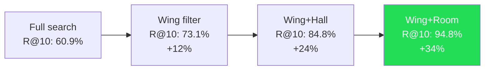

# Chapter 7: The 34% Retrieval Improvement Is Not a Coincidence

> **Positioning**: Using data to prove that structure is the product --- where the 34% retrieval precision improvement comes from, why it is reproducible, and its broader implications for AI memory system design.

---

## Four Numbers

On a benchmark test using over 22,000 real conversation memories, MemPalace recorded the following R@10 (Recall at 10 --- the probability that the correct answer appears in the top 10 results) data:

| Search Scope | R@10 | Improvement Over Baseline |
|-------------|------|--------------------------|
| Full search (no structure) | 60.9% | -- |
| Wing-scoped search | 73.1% | +12.2% |
| Wing + Hall | 84.8% | +23.9% |
| Wing + Room | 94.8% | +33.9% |

This set of data needs to be carefully interpreted.

60.9% is the baseline --- all memories placed in a flat vector database with no structural organization, using ChromaDB's default embedding model (all-MiniLM-L6-v2) for semantic retrieval. This baseline represents the performance ceiling of "pure vector search."

94.8% is the result after applying Wing + Room filtering. The same data, the same embedding model, the same retrieval algorithm --- the only variable is metadata filtering applied before search. **From 60.9% to 94.8%, an improvement of 33.9 percentage points, entirely from structure. No better model, no larger embedding dimensions, no LLM reranking. Simply telling the search engine "look in this Wing's this Room."**

The credibility of this data depends on three factors: data scale, test methodology, and reproducibility. 22,000 memories is not a small toy dataset --- it represents months of real usage accumulation. The test methodology follows standard information retrieval evaluation paradigms (R@K metrics). As for reproducibility, MemPalace provides complete benchmark run scripts in the `benchmarks/` directory; anyone can repeat these tests on their own data.

---

## First-Tier Improvement: Wing Eliminates Cross-Domain Interference

From 60.9% to 73.1%, Wing produced a 12.2-percentage-point improvement. This is the largest single-tier improvement, and its cause is the most intuitive.

Consider a query: "Why did we choose Clerk for auth?"

In a full search, ChromaDB searches all 22,000 memories for the 10 most semantically similar to this query. The problem is that if you discussed auth-related topics in multiple projects --- say, Driftwood chose Clerk, Orion uses Auth0, and a personal project uses Firebase Auth --- the auth discussions from these three domains will be very close in vector space. Three sets of memories compete for top-10 positions, and the correct answer (Driftwood's Clerk decision record) may be pushed to position 11 or 12.

With Wing filtering added (`wing="wing_driftwood"`), the search space shrinks to Driftwood project memories. Two of the three sets of semantically similar auth discussions are directly excluded. The correct answer no longer needs to compete with results from unrelated domains.

This improvement is essentially leveraging **prior knowledge**. When the user or AI agent knows it is asking a question about Driftwood, this knowledge can be encoded as a Wing filter --- simplifying the search problem from "find the correct answer among 22,000 memories" to "find the correct answer among approximately 2,750 Driftwood memories."

The theoretical basis of vector search is that the correct answer should be closest to the query in embedding space. But when the candidate set contains many "close but incorrect" interference items, this theoretical assumption breaks down. Wing restores the validity of this assumption by removing the strongest interference source --- documents from entirely different domains that are semantically similar.

---

## Second-Tier Improvement: Hall Distinguishes Memory Types

From 73.1% to 84.8%, Hall added another 11.7 percentage points on top of Wing.

This improvement is more subtle. Even within the same Wing, semantic overlap exists between different types of memories. "We decided to use Clerk" (fact), "Kai recommended Clerk because of better pricing and developer experience" (advice), and "the Clerk adoption was finalized at last Wednesday's meeting" (event) --- these three memories may be very close in vector space because they all contain keywords like "Clerk," "auth," and "decision."

But a query's intent usually points to only one type. If you ask "why did we choose Clerk," you want advice (hall_advice) or facts (hall_facts), not event records. If you ask "at which meeting was Clerk decided," you want events (hall_events), not technical advice.

Hall filtering eliminates this within-domain interference by distinguishing memory types. The five Halls (facts, events, discoveries, preferences, advice) correspond to five different query intent patterns. When the search system can correctly infer a query's type intent, it can further narrow the candidate set, excluding type-mismatched results.

It is worth noting that Hall's improvement (11.7%) is nearly equal to Wing's improvement (12.2%). This means the strength of cross-type interference is roughly comparable to cross-domain interference --- a somewhat counterintuitive finding. You might expect interference from entirely different domains to be far stronger than interference from different types within the same domain, but distance distributions in vector space do not always match human intuition. In high-dimensional space, the distance differences between different types of text within the same domain can be as small as the distance differences between domains.

---

## Third-Tier Improvement: Room Pinpoints Concepts

From 84.8% to 94.8%, Room produced the final 10 percentage points of improvement.

If Wing eliminates domain interference and Hall eliminates type interference, then Room eliminates **concept interference**. Even within the same Wing and the same Hall, multiple different concepts may exist. `wing_driftwood/hall_facts` might contain facts about auth migration, database selection, deployment strategy, and team organization. They are all "facts," all belong to "Driftwood," but they are about different things.

Room eliminates this last level of semantic ambiguity through named concept nodes (`auth-migration`, `database-selection`, `deploy-strategy`). When the search is scoped to `wing_driftwood/room=auth-migration`, the candidate set contains only memories about auth migration --- at this point, vector search merely needs to distinguish "the most relevant few" among a small number of highly relevant documents, which is a problem vector search handles well.

Room's 10% improvement, while the smallest of the three tiers, pushes retrieval precision from 84.8% to 94.8% --- crossing the 90% threshold generally regarded in engineering practice as the dividing line for "usable." From the user experience perspective, 84.8% means roughly one in every six searches fails to find the correct answer; 94.8% means roughly one in every twenty misses. This difference is perceptible in daily use.

---

## Why Structure Works: High-Dimensional Degradation in Vector Spaces

The analysis above explains what each tier "does" but has not yet answered a more fundamental question: **why can metadata filtering alone produce such a large improvement?** Metadata filtering does not change embedding vector quality or distance calculation methods --- it only reduces the number of candidates participating in comparison. Why does reducing candidates improve precision?

The answer relates to a fundamental property of high-dimensional vector spaces: **the curse of dimensionality.**

MemPalace's default embedding model, all-MiniLM-L6-v2, generates 384-dimensional vectors. In 384-dimensional space, a repeatedly verified phenomenon is: as dataset size grows, the distance distribution among data points tends to concentrate --- the distance difference between the nearest and farthest neighbors becomes smaller and smaller.

In more intuitive terms: imagine standing at the center of a 384-dimensional space with 22,000 points around you. These points' distances from you might be distributed between 0.3 and 0.7. Now you need to find the 10 closest points. The problem is that within this distance range, hundreds of points might have distances falling between 0.31 and 0.35 --- the distance differences between them are smaller than measurement noise. At this precision, the distance difference between "ranked first" and "ranked fiftieth" might be only 0.01 --- far below any meaningful discrimination threshold.

Now, if you shrink the candidate set from 22,000 to 2,750 through Wing filtering, the concentration of the distance distribution decreases. In a smaller candidate set, the distance gap between the correct answer and the nearest interference item widens. In information-theoretic terms, you have improved the signal-to-noise ratio --- not by strengthening the signal (better embeddings) but by reducing the noise (removing irrelevant candidates).

This is the value of structure: **structure is not a better search algorithm; it is a better precondition for search.**

---

## Structure as Prior

Bayesian statistics has a core concept: the prior. Before observing data, you have an initial belief distribution about the problem's answer. The more informative the prior, the less data you need to arrive at an accurate posterior.

The Wing/Hall/Room structure plays exactly the role of a prior in retrieval.

Without structure, the search system's "prior" is a uniform distribution --- each of the 22,000 memories has an equal probability of being the correct answer. Embedding distance is the only source of evidence.

With structure, the search system's "prior" is dramatically updated --- after specifying a Wing, only about 1/8 of memories have a reasonable probability of being the correct answer; after further specifying a Room, perhaps only a few dozen memories are in the candidate range. Embedding distance is still the evidence source, but it now only needs to discriminate within a much smaller candidate set --- a far easier task.

The 34% improvement is essentially quantifying **the value of prior information**. When you tell the search system "the answer is in this Wing's this Room," you provide approximately 7--8 bits of prior information (shrinking from 22,000 to a few dozen). This information comes not from a better model or more computation --- it comes from how the data is organized.

This also explains why the improvement is **robust** --- it does not depend on the choice of embedding model, the type of query, or the data domain. As long as the following conditions hold, structure will produce improvement:

1. The dataset is large enough that full search faces high-dimensional degradation;
2. Structural partitions are semantically coherent, so the correct answer likely falls in the correct partition;
3. The semantic distance between partitions is greater than the semantic distance within partitions.

These three conditions hold in the vast majority of real-world AI memory scenarios.

---

## Control Group: Systems Without Structure

To verify that structure is indeed the key variable, it is worth comparing MemPalace against systems that do not use structure on the same benchmark.

On the LoCoMo benchmark (1,986 multi-hop QA pairs), the comparison across different systems is as follows:

| System | Method | R@10 | Notes |
|--------|--------|------|-------|
| MemPalace (session, no structure) | Pure vector search | 60.3% | Baseline |
| MemPalace (hybrid v5) | Vector + keyword + time weighting | 88.9% | Hybrid scoring |
| MemPalace (hybrid + Sonnet rerank) | Hybrid + LLM reranking | 100% | Perfect score in all categories |

The 60.3% baseline is nearly identical to the 60.9% mentioned above --- this is not a coincidence but validation of the same pattern: on memory sets at the ten-thousand scale, pure vector search R@10 hovers around 60%.

From 60.3% to 88.9% (hybrid v5), a 28.6-percentage-point improvement. This improvement comes from keyword overlap scoring, time weighting, and person-name boosting --- essentially introducing additional ranking signals beyond vector distance. These signals are not structural (they do not depend on Wing/Room partitioning) but heuristic.

From baseline to 100% (with Sonnet rerank), a total improvement of 39.7 percentage points. LLM reranking contributed the final 11.1 percentage points from 88.9% to 100%.

Comparing these figures with the structural improvement:

- Pure structure (Wing + Room filtering): +34%
- Hybrid scoring heuristics: +28.6%
- LLM reranking: +11.1%

The structural improvement and hybrid heuristic improvement are of the same order of magnitude. But the cost difference between the two is enormous: the structural improvement has zero computational cost (merely adding a `where` clause), while hybrid heuristics require additional text processing, tokenization, and scoring computation. LLM reranking further demands API calls and additional latency.

**Structure is the cheapest source of precision.**

---

## Reproducibility

In the benchmarking world, an unreproducible result is as good as nonexistent. MemPalace provides a complete reproduction path in the `benchmarks/` directory.

Core benchmark scripts include:

- `longmemeval_bench.py` --- LongMemEval benchmark runner
- `locomo_bench.py` --- LoCoMo benchmark runner
- `membench_bench.py` --- MemBench benchmark runner

Each script accepts a dataset path and mode parameter and outputs results files in standard format. `benchmarks/BENCHMARKS.md` records the complete improvement journey from the 96.6% baseline to the 100% perfect score --- not as marketing material but as a technical experiment log, documenting in detail the motivation, method, and result of each improvement step.

For example, the first improvement from 96.6% to 97.8% (hybrid scoring v1) was motivated by identifying a specific failure mode: queries containing exact terms (such as "PostgreSQL" or "Dr. Chen"), where pure embedding similarity would rank semantically similar but term-mismatched documents above exact matches. The fix was layering keyword overlap weighting on top of embedding distance.

The final step from 99.4% to 100% involved analyzing three questions where two independent architectures (hybrid v4 and palace mode) both failed, then designing targeted fixes for each: quoted phrase extraction, person-name weighting, and memory/nostalgia pattern matching. This "analyze failure -> design fix -> verify effect" cycle is an engineering-reliable improvement method --- not parameter tuning, but understanding the cause of failure.

---

## Structure Is the Product

This chapter's core argument can be captured in a single sentence: **in AI memory systems, how data is organized matters more than the choice of retrieval algorithm.**

The 34% improvement does not require a better embedding model --- all-MiniLM-L6-v2 is a model released in 2020 with a relatively small parameter count, far from the current state of the art in embedding technology. It does not require LLM involvement --- no API calls were made in the entire improvement process. It does not require complex post-processing --- no reranking, no query expansion, no pseudo-relevance feedback.

It requires only three things:

1. Data was assigned meaningful metadata labels (wing, hall, room) at storage time;
2. Search used these labels to narrow the candidate set;
3. The label system is semantically coherent --- data within the same Wing is indeed semantically related, and data in different Wings is indeed semantically different.

None of these three things requires AI. What they require is a good classification design --- and this classification design comes from a cognitive technique that is twenty-five hundred years old.

MemPalace's README has a line worth repeating: "Wings and rooms aren't cosmetic. They're a 34% retrieval improvement. The palace structure is the product." This is not a marketing slogan --- it is a direct summary of the benchmark data.

When your data organization itself is your product, adding better algorithms is icing on the cake, not the foundational zero-to-one. The 34% improvement is the starting line that structure gives you. On top of this starting line, hybrid scoring adds another 28%, LLM reranking adds another 11%, and the final result reaches 100%. But without that starting line, you begin at 60% --- meaning you need algorithms and LLMs to fill a much larger gap, and those all have costs.

Structure is free. That is its significance.

---

## Next Steps

This chapter and the preceding three collectively complete the "memory palace" portion of the argument: from the cognitive science foundation of the Method of Loci (Chapter 4), to the design and implementation of the five-tier structure (Chapter 5), to the cross-domain discovery capability of the tunnel mechanism (Chapter 6), to the validation through benchmark data (this chapter).

But the memory palace is only one of MemPalace's three core designs. Structure solves the "how to find information" problem, but there is another equally critical question left unanswered: once you find the information, how do you convey it to the AI within an extremely small token budget?

A Wing may contain thousands of memories. Even if structural filtering narrows the candidate set to a few dozen, stuffing all of those complete texts into the AI's context window is still expensive (potentially requiring thousands or even tens of thousands of tokens). You need a compression method --- not summarization (summarization loses information) but a lossless, AI-directly-readable compression encoding.

This is the problem the AAAK dialect was created to solve. Part 3 will analyze in depth how this 30x compression, zero-information-loss, AI-specific language was designed.
