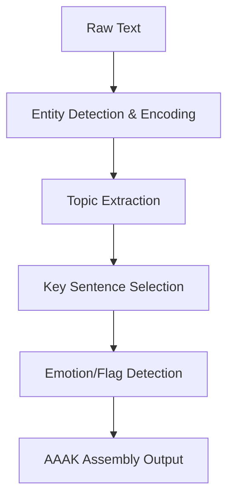

# Chapter 9: The Grammar Design of AAAK

> **Positioning**: The previous chapter derived through constraint satisfaction analysis that a viable compression scheme must be "extremely abbreviated natural language." This chapter enters the concrete syntax level: what abbreviation rules AAAK uses, what delimiters, what tagging system, and how these choices are implemented in `dialect.py`. From here on, we will see real code and real compression comparisons.

---

## From English to AAAK: A Complete Comparison

Before analyzing the grammar rules, let us look at a complete comparison example. This is the core demonstration from the MemPalace README:

**English original (~1000 tokens):**

```
Priya manages the Driftwood team: Kai (backend, 3 years),
Soren (frontend), Maya (infrastructure), and Leo (junior,
started last month). They're building a SaaS analytics platform.
Current sprint: auth migration to Clerk. Kai recommended Clerk
over Auth0 based on pricing and DX.
```

**AAAK compressed (~120 tokens):**

```
TEAM: PRI(lead) | KAI(backend,3yr) SOR(frontend) MAY(infra) LEO(junior,new)
PROJ: DRIFTWOOD(saas.analytics) | SPRINT: auth.migration->clerk
DECISION: KAI.rec:clerk>auth0(pricing+dx) | ****
```

The original -- a natural language paragraph of approximately 250 characters -- is compressed into approximately 180 characters of AAAK representation. But the compression ratio at the token level is even more significant, because AAAK's structured format is more tokenizer-friendly -- the English original's articles, prepositions, and conjunctions each occupy individual tokens, while in AAAK all such redundancy has been removed.

More critical is the completeness of information. Let us verify item by item:

| Fact in English original | Corresponding representation in AAAK |
|---|---|
| Priya is the team lead | `PRI(lead)` |
| Kai does backend, 3 years of experience | `KAI(backend,3yr)` |
| Soren does frontend | `SOR(frontend)` |
| Maya does infrastructure | `MAY(infra)` |
| Leo is junior, just started | `LEO(junior,new)` |
| Team is called Driftwood | `DRIFTWOOD` |
| Building a SaaS analytics platform | `saas.analytics` |
| Current sprint is auth migration | `SPRINT: auth.migration` |
| Migration target is Clerk | `->clerk` |
| Kai recommended Clerk | `KAI.rec:clerk` |
| Clerk preferred over Auth0 | `clerk>auth0` |
| Reasons are pricing and developer experience | `(pricing+dx)` |
| This is an important decision | `****` |

Thirteen factual assertions, all preserved. Zero loss. And the token count dropped from approximately 70 in the original to approximately 35 after compression -- this brief example actually achieves about a 2x compression ratio. But when applied to longer texts (thousands of tokens of complete conversation logs), the abundant narrative redundancy, transition sentences, and repeated references in natural language are eliminated en masse, making the 30x compression ratio achievable.

---

## Six Core Grammar Elements

AAAK's grammar can be decomposed into six core elements. Each corresponds to a specific compression strategy.

### Element 1: Three-Letter Entity Encoding

This is AAAK's most fundamental grammar rule: personal names, project names, and other named entities are abbreviated to three uppercase letters.

```
Priya -> PRI    Kai -> KAI    Soren -> SOR
Maya -> MAY     Leo -> LEO    Driftwood -> DRI
```

The rule is simple: take the first three characters of the name and convert to uppercase. The implementation in `dialect.py` is as follows:

```python
# dialect.py:378-379
def encode_entity(self, name: str) -> Optional[str]:
    ...
    # Auto-code: first 3 chars uppercase
    return name[:3].upper()
```

This implementation lives in the `Dialect.encode_entity` method (`dialect.py:367-379`). The method first checks for a predefined entity mapping (via the `entities` parameter passed to the constructor); if none exists, it falls back to the "take first three characters" auto-encoding strategy.

The choice of three letters is not arbitrary. Two letters (such as PR, KA) have too high a collision probability -- 26^2 = 676 combinations can easily produce ambiguity in a system with dozens of entities. Four letters (such as PRIY, KAIS) have diminishing returns -- the extra character's disambiguation benefit is not worth the token space it occupies at every occurrence. Three letters (26^3 = 17,576 combinations) strike the best balance between disambiguation and compactness.

More importantly, three-letter encoding maintains an intuitive association with the original name. When a model sees `PRI`, if Priya has appeared in the context, it can immediately make the connection. This is precisely the "self-explanatory" requirement discussed in Chapter 8: the encoding itself carries sufficient semantic cues without requiring an external encoding table.

### Element 2: Pipe Delimiter

AAAK uses the vertical bar `|` as a field separator, replacing commas, periods, and line breaks in natural language.

```
0:PRI+KAI|backend_auth|"switched to Clerk"|determ+convict|DECISION
```

This structure is built in `dialect.py`'s `compress` method (`dialect.py:539-602`). The method takes detected entities, topics, key quotes, emotions, and tags as separate fields, joined by pipe characters:

```python
# dialect.py:600-602
parts = [f"0:{entity_str}", topic_str]
if quote_part:
    parts.append(quote_part)
...
lines.append("|".join(parts))
```

The choice of pipe character has two engineering rationales. First, it rarely appears in natural language, so it does not create ambiguity with the content itself -- unlike the comma, which serves as both delimiter and English punctuation. Second, large language models have seen extensive pipe-delimited formats in training data (command-line output, Markdown tables, log files) and have already learned to interpret `|` as "field boundary."

### Element 3: Arrow Causality

AAAK uses `->` to represent causal, directional, or transitional relationships:

```
auth.migration->clerk          # migration direction
fear->trust->peace            # emotional arc
KAI.rec:clerk>auth0           # recommendation (Clerk preferred over Auth0)
```

The semantics of arrows vary slightly across contexts: in action contexts they indicate direction (from A to B), in emotional arcs they indicate temporal progression (first fear, then trust, finally peace), and in comparisons they indicate preference. But the core meaning is always "left-to-right flow" -- a metaphor understood by virtually all cultures and all language models.

Emotional arcs are marked with the `ARC:` prefix in `dialect.py` (`dialect.py:742`), allowing the model to directly read an individual's emotional trajectory from `ARC:fear->trust->peace`.

### Element 4: Star Importance Markers

AAAK uses one to five stars to mark the importance level of information:

```
DECISION: KAI.rec:clerk>auth0(pricing+dx) | ****
```

The elegance of this marking system lies in its cognitive transparency. Anyone (and any model) seeing four stars immediately knows "this is important," without needing an explanation of what "importance level 4" means. Stars are defined in the MCP server's AAAK specification (`mcp_server.py:109`):

```
IMPORTANCE: * to ***** (1-5 scale).
```

In `dialect.py`'s zettel encoding path, importance is expressed through an `emotional_weight` value (0.0-1.0) (`dialect.py:697`), while at the AAAK specification level, stars provide a more intuitive alternative representation.

### Element 5: Emotion Tags

AAAK uses short emotion codes to tag the emotional tone of text. `dialect.py` defines a complete emotion encoding table (`dialect.py:47-88`):

```python
# dialect.py:47-52 (excerpt)
EMOTION_CODES = {
    "vulnerability": "vul",
    "joy": "joy",
    "fear": "fear",
    "trust": "trust",
    "grief": "grief",
    "wonder": "wonder",
    ...
}
```

The encoding rule takes the first three to four characters of the emotion word as an abbreviation: vulnerability becomes `vul`, tenderness becomes `tender`, exhaustion becomes `exhaust`. The `encode_emotions` method (`dialect.py:381-388`) converts an emotion list into a compact `+`-joined string, keeping at most three emotion tags:

```python
# dialect.py:381-388
def encode_emotions(self, emotions: List[str]) -> str:
    codes = []
    for e in emotions:
        code = EMOTION_CODES.get(e, e[:4])
        if code not in codes:
            codes.append(code)
    return "+".join(codes[:3])
```

Emotion tags might seem superfluous in an AI memory system -- why should memory record emotions? But MemPalace's designer clearly recognized that the decision-making context of humans often includes an emotional dimension. "We chose Clerk under extreme anxiety" and "We calmly chose Clerk after thorough deliberation" convey not just emotional differences but also signals about decision quality. When the model is later asked "Was that decision sound?", emotion tags provide additional basis for judgment.

In the MCP server, the AAAK specification uses a more expressive emotion tagging syntax (`mcp_server.py:107`):

```
EMOTIONS: *action markers* before/during text.
*warm*=joy, *fierce*=determined, *raw*=vulnerable, *bloom*=tenderness.
```

These asterisk-wrapped action markers are closer to "stage directions" in literary writing -- they do not merely annotate "there is sadness here" but rather "the tone here is vulnerable." This provides tone cues for the AI when recalling past events.

### Element 6: Semantic Flags

AAAK defines a set of fixed flags to mark the type and nature of information (`dialect.py:29-36`):

```
ORIGIN   = origin moment (the birth of something)
CORE     = core belief or identity pillar
SENSITIVE = requires extremely careful handling
PIVOT    = emotional turning point
GENESIS  = directly led to something that currently exists
DECISION = an explicit decision or choice
TECHNICAL = technical architecture or implementation detail
```

The `_FLAG_SIGNALS` dictionary (`dialect.py:117-152`) defines mapping rules from natural language keywords to flags:

```python
# dialect.py:117-125 (excerpt)
_FLAG_SIGNALS = {
    "decided": "DECISION",
    "chose": "DECISION",
    "switched": "DECISION",
    "founded": "ORIGIN",
    "created": "ORIGIN",
    "turning point": "PIVOT",
    "core": "CORE",
    ...
}
```

When the compression engine detects keywords like "decided," "chose," or "switched" in the text, it automatically adds the `DECISION` flag. These flags function like index tags in a database -- they do not change the content itself but greatly accelerate subsequent retrieval and filtering. When the AI is asked "What important decisions have we made?", it only needs to filter for the `DECISION` flag rather than performing semantic matching across all memories.

---

## The Compression Pipeline: From Raw Text to AAAK

Having understood the six grammar elements, let us see how they are assembled in the `Dialect.compress` method. This is MemPalace's core entry point for converting arbitrary text to AAAK (`dialect.py:539-602`).

The compression pipeline consists of five stages:

**Stage 1: Entity detection.** The `_detect_entities_in_text` method (`dialect.py:510-537`) searches the text for known entities (via predefined mappings) or automatically detects capitalized words as potential entity names. Detected entities are encoded as three-letter codes joined by `+`.

**Stage 2: Topic extraction.** The `_extract_topics` method (`dialect.py:430-455`) extracts key topic words from the text. Its strategy is word frequency counting, with weighted treatment of capitalized words (potentially proper nouns) and words containing underscores or hyphens (potentially technical terms). A stopword list (`dialect.py:155-289`) ensures that "the," "is," "was," and other uninformative words do not pollute topic extraction results.

**Stage 3: Key sentence extraction.** The `_extract_key_sentence` method (`dialect.py:457-508`) selects the most "important" sentence fragment from the text as a quote. The scoring criteria favor short sentences containing decision words ("decided," "because," "instead") -- these sentences typically carry the highest information density.

**Stage 4: Emotion and flag detection.** `_detect_emotions` (`dialect.py:408-417`) and `_detect_flags` (`dialect.py:419-428`) respectively detect emotional tone and semantic flags through keyword matching.

**Stage 5: Assembly.** All detected components are assembled into pipe-delimited AAAK format lines:

```python
# dialect.py:596-602
parts = [f"0:{entity_str}", topic_str]
if quote_part:
    parts.append(quote_part)
if emotion_str:
    parts.append(emotion_str)
if flag_str:
    parts.append(flag_str)
lines.append("|".join(parts))
```

If metadata is present (source file, wing, room, date), a header line is prepended before the content line (`dialect.py:583-589`).



The design philosophy of the entire pipeline is: better to over-preserve than under-preserve. Each stage has upper limits (at most 3 emotions, at most 3 flags, at most 3 topics), but no lower limits -- if fewer items are detected than the upper limit, all are preserved.

---

## Calculating the Compression Ratio

The `Dialect` class provides a `compression_stats` method (`dialect.py:936-946`) to quantify compression effectiveness:

```python
# dialect.py:932-934
@staticmethod
def count_tokens(text: str) -> int:
    """Rough token count (1 token ~ 3 chars for structured text)."""
    return len(text) // 3
```

This token count uses the approximation "every 3 characters equals roughly 1 token" -- a reasonable estimate for structured text (natural English is approximately 4 characters per token, but AAAK's uppercase letters and symbols make tokenization denser).

In practice, the compression ratio depends on the nature of the original text. Purely narrative conversation logs (filled with expressions like "well, I think that maybe we should consider...") can achieve compression ratios above 30x. Structured technical descriptions (already fairly compact) typically achieve 5-10x compression. The 30x figure claimed in the MemPalace README is representative of typical conversation logs.

---

## Zettel Encoding: A Compression Path for Structured Data

Beyond plain text compression, `dialect.py` also maintains an encoding path for structured zettel data. This is AAAK's original design -- encoding memory entries that have already been decomposed into zettel (card) format.

The `encode_zettel` method (`dialect.py:681-710`) processes a single zettel card:

```python
# dialect.py:681-685
def encode_zettel(self, zettel: dict) -> str:
    zid = zettel["id"].split("-")[-1]
    entity_codes = [self.encode_entity(p) for p in zettel.get("people", [])]
    entity_codes = [e for e in entity_codes if e is not None]
    ...
```

The output format follows the specification defined in `dialect.py`'s header comments (`dialect.py:15-18`):

```
Header:   FILE_NUM|PRIMARY_ENTITY|DATE|TITLE
Zettel:   ZID:ENTITIES|topic_keywords|"key_quote"|WEIGHT|EMOTIONS|FLAGS
Tunnel:   T:ZID<->ZID|label
Arc:      ARC:emotion->emotion->emotion
```

The `encode_file` method (`dialect.py:720-751`) encodes a complete zettel JSON file (containing multiple zettels and their tunnel connections) into a multi-line AAAK text block. The header line contains the file number, primary entity, date, and title, followed by the encoded line for each zettel and tunnel connection lines.

These two paths -- plain text compression and zettel encoding -- serve different use cases. Plain text compression (the `compress` method) is used for real-time processing of new input, while zettel encoding (`encode_zettel` / `encode_file`) is used for processing pre-processed and structured historical data.

---

## The Delivery Mechanism for the AAAK Specification

No matter how elegant a grammar design is, it is useless if the model does not know its rules. AAAK solves this problem in a surprisingly direct way: embedding the complete specification text in the MCP server's status response.

`mcp_server.py` defines an `AAAK_SPEC` constant (`mcp_server.py:102-119`):

```python
# mcp_server.py:102-103
AAAK_SPEC = """AAAK is a compressed memory dialect
that MemPalace uses for efficient storage.
It is designed to be readable by both humans
and LLMs without decoding.
...
"""
```

This specification is embedded in the `mempalace_status` tool's response (`mcp_server.py:85-86`):

```python
# mcp_server.py:84-86
return {
    ...
    "protocol": PALACE_PROTOCOL,
    "aaak_dialect": AAAK_SPEC,
}
```

This means that when the AI first calls `mempalace_status` (typically the first action at session start), it receives the complete AAAK grammar specification in the response. From that moment on, it knows how to read and write AAAK.

The brilliance of this design lies in the fact that **the specification itself is also natural language text**. The model does not need to "learn" a new encoding -- it simply reads a description about this encoding, just as a human reads a format specification document. The AAAK specification can describe itself using AAAK's own terminology, a recursive self-consistency.

In testing, Claude, GPT-4, Gemini, and other models correctly read and generate AAAK text after seeing the AAAK specification for the first time. No fine-tuning, no few-shot examples, no iterative training required. This validates Chapter 8's core argument: AAAK is not a new language but an extremely abbreviated form of English, and models' existing language capabilities are sufficient to "decode" it.

---

## A Model's First Contact

To illustrate more concretely this property of "readable at first sight," consider the following scenario:

A model that has never seen AAAK receives this text:

```
TEAM: PRI(lead) | KAI(backend,3yr) SOR(frontend) MAY(infra) LEO(junior,new)
```

Even without any specification, the model can infer: this describes a team; PRI is an abbreviation of someone's name, likely the team lead; KAI does backend with 3 years of experience; SOR does frontend; and so on. Because these abbreviations and structures leverage universal patterns of English -- parentheses contain attributes, commas separate attributes, uppercase abbreviations are names.

And when the model simultaneously receives the AAAK specification, understanding becomes even more certain: it no longer needs to "guess" that PRI is a name abbreviation, because the specification explicitly states "ENTITIES: 3-letter uppercase codes."

This property of "roughly understandable even without the specification, precisely understandable with it" is the key achievement of AAAK's design. It makes the compression format "work" on two levels: at the language intuition level (leveraging the model's language comprehension), and at the specification level (eliminating ambiguity through explicit format description).

---

## Automatic Detection of Emotional Signals

A noteworthy design in `dialect.py` is the automatic emotion detection mechanism. The `_EMOTION_SIGNALS` dictionary (`dialect.py:91-114`) maps everyday English emotional keywords to AAAK emotion codes:

```python
# dialect.py:91-99 (excerpt)
_EMOTION_SIGNALS = {
    "decided": "determ",
    "prefer": "convict",
    "worried": "anx",
    "excited": "excite",
    "frustrated": "frust",
    "love": "love",
    "hope": "hope",
    ...
}
```

This means when you write "I'm worried about the deadline," the compression engine automatically detects "worried" and tags `anx` (anxiety). You do not need to manually annotate emotions -- the system infers them from the text itself.

Similarly, `_FLAG_SIGNALS` (`dialect.py:117-152`) automatically adds semantic flags through keyword detection. "decided to use GraphQL" triggers `DECISION`, "this was a turning point" triggers `PIVOT`, "I created a new repo" triggers `ORIGIN`.

This keyword-based detection is obviously not perfect -- it misses euphemisms ("I'm not sure this is the right approach" will not trigger `doubt`), and may misjudge ("I love this bug" where "love" is clearly sarcastic). But in MemPalace's design philosophy, coarse-grained automatic detection is better than no detection. Even if only 60% of emotional signals are tagged, that 60% still provides a valuable filtering dimension for subsequent retrieval.

---

## Layer 1 Generation: Global Compression

The most complex method in `dialect.py` is `generate_layer1` (`dialect.py:784-902`), which extracts the most critical memories from all zettel files and generates a compressed "Layer 1" wake-up file.

The logic of this method has three steps:

1. **Filtering**: Iterate through all zettels, keeping only entries with emotional weight above a threshold (default 0.85) or entries carrying `ORIGIN`, `CORE`, or `GENESIS` flags.
2. **Grouping**: Group filtered entries by date, generating `=MOMENTS[date]=` sections.
3. **Encoding**: Apply AAAK encoding to each entry, outputting compact pipe-delimited lines.

Output example:

```
## LAYER 1 -- ESSENTIAL STORY
## Auto-generated from zettel files. Updated 2026-04-07.

=MOMENTS[2025-11]=
PRI+KAI|auth decision|"chose Clerk for DX and pricing"|0.92|DECISION
KAI|backend architecture|"GraphQL over REST"|0.88|DECISION+TECHNICAL

=MOMENTS[2025-12]=
LEO|onboarding|"first PR merged"|0.85|ORIGIN

=TUNNELS=
auth decision connects KAI and PRI
```

This is what the AI loads at the start of every session -- the entire team's months of critical history, condensed into fewer than 120 tokens.

---

## A Summary of the Grammar Design

Looking back at AAAK's six core grammar elements, a pattern becomes clear: every element follows the same principle -- leverage the model's existing language intuitions, rather than inventing new rules the model must learn.

- Three-letter encoding leverages the intuition that "uppercase abbreviation = name"
- Pipe delimiting leverages the intuition that "vertical bar = field boundary"
- Arrows leverage the intuition that "left to right = cause/direction"
- Stars leverage the intuition that "more stars = more important"
- Emotion codes leverage the intuition that "abbreviation = original word"
- Flags leverage the intuition that "uppercase word = label"

Not a single element requires the model to "learn" new semantics. They are all built on patterns that appear extensively in model training data. This is not coincidence but rather a direct consequence of the constraints derived in Chapter 8: when you cannot use a decoder, your only "decoder" is the model's existing knowledge. And the most reliable way to leverage existing knowledge is to use patterns it already understands.

The next chapter will explore a far-reaching consequence of this design choice: because AAAK is merely abbreviated English rather than some model-specific encoding, it inherently possesses cross-model universality.
