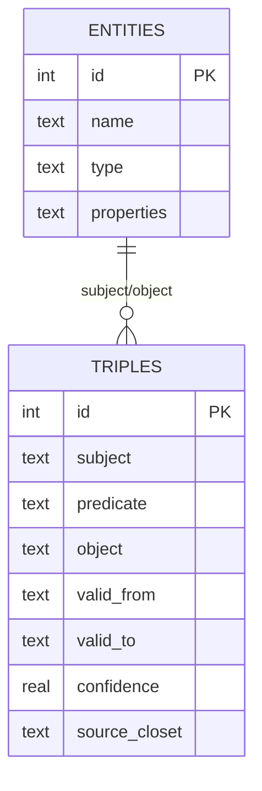

# Chapter 11: Temporal Knowledge Graph

> **Positioning**: The opening chapter of Part 4, "The Time Dimension." Starting from MemPalace's knowledge graph source code, this chapter analyzes the design philosophy of temporal triples: facts are not eternal -- they have lifecycles. This chapter is the foundation for understanding Chapter 12's contradiction detection and Chapter 13's timeline narration.

---

## Facts Expire

Before discussing the technical implementation, let us address the most fundamental cognitive issue.

"Kai is working on the Orion project." This statement was a fact in June 2025. By March 2026, Kai had moved to another project, and the statement was no longer true. But in a traditional knowledge graph, this record still sits quietly, with no one informing the system that it has expired. The next time someone asks "What project is Kai working on now?", the system confidently delivers a wrong answer.

This is not hypothetical. This is a real problem faced by virtually all knowledge systems based on static triples. In Wikipedia's infoboxes, tens of thousands of expired facts await manual updates by human volunteers every day. In enterprise knowledge bases, project assignments, personnel responsibilities, and technology stack choices -- these pieces of information typically have a shelf life measured in weeks, while update frequency is measured in months or even years.

MemPalace's response to this problem is: **do not pretend facts are eternal. Give every fact an explicit time window.**

This is the core idea of the Temporal Knowledge Graph.

---

## Static KG vs. Temporal KG

A traditional knowledge graph stores triples: subject-predicate-object. For example, `(Kai, works_on, Orion)`. This triple expresses a relationship, but it does not answer three critical questions:

1. **When did this relationship begin?**
2. **Is this relationship still valid now?**
3. **At a specific historical point in time, was this relationship valid?**

A static KG cannot answer these questions because its data model simply has no time dimension. All you can do is overwrite old values (losing history) or append new values (creating contradictions).

A temporal KG adds two timestamps to triples: `valid_from` (effective date) and `valid_to` (expiration date). Multiple relationships of the same type can exist between the same subject and object, each covering a different time period. This transforms the knowledge graph from a static snapshot into a chronicle.

A comparison table:

| Capability | Static KG | Temporal KG |
|------|---------|---------|
| Store current facts | Yes | Yes |
| Store historical facts | Overwrite loses them | Fully preserved |
| Answer "Is X true now?" | Yes (but may be stale) | Precisely |
| Answer "Was X true in Jan 2025?" | No | Yes |
| Detect expired information | No | Yes |
| Support timeline narration | No | Yes |

MemPalace chose temporal KG. The direct consequence of this choice is: every fact entering the knowledge graph must carry temporal information, and every query result leaving the knowledge graph can be filtered by time.

---

## Schema Design

Opening `knowledge_graph.py`, the complete database structure can be seen from the `_init_db()` method (`knowledge_graph.py:55`). MemPalace's temporal KG is built on two SQLite tables.

### entities table

```sql
CREATE TABLE IF NOT EXISTS entities (
    id TEXT PRIMARY KEY,
    name TEXT NOT NULL,
    type TEXT DEFAULT 'unknown',
    properties TEXT DEFAULT '{}',
    created_at TEXT DEFAULT CURRENT_TIMESTAMP
);
```

(`knowledge_graph.py:58-63`)

The entity table design is minimalist. `id` is the normalized form of the entity name (lowercase, spaces replaced by underscores), `name` preserves the original display name, `type` marks the entity type (person, project, tool, concept), and `properties` is a JSON field for storing additional entity attributes (such as birthday, gender, etc.).

Note that the `type` field defaults to `'unknown'`. This means entities can be created without complete type information -- the system will not refuse to store a relationship because of missing metadata. This is a classic "tolerant input" design: store the information first, fill in type information later.

### triples table

```sql
CREATE TABLE IF NOT EXISTS triples (
    id TEXT PRIMARY KEY,
    subject TEXT NOT NULL,
    predicate TEXT NOT NULL,
    object TEXT NOT NULL,
    valid_from TEXT,
    valid_to TEXT,
    confidence REAL DEFAULT 1.0,
    source_closet TEXT,
    source_file TEXT,
    extracted_at TEXT DEFAULT CURRENT_TIMESTAMP,
    FOREIGN KEY (subject) REFERENCES entities(id),
    FOREIGN KEY (object) REFERENCES entities(id)
);
```

(`knowledge_graph.py:65-78`)

This is the core of the temporal KG. Beyond the standard `subject`/`predicate`/`object` triple fields, five additional fields deserve individual examination:

**`valid_from` and `valid_to`** -- the time window. Both fields allow `NULL`. A `NULL` `valid_from` means "unknown when it started" (not "has existed since the beginning of time"); a `NULL` `valid_to` means "currently still valid." This convention is crucial: by checking `valid_to IS NULL`, the system can immediately distinguish current facts from historical facts.

**`confidence`** -- confidence level, defaulting to 1.0 (fully certain). This field leaves room for future probabilistic reasoning. When a fact comes from a less reliable source (such as a relationship inferred from casual conversation), the confidence can be set below 1.0.

**`source_closet`** -- points to a closet in the memory palace. This is the bridge between the knowledge graph and the palace structure: every triple can be traced back to which closet it came from, and thus back to the original verbatim memory. When you question "what is the basis for this fact?", the system can take you back to the original conversation text.

**`source_file`** -- the original file path. Lower-level provenance information than `source_closet`.

**`extracted_at`** -- the time the triple was entered into the system. Note this differs from `valid_from`: a fact might have become effective in 2025 but not entered into the system until 2026.

Finally, the index design (`knowledge_graph.py:82-84`):

```sql
CREATE INDEX IF NOT EXISTS idx_triples_subject ON triples(subject);
CREATE INDEX IF NOT EXISTS idx_triples_object ON triples(object);
CREATE INDEX IF NOT EXISTS idx_triples_predicate ON triples(predicate);
CREATE INDEX IF NOT EXISTS idx_triples_valid ON triples(valid_from, valid_to);
```

Four indexes covering the triple's three dimensions plus the time window. `idx_triples_valid` is a composite index covering both `valid_from` and `valid_to`, enabling efficient execution of time range queries.



---

## Writing: add_triple()

The `add_triple()` method (`knowledge_graph.py:110-167`) is the knowledge graph's primary write interface. The method signature is:

```python
def add_triple(
    self,
    subject: str,
    predicate: str,
    obj: str,
    valid_from: str = None,
    valid_to: str = None,
    confidence: float = 1.0,
    source_closet: str = None,
    source_file: str = None,
):
```

Several design details are worth noting.

**Automatic entity creation.** Before inserting a triple, the method automatically creates entity records for the subject and object (if they do not already exist):

```python
conn.execute("INSERT OR IGNORE INTO entities (id, name) VALUES (?, ?)", (sub_id, subject))
conn.execute("INSERT OR IGNORE INTO entities (id, name) VALUES (?, ?)", (obj_id, obj))
```

(`knowledge_graph.py:134-135`)

`INSERT OR IGNORE` means the operation is skipped if the entity already exists. This frees callers from needing to worry about "has this entity been registered before" -- just add triples, and entities automatically appear in the graph. This further reinforces the "tolerant input" design philosophy.

**Deduplication check.** Before inserting a new triple, the method checks whether an identical, still-valid triple already exists:

```python
existing = conn.execute(
    "SELECT id FROM triples WHERE subject=? AND predicate=? AND object=? AND valid_to IS NULL",
    (sub_id, pred, obj_id),
).fetchone()

if existing:
    conn.close()
    return existing[0]  # Already exists and still valid
```

(`knowledge_graph.py:139-146`)

Note the `valid_to IS NULL` in the query condition -- only currently valid triples are checked. If the same relationship once existed but has been marked as ended (`valid_to` is not null), re-adding the same relationship creates a new record rather than reviving the old one. This is intuitive: if Kai once worked on the Orion project, then left, and has now returned, it should be two separate work stints, not one continuous one.

**Triple ID generation.** Each triple's ID is a composite string: `t_{subject}_{predicate}_{object}_{hash}`, where the hash is based on the first 8 characters of the MD5 of `valid_from` and the current timestamp (`knowledge_graph.py:148`). This ensures that even when multiple same-type relationships exist between the same entity pair (covering different time periods), each record has a unique ID.

---

## Querying: query_entity()

The `query_entity()` method (`knowledge_graph.py:186-241`) is the most critical query interface. Its parameter design precisely embodies the temporal KG's query model:

```python
def query_entity(self, name: str, as_of: str = None, direction: str = "outgoing"):
```

Three parameters, three dimensions:

- **`name`**: The entity to query.
- **`as_of`**: An optional temporal snapshot. If provided, only facts valid at that point in time are returned.
- **`direction`**: Relationship direction. `"outgoing"` queries relationships where the entity is the subject (entity -> ?), `"incoming"` queries relationships where the entity is the object (? -> entity), `"both"` queries both directions.

The SQL implementation of the `as_of` parameter is the essence of this query logic (`knowledge_graph.py:201-203`):

```python
if as_of:
    query += " AND (t.valid_from IS NULL OR t.valid_from <= ?) AND (t.valid_to IS NULL OR t.valid_to >= ?)"
    params.extend([as_of, as_of])
```

The meaning of this condition is: a fact is valid at the `as_of` point in time if and only if:
1. Its effective date is before or equal to `as_of` (or the effective date is unknown), **and**
2. Its expiration date is after or equal to `as_of` (or it has not yet expired).

`valid_from IS NULL` is treated as "always valid," and `valid_to IS NULL` is treated as "not yet ended." This means a fact without temporal information is considered valid at all points in time -- a reasonable default behavior, as it avoids "filtering out a fact just because it lacks a time annotation."

The query result includes a `current` field (`knowledge_graph.py:215`):

```python
"current": row[5] is None,
```

`row[5]` is `valid_to`. If it is `None` (i.e., `NULL`), the fact is still valid. This allows callers to distinguish current facts from historical facts at a glance.

### A Concrete Query Example

Suppose the knowledge graph contains the following triples:

```
Kai -> works_on -> Orion   (valid_from: 2025-06-01, valid_to: 2026-03-01)
Kai -> works_on -> Nova    (valid_from: 2026-03-15, valid_to: NULL)
Kai -> recommended -> Clerk (valid_from: 2026-01-01, valid_to: NULL)
```

Calling `kg.query_entity("Kai")` without the `as_of` parameter returns all three records, with the first having `current` as `False` and the latter two as `True`.

Calling `kg.query_entity("Kai", as_of="2025-12-01")` returns only the first record (Orion), because in December 2025, Kai had not yet recommended Clerk and had not yet moved to Nova.

Calling `kg.query_entity("Kai", as_of="2026-04-01")` returns the latter two (Nova and Clerk), because by April 2026, Kai had already left Orion.

This is the power of temporal queries: the same entity presents different factual faces at different points in time.

---

## Invalidation: invalidate()

The `invalidate()` method (`knowledge_graph.py:169-182`) is used to mark the end of a fact:

```python
def invalidate(self, subject: str, predicate: str, obj: str, ended: str = None):
    """Mark a relationship as no longer valid (set valid_to date)."""
    sub_id = self._entity_id(subject)
    obj_id = self._entity_id(obj)
    pred = predicate.lower().replace(" ", "_")
    ended = ended or date.today().isoformat()

    conn = self._conn()
    conn.execute(
        "UPDATE triples SET valid_to=? WHERE subject=? AND predicate=? AND object=? AND valid_to IS NULL",
        (ended, sub_id, pred, obj_id),
    )
    conn.commit()
    conn.close()
```

Design highlights:

1. **Only updates currently valid records** (`valid_to IS NULL`). It will not accidentally modify already-ended historical records.
2. **Default end date is today** (`ended or date.today().isoformat()`). Most of the time, you realize something is no longer true "right now."
3. **No data deletion.** Invalidation is not deletion but setting an end time. Historical queries can still see this record.

This "soft delete" strategy means the knowledge graph is a data structure that only grows, never shrinks. Every fact that was once true remains in the graph permanently. While this might sound like it could create storage pressure, for personal or small-team-scale knowledge graphs, a SQLite database file with even tens of thousands of triples is only a few MB -- not a problem at all.

---

## Why SQLite

MemPalace's temporal knowledge graph directly competes with Zep's Graphiti. The README contains a direct comparison (`README.md:359-366`):

| Feature | MemPalace | Zep (Graphiti) |
|------|-----------|----------------|
| Storage | SQLite (local) | Neo4j (cloud) |
| Cost | Free | $25/mo+ |
| Temporal | Yes | Yes |
| Self-hosted | Always | Enterprise only |
| Privacy | Everything local | SOC 2, HIPAA |

Zep's Graphiti uses Neo4j as its underlying graph database. Neo4j is the benchmark product in the graph database space, supporting native graph traversal, the Cypher query language, and distributed cluster deployment. Its capabilities are beyond question -- but for MemPalace's use case, most of these capabilities are excessive.

MemPalace's knowledge graph query patterns are highly concentrated: entity-centric queries for direct relationships with optional temporal filtering. It does not need multi-hop traversal ("find all people with three degrees of separation from Kai"), does not need complex graph algorithms (shortest path, community detection), and does not need horizontal scaling to multi-node clusters.

For this query pattern, SQLite has three decisive advantages:

**Zero operations.** SQLite is an embedded database that requires no server startup, connection configuration, or process management. It is just a file. `~/.mempalace/knowledge_graph.sqlite3`, and that is it. No Docker, no database administrator, no 3 AM alert wake-ups.

**Local-first.** Data always stays on your machine. No network connection needed, no authentication needed, no worrying about third-party service privacy policy changes. Your knowledge graph sits in your filesystem alongside your code, notes, and photos.

**Good enough.** How much knowledge graph data can a person or small team accumulate over several years? A few thousand entities, tens of thousands of triples -- this is already a quite substantial knowledge graph. SQLite handles this scale with query times in the millisecond range. MemPalace's index design (four indexes covering the primary query paths) ensures that even if data volume increases tenfold, performance will not become a bottleneck.

Of course, choosing SQLite also means giving up some things: no native graph traversal algorithms, no visual query interface, no multi-user concurrent write capability. But none of these are hard requirements in the personal AI memory system scenario. This is a classic engineering tradeoff: giving up unnecessary capabilities in exchange for zero operational cost.

---

## query_relationship(): Querying by Relationship Type

In addition to entity-centric queries, MemPalace provides a relationship-type-centric query interface (`knowledge_graph.py:243-272`):

```python
def query_relationship(self, predicate: str, as_of: str = None):
```

This method returns all triples with a specific relationship type. For example, `kg.query_relationship("works_on")` returns all "works on a project" relationships, while `kg.query_relationship("works_on", as_of="2026-01-01")` returns only work relationships that were still valid on January 1, 2026.

This query pattern is particularly useful in contradiction detection. When the system needs to verify the claim "Soren completed the auth migration," it can call `query_relationship("assigned_to")` to see who the auth-migration project was actually assigned to. We will discuss this mechanism in detail in Chapter 12.

---

## Seeding from Known Facts

The `seed_from_entity_facts()` method (`knowledge_graph.py:338-384`) demonstrates how the knowledge graph is initialized. It accepts a structured entity-facts dictionary and batch-creates entities and triples:

```python
def seed_from_entity_facts(self, entity_facts: dict):
    """
    Seed the knowledge graph from fact_checker.py ENTITY_FACTS.
    This bootstraps the graph with known ground truth.
    """
```

This method handles multiple relationship types: `child_of` (parent-child), `married_to` (marriage), `is_sibling_of` (sibling), `is_pet_of` (pet ownership), and `loves` (interests/hobbies). Each relationship carries an appropriate `valid_from` timestamp -- parent-child relationships start from the birth date, interests/hobbies start from `2025-01-01`.

The comments note that data comes from `fact_checker.py ENTITY_FACTS`, meaning there is an independent fact verification module maintaining a set of verified baseline facts. The knowledge graph seeding process is essentially converting these baseline facts from one data structure (Python dictionary) to another (SQLite triples). This design decouples "fact source" from "fact storage" -- you can replace the knowledge graph implementation without affecting fact verification logic, and vice versa.

---

## stats(): Graph Overview

The `stats()` method (`knowledge_graph.py:315-334`) provides global statistics for the knowledge graph:

```python
return {
    "entities": entities,
    "triples": triples,
    "current_facts": current,
    "expired_facts": expired,
    "relationship_types": predicates,
}
```

The distinction between `current_facts` and `expired_facts` is particularly meaningful. If a knowledge graph has far more `expired_facts` than `current_facts`, it indicates the graph covers a long time span with extensive accumulated history. If `current_facts` far exceeds `expired_facts`, most facts were recently entered and are still valid. This ratio itself is metadata, telling you the knowledge graph's "age" and "activity level."

---

## Entity ID Normalization

A seemingly minor but very important design detail is how entity IDs are generated (`knowledge_graph.py:92-93`):

```python
def _entity_id(self, name: str) -> str:
    return name.lower().replace(" ", "_").replace("'", "")
```

All entity names are normalized before storage: converted to lowercase, spaces replaced with underscores, apostrophes removed. This means `"Kai"`, `"kai"`, and `"KAI"` all map to the same entity ID `"kai"`.

This design solves a very practical problem: when extracting facts from multiple sources (conversations, documents, code comments), the same entity will almost certainly appear in different cases and formats. Without normalization, the knowledge graph would contain `kai`, `Kai`, and `KAI` as three separate entities with no relationships between them -- but in reality they are the same person.

The normalization function is intentionally simple. It does not attempt to handle complex synonym problems (such as recognizing that "Zhang San" and "Zhang San" in different scripts refer to the same person), nor does it attempt entity disambiguation (same name, different people). It only handles the most common variant cases. More complex entity resolution is left to upstream entity detection modules.

---

## Design Philosophy Summary

Looking back at the entire `knowledge_graph.py` design, several principles run throughout:

**Time is a first-class citizen.** Every write operation accepts time parameters; every query operation supports time filtering. Time is not an afterthought annotation but a core dimension of the data model.

**Tolerant input, precise output.** On write, missing time information, missing entity types, and missing provenance information are all acceptable. On query, filtering by time window is precise, and the distinction between current and historical facts is precise. The system will not refuse to work because data is imperfect, but it will not give vague answers because data is imperfect either.

**Grow only, never shrink.** `invalidate()` does not delete data; it only marks the end time. `add_triple()` does not overwrite ended records; it creates new records. The knowledge graph is a chronicle, and every page is preserved.

**Local-first, zero dependencies.** SQLite as the storage engine requires no external services, no network connection, and no additional process management. The entire knowledge graph is a single `.sqlite3` file in your filesystem.

These principles together form the design philosophy of MemPalace's temporal knowledge graph. It does not pursue the full capabilities of a graph database, but rather achieves the most critical temporal functionality with minimal complexity for the specific scenario of personal AI memory systems.

The next chapter will examine an important application of the temporal KG: contradiction detection. When a new claim conflicts with existing facts in the knowledge graph, how does the system discover and report this inconsistency? The answer lies in the cross-comparison of time windows.
