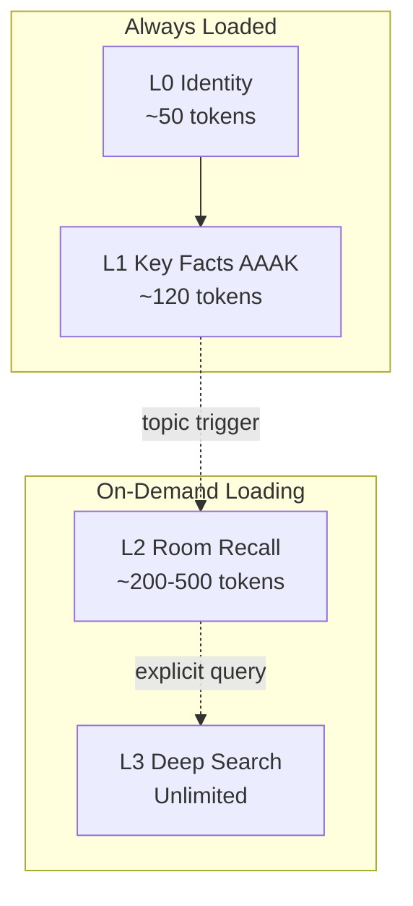

# Chapter 14: L0-L3 -- The Layered Design of the Four-Tier Memory Stack

> **Positioning**: This chapter dissects the design rationale and implementation of MemPalace's four-tier memory stack. We will analyze layer by layer what problem each solves, how many tokens it consumes, when it loads, and why four layers rather than some other number. Source code analysis is based on `mempalace/layers.py`.

---

## A Question About "Waking Up"

When your AI assistant starts a fresh session from scratch, it knows nothing about you. It does not know your name, does not know what project you are working on, does not know you made a critical architectural decision yesterday. Every new session is a complete amnesia.

The naive solution to this problem is: stuff all conversation history into the context window. But as analyzed in earlier chapters of this book, six months of daily AI use produces approximately 19.5 million tokens -- far exceeding any model's context window. Even if context windows expand to 100 million tokens in the future, this brute-force loading approach has a fundamental cost problem: every conversation would bill for millions of tokens, 99% of which are useless in the current conversation.

Another common approach is having the LLM extract "important information" after each conversation and save it as summaries. But as we have repeatedly discussed, this method introduces irreversible information loss at the storage stage.

MemPalace's answer is a four-tier memory stack: not storing more, not storing less, but loading the right amount at the right time.

---

## Why "Stack" Rather Than "Database"

Before discussing the specific layers, it is worth understanding why MemPalace chose the "stack" metaphor.

A traditional database is flat: all data lives on the same level, extracted on demand via query language. But human memory does not work this way. You do not need to recall your own name -- that information is always on the surface of consciousness; you do not need to deliberately think about what you did this morning -- these recent experiences are readily available in "working memory"; but if someone asks about details of a trip three years ago, you need to actively "search" long-term memory.

This layering is not accidental. Cognitive science divides human memory into sensory memory, short-term (working) memory, and long-term memory, each with different capacity, duration, and retrieval cost. MemPalace's four-tier stack directly maps this cognitive structure -- not because biomimicry is the goal, but because this layering happens to solve practical engineering problems in AI context management.

The core question is: **how to maximize information utility within a limited token budget?**

The answer is to layer by frequency and urgency. Some information is needed in every conversation ("who I am"), some only when a specific topic comes up ("recent discussions about this project"), and some only when explicitly asked ("the discussion about GraphQL last March"). Treating them all at the same level is either too expensive, too slow, or both.

---

## The Four-Tier Overview

Before diving into the details of each layer, here is the complete stack structure:

| Layer | Content | Typical Size | Load Timing | Design Motivation |
|------|------|---------|---------|---------|
| L0 | Identity -- "Who am I" | ~50-100 tokens | Always loaded | AI needs to know its role and basic relationships |
| L1 | Key facts -- the most important memories | ~120 tokens (AAAK) / ~500-800 tokens (raw) | Always loaded | Minimum viable context: team, project, core preferences |
| L2 | Room recall -- on-demand retrieval | ~200-500 tokens/retrieval | When a topic comes up | Recent history and relevant context for the current topic |
| L3 | Deep search -- semantic retrieval | Unlimited | On explicit query | Full semantic search across all data |



L0 + L1 constitute the "wake-up cost" -- approximately 170 tokens (when using AAAK compression), or 600-900 tokens (when using raw text). This means your AI needs fewer than a thousand tokens at the start of each new session to "remember" your entire world. Over 95% of the context window is left for the current conversation.

According to the data published in the README, this wake-up cost translates to approximately **$0.70/year** -- assuming one new session per day, loading 170 tokens of AAAK-compressed text each time.

---

## L0: The Identity Layer

```
Layer 0: Identity       (~100 tokens)   -- Always loaded. "Who am I?"
```

L0 is the simplest layer in the entire stack and also the most indispensable. It answers a fundamental question: **who is this AI assistant?**

In the `layers.py` implementation, the `Layer0` class reads identity information from a plain text file (`layers.py:34-69`):

```python
class Layer0:
    """
    ~100 tokens. Always loaded.
    Reads from ~/.mempalace/identity.txt -- a plain-text file the user writes.
    """
    def __init__(self, identity_path: str = None):
        if identity_path is None:
            identity_path = os.path.expanduser("~/.mempalace/identity.txt")
        self.path = identity_path
        self._text = None

    def render(self) -> str:
        if self._text is not None:
            return self._text
        if os.path.exists(self.path):
            with open(self.path, "r") as f:
                self._text = f.read().strip()
        else:
            self._text = (
                "## L0 -- IDENTITY\n"
                "No identity configured. Create ~/.mempalace/identity.txt"
            )
        return self._text
```

Several design choices are worth noting.

**Plain text, user-written.** Identity is not automatically extracted from conversations but written by the user themselves. This is a deliberate decision. Identity is declarative knowledge -- "I am Atlas, Alice's personal AI assistant" -- that does not need to be mined from massive conversations. Having users define their own identity means identity is always precise, intentional, and controllable.

**Filesystem, not database.** L0 reads from `~/.mempalace/identity.txt` -- an ordinary text file editable with any text editor. This eliminates all the complexity of "how to update identity." Want to change the identity? Edit the file.

**Cached reading.** The `render()` method uses `_text` for simple caching (`layers.py:52-65`). The file is read only once; afterward, the cached content is returned directly. This is sufficient for L0 -- identity does not change during a session.

**Graceful degradation.** If the identity file does not exist, L0 does not error out but returns prompt text guiding the user to create the file (`layers.py:61-63`). The system can always start, regardless of whether configuration is complete.

**Token estimation.** The `token_estimate()` method uses a simple heuristic: character count divided by 4 (`layers.py:67-68`). This is not a precise tokenizer calculation but a good-enough approximation. At L0's scale (typically a few dozen to a hundred tokens), this precision is perfectly acceptable.

A typical identity.txt looks roughly like this:

```
I am Atlas, a personal AI assistant for Alice.
Traits: warm, direct, remembers everything.
People: Alice (creator), Bob (Alice's partner).
Project: A journaling app that helps people process emotions.
```

This is approximately 50 tokens. It looks trivial, but it gives the AI a crucial anchor: it knows "who" it is, "whom" it serves, and what its behavioral style should be. Without this anchor, every conversation would need to begin by re-establishing the relationship from "Hello, I am your AI assistant."

---

## L1: The Key Facts Layer

```
Layer 1: Essential Story (~500-800)  -- Always loaded. Top moments from the palace.
```

If L0 is "who am I," L1 is "what are the most important things I know."

L1's design goal is to load the core facts most likely to be useful in the current conversation within the smallest possible token budget. It does not need to contain all memories -- that is L3's job -- but rather provides a "minimum viable context" that allows the AI to appear as if it "remembers you" without any active searching.

In `layers.py:76-168`, the `Layer1` class implementation reveals several key design decisions:

**Auto-generated, not manually maintained.** Unlike L0, L1 does not require the user to write it by hand. It automatically extracts the most important memory fragments from ChromaDB's palace data (`layers.py:91-168`).

**Importance ranking.** L1 uses a scoring mechanism to decide which memories are most worth loading. The scoring logic is at `layers.py:116-128`:

```python
scored = []
for doc, meta in zip(docs, metas):
    importance = 3
    for key in ("importance", "emotional_weight", "weight"):
        val = meta.get(key)
        if val is not None:
            try:
                importance = float(val)
            except (ValueError, TypeError):
                pass
            break
    scored.append((importance, meta, doc))

scored.sort(key=lambda x: x[0], reverse=True)
top = scored[: self.MAX_DRAWERS]
```

The code tries to read importance scores from multiple metadata keys -- `importance`, `emotional_weight`, `weight` -- reflecting a pragmatic compatibility strategy: data from different sources may use different key names to mark importance, and L1 tries each in sequence, using the first valid value found. The default value is 3 (moderate importance), ensuring that even without explicit marking, memories can participate in ranking.

**Grouped by room.** The top N memories after sorting are not simply listed in a flat list but grouped by room for display (`layers.py:135-139`):

```python
by_room = defaultdict(list)
for imp, meta, doc in top:
    room = meta.get("room", "general")
    by_room[room].append((imp, meta, doc))
```

This design gives L1's output structure -- the AI does not see a jumble of scattered facts but information organized by topic. This aligns with the memory palace's core concept: spatial structure itself is the index.

**Hard token limits.** L1 has two hard constraints: maximum 15 memories (`MAX_DRAWERS = 15`), and total characters not exceeding 3200 (`MAX_CHARS = 3200`, approximately 800 tokens). When approaching the limit, the generation process gracefully truncates and adds a `"... (more in L3 search)"` hint telling the AI it can get more through deep search (`layers.py:160-163`).

**Why ~120 tokens (AAAK) and ~500-800 tokens (raw)?** This range was not decided arbitrarily. The README data indicates MemPalace's goal is to keep the wake-up cost (L0 + L1) around 170 tokens. When using AAAK compression (30x compression ratio), L1 occupies approximately 120 tokens -- enough to include team members, current projects, key decisions, and core preferences. Without AAAK, the same information volume occupies 500-800 tokens, still within a manageable range.

This token budget was determined through reverse derivation: first define "after waking up, what questions should the AI be able to answer" (who you are, who your team is, what project you are currently working on, what important decisions were recently made), then calculate the minimum information needed to answer these questions, plus a safety margin. 120 AAAK tokens is that minimum information amount.

---

## L2: The On-Demand Retrieval Layer

```
Layer 2: On-Demand      (~200-500 each)  -- Loaded when a topic/wing comes up.
```

L2 is the middle ground between "passive memory" and "active search."

L0 and L1 are always present, forming the AI's "resident awareness." L3 is deep search, requiring explicit queries. L2's role sits between both: when a topic naturally arises in conversation -- for example, the user mentions a project name, or discussion shifts to a technical domain -- L2 automatically loads memory fragments related to that topic.

In `layers.py:176-233`, `Layer2`'s implementation is quite straightforward:

```python
class Layer2:
    """
    ~200-500 tokens per retrieval.
    Loaded when a specific topic or wing comes up in conversation.
    Queries ChromaDB with a wing/room filter.
    """
    def retrieve(self, wing: str = None, room: str = None, 
                 n_results: int = 10) -> str:
```

L2's core mechanism is **filtering rather than searching**. It does not use semantic queries but narrows scope through metadata filtering (wing and room) (`layers.py:195-205`):

```python
where = {}
if wing and room:
    where = {"$and": [{"wing": wing}, {"room": room}]}
elif wing:
    where = {"wing": wing}
elif room:
    where = {"room": room}

kwargs = {"include": ["documents", "metadatas"], "limit": n_results}
if where:
    kwargs["where"] = where

results = col.get(**kwargs)
```

Note this uses `col.get()` rather than `col.query()`. `get()` is ChromaDB's metadata filtering method, involving no vector similarity computation -- it simply returns documents matching the conditions. This means L2 retrieval is deterministic and has zero semantic overhead. When the user says "let's look at the Driftwood project," L2 does not need to understand the "meaning" of this sentence; it only needs to find all memories with `wing=driftwood`.

**Why 200-500 tokens?** This range corresponds to the 5-10 most recent memory fragments under a topic. Each fragment is truncated to under 300 characters (`layers.py:226-228`), and with metadata tags, the total is kept to one or two paragraphs. This amount is sufficient for the AI to "recall" the recent thread of the current topic without crowding the conversation's own context space.

L2's existence solves a subtle but important user experience problem: without L2, the AI either has only L1-level shallow knowledge of all topics (insufficient) or requires the user to manually trigger a search every time topics change (too cumbersome). L2 makes "naturally switching topics" possible -- when you mention a project, related memories automatically surface, just as humans naturally recall related experiences in conversation.

---

## L3: The Deep Search Layer

```
Layer 3: Deep Search    (unlimited)      -- Full ChromaDB semantic search.
```

L3 is the only layer that uses semantic search.

The previous three layers all perform "pre-loading" -- based on rules and structure, automatically injecting relevant information before conversation begins or when topics switch. L3 is different: it is an on-demand, full-corpus search, used to answer questions that require retrieval across the entire memory store.

`Layer3`'s core method `search()` is at `layers.py:251-303`:

```python
class Layer3:
    """
    Unlimited depth. Semantic search against the full palace.
    """
    def search(self, query: str, wing: str = None, 
               room: str = None, n_results: int = 5) -> str:
        # ...
        kwargs = {
            "query_texts": [query],
            "n_results": n_results,
            "include": ["documents", "metadatas", "distances"],
        }
        if where:
            kwargs["where"] = where

        results = col.query(**kwargs)
```

Here `col.query()` is used -- ChromaDB's semantic search method. It converts the query text into a vector, ranks the entire collection by cosine similarity, and returns the closest results.

L3's output format design is also noteworthy (`layers.py:287-303`):

```python
lines = [f'## L3 -- SEARCH RESULTS for "{query}"']
for i, (doc, meta, dist) in enumerate(zip(docs, metas, dists), 1):
    similarity = round(1 - dist, 3)
    wing_name = meta.get("wing", "?")
    room_name = meta.get("room", "?")
    # ...
    lines.append(f"  [{i}] {wing_name}/{room_name} (sim={similarity})")
    lines.append(f"      {snippet}")
```

Each result includes three types of information: location (wing/room), similarity score, and content snippet. Location information tells the AI "where in the palace" this memory lives, the similarity score lets the AI judge the result's reliability, and the content snippet provides the actual information.

**Relationship with `searcher.py`.** The L3 implementation in `layers.py` and the search functionality in `searcher.py` are logically overlapping. `searcher.py` provides two functions: `search()` (prints formatted output, `searcher.py:15-84`) and `search_memories()` (returns structured data, `searcher.py:87-142`). Both use the same ChromaDB `query()` call, differing only in output format -- the former for CLI, the latter for programmatic calls such as the MCP server.

L3 also provides a `search_raw()` method (`layers.py:305-352`) that returns raw dictionary lists instead of formatted text. This provides a flexible data interface for upper-layer applications (such as MCP tools).

---

## Unified Interface: MemoryStack

The four layers are exposed through a unified `MemoryStack` class (`layers.py:360-438`):

```python
class MemoryStack:
    def __init__(self, palace_path=None, identity_path=None):
        self.l0 = Layer0(self.identity_path)
        self.l1 = Layer1(self.palace_path)
        self.l2 = Layer2(self.palace_path)
        self.l3 = Layer3(self.palace_path)

    def wake_up(self, wing=None) -> str:
        """L0 (identity) + L1 (essential story). ~600-900 tokens."""
        parts = []
        parts.append(self.l0.render())
        parts.append("")
        if wing:
            self.l1.wing = wing
        parts.append(self.l1.generate())
        return "\n".join(parts)

    def recall(self, wing=None, room=None, n_results=10) -> str:
        """On-demand L2 retrieval."""
        return self.l2.retrieve(wing=wing, room=room, n_results=n_results)

    def search(self, query, wing=None, room=None, n_results=5) -> str:
        """Deep L3 semantic search."""
        return self.l3.search(query, wing=wing, room=room, n_results=n_results)
```

Three methods, three usage scenarios:

- `wake_up()`: Called once at the start of each session. Injected into the system prompt or first message.
- `recall()`: Called on topic changes. When conversation involves a specific project or domain, loads related memories.
- `search()`: Called on explicit user questions. Semantic retrieval across all data.

The `wake_up()` method also supports a wing parameter (`layers.py:380-399`), allowing L1 content to be filtered by project. If you are working on Driftwood, `wake_up(wing="driftwood")` loads only key facts related to Driftwood, further reducing token consumption while improving information relevance.

The `status()` method (`layers.py:409-438`) provides overall stack diagnostics, including whether the identity file exists, token estimates, and total memory count. This is useful for debugging and operations.

---

## Why Four Layers, Not Two or Eight

This is a design question worth answering seriously.

**Why not two layers (always-loaded + search)?** Because an important gray area exists between "always loaded" and "search." Imagine a system with only L0+L1 and L3: your AI knows your name and current project (L1), and can search if asked specific questions (L3), but when conversation naturally shifts to a related topic, it does not automatically load context. Users would either need to constantly trigger searches manually or tolerate the AI's shallow understanding of the current topic. L2 fills this gap -- it is "topic-aware preloading," making conversational flow more natural.

**Why not three layers (dropping L0, merging identity into L1)?** Because identity and facts are fundamentally different in nature. Identity is declarative, user-controlled, and almost never changes. L1's key facts are auto-generated from data, ranked by importance, and updated as new data arrives. Mixing them together means either user identity declarations get crowded out by auto-generated content, or auto-generation logic must carefully avoid the user-written portions. Separating them is cleaner.

**Why not more layers?** Because each additional layer adds a "when to load" decision point. Four layers already cover all critical temporal semantics: always (L0, L1), by topic (L2), by query (L3). It is hard to define a fifth meaningful loading trigger. If you try to split L2 into "recent topics" and "older topics," or split L3 into "shallow search" and "deep search," the complexity introduced would likely exceed the benefit.

Four layers is a **minimum complete set**: one fewer means missing functionality, one more means over-engineering.

---

## The Economics of Token Budgets

Finally, let us do the math.

The core number is: MemPalace wake-up requires only ~170 tokens, with an annual cost of approximately $0.70; even adding 5 daily deep searches costs no more than ~$10/year -- a stark contrast to the ~$507/year of LLM summarization approaches (for the complete cost comparison across approaches, see Chapter 23).

The $0.70/year wake-up cost -- the significance of this number is not how cheap it is, but what design principle it reveals: **the best cost optimization is not making each call cheaper, but making most calls not happen at all.**

The 170 tokens of L0 + L1 are not "compressed" into existence -- they are "selected" into existence. Through four-tier layering, over 95% of memories never need to be loaded into any conversation's context. They sit quietly in ChromaDB, appearing through L2 or L3 only when explicitly needed.

This is the value of layering: it does not make you store fewer things, but makes you load the right amount at the right time. Six months of complete memories are still there, not a single one lost. But your AI needs only 170 tokens to "wake up" and behave as though it remembers everything.

The stack is not a filing cabinet. It is a layered decision system about "what is worth remembering right now."
