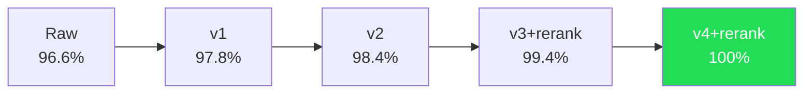

# Chapter 15: Hybrid Retrieval -- From 96.6% to 100%

> **Positioning**: This chapter analyzes how MemPalace leaped from 96.6% R@5 with pure vector retrieval to 100% (500/500) with hybrid mode. We will dissect the failure case types in the 3.4%, the step-by-step technical improvement path, the cost and rationale of Haiku reranking, and why 100% should not be simply equated with "forever perfect."

---

## What 96.6% Means

Of the 500 questions in the LongMemEval benchmark, MemPalace's pure ChromaDB mode -- calling no external APIs, using no LLM, running entirely locally -- hit 483. This is a number that needs to be understood in context.

LongMemEval is a standardized AI memory benchmark containing six question types: knowledge update, multi-session reasoning, temporal reasoning, single-session user questions, single-session preference questions, and single-session assistant questions. R@5 (Recall at 5) means: does the correct answer exist within the system's top 5 returned results? 96.6% means that of 500 questions, only 17 had the correct answer outside the top 5 retrieval results.

The system that achieved this score depended on exactly one component: ChromaDB's default embedding model (all-MiniLM-L6-v2). No post-processing, no reranking, no "intelligent extraction." Store raw text, embed, sort by cosine similarity, return.

As `BENCHMARKS.md` states:

> Nobody published this result because nobody tried the simple thing and measured it properly.

This statement points to a deeper discovery: the entire AI memory field has been over-engineering at the storage stage. When Mem0 uses an LLM to extract "user prefers PostgreSQL" and discards the original conversation, when Mastra uses GPT to observe conversations and generate summaries, they are all introducing irreversible information loss at the storage stage. MemPalace proved a counterintuitive fact: preserving raw text and relying on a good embedding model for retrieval is already an extremely powerful baseline.

But 96.6% is not 100%. What do those 17 failed questions tell us?

---

## 3.4%: Anatomy of the Failure Cases

Analysis of the failure cases reveals several clear patterns. These patterns are not random -- they point to systematic blind spots in vector retrieval.

### Type 1: Embedding Model Underweights Specific Nouns

`HYBRID_MODE.md` documents typical cases:

- **"What degree did I graduate with?"** The correct answer is "Business Administration." The embedding model treats "Business Administration" and "Computer Science" as semantically equally close to "what degree" -- both are degree names and are close in embedding space. But only one document simultaneously contains both "degree" and "Business Administration."
- **"What kitchen appliance did I buy?"** The correct answer is "stand mixer." "Kitchen appliance" is a broad semantic region in embedding space with many related documents. But "stand mixer" as a specific noun appears in only one specific document.
- **"Where did I study abroad?"** The correct answer is "Melbourne." City names have their embedding signal diluted when surrounded by abundant contextual vocabulary.

Common characteristic: the correct answer depends on a specific noun or phrase, and the embedding model tends to capture "semantic similarity" rather than "exact match." When multiple documents are semantically related to the query, the embedding model cannot distinguish which contains the specific answer word.

### Type 2: Temporal Anchors Ignored by Embeddings

"What was the significant business milestone I mentioned four weeks ago?" This type of question contains a temporal anchor -- "four weeks ago." The embedding model does not process temporal information at all. It does not know which date "four weeks ago" corresponds to, nor can it adjust ranking based on document timestamps. The correct document is indeed semantically related to the query (it is about a "business milestone"), but within the top-50 semantic results, its ranking is not high enough because the temporal signal is ignored.

### Type 3: Indirect Expression of Preferences

"What database do I prefer?" This type of question is related in embedding space to many documents involving databases. But the way users express preferences is often indirect -- "I find Postgres more reliable in my experience" or "I usually go with Postgres for new projects." The embedding model interprets these sentences as "statements about Postgres" rather than "expressions of preference." When the top-5 results include other more "semantically close" database discussion documents, the document actually containing the preference may rank 6th or 7th.

### Type 4: References to Assistant Responses

"You suggested X, can you remind me..." This type of question refers to something the AI assistant said, not the user. But the standard index only stores user utterances. Assistant responses are not in the search scope and naturally cannot match.

---

## From 96.6% to 100%: A Five-Step Leap

MemPalace's improvement path was a series of targeted fixes for specific failure patterns, not speculative generalized optimization. Each step responds to one of the failure types analyzed above. `BENCHMARKS.md` documents the complete evolution trajectory.



### Step 1: Hybrid Scoring v1 (96.6% -> 97.8%)

**Problem addressed:** Type 1 -- specific nouns underweighted by embeddings.

**Method:** Layer keyword overlap scoring on top of embedding similarity. Extract meaningful keywords from the query (removing stopwords), calculate the matching proportion of keywords in each candidate document, and use this proportion to adjust the distance score.

`HYBRID_MODE.md` documents the fusion formula:

```python
fused_dist = dist * (1.0 - 0.30 * overlap)
```

- `dist`: ChromaDB's cosine distance (lower is better)
- `overlap`: proportion of query keywords found in the document (0.0 to 1.0)
- `0.30`: boost weight -- up to 30% distance reduction

A concrete example: Document A has semantic distance 0.45 with keyword overlap of 0; Document B has semantic distance 0.52 but complete keyword match. After fusion, A's score remains 0.450, while B becomes 0.364, flipping from behind to ahead in ranking.

The key design choice is expanding the candidate pool: from top-10 to **top-50**. A larger candidate pool gives keyword reranking more working room -- if the correct answer is at semantic rank 45 but has complete keyword match, it needs to be in the pool to have a chance of being promoted.

**Why 30% and not higher?** `HYBRID_MODE.md` explains the weight tuning process. In the full 500-question test, 0.30 and 0.40 performed essentially the same; above 0.40, signs of overfitting began appearing (looking better on a 100-question subset but no improvement on the full 500). 30% is enough to flip edge cases without being so strong as to override clearly better semantic results.

The stopword list itself was also carefully designed:

```python
STOP_WORDS = {
    "what", "when", "where", "who", "how", "which", "did", "do",
    "was", "were", "have", "has", "had", "is", "are", "the", "a",
    "an", "my", "me", "i", "you", "your", ...
}
```

Only words longer than 3 characters and not in the stopword list are treated as keywords. This filters out function words from questions while preserving content words with retrieval value.

### Step 2: Hybrid Scoring v2 (97.8% -> 98.4%)

**Problem addressed:** Type 2 -- temporal anchors ignored.

**Method:** For questions containing temporal references ("four weeks ago," "last month," "recently"), calculate the date distance between each candidate document and the target date, giving temporally proximate documents an additional score boost.

```python
days_diff = abs((session_date - target_date).days)
temporal_boost = max(0.0, 0.40 * (1.0 - days_diff / window_days))
fused_dist = fused_dist * (1.0 - temporal_boost)
```

A maximum 40% temporal boost -- enough to push temporally correct documents to the front, but not enough to completely override the semantic signal. `HYBRID_MODE.md` specifically explains why 100% is not used: temporal proximity is a strong signal but not a deterministic one; it is a "hint" not a "rule."

Additionally, v2 introduced a two-round retrieval mechanism to handle Type 4 (assistant reference questions): the first round uses the user-only index to find the 5 most likely sessions, then the second round builds a new index for those 5 sessions that includes assistant responses and queries again. This "coarse-then-fine" strategy avoids the semantic signal dilution that comes from globally indexing assistant responses.

The key characteristic of v2: **zero LLM calls**. All improvements are based on string matching and date arithmetic -- completed entirely locally, requiring no API key and no network connection.

### Step 3: Hybrid Scoring v2 + Haiku Reranking (98.4% -> 98.8%)

This is the system's first introduction of an LLM.

The `llm_rerank()` function implemented at `longmemeval_bench.py:2765-2860` reveals the complete reranking mechanism:

```python
def llm_rerank(question, rankings, corpus, corpus_ids, api_key, 
               top_k=10, model="claude-haiku-4-5-20251001"):
```

The workflow is extremely concise: take the top-K candidate documents from retrieval, truncate each to the first 500 characters, send them along with the question to Haiku, and ask it to select the one "most likely to contain the answer." The selected document is promoted to rank 1; the rest maintain their original order.

The prompt design is intentionally kept simple (`longmemeval_bench.py:2807-2814`):

```
Question: {question}

Below are {N} conversation sessions from someone's memory. 
Which single session is most likely to contain the answer? 
Reply with ONLY a number between 1 and {N}. Nothing else.

Session 1: {text[:500]}
...

Most relevant session number:
```

**Why select only one instead of performing full reranking?** The explanation in `HYBRID_MODE.md` is direct: requiring full reranking increases prompt complexity and error rates. Selecting the single best is "decisive and reliable." The remaining rankings maintain the hybrid scoring order -- which is already quite good on its own.

**The fault-tolerant design is also noteworthy.** If the API call fails (timeout, rate limiting, no key), the function catches the exception and returns the original ranking unchanged (`longmemeval_bench.py:2851-2858`). The system does not crash because the reranking step failed. This is an optional enhancement, not a required dependency.

### Step 4: Hybrid Scoring v3 + Haiku Reranking (98.8% -> 99.4%)

**Problem addressed:** Type 3 -- indirect expression of preferences.

This step introduced **preference extraction** -- using 16 regex patterns to detect user preference expressions at indexing time:

```python
PREF_PATTERNS = [
    r"i've been having (?:trouble|issues?|problems?) with X",
    r"i prefer X",
    r"i usually X",
    r"i want to X",
    r"i'm thinking (?:about|of) X",
    # ...
]
```

When a preference expression is detected in a session, the system generates a synthetic document -- for example, `"User has mentioned: battery life issues on phone; looking at phone upgrade options"` -- and adds it to ChromaDB with the same `corpus_id` as the original session. This synthetic document directly bridges the semantic gap between query vocabulary and session content.

Simultaneously, v3 expanded the Haiku reranking candidate pool from top-10 to top-20. In some assistant-reference-type failure cases, the correct session ranked 11th or 12th -- just outside Haiku's visible window. Expanding to 20 captured these edge cases, with negligible additional prompt cost.

99.4% is a milestone worth marking: only 3 questions out of 500 remained unhit. More importantly, `BENCHMARKS.md` records an independent verification -- Palace mode (an entirely different retrieval architecture based on hall classification and two-round navigation) also reached exactly 99.4%. Two independent architectures converging on the same score strongly suggests 99.4% is close to the architectural ceiling of this problem.

### Step 5: Hybrid Scoring v4 + Haiku Reranking (99.4% -> 100%)

The last 3 failed questions were analyzed and fixed individually. `BENCHMARKS.md` documents each one:

**Question 1: Quoted phrase.** A question contained a precise phrase enclosed in single quotes. Fix: detect phrases inside quotes and give sessions containing that phrase a 60% distance reduction.

**Question 2: Insufficient name weight.** A temporal reasoning question about a specific person. The embedding model gave insufficient weight to the proper noun. Fix: extract capitalized proper nouns from the query and give sessions mentioning that name a 40% distance reduction.

**Question 3: Memory/nostalgia pattern.** A preference question involving high school experiences. Fix: add `"I still remember X"`, `"I used to X"`, `"when I was in high school X"` and similar patterns to the preference extraction patterns.

Result: 500/500. All 6 question types at 100%.

**Cross-validation: Haiku vs. Sonnet.** `BENCHMARKS.md` reports a detail: using both Haiku and Sonnet as rerankers achieves 100% R@5, with NDCG@10 of 0.976 and 0.975, respectively -- statistically no difference. Haiku is approximately 3x cheaper and is therefore recommended as the default.

---

## Vector Distance vs. Semantic Understanding

The journey of these five improvement steps reveals a fundamental distinction: **vector distance is not semantic understanding.**

Vector distance measures the geometric distance between two texts in embedding space. When you ask "What database do I prefer?" and the system has three sessions about databases, the embedding model tells you "all three are related to databases, distances are about the same." But answering this question requires not "finding documents about databases" but "finding the document where the user expressed a database preference." This is a semantic reasoning task, not a distance calculation task.

This is why Haiku reranking is so effective. The embedding model can only say "these documents are related to the query." What Haiku can do is read the query and candidate documents, then reason about which document actually answers the question. The former is geometric computation; the latter is reading comprehension.

But it is worth noting: 96.6% of questions do not need this reasoning. For the vast majority of questions, vector distance is a good enough approximation of semantic understanding. Only 3.4% of edge cases require genuine reading comprehension ability to distinguish "semantically related" from "actually answers."

This proportion matters. It means:

1. Vector retrieval itself is an extremely strong baseline that should not be underestimated.
2. LLM reranking is not a replacement for core functionality but a patch for edge cases.
3. The system is already usable and competitive without any LLM involvement.

---

## Cost: The $0.70/Year Arithmetic

Let us calculate the actual cost of Haiku reranking.

Each reranking call sends: 1 question + 10 candidate documents of 500 characters each = approximately 5000 characters = ~1250 input tokens. Haiku's reply is a single number -- approximately 2 tokens. At Haiku's pricing, each call costs approximately $0.001.

If a user conducts 5 deep-search conversations per day, each triggering one Haiku rerank:

```
5 calls/day * 365 days * $0.001/call = $1.83/year
```

But in reality, not every search requires reranking. Most queries get correct results in the pure vector retrieval phase (96.6% of cases). If reranking is only triggered for low-confidence results, actual call frequency is even lower.

The `$0.70/year` cited in the README more specifically refers to the target wake-up cost -- L0 + L1 loaded once daily after the AAAK wake-up path is fully wired through, at roughly 170 tokens each time. The current default implementation is higher, but still in the same "single-digit dollars per year" band for wake-up alone. This and reranking are two separate cost items, but they remain consistent in magnitude: both are in the "dollars per year" range rather than the "hundreds per year" range.

By contrast, the gap between MemPalace's annual cost (pure local $0, with Haiku reranking ~$1-2) and competitors (Mem0, Zep, etc. at $228-$2,988 annually) is not a matter of percentage points -- it is three orders of magnitude. For complete competitor cost comparison data, see Chapter 23.

---

## Do Not Treat 100% as "Forever Perfect"

This point must be stated clearly, because MemPalace's team themselves have repeatedly emphasized this caveat.

100% R@5 was measured on LongMemEval's 500 questions. These 500 questions cover six types, were designed by an academic team, and represent the most standardized evaluation benchmark for AI memory systems currently available. This score is reproducible, verified, and comes with complete reproduction scripts.

But it is still a specific metric on a specific test set. Here are several boundary conditions to note:

**Test set size.** 500 questions are sufficient for statistically meaningful comparison (confidence intervals are narrow enough), but insufficient to represent all possible memory retrieval scenarios. Real-world query diversity far exceeds 500 questions.

**Question type distribution.** LongMemEval's six question types are a classification defined by an academic team. Real user queries may include types beyond these six -- such as cross-modal references ("that architecture diagram you drew for me last time") or metacognitive questions ("how many times have I changed my mind on this issue").

**Data characteristics.** The benchmark uses conversation data prepared by the research team. Different users' conversation styles, topic distributions, and expression habits may differ significantly.

**v4's targeted fixes.** The three fixes from v3 to v4 (quoted phrase extraction, name boosting, nostalgia pattern detection) were designed for specific failed questions. These fixes work perfectly on the test set, but are not guaranteed to apply to entirely new failure patterns. This is an inherent limitation of any data-driven optimization.

`BENCHMARKS.md` expresses this honestly:

> The 96.6% is the product story: free, private, one dependency, no API key, runs entirely offline.
> The 100% is the competitive story: a perfect score on the standard benchmark for AI memory.
> Both are real. Both are reproducible. Neither is the whole picture alone.

96.6% and 100% are two facets of the same system. The former is an unconditional guarantee -- independent of any external service, works in any environment; the latter is competitive performance on a standard benchmark -- but requires an API key and network connection. Users need to choose which mode to use based on their specific scenario.

---

## The Convergence of Two Independent Paths

Before concluding this chapter, it is worth mentioning one more piece of powerful evidence validating MemPalace's retrieval ceiling.

Alongside the hybrid scoring path (hybrid v1 -> v2 -> v3 -> v4), the team independently developed **Palace mode** -- an entirely different retrieval architecture based on hall classification and two-round navigation. Palace mode classifies each session into one of five halls (preferences, facts, events, assistant suggestions, general), then at query time first does a compact search within the most likely hall (reducing noise), followed by a hall-weighted search across all data (preventing classification errors from causing misses).

These two paths converge precisely at 99.4% R@5. `BENCHMARKS.md` calls this "independent architecture convergence" -- different designs, different code paths, same score ceiling. When two independent methods hit the same ceiling, this speaks more powerfully than any single experiment about the ceiling's authenticity.

The final v4 breakthrough from 99.4% to 100% relied on three extremely targeted fixes -- essentially "manually untangling" the last three edge cases. These fixes work, but their targeted nature itself reveals a fact: on this problem, "general-purpose improvements" have reached their limits, and what remains can only be tackled by "picking them off one by one."

This is not pejorative. Quite the opposite -- it demonstrates that MemPalace's foundational architecture -- raw text + structured storage + embedding retrieval -- is strong enough that only a tiny number of highly specific cases require extra handling. 96.6% is the power of architecture. The journey from 3.4% to 0% is the power of precision engineering. Both are indispensable, but their focus differs: the former is transferable; the latter requires adaptation.

If you are designing your own memory system, the design principles behind 96.6% (store raw text, organize structurally, retrieve via embeddings) are directly borrowable. The targeted optimizations from 96.6% to 100% need to be customized based on your own failure cases. This is this chapter's most essential takeaway: **do not start from optimization. Start from the baseline, then let the failure cases tell you what to optimize.**

---

## Version Evolution: v3.0.0 → v3.3.0

The chapter's core analysis (hybrid-path design, the 96.6%-to-100% engineering story, two independent paths converging) still holds in v3.3.0. But two low-level fixes directly affect whether the chapter's numbers are reproducible — if you plan to re-run the benchmark, you must run it on v3.3.0.

### Issue #807: ChromaDB distance metric fix

v3.0.0 did not explicitly declare a distance metric when creating collections, so ChromaDB silently fell back to **L2 (Euclidean)** — whereas the entire book's analysis (this chapter included) assumes **cosine similarity**. The two behave similarly on length-normalized embeddings but can produce radically different nearest-neighbor rankings on unnormalized vectors. This means v3.0.0's 96.6% and v4's 100% were both measured under L2 — the "0.9 cosine dedup threshold" in `add_drawer` and `search`'s cosine distance filter mentioned in this chapter may have **actually been running L2** in v3.0.0.

`#807` added `{"hnsw:space": "cosine"}` metadata at every collection creation site. Only under v3.3.0 does cosine truly land. **If you want to reproduce the 96.6% → 100% numbers, re-run under v3.3.0.**

### BM25 + Closet boost

v3.3.0 introduced the Closet layer as a compact index above drawers (PR `#788`). BM25 runs against closets (`#795`, `#829`), and matches **boost** the underlying drawers rather than gating them — meaning BM25 won't drop drawers that vector retrieval finds but BM25 misses. This is closer to production RAG practice (typical pipelines run BM25 recall + vector rerank, or fusion of both).

This chapter's hybrid path is **problem classification + path selection** hybrid; v3.3.0's BM25 + vector is **recall-layer** hybrid. The two "hybrid" approaches solve different problems and can stack — the benefit of stacking hasn't been measured in this chapter's benchmark and is worth a follow-up experiment.

### Diff snapshot

- v3.0.0: vector retrieval + optional hybrid path + L2 default distance (cosine was the design intent)
- v3.3.0: vector retrieval + BM25 closet boost + enforced cosine + optional hybrid path

None of this chapter's percentage numbers have been re-run on v3.3.0. Readers citing these numbers precisely should understand them as measured against v3.0.0.
