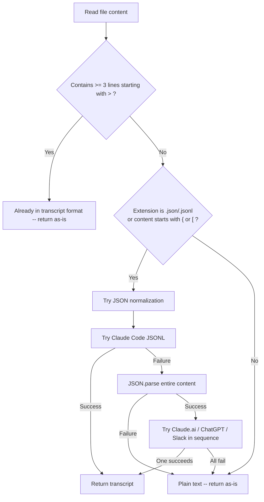

# Chapter 16: Format Normalization

> **Positioning**: The first gate through which data enters the memory palace. Five chat formats, five different data structures, but the palace accepts only one. This chapter covers how normalize.py accomplishes this translation work in under 250 lines of code -- without any ML, without any API calls, purely through pattern matching and structural transformation.

---

## The Problem: Every Platform Invented Its Own Format

If you converse with AI, your conversation history may be scattered across five different places.

Claude Code stores sessions as JSONL -- each line is a JSON object, with the `type` field distinguishing `human` from `assistant`. Claude.ai's web export is a standard JSON array, where each element has `role` and `content`. ChatGPT uses a tree structure -- a `mapping` field contains a node tree, each node has `parent` and `children`, and messages are buried in `message.content.parts`. Slack exports are message lists where `type` is fixed as `"message"` and user identity is hidden in the `user` field. And there is the most basic format: plain text, where human utterances are marked with `>` and AI replies follow directly.

Five formats, five data structures, five different understandings of "what constitutes one turn of conversation."

If you want to do any downstream processing on these conversations -- chunking, retrieval, entity detection -- you have two choices.

**Choice A: Process each format separately.** Write five chunking logics, five entity detection logics, five retrieval logics. Every time a new format is added, all downstream modules must be modified. This is the N x M problem -- N input formats times M processing steps.

**Choice B: Unify the format first, then process.** Write five format converters and one set of downstream logic. Every time a new format is added, only one more converter is needed. This is the N + M problem.

MemPalace chose B. `normalize.py` is that N-to-1 translation layer.

---

## Unified Output: The Transcript Format

Regardless of input format, `normalize()`'s output is always the same text format:

```
> What the user said
AI's reply

> User's next question
AI's next reply

```

The rules are simple:

- User utterances begin with `>` (borrowing Markdown blockquote syntax)
- AI replies follow immediately after the user's message with no prefix
- Each question-answer pair is separated by a blank line

This is MemPalace's internal "lingua franca." Downstream chunkers (Chapter 18), entity detectors (Chapter 17), retrieval engines -- they only need to recognize this one format.

Why this format instead of JSON? Because downstream ultimately needs plain text. Vector embedding needs text, semantic search needs text, and what is displayed to users is also text. Using JSON as an intermediate format means every downstream consumer must parse JSON and then extract text -- an unnecessary level of indirection. Using text directly eliminates this step.

The `>` marker design is also deliberate. It makes "distinguishing who is speaking" an `O(1)` operation -- check whether the line starts with `>`: if yes, it is the user; if no, it is the AI. No state machine needed, no JSON parsing needed, a single `startswith(">")` suffices.

---

## Detection Branches: Identification Logic for Five Formats

The `normalize()` function (`normalize.py:22`) is the entire module's entry point. Its detection logic has three tiers:



The first tier of judgment is at `normalize.py:37-39`:

```python
lines = content.split("\n")
if sum(1 for line in lines if line.strip().startswith(">")) >= 3:
    return content
```

If the file already has 3 or more lines starting with `>`, it is considered already in transcript format and returned directly. The threshold of 3 instead of 1 or 2 is to avoid false triggering from occasional blockquotes in Markdown files.

The second tier is at `normalize.py:43`:

```python
ext = Path(filepath).suffix.lower()
if ext in (".json", ".jsonl") or content.strip()[:1] in ("{", "["):
    normalized = _try_normalize_json(content)
```

This uses a dual condition -- checking both the extension and the first character of the content. The extension covers normally named files; content sniffing covers files with incorrect extensions (e.g., `.txt` that actually stores JSON).

The third tier is a fallback. If it is neither transcript nor JSON, it is treated as plain text and returned as-is. Plain text is handled during the chunking stage using a paragraph-based chunking strategy (see Chapter 18).

---

## Parsing the Five Specific Formats

### Format 1: Claude Code JSONL

Claude Code's session export is JSONL format -- each line is an independent JSON object. The parsing function is `_try_claude_code_jsonl()` (`normalize.py:71`).

Input example:

```jsonl
{"type": "human", "message": {"content": "Explain Python's GIL"}}
{"type": "assistant", "message": {"content": "The GIL is the Global Interpreter Lock..."}}
{"type": "human", "message": {"content": "Is multithreading still useful then?"}}
{"type": "assistant", "message": {"content": "Yes, it depends on your scenario..."}}
```

The key identification signal is the `type` field -- `"human"` or `"assistant"`. The parsing logic reads line by line, skipping lines that fail to parse, skipping non-dictionary lines, extracting only `type` and `message.content`.

The final validation condition is at `normalize.py:92`:

```python
if len(messages) >= 2:
    return _messages_to_transcript(messages)
return None
```

At least 2 messages are required for the parse to be considered successful. This is the minimum threshold shared across all format parsers -- one question and one answer constitute a meaningful conversation.

Note this function's position within `_try_normalize_json()` (`normalize.py:54`) -- it is placed first among all JSON parsers, and executes before `json.loads()`. The reason is that JSONL is not valid JSON; calling `json.loads()` on the entire content would fail. So line-by-line parsing must be attempted first.

### Format 2: Claude.ai JSON

Claude.ai's web export is standard JSON. The parsing function is `_try_claude_ai_json()` (`normalize.py:97`).

Input example:

```json
[
  {"role": "user", "content": "What is a memory palace?"},
  {"role": "assistant", "content": "A memory palace is an ancient mnemonic technique..."}
]
```

Or wrapped in an outer object:

```json
{
  "messages": [
    {"role": "human", "content": "..."},
    {"role": "ai", "content": "..."}
  ]
}
```

This parser's flexibility is evident in two areas. First, the outer structure -- it accepts both a direct array and an object containing `messages` or `chat_messages` keys (`normalize.py:99-100`). Second, role names -- both `"user"` and `"human"` are recognized as the user, and both `"assistant"` and `"ai"` are recognized as the AI (`normalize.py:109-112`). This lenient parsing strategy is not sloppiness but pragmatism -- Claude's API and web interface have used different field names across versions, and rather than guessing "which does the current version use," it supports all of them.

### Format 3: ChatGPT conversations.json

ChatGPT's export format is the most complex of all formats. The parsing function is `_try_chatgpt_json()` (`normalize.py:118`).

ChatGPT does not store conversations in a linear array but in a tree. Why? Because ChatGPT supports "edit a previous message and regenerate" -- users can go back to any point in the conversation, modify their prompt, and generate a new branch. This tree represents those branches.

Input example (simplified):

```json
{
  "mapping": {
    "root-id": {
      "parent": null,
      "message": null,
      "children": ["msg-1"]
    },
    "msg-1": {
      "parent": "root-id",
      "message": {
        "author": {"role": "user"},
        "content": {"parts": ["What is a vector database?"]}
      },
      "children": ["msg-2"]
    },
    "msg-2": {
      "parent": "msg-1",
      "message": {
        "author": {"role": "assistant"},
        "content": {"parts": ["A vector database is a specialized..."]}
      },
      "children": []
    }
  }
}
```

The identification signal is the top-level `mapping` key (`normalize.py:120`). The parsing strategy is to find the root node (a node with `null` parent and no `message`), then follow each node's first `children` all the way down, forming a linear path.

There is a design decision here: when a node has multiple `children` (i.e., the user edited a message creating a branch), only the first branch is taken (`normalize.py:153`). This means branch history is lost. This is a deliberate tradeoff -- for memory storage, preserving "the final direction of the conversation" is more valuable than preserving "all possible branches." If all branches were preserved, subsequent retrieval would produce many near-duplicate results.

The traversal process also uses a `visited` set (`normalize.py:140`) to prevent circular references -- though normal ChatGPT exports should not have cycles, defensive programming is always worthwhile.

### Format 4: Slack JSON

Slack's channel export is a message array. The parsing function is `_try_slack_json()` (`normalize.py:159`).

Input example:

```json
[
  {"type": "message", "user": "U123", "text": "Should we run tests before deploying?"},
  {"type": "message", "user": "U456", "text": "Must run. CI is configured for it."},
  {"type": "message", "user": "U123", "text": "OK, I'll run a local round first."}
]
```

Slack has a fundamental difference from other formats: it is not a "user vs. AI" conversation but a "person vs. person" conversation. There is no natural "questioner" and "answerer" role.

The parser's handling strategy is clever (`normalize.py:177-186`): the first user to appear is labeled as `"user"`, the second as `"assistant"`. If there is a third, fourth participant, their roles depend on the current `last_role` value -- alternating between `user` and `assistant`.

```python
if not seen_users:
    seen_users[user_id] = "user"
elif last_role == "user":
    seen_users[user_id] = "assistant"
else:
    seen_users[user_id] = "user"
```

This does not claim "someone is an AI" but uses the user/assistant alternating structure to ensure downstream question-answer pair chunking works correctly. In the transcript format, `>` marks the "questioner" and the unmarked text is the "responder." For Slack DMs, who is asking and who is answering alternates naturally -- you ask me a question, I answer, then I ask you a question, you answer. Alternating role assignment happens to match this natural conversational rhythm.

### Format 5: Plain Text

Plain text has no dedicated parser. If a file is neither in transcript format nor JSON format, `normalize()` returns the original content directly (`normalize.py:48`).

These files are handled during the chunking stage by `convo_miner.py`'s `_chunk_by_paragraph()` (see Chapter 18), chunking by paragraphs or line groups.

---

## Content Extraction: Unified Handling of Polymorphic Content

Among the five formats, "message content" is represented differently. Claude Code's `content` may be a string or an array containing `{"type": "text", "text": "..."}`; ChatGPT's content is buried in `content.parts` as a string array; Claude.ai's may also be a string or array.

The `_extract_content()` function (`normalize.py:192`) is the unified entry point for handling this polymorphism:

```python
def _extract_content(content) -> str:
    if isinstance(content, str):
        return content.strip()
    if isinstance(content, list):
        parts = []
        for item in content:
            if isinstance(item, str):
                parts.append(item)
            elif isinstance(item, dict) and item.get("type") == "text":
                parts.append(item.get("text", ""))
        return " ".join(parts).strip()
    if isinstance(content, dict):
        return content.get("text", "").strip()
    return ""
```

Three types, three branches, with an empty string fallback. This function is shared by all format parsers, avoiding duplicated content polymorphism handling in each parser.

Note the `list` branch's two treatments of array elements: if the element is a string it is taken directly; if the element is a dict with `type` equal to `"text"`, the `text` field is taken. This covers Claude API's content block format (`[{"type": "text", "text": "..."}, {"type": "image", ...}]`), while automatically skipping non-text content blocks such as images.

---

## Transcript Generation: From Message Lists to Transcript

All format parsers ultimately call `_messages_to_transcript()` (`normalize.py:209`), converting `[(role, text), ...]` lists into transcript text.

The core logic of this function is pairing -- after finding a `user` message, check if the next one is `assistant`; if so, pair them together; if not (e.g., two consecutive `user` messages), output the user message alone.

```python
while i < len(messages):
    role, text = messages[i]
    if role == "user":
        if _fix is not None:
            text = _fix(text)
        lines.append(f"> {text}")
        if i + 1 < len(messages) and messages[i + 1][0] == "assistant":
            lines.append(messages[i + 1][1])
            i += 2
        else:
            i += 1
    else:
        lines.append(text)
        i += 1
    lines.append("")
```

There is another detail here: user messages go through spellcheck (`spellcheck_user_text`, brought in via optional import). Why only check user text? Because AI output almost never has spelling errors, while users typing in chat boxes frequently make typos. Correcting these spelling errors at the normalization stage can improve the accuracy of subsequent vector retrieval -- "waht is GIL" and "what is GIL" may have a non-trivial distance in embedding space.

---

## The Deeper Logic of Architectural Choices

Returning to the N + M vs. N x M question from the beginning. MemPalace's normalization layer is not just about "writing less code." It brings three deeper benefits.

**First, it decouples input from processing.** When a new AI conversation platform appears in late 2025 (say, Gemini's export format), you only need to add a `_try_gemini_json()` function in `normalize.py`. The chunker does not need to change, the retriever does not need to change, the entity detector does not need to change.

**Second, it makes testing manageable.** Downstream modules only need test cases written in transcript format. No need to prepare test data in five formats or maintain five testing matrices. The correctness of format conversion is independently guaranteed by `normalize.py`'s unit tests.

**Third, it largely preserves data semantics.** The normalization process mainly performs format conversion rather than content rewriting (aside from spellcheck). The original question-answer structure and conversation order are generally preserved. But "speaker identity is fully preserved" would be too strong: in the Slack path, multi-party conversations can collapse into a simpler `user` / `assistant` alternation for chunking purposes. This still preserves sequence and exchange structure reasonably well, but it does not always preserve the original speaker identity in full fidelity.

The entire `normalize.py` file is only 253 lines, has no external dependencies (using only `json`, `os`, and `pathlib` from the standard library), and calls no network APIs. It runs locally with near-instantaneous speed. This minimalism is not accidental -- it is a direct manifestation of the engineering principle that "the first layer of a data pipeline should be as simple and reliable as possible." If the normalization layer itself is complex enough to require debugging, it defeats its own purpose.

---

## Summary

Format normalization solves a problem that seems inconspicuous but is critically important: building a bridge between the chaotic real-world data and a clean internal representation. Five formats come in, one format goes out. Downstream modules never need to care about "was this data originally exported from ChatGPT or Slack."

Key design points:

- **Detection priority**: transcript passthrough > JSONL line-by-line attempt > whole-content JSON parse > plain text fallback
- **Lenient parsing**: multiple role names accepted (`user`/`human`, `assistant`/`ai`), flexible outer structure (array or object)
- **Unified output**: `> user turn` + `assistant response` + blank line, minimal yet informationally complete
- **Lossless conversion**: changes format only, not content (except for spellcheck)
- **Zero external dependencies**: standard library suffices

The next chapter will examine how normalized text is scanned to discover the people and projects mentioned within it -- without machine learning, without NER models, using only regular expressions and a scoring algorithm.
