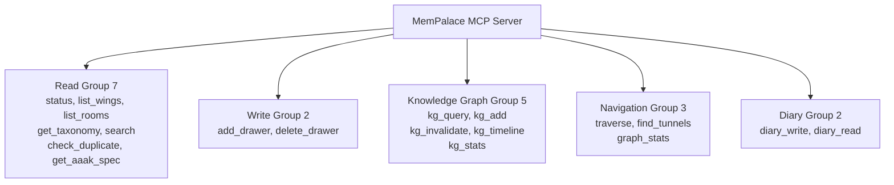

# Chapter 19: MCP Server -- API Design of 19 Tools

> **Positioning**: This chapter dissects how MemPalace exposes its memory palace to AI through 19 MCP tools, and why the response structure of `mempalace_status` doesn't just return data -- it simultaneously teaches the AI a language and a behavioral protocol.

---

## One Tool Would Suffice, So Why 19?

The classic tension in API design is granularity. Too coarse -- a single omnipotent tool -- and the AI must express all intent through call parameters, turning the prompt into a micro programming language. Too fine -- one tool per operation -- and the AI drowns in choices, with each decision adding to token consumption.

MemPalace chose 19 tools, not because there happen to be 19 operations, but because these 19 tools map to 5 cognitive categories, each corresponding to a role the AI plays in memory interactions. This isn't a feature checklist -- it's a role model.

Let's start from the source code. Open `mcp_server.py` -- tools are registered in the `TOOLS` dictionary at lines 441-688. Each tool is a key-value pair: a name mapped to a dictionary containing `description`, `input_schema`, and `handler` fields. The registration approach is utterly plain -- no decorators, no registry, just a Python dictionary:

```python
TOOLS = {
    "mempalace_status": {
        "description": "Palace overview — ...",
        "input_schema": {"type": "object", "properties": {}},
        "handler": tool_status,
    },
    # ... 18 more tools
}
```

This plainness isn't laziness. The MCP protocol itself is JSON-RPC -- the client sends `tools/list`, the server returns the tool list; the client sends `tools/call`, the server executes and returns results. The `handle_request` function at `mcp_server.py:708-718` handles `tools/list` requests by simply iterating over the `TOOLS` dictionary to generate the response. The entire protocol interaction is under 30 lines of code. Plain means transparent, and transparent means any developer can understand the entire registration mechanism in five minutes.

---

## Five Groups of Tools, Five Roles

The 19 tools are divided into five groups by cognitive role. First the overview, then we'll break down why they're organized this way.

**Read group (7)** -- lets the AI perceive the palace's structure and content: `status`, `list_wings`, `list_rooms`, `get_taxonomy`, `search`, `check_duplicate`, `get_aaak_spec`.

**Write group (2)** -- lets the AI store things in the palace: `add_drawer`, `delete_drawer`.

**Knowledge graph group (5)** -- lets the AI operate on entity relationships: `kg_query`, `kg_add`, `kg_invalidate`, `kg_timeline`, `kg_stats`.

**Navigation group (3)** -- lets the AI walk and explore the palace: `traverse`, `find_tunnels`, `graph_stats`.

**Diary group (2)** -- lets the AI maintain cross-session self-awareness: `diary_write`, `diary_read`.



This grouping isn't based on technical implementation. `search` and `traverse` both query ChromaDB underneath, but the former is "finding content" while the latter is "walking paths." `kg_query` and `search` are both retrieval, but the former retrieves structured relationships while the latter retrieves unstructured text. The grouping criterion is the role the AI plays when calling the tool: is it observing, recording, reasoning, exploring, or reflecting?

Why does the write group have only 2 tools while the read group has 7? Because of a core asymmetry in memory systems: **writing is simple (put things in), reading is complex (find things from different angles).** A room has only one door to enter, but seven windows to observe from. `list_wings` is a bird's-eye view, `list_rooms` is a local zoom, `get_taxonomy` is the complete map, `search` is semantic positioning, `check_duplicate` is a deduplication gate before storage, `get_aaak_spec` is a language reference manual. Each window corresponds to a different cognitive need.

---

## mempalace_status: One Tool Call, Triple Payload

Among the 19 tools, `mempalace_status` holds a special position. It doesn't just return data -- it teaches the AI two things: a language (AAAK) and a behavioral protocol (the memory protocol).

Look at the return structure of `tool_status` at `mcp_server.py:63-86`:

```python
def tool_status():
    col = _get_collection()
    if not col:
        return _no_palace()
    count = col.count()
    wings = {}
    rooms = {}
    # ... count logic ...
    return {
        "total_drawers": count,
        "wings": wings,
        "rooms": rooms,
        "palace_path": _config.palace_path,
        "protocol": PALACE_PROTOCOL,
        "aaak_dialect": AAAK_SPEC,
    }
```

The first four fields are standard status data -- total drawer count, wing distribution, room distribution, storage path. The last two fields are key: `protocol` and `aaak_dialect`.

**First payload: palace overview.** `total_drawers`, `wings`, `rooms` tell the AI "how large your memory is, how it's divided, and what each section contains." This is spatial awareness -- after seeing these numbers, the AI knows to search `wing_user` for personal preferences and `wing_code` for technical decisions.

**Second payload: memory protocol.** `PALACE_PROTOCOL` is a plain-text instruction defined at `mcp_server.py:93-100`. It specifies the AI's five-step behavioral protocol:

```
1. ON WAKE-UP: Call mempalace_status to load palace overview + AAAK spec.
2. BEFORE RESPONDING about any person, project, or past event:
   call mempalace_kg_query or mempalace_search FIRST. Never guess — verify.
3. IF UNSURE about a fact: say "let me check" and query the palace.
4. AFTER EACH SESSION: call mempalace_diary_write to record what happened.
5. WHEN FACTS CHANGE: call mempalace_kg_invalidate on the old fact,
   mempalace_kg_add for the new one.
```

This isn't a suggestion -- it's a protocol. It elevates the AI from "a tool caller that has memory available" to "an agent that actively maintains memory." Item 2 is especially critical -- "Never guess, verify" -- directly countering the core weakness of LLMs: hallucination. When the AI is asked "How old is Max?", the protocol requires it to query the knowledge graph first rather than guessing an answer from training data.

**Third payload: AAAK dialect specification.** `AAAK_SPEC` is defined at `mcp_server.py:102-119` -- a complete compressed language specification. It teaches the AI three things: entity encoding (`ALC=Alice, JOR=Jordan`), emotion markers (`*warm*=joy, *fierce*=determined`), and structural syntax (pipe-delimited, star ratings, hall/wing/room naming conventions).

Why embed the language specification in the status response rather than a separate tool? Because of MCP's call timing. When the AI first connects to the palace, the most natural action is to call `status` -- "let me see what's here." If the AAAK specification were in another tool, the AI would need two calls to complete initialization. Embedding it in status completes three things in one call: understanding the palace structure, learning the behavioral protocol, and mastering the compression language.

The underlying philosophy of this design is: **APIs don't just transmit data -- they transmit behavioral patterns.** Traditional APIs assume the caller already knows how to use the data. But when the caller is an LLM with no persistent memory, the API must re-educate the caller in every session. The triple payload of `mempalace_status` is designed precisely for this purpose.

---

## mempalace_search: Restrained Interface for Semantic Retrieval

`mempalace_search` is the most frequently used tool, but its interface design is extremely restrained. Look at the schema at `mcp_server.py:587-600`:

```python
"mempalace_search": {
    "input_schema": {
        "type": "object",
        "properties": {
            "query": {"type": "string"},
            "limit": {"type": "integer"},
            "wing": {"type": "string"},
            "room": {"type": "string"},
        },
        "required": ["query"],
    },
    "handler": tool_search,
}
```

Four parameters, only `query` is required. `wing` and `room` are optional filters. No sorting options, no pagination, no embedding model selection, no distance metric parameters.

This restraint is deliberate. Its underlying logic comes from the retrieval gains provided by the palace structure: in testing on 22,000+ memories, unfiltered full-corpus search achieved only 60.9% R@10, adding wing filtering jumped to 73.1%, and adding wing + room filtering jumped to 94.8%. In other words, filters are the primary precision lever, not the search algorithm itself.

So the interface design focuses on filters -- making it easy for the AI to express "search in this wing's this room" -- while fully encapsulating the complexity of the search algorithm. The AI doesn't need to know whether the underlying system uses ChromaDB's cosine similarity or Euclidean distance -- it only needs to know "give me a query, an optional scope."

The handler implementation is equally concise. `tool_search` at `mcp_server.py:173-180` has only one effective line of code -- directly calling the `search_memories` function from `searcher.py`:

```python
def tool_search(query, limit=5, wing=None, room=None):
    return search_memories(
        query, palace_path=_config.palace_path,
        wing=wing, room=room, n_results=limit,
    )
```

`search_memories` (`searcher.py:87-142`) returns a structured dictionary containing the original text, wing, room, source file, and similarity score for each result. Note that it returns the original text -- "the actual words, never summaries" -- this is MemPalace's core promise. What the AI receives is verbatim memory, not some summary model's reinterpretation of the memory.

---

## mempalace_add_drawer: Writing Is Deduplication

There are only two write tools, but `add_drawer`'s implementation is more complex than its interface suggests. See `mcp_server.py:250-287`:

```python
def tool_add_drawer(wing, room, content,
                    source_file=None, added_by="mcp"):
    col = _get_collection(create=True)
    # Duplicate check
    dup = tool_check_duplicate(content, threshold=0.9)
    if dup.get("is_duplicate"):
        return {
            "success": False,
            "reason": "duplicate",
            "matches": dup["matches"],
        }
    # ... generate ID, store, return success
```

Key behavior: before storing, it automatically calls `tool_check_duplicate` for semantic deduplication. The threshold is 0.9 -- if the palace already contains a memory with cosine similarity exceeding 90% to the new content, the write is rejected and existing matches are returned.

This design removes deduplication responsibility from the AI. Without this mechanism, the AI would need to manually call `check_duplicate` before every write, and LLMs frequently "forget" to perform such defensive operations. Built-in deduplication means that even if the AI tries to store the same content repeatedly -- for example, being told the same thing in different sessions -- the palace won't bloat.

The drawer ID generation approach (`mcp_server.py:267`) is also worth noting: it uses an MD5 hash of the first 100 characters of content plus the current timestamp, taking the first 16 hex digits and prepending wing and room prefixes. This means the same content stored at different times produces different IDs -- but with a deduplication threshold of 0.9, semantically identical content is already intercepted. The ID naming convention (`drawer_wing_room_hash`) also makes debugging intuitive: seeing an ID immediately tells you which wing and room it belongs to.

---

## mempalace_kg_query: Timeline of Structured Memory

The five knowledge graph tools are the fundamental difference between MemPalace and pure vector retrieval systems. Among them, `kg_query` is the most frequently used. See `mcp_server.py:309-312`:

```python
def tool_kg_query(entity, as_of=None, direction="both"):
    results = _kg.query_entity(
        entity, as_of=as_of, direction=direction)
    return {"entity": entity, "as_of": as_of,
            "facts": results, "count": len(results)}
```

Three parameters -- entity name, point in time, direction -- correspond to three query modes:

- `kg_query("Max")` -- all of Max's relationships, past and present.
- `kg_query("Max", as_of="2026-01-15")` -- a snapshot of Max's relationships as of January 15, 2026.
- `kg_query("Max", direction="incoming")` -- who has relationships with Max.

The underlying implementation of the `as_of` parameter is in `knowledge_graph.py:199-203`: it uses the SQL condition `valid_from <= ? AND (valid_to IS NULL OR valid_to >= ?)` to return only facts valid at the specified date. This means when the AI is asked "What was Max working on last year?", it can see facts that were valid last year rather than today's facts.

The time dimension works in concert with `kg_invalidate`. When a fact is no longer true -- say Max has left the swimming team -- the AI calls `kg_invalidate("Max", "does", "swimming", ended="2026-03-01")`. The fact isn't deleted but is marked with an end date. Historical queries can still see it, but current queries won't return it.

This "soft delete" design reflects a deep cognitive insight: **memory is not a database -- the termination of a fact is just as important as its existence.** Deleting a memory means pretending it never happened. Marking its end date means acknowledging the passage of time. The AI needs the latter capability to correctly answer the difference between "What did Max used to do?" and "What does Max do now?"

---

## Navigation Group: From "Finding Things" to "Walking Paths"

The three navigation tools -- `traverse`, `find_tunnels`, `graph_stats` -- differ fundamentally from the read group's `search`. `search` is "I know what I'm looking for, help me find it." Navigation is "I don't know what I'm looking for, take me for a walk."

`mempalace_traverse` (`mcp_server.py:553-569`) says it most clearly in its description: "Like following a thread through the palace: start at 'chromadb-setup' in wing_code, discover it connects to wing_myproject (planning) and wing_user (feelings about it)."

Its implementation delegates to the `traverse` function in `palace_graph.py`. The underlying logic builds a room-level graph from ChromaDB's metadata -- when the same room name appears in different wings, a "tunnel" forms between them. The AI starts from one room, follows a tunnel to a same-named room in another wing, then sees what other rooms in that wing relate to the starting point.

`find_tunnels` is more direct -- given two wings (or none, to see bridges between all wings), it returns the rooms that connect them. When the AI needs to understand "what's the relationship between technical decisions and team dynamics," it can call `find_tunnels(wing_a="wing_code", wing_b="wing_team")` and receive a set of shared room names -- these rooms are the topics where the two domains intersect.

The existence of these three navigation tools explains why the total tool count is 19 rather than 14 or 15. With only read and write, the AI can only do precise retrieval. Adding the knowledge graph, the AI can do structured reasoning. Adding navigation, the AI can do open-ended exploration. The 19 tools cover the complete spectrum of memory interaction: from storage to retrieval to reasoning to exploration to reflection.

---

## Protocol Layer: Minimalist JSON-RPC Implementation

Finally, let's look at the MCP protocol layer itself. The `main` function at `mcp_server.py:746-768` is the entire server's entry point:

```python
def main():
    logger.info("MemPalace MCP Server starting...")
    while True:
        line = sys.stdin.readline()
        if not line:
            break
        request = json.loads(line.strip())
        response = handle_request(request)
        if response is not None:
            sys.stdout.write(json.dumps(response) + "\n")
            sys.stdout.flush()
```

Read from stdin, parse JSON, dispatch, write to stdout. No HTTP, no WebSocket, no framework. The MCP protocol runs over the stdio channel -- the most primitive form of inter-process communication.

This choice has two consequences. First, startup cost is nearly zero -- no port binding needed, no TLS certificates, no service discovery. `claude mcp add mempalace -- python -m mempalace.mcp_server` completes registration in a single command. Second, the security model is extremely simple -- the MCP server is a subprocess of Claude Code, inheriting the parent process's permissions, requiring no additional authentication mechanism.

`handle_request` (`mcp_server.py:691-743`) handles four methods: `initialize` (handshake), `notifications/initialized` (confirmation), `tools/list` (tool catalog), and `tools/call` (tool invocation). During tool invocation, it looks up the handler from the `TOOLS` dictionary, unpacks parameters with `**tool_args`, calls the function, and serializes the return value to JSON. The entire dispatch logic is under 50 lines.

This minimalist implementation isn't a technical limitation -- it's a design philosophy: **the protocol layer should be transparent -- all complexity should be in the tools' semantic design, not in the transport mechanism.** The grouping logic of 19 tools, the triple payload of status, the built-in deduplication of add_drawer, the temporal filtering of kg_query -- these are where design effort is worth investing. The protocol layer just needs to work.

---

## The Invisible Aspects of Design

Returning to the opening question: why 19 tools?

The answer isn't in the number itself. 19 tools are the natural result of the following constraints:

**Read must outnumber write.** Because memory's value lies in being retrieved, and retrieval has multiple granularities -- global overview, wing-level listing, room-level listing, semantic search, duplicate checking, language specification reference. Each granularity serves a different cognitive moment.

**Knowledge graph must be independent from vector retrieval.** Because vector retrieval answers "what content is similar to this query," while the knowledge graph answers "what relationships does this entity have with whom, and at what time." The former is fuzzy matching; the latter is precise reasoning. The AI needs both capabilities.

**Navigation must be independent from search.** Because search assumes the user knows what they're looking for, while navigation assumes the user wants to explore the unknown. `traverse` and `find_tunnels` let the AI discover connections, not just retrieve known ones.

**Diary must exist.** Because without diary, the AI is merely a tool that searches other people's memories. With diary, it's an agent with its own observation history. The gap between the two isn't a feature gap -- it's a role gap.

19 is the minimum complete set of these constraints. Not 18, because that would mean cutting a cognitive capability. Not 20, because there's no 20th need that can't be covered by the first 19.

Every API ultimately encodes a worldview. MemPalace's 19 tools encode the worldview that: AI doesn't just need to store and retrieve memories -- it needs to reason within structured relationships, explore spatial topology, trace along timelines, and reflect in private diaries. These five capabilities together constitute complete memory interaction.
