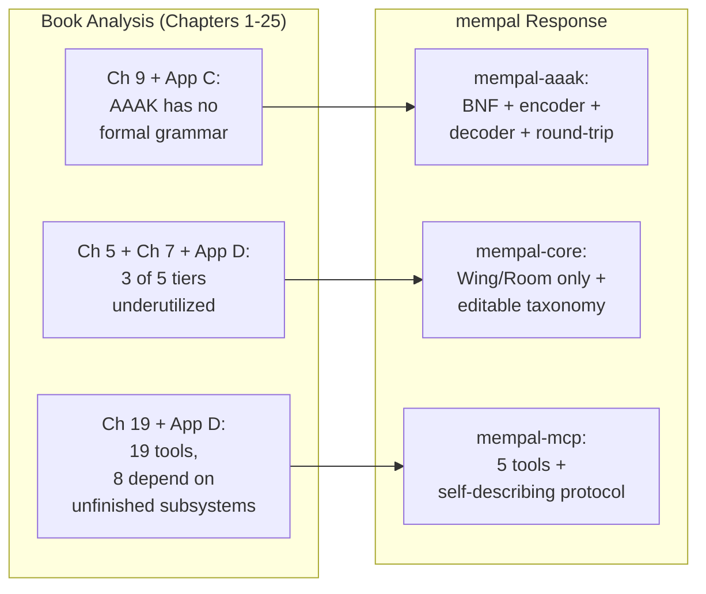

# Chapter 26: Why Rewrite in Rust

> **Positioning**: This chapter traces the path from analyzing MemPalace to deciding to reforge it in Rust. Prerequisite: Chapters 1-25 (the analysis that revealed the structural gaps). Applicable scenario: when you have thoroughly analyzed an existing system and must decide whether to patch or rebuild.

---

## The Analysis That Became a Blueprint

This book began as a third-party design analysis. We set out to understand MemPalace's architecture — its spatial metaphor, its compression language, its local-first philosophy — and to assess how well the implementation delivered on those ideas. Twenty-five chapters and four appendices later, the analysis was complete. But something unexpected happened along the way: the analysis itself became a blueprint for a new implementation.

The twenty-five chapters that precede this one are not preamble to a Rust project. They are the reason the Rust project exists. Every design decision in mempal — our Rust reimplementation — traces back to a specific finding in this book. This chapter documents those connections.

The story is not "MemPalace was bad, so we rewrote it." MemPalace's design ideas are sound — verbatim storage, spatial retrieval, AAAK compression, local-first architecture. The story is: "MemPalace's ideas are good enough to deserve a more rigorous implementation."

---

## Trigger Points: What the Analysis Revealed

Three findings from the book's analysis converged into a single conclusion: the gap between MemPalace's design intent and its implementation was structural, not incidental.

### AAAK: A Language Without a Grammar

Chapter 9 walked through AAAK's six grammar elements — three-letter entity codes, pipe delimiters, star ratings, emotion tags, semantic flags, and tunnels. The syntax is elegant. But Appendix C, which attempted to provide a complete dialect reference, revealed a critical gap: there is no formal grammar.

The `dialect.py` encoder is a heuristic pipeline. It selects key sentences, extracts top-frequency topics, truncates entity and emotion lists, and concatenates them with pipe delimiters. There is no BNF specification defining what constitutes a valid AAAK document. There is no decoder — once text is compressed, the only way to "decompress" it is to have an LLM read it. There is no round-trip test verifying that encoding and decoding preserve all factual assertions.

As Appendix D put it: if AAAK is read as a design direction, it is credible. If read as a fully delivered product capability, it is not. The encoder produces output that looks like AAAK but isn't mechanically verifiable as AAAK, because "valid AAAK" has no formal definition.

This is not a bug to fix with a patch. A formal grammar, a conforming encoder, a decoder, and round-trip verification tests constitute a redesign of the AAAK subsystem from its specification layer up. In mempal, this became the `mempal-aaak` crate (`crates/mempal-aaak/`), which implements a BNF-defined grammar, a structured encoder, a decoder, and round-trip property tests — the complete stack that `dialect.py` was missing.

### Five Tiers, Three Unused

Chapter 5 documented the five-tier spatial hierarchy: Wing → Hall → Room → Closet → Drawer. Chapter 7 demonstrated the retrieval improvement: from 60.9% baseline to 94.8% with Wing, Hall, and Room filtering — a gain of 33.9 percentage points. But our analysis revealed that the improvement is not evenly distributed across tiers.

The bulk of the retrieval gain comes from Wing filtering alone (+12.2 percentage points). Adding Hall brings a further +11.7 points. Room adds another +10 points. The deeper tiers — Closet and Drawer — were not benchmarked separately, and contribute no measured retrieval benefit beyond Room.

More importantly, Appendix D found that "Hall / Closet / agent architecture is narrated more completely than implemented." The current `searcher.py` supports explicit Wing and Room filtering. Hall exists as a taxonomy concept but is not a default routing target. Closet exists as a storage-layer idea but the runtime primarily operates on Drawers directly.

This means three of the five tiers in the spatial hierarchy are, in practice, either underutilized or aspirational. A redesign could simplify to two tiers — Wing and Room — while preserving the vast majority of the retrieval benefit, and replace the static hierarchy with an editable taxonomy that adapts to actual usage patterns. In mempal, this simplification lives in `mempal-core` (`crates/mempal-core/src/db.rs`), where the `drawers` table has `wing` and `room` columns with an editable `taxonomy` table driving query routing — no Hall, no Closet, no static tier hierarchy.

### 19 Tools, 5 Cognitive Roles

Chapter 19 analyzed the MCP server's 19 tools organized into 5 cognitive roles: Read (7), Write (2), Knowledge Graph (5), Navigation (3), and Diary (2). The role-based organization is intellectually coherent. But for an AI agent making tool-selection decisions, 19 choices create a large decision space.

Each tool call costs tokens — not just for the call itself, but for the LLM to evaluate which of 19 tools best matches its current intent. The Knowledge Graph group (5 tools) and Navigation group (3 tools) depend on subsystems that Appendix D flagged as more narrated than exercised. The Diary group assumes a specialist agent architecture that is not yet part of the default runtime.

The question became: could a smaller tool surface — focused on what is actually production-ready — serve agents better? Not because fewer tools are inherently better, but because each tool in a smaller set can carry richer self-documentation, and agents spend fewer tokens on tool selection. mempal's answer is 5 tools — `mempal_status`, `mempal_search`, `mempal_ingest`, `mempal_delete`, and `mempal_taxonomy` — registered in `crates/mempal-mcp/src/server.rs`. Each tool's input schema carries doc comments that teach agents how to use it correctly (see Chapter 28).

---

## The Judgment: Why Patching Was Not Enough

With these three findings in hand, we faced a choice: contribute patches to MemPalace, or build a new implementation from the same design principles.

We chose to rebuild. Here is why.

### Coupling Makes Targeted Fixes Expensive

The AAAK subsystem touches multiple layers. `dialect.py` is invoked by `cli.py` for compression, while `mcp_server.py` hardcodes an `AAAK_SPEC` string for status responses. The encoder's output format is referenced by `palace_graph.py`'s storage paths and `searcher.py`'s retrieval logic. Adding a formal grammar requires changing not just the encoder but the interfaces between compression, storage, and retrieval. In a 21-module Python codebase where modules share state through ChromaDB collections and in-memory caches, changing one subsystem's contract ripples through others.

Similarly, simplifying the five-tier hierarchy to two tiers is not a matter of deleting three layers. The tier structure is embedded in storage schemas, query routing logic, and MCP tool semantics. A targeted "remove Hall and Closet" patch would need to touch `palace_graph.py`, `searcher.py`, `mcp_server.py`, and `layers.py` — essentially rewriting the data model while preserving backwards compatibility with existing palaces.

### The Design Document Already Existed

By the time we finished the book's analysis, we had something unusual: a detailed, evidence-based specification for what the implementation should look like. The book's 25 chapters identified what works (verbatim storage, Wing/Room filtering, MCP interface), what doesn't (heuristic AAAK, unused tiers, oversized tool surface), and what the design intent was (local-first, cross-model, single-file storage).

That specification was more complete than what most rewrite projects start with. We were not guessing at requirements — we had derived them from 25 chapters of analysis. The risk profile of "rebuild from a detailed spec" was lower than "patch an existing system while preserving backwards compatibility."

### Different Product Form, Different Language

MemPalace is a Python library. It requires `pip install`, a Python runtime, and ChromaDB as a vector store. For a developer's personal tool, this is acceptable. For a tool that every coding agent should be able to use — Claude Code, Codex, Cursor, Gemini CLI — the installation friction matters.

The product vision for the reimplementation was different: a single binary, zero external dependencies, ready in seconds. This product form is not achievable as a patch to a Python codebase — it requires starting from a different foundation entirely.

---

## The Single-Binary Philosophy

The product form drove many technical decisions. A single binary means:

**Zero installation friction.** One command, one binary, no runtime, no package manager conflicts, no virtual environment. An AI agent's MCP configuration points to the binary path and it works.

**Single-file database.** SQLite replaces ChromaDB. The entire memory palace is one file: `~/.mempal/palace.db`. Backup is `cp`. Migration is `scp`. There is no server process to manage, no port to configure, no data directory to locate.

**Embedded inference.** The ONNX Runtime is compiled into the binary. The default embedding model (MiniLM-L6-v2, 384 dimensions) downloads once and runs locally. No API keys, no network dependency after first run, no per-query cost.

**Self-contained MCP server.** `mempal serve --mcp` starts a stdio-based MCP server from the same binary. No separate server process, no port allocation, no process management.

This is not minimalism for its own sake. It is a design response to a concrete problem: coding agents run in diverse environments — local terminals, CI pipelines, remote SSH sessions, containerized dev environments. A tool that requires `pip install` plus a ChromaDB instance plus a Python runtime is viable in some of these environments. A single binary is viable in all of them.

---

## Why Rust, Specifically

Given the single-binary requirement, several languages could work: Go, Zig, C++, or Rust. We chose Rust for reasons specific to mempal's use case, not for general language advocacy.

**MCP servers are long-running processes.** When an AI agent connects to mempal via MCP, the server process stays alive for the duration of the session — potentially hours. A long-running process that holds open SQLite connections, manages embedding model state, and serves concurrent tool calls benefits from deterministic resource cleanup. Rust's ownership model ensures database connections are released exactly when their scope ends and memory is freed without relying on a garbage collector's timing — predictability that matters for a process that may run unattended for an entire coding session.

**The type system enforces interface contracts.** mempal has 8 crates with well-defined boundaries: `mempal-core` defines data types, `mempal-embed` defines the `Embedder` trait, `mempal-search` consumes both. Rust's type system ensures that when we change a type in `mempal-core`, every downstream consumer is checked at compile time. In a rewrite that redesigns subsystem interfaces — exactly what we needed after the book's analysis — this is not a luxury but a necessity.

**crates.io distribution.** `cargo install mempal` is the entire installation story. The Rust ecosystem's package registry and build system align perfectly with the single-binary product form. No PyPI wheel compatibility issues, no platform-specific build scripts, no runtime version conflicts.

**SQLite and ONNX have mature Rust bindings.** `rusqlite` (with bundled SQLite) and `ort` (ONNX Runtime) are production-grade crates. `sqlite-vec` provides vector search as a SQLite extension. The specific technical stack mempal needs — embedded database plus vector search plus ML inference — has strong Rust ecosystem support.

### What Rust Does Not Solve

Language choice does not solve design problems. Rust did not tell us to simplify five tiers to two, or to add a formal grammar to AAAK, or to reduce 19 MCP tools to 5. Those decisions came from the book's analysis. Rust provided a vehicle for implementing those decisions in a product form that serves coding agents well.

Rust also did not eliminate all challenges. The embedding model (MiniLM) is English-centric, which degrades search quality for non-English queries — a problem we discovered during dogfooding and addressed with a protocol-level workaround rather than a language-level solution (see Chapter 28). The type system catches interface mismatches but cannot verify that a search result is semantically relevant. Static analysis prevents memory corruption but not data loss from overly broad deletion queries — a lesson we learned the hard way during development (see Chapter 29).

The decision to use Rust was pragmatic, not ideological. A different project with different deployment constraints might reasonably choose Go, Zig, or even stay with Python. What mattered was not the language but the clarity of the specification — and that specification was the product of twenty-five chapters of analysis.

---

## From Analysis to Practice

This chapter marks a transition in the book's narrative. For twenty-five chapters, we analyzed someone else's design. We identified what works, what needs improvement, and what the implementation gaps are. Starting here, we turn that analysis into practice.

The remaining chapters of Part 10 trace the specific design decisions that followed:

- **Chapter 27** details what we preserved from MemPalace and what we changed, with evidence for each decision.
- **Chapter 28** examines the self-describing protocol — how mempal teaches AI agents to use it correctly, and why each protocol rule exists because of a real failure.
- **Chapter 29** documents multi-agent coordination — the unexpected discovery that a memory tool becomes a coordination mechanism between different AI agents.

The loop from analysis to implementation is not closed yet. Benchmarks have not been run against MemPalace's published numbers. The temporal knowledge graph remains a schema reservation rather than a working feature. These honest gaps will be addressed in a future chapter. For now, the chapters ahead show what happens when twenty-five chapters of critique meet a Rust compiler.
