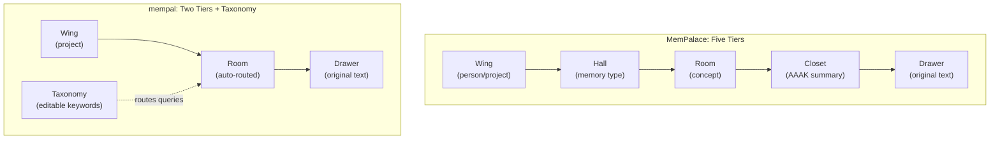

# Chapter 27: What Stayed, What Changed

> **Positioning**: This chapter compares MemPalace (Python) and mempal (Rust) dimension by dimension — what design ideas survived the rewrite, what implementation structures changed, and why. Prerequisite: Chapter 26 (why the rewrite happened). Applicable scenario: when evaluating which parts of an existing design deserve preservation versus redesign.

---

## Five Ideas Worth Preserving

Before cataloging changes, we should be clear about what did not change. mempal preserves five core design ideas from MemPalace — each one validated by this book's analysis.

**1. Verbatim storage** (Chapter 3). Raw conversation text is stored exactly as ingested. Drawers in mempal's `drawers` table (`crates/mempal-core/src/db.rs:16-25`) hold the original content, never a summary or extraction. Chapter 3's economic argument holds: 19.5 million tokens of conversation data over six months is roughly 100 MB of raw text — storage cost is negligible. The real problem is retrieval, not storage. mempal does not compress on ingest.

**2. Spatial structure for retrieval** (Chapters 5 and 7). The idea that semantic partitioning improves retrieval precision — organizing memories into named regions rather than dumping everything into a flat vector space — is preserved entirely. Chapter 7's data showed a 33.9 percentage-point improvement from baseline to full spatial filtering. mempal implements this through Wing and Room columns on every drawer, with indexes that make filtered queries fast (`idx_drawers_wing`, `idx_drawers_wing_room` in `db.rs:51-52`).

**3. AAAK as output formatter, not storage encoder** (Chapter 8). MemPalace's design doc describes AAAK as a compression layer. mempal follows the same principle but makes the boundary explicit: AAAK is never applied during ingestion or storage. It exists only on the output path — when a CLI `wake-up` command or an MCP status response wants to compress recent context for a token-constrained AI. The `mempal-aaak` crate has no dependency on `mempal-ingest` or `mempal-search`, enforced by the Cargo workspace dependency graph.

**4. MCP as the primary AI interface** (Chapter 19). MemPalace exposed its memory palace through MCP tools. mempal does the same: `mempal serve --mcp` starts a stdio-based MCP server. The conviction that AI agents need a structured tool interface — not just a REST API or a command-line wrapper — carries over directly.

**5. Local-first architecture** (Chapter 24). No cloud services, no API keys for core operation, no data leaving the machine. mempal's entire state is a single SQLite file. The embedding model runs locally via ONNX Runtime. This is not a compromise but a design choice — Chapter 24's argument about "cognitive X-rays" applies equally to mempal.

These five ideas are the load-bearing walls of the design. Everything else — the number of tiers, the storage engine, the compression implementation, the tool surface — is the interior that can be restructured.

---

## Dimension 1: Spatial Structure — Five Tiers to Two

This is the most visible architectural change.

### What MemPalace Does

MemPalace defines five tiers: Wing → Hall → Room → Closet → Drawer. Chapter 5 analyzed each tier's purpose. Wing scopes by person or project. Hall classifies by memory type (facts, events, discoveries, preferences, advice). Room identifies a specific concept. Closet holds a compressed AAAK summary. Drawer holds the original text.



### What mempal Does

mempal uses two tiers: Wing and Room. The `drawers` table has `wing TEXT NOT NULL` and `room TEXT` columns. A separate `taxonomy` table (`db.rs:43-49`) maps `(wing, room)` pairs to display names and keyword lists. When a query arrives, `mempal-search`'s routing module (`crates/mempal-search/src/route.rs`) matches query terms against taxonomy keywords to determine which Wing and Room to filter by.

### Why the Change

Chapter 7's retrieval data tells the story. Wing filtering alone provides +12.2 percentage points. Adding Room filtering (Wing+Room combined) brings the total to +33.9 points. But Appendix D found that Hall is "narrated more completely than implemented" — `searcher.py` supports Wing and Room filtering explicitly, not Hall as a first-class routing target.

The practical reality is that most of the retrieval benefit comes from two operations: narrowing by project/domain (Wing) and narrowing by concept (Room). Hall's classification by memory type (facts vs. events vs. preferences) is theoretically useful but was not part of the default retrieval path in MemPalace's actual code.

Closet — the compressed AAAK summary tier — serves the same function as mempal's output-side AAAK formatting. Rather than storing compressed summaries as a persistent layer, mempal generates them on demand when requested. This eliminates the need to keep summaries synchronized with their source drawers.

The editable taxonomy is the key design replacement. Instead of a static five-tier hierarchy that must be defined upfront, mempal's taxonomy can be modified at runtime. `mempal taxonomy edit <wing> <room> --keywords "auth,migration,clerk"` updates routing keywords. MCP-connected agents can do the same via the `mempal_taxonomy` tool. The taxonomy adapts to actual usage patterns rather than requiring users to commit to a classification scheme before they know what they'll store.

This is not a claim that two tiers are always better than five. It is a claim that, given the evidence from Chapter 7 and Appendix D, two tiers plus an editable taxonomy capture most of the retrieval benefit while eliminating the implementation complexity of three tiers that were aspirational in MemPalace's codebase.

---

## Dimension 2: Storage — ChromaDB to SQLite + sqlite-vec

### What MemPalace Does

MemPalace uses ChromaDB as its vector store. `palace_graph.py` writes drawers to ChromaDB collections, and `searcher.py` queries them for semantic retrieval. ChromaDB provides embedding storage, similarity search, and metadata filtering in one package.

### What mempal Does

mempal uses SQLite with the `sqlite-vec` extension. The `drawers` table stores content and metadata. The `drawer_vectors` virtual table (`db.rs:27-30`) stores 384-dimensional float vectors using `vec0`. Search queries use `embedding MATCH vec_f32(?)` for k-NN retrieval, joined with the `drawers` table for metadata filtering.

The entire database is one file: `~/.mempal/palace.db`.

### Why the Change

Three engineering requirements drove the switch:

**Transactions and schema migration.** SQLite provides ACID transactions and `PRAGMA user_version` for schema versioning. mempal's `apply_migrations()` function (`db.rs`) applies forward migrations automatically when opening a database. When we added `deleted_at` for soft-delete support, this was a one-line `ALTER TABLE` in a versioned migration. ChromaDB has no equivalent mechanism — schema changes require recreating collections.

**Single-file portability.** A SQLite database is one file. Backup is `cp palace.db palace.db.bak`. Transfer between machines is `scp`. There is no server process, no port, no data directory with multiple files. For a personal developer tool that might live in a dotfiles repository or be synced across machines, single-file storage eliminates an entire class of deployment problems.

**Embedded deployment.** SQLite is compiled into the binary via `rusqlite`'s `bundled` feature. `sqlite-vec` is likewise bundled. There is no external process to start, no version compatibility to manage, no network connection to a vector database. The binary is self-sufficient.

What we gave up: ChromaDB's embedding management (mempal handles this separately via the `mempal-embed` crate and the `Embedder` trait), and ChromaDB's built-in collection-level isolation (mempal uses Wing/Room columns with SQL indexes instead). The tradeoff was worthwhile because the engineering requirements above — transactions, single-file, embedded — were non-negotiable for the single-binary product form.

---

## Dimension 3: AAAK — From Heuristic to Formal

This is the dimension where the gap between MemPalace's design intent and its implementation was widest.

### What MemPalace Does

`dialect.py` implements an AAAK encoder. It takes conversation text, selects key sentences, extracts top-frequency topics, detects entities (three uppercase letters), assigns emotion codes and semantic flags, and concatenates everything with pipe delimiters. The output looks like AAAK. But as Appendix C documented, there is no formal grammar defining valid AAAK, no decoder to reconstruct text from AAAK, and no round-trip test to verify information preservation.

### What mempal Does

The `mempal-aaak` crate (`crates/mempal-aaak/`) implements four components that `dialect.py` was missing:

**A BNF grammar.** The design document (`docs/specs/2026-04-08-mempal-design.md:209-229`) defines AAAK syntax formally:

```
document    ::= header NEWLINE body
header      ::= "V" version "|" wing "|" room "|" date "|" source
zettel      ::= zid ":" entities "|" topics "|" quote "|" weight "|" emotions "|" flags
tunnel      ::= "T:" zid "<->" zid "|" label
arc         ::= "ARC:" emotion ("->" emotion)*
```

**A conforming parser.** `parse.rs` validates documents against this grammar — checking that entity codes are exactly 3 uppercase ASCII characters, emotion codes are 3-7 lowercase characters, and tunnel references point to existing zettels. This means "valid AAAK" has a mechanical definition, not just a visual resemblance.

**An encoder and decoder pair.** `codec.rs` provides `AaakCodec::encode()` (producing an `AaakDocument` from raw text) and `decode()` (reconstructing readable text from AAAK by expanding entity codes back to full names using a bidirectional hash map). MemPalace had only the encode direction.

**Round-trip verification.** `verify_roundtrip()` (`codec.rs:281-302`) encodes text to AAAK, decodes it back, and calculates a coverage metric: `preserved / (preserved + lost)`. Tests in `aaak_test.rs` verify that round-trip coverage meets a threshold (≥80%) and that any lost assertions are explicitly reported. This is the most important addition — it makes AAAK's information preservation empirically measurable rather than assumed.

### Chinese: From Bigrams to Part-of-Speech Tagging

MemPalace's `dialect.py` handles Chinese text by generating CJK character bigrams — a character-level approach that can fragment meaningful words. The phrase "知识图谱" (knowledge graph) would become the bigrams "知识", "识图", "图谱" — two of which are meaningless fragments.

mempal uses `jieba-rs` (a Rust port of the jieba Chinese word segmenter) with part-of-speech tagging. `codec.rs:579-609` calls jieba's POS tagger to identify proper nouns (`nr`, `ns`, `nt`, `nz` tags) for entity extraction. `codec.rs:611-643` extracts content words (`n*`, `v*`, `a*` tags) for topic extraction, while filtering function words like pronouns and particles. The difference is structural: bigrams are character-level heuristics; POS tagging is word-level linguistic analysis.

Tests cover Chinese encoding explicitly: `test_aaak_encode_chinese_text` (line 326), `test_aaak_encode_mixed_script_text_extracts_cjk_and_ascii_entities` (line 377), and `test_aaak_roundtrip_does_not_split_on_chinese_commas` (line 421).

---

## Dimension 4: Temporal Knowledge Graph — Schema Reserved, Logic Deferred

### What MemPalace Does

Chapters 11-13 analyzed MemPalace's temporal knowledge graph: triples with `valid_from` and `valid_to` timestamps, contradiction detection across time, and timeline narrative generation. These are among the most intellectually ambitious features in the design.

### What mempal Does

mempal preserves the schema. The `triples` table exists in `db.rs:32-41`:

```sql
CREATE TABLE triples (
    id TEXT PRIMARY KEY,
    subject TEXT NOT NULL,
    predicate TEXT NOT NULL,
    object TEXT NOT NULL,
    valid_from TEXT,
    valid_to TEXT,
    confidence REAL DEFAULT 1.0,
    source_drawer TEXT REFERENCES drawers(id)
);
```

The `Triple` struct in `types.rs:23-32` mirrors this schema with `valid_from: Option<String>` and `valid_to: Option<String>`. But mempal does not implement automatic triple extraction from conversations, contradiction detection, or timeline narrative generation.

### Why the Deferral

This is a prioritization judgment, not a design disagreement.

The temporal KG features depend on reliable knowledge graph population. In MemPalace, `kg_add` is a manual MCP tool — the AI explicitly writes triples. Automatic extraction from conversation text (identifying "Kai switched to the Orion project in March") requires either an LLM call per ingestion or a sophisticated NLP pipeline. Both add external dependencies that conflict with the zero-dependency local-first philosophy.

mempal's v1 priority was making the core pipeline reliable: ingest → embed → search → cite. Every feature in that pipeline had to work correctly before adding temporal reasoning on top. The schema reservation means that when the temporal KG is implemented, existing databases are ready — no migration needed for the triples table itself. But the implementation was honestly not ready for v1, and shipping an unreliable temporal reasoner would have been worse than shipping none.

Appendix D's observation applies here: it is better to ship what works than to narrate what is planned.

---

## Dimension 5: MCP Tool Surface — 19 to 5

### What MemPalace Does

Chapter 19 documented 19 MCP tools in 5 cognitive groups. The design is intellectually coherent — each group maps to a role the AI plays when interacting with memory.

### What mempal Does

mempal exposes 5 tools: `mempal_status`, `mempal_search`, `mempal_ingest`, `mempal_delete`, and `mempal_taxonomy`. These map to the operations that are production-ready and actively used in daily development.

### Why the Reduction

The reduction is not a judgment that 19 tools are wrong. It reflects a different stage of implementation maturity and a design choice about self-documentation.

Eight of MemPalace's 19 tools belong to the Knowledge Graph (5) and Navigation (3) groups. These depend on a fully populated knowledge graph and a working graph traversal engine — subsystems that Appendix D flagged as more narrated than exercised. Including tools for subsystems that are not yet reliable misleads agents into calling them and getting poor results.

The 5-tool surface also enables richer per-tool documentation. Each tool in mempal carries detailed field-level documentation — the `wing` field on `SearchRequest` (`crates/mempal-mcp/src/tools.rs:11-16`) explains exactly when to omit it and warns that guessing silently returns zero results. With 19 tools, this level of documentation per field would overwhelm the tool-list response. With 5 tools, each one can be thoroughly self-documenting.

The protocol-level design that makes 5 tools sufficient — the MEMORY_PROTOCOL embedded in MCP server instructions — is the subject of Chapter 28.

---

## The Design Decision Table

mempal's design document (`docs/specs/2026-04-08-mempal-design.md`) captures these decisions in two tables. Here is the consolidated view:

| Dimension | MemPalace | mempal | Rationale |
|-----------|-----------|--------|-----------|
| Spatial structure | Wing/Hall/Room/Closet/Drawer | Wing/Room + editable taxonomy | 33.9pp gain from Wing+Room; Hall/Closet underutilized (App D) |
| Storage | ChromaDB | SQLite + sqlite-vec | Transactions, single-file, embedded deployment |
| Embedding | ChromaDB built-in | ONNX (MiniLM) via `Embedder` trait | Offline-first, swappable models |
| AAAK | Heuristic encoder only | BNF grammar + encoder + decoder + round-trip | Fix Appendix C deficiencies |
| CJK processing | Character bigrams | jieba POS tagging | Word-level vs character-level |
| Temporal KG | Triples + contradiction + timeline | Schema reserved, logic deferred | Search reliability > temporal features |
| MCP tools | 19 in 5 groups | 5 tools + self-describing protocol | Ship what works, document it thoroughly |
| Language | Python | Rust | Single binary, zero runtime deps (Ch 26) |

Every row in this table traces back to a finding in the book's first 25 chapters or appendices. The "rationale" column is not post-hoc justification — it is the analysis that preceded the implementation.

---

## What This Comparison Reveals

The pattern across all five dimensions is consistent: mempal preserves MemPalace's design ideas while simplifying or completing their implementation.

- Spatial structure: same idea (semantic partitioning improves retrieval), simpler implementation (two tiers instead of five)
- Storage: same idea (local single-file), different engine (SQLite instead of ChromaDB)
- AAAK: same idea (AI-readable compression), complete implementation (grammar + decoder + round-trip)
- Temporal KG: same idea (facts expire), honest deferral (schema ready, logic not)
- MCP tools: same idea (structured AI interface), focused surface (5 production-ready tools)

This is not a coincidence. It is the natural outcome of building from a detailed analysis rather than starting from scratch. The analysis told us what to keep and what to change — the implementation simply followed.
