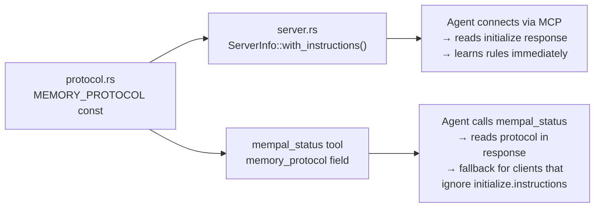

# Chapter 28: Self-Describing Protocol

> **Positioning**: This chapter examines mempal's most distinctive design: embedding behavioral instructions directly into the tool interface so that any AI agent learns how to use mempal correctly from the tool itself — no external documentation, no system prompt configuration. Prerequisite: Chapter 27 (what changed architecturally). Applicable scenario: when designing tools that AI agents will discover and use without human guidance.

---

## The Problem: Tools That Cannot Teach

When an AI agent connects to an MCP server, it receives a list of tools. Each tool has a name, a description, and an input schema. The agent must decide — from this information alone — when to call which tool, what parameters to pass, and how to interpret results.

Chapter 19 analyzed MemPalace's 19-tool MCP surface. The tool descriptions tell the agent *what* each tool does. But they do not tell the agent *when* to use memory versus grepping files, *how* to discover valid wing names before filtering, or *why* citations matter. Those behavioral patterns were documented in README files and project guides — places that an MCP-connected agent never sees.

mempal's answer is not better tool descriptions. It is a behavioral protocol embedded in the tool interface itself.

---

## Protocol as Code

The MEMORY_PROTOCOL lives in `crates/mempal-core/src/protocol.rs` as a Rust string constant:

```rust
pub const MEMORY_PROTOCOL: &str = r#"MEMPAL MEMORY PROTOCOL (for AI agents)

You have persistent project memory via mempal. Follow these rules...
"#;
```

This constant is compiled into the mempal binary. It reaches AI agents through two paths:



The primary path is `ServerInfo::with_instructions()` in `crates/mempal-mcp/src/server.rs`. The MCP specification defines an `instructions` field on the server info response — most MCP clients inject this into the LLM's system prompt at connection time. By putting the protocol there, mempal teaches every connected agent its behavioral rules before the agent makes its first tool call.

The fallback path is the `mempal_status` tool, which returns the same protocol text in its `memory_protocol` response field. This covers clients that ignore the `initialize.instructions` field — the agent can still discover the protocol by calling status.

The protocol text lives next to the code, not in a separate documentation file. The module-level doc comment on `protocol.rs` explains why:

```rust
//! This is embedded in MCP status responses and CLI wake-up output,
//! following the same self-describing principle as `mempal-aaak::generate_spec()`:
//! the protocol lives next to the code so it cannot drift.
```

If the protocol said "call mempal_status to discover wings" but `mempal_status` stopped returning wing data, the protocol would be wrong. By keeping them in the same codebase — and testing that `MEMORY_PROTOCOL` contains expected keywords in `mcp_test.rs` — the text and behavior stay synchronized.

---

## Seven Rules, Seven Failures

The MEMORY_PROTOCOL contains seven rules (numbered 0 through 5, plus 3a). Each rule exists because a real failure happened during mempal's development. This is not theoretical API design — it is post-incident documentation encoded as behavioral instructions.

### Rule 0: FIRST-TIME SETUP

> *Call mempal_status() once at the start of any session to discover available wings and their drawer counts.*

**The failure**: In a fresh Codex session, a user asked about AAAK's Chinese word segmentation implementation. Codex correctly called `mempal_search` — but passed `{"wing": "engineering"}`. mempal's wing filter is strict equality. The only wing in the database was "mempal". The query returned zero results, and Codex fell back to reading source code directly, bypassing memory entirely.

**Root cause** (documented in `drawer_mempal_mempal_mcp_a916f9dc`): Three things converged. `SearchRequest.wing` had no doc comment, so the JSON schema gave no guidance on when to omit it. The field name "wing" invited guessing. And nothing told fresh clients to call `mempal_status` first to discover valid wing names.

**The fix**: Rule 0 tells agents to call `mempal_status()` once per session before using wing filters. The status response includes a `scopes` array listing every `(wing, room, drawer_count)` triple. After reading this, the agent knows the exact wing names and can filter correctly — or leave the filter unset for a global search.

### Rule 1: WAKE UP

> *Some clients pre-load recent wing/room context. Others do NOT — for those, step 0 is how you wake up.*

**The failure**: The original Rule 1 assumed all clients pre-loaded context via session-start hooks. This was true for Claude Code (which has SessionStart hooks) but false for Codex, Cursor, and raw MCP clients. The assumption caused Rule 0 to not exist initially — it was added after the Codex wing-guessing incident.

**The fix**: Rule 1 now explicitly distinguishes between clients with pre-load mechanisms and those without, directing the latter to Rule 0.

### Rule 2: VERIFY BEFORE ASSERTING

> *Before stating project facts, call mempal_search to confirm. Never guess from general knowledge.*

**The failure** (documented in `drawer_mempal_default_cb58c7f3`): Claude was observed making project-specific claims without consulting memory. In one instance, Claude stated "mempal_search cannot retrieve by drawer_id, we need a new mempal_get_drawer tool." In reality, Claude had used a direct `sqlite3` shell command as a side-door, then framed the limitation as an MCP gap. The actual MCP search works correctly when given a semantic query instead of an opaque ID.

**The fix**: Rule 2 requires agents to call `mempal_search` before asserting project facts. This prevents an agent from hallucinating project state or proposing unnecessary tool additions based on incorrect assumptions.

### Rule 3: QUERY WHEN UNCERTAIN

> *When the user asks about past decisions or historical context, call mempal_search. Do not rely on conversation memory alone.*

**The failure**: Across multiple sessions, agents would answer "why did we choose X?" questions from their training data's general knowledge rather than from the project's actual decision history. A user asking "why did we switch from ChromaDB to SQLite?" would get a generic answer about SQLite advantages, not the specific engineering rationale documented in mempal drawers.

**The fix**: Rule 3 explicitly triggers on patterns like "why did we...", "last time we...", and "what was the decision about..." — phrases that signal project-specific historical questions.

### Rule 3a: TRANSLATE QUERIES TO ENGLISH

> *The embedding model (MiniLM) is English-centric. Non-English queries produce poor vector representations.*

**The failure**: During dogfooding in this session, a Chinese query — "它不再是一个高级原型" (it is no longer just an advanced prototype) — returned completely irrelevant results (AAAK documentation instead of the target status snapshot). The same query translated to English — "no longer just an advanced prototype" — hit the correct drawer immediately.

**Root cause**: MiniLM-L6-v2 has sparse CJK token coverage. Chinese text fragments into unknown-token embeddings with low semantic fidelity. The vector representation of the Chinese query was so poor that it matched by accident rather than by meaning.

**The fix**: Rule 3a tells agents to translate non-English queries into English before passing them to `mempal_search`. This is a zero-cost fix — the agents performing the search are LLMs that can translate natively. The rule includes a concrete example to make the expected behavior unambiguous.

### Rule 4: SAVE AFTER DECISIONS

> *When a decision is reached in conversation, call mempal_ingest to persist it. Include the rationale, not just the decision.*

**The failure**: In an early session, Claude completed a significant implementation (adding CI workflows) and immediately asked "want to commit?" — without saving a decision record to mempal. Codex, picking up the next session, had no record of *why* the CI was structured that way, what was deliberately omitted (rustfmt), or what the follow-up priorities were. The handoff relied entirely on git commit messages, which capture what changed but not why.

**The fix**: Rule 4 makes decision persistence explicit. "Include the rationale, not just the decision" is the key phrase — a drawer that says "added CI" is nearly useless; a drawer that says "added CI with default + all-features matrix, deliberately omitted rustfmt because formatting drift exists, follow-up: cargo fmt --all then add fmt check" is the kind of context that enables cross-session continuity.

### Rule 5: CITE EVERYTHING

> *Every mempal_search result includes drawer_id and source_file. Reference them when you answer.*

**The failure**: Without this rule, agents would search mempal, find relevant information, and then present it as their own knowledge — "we decided to use SQLite for single-file portability" — without attribution. The user has no way to verify the claim, trace it to its source, or assess its age.

**The fix**: Rule 5 requires explicit citations: "according to drawer_mempal_default_2fd6f980, we decided...". Citations serve three purposes: they let the user verify the source, they make the agent's reasoning auditable, and they distinguish memory-backed claims from hallucination.

---

## Field-Level Documentation: Teaching Through Schema

The protocol teaches behavioral rules. But there is a second layer of self-documentation: field-level doc comments on tool input types that propagate into the MCP schema.

`SearchRequest` in `crates/mempal-mcp/src/tools.rs` demonstrates this pattern:

```rust
#[derive(Debug, Clone, Deserialize, JsonSchema)]
pub struct SearchRequest {
    /// Natural-language query. Use the user's actual question verbatim
    /// when possible — the embedding model handles paraphrase and translation.
    pub query: String,

    /// Optional wing filter. OMIT (leave null) unless you already know the
    /// EXACT wing name from a prior mempal_status call or the user named it
    /// explicitly. Wing filtering is a strict equality match, so guessing a
    /// wing name (e.g. "engineering", "backend") will silently return zero
    /// results. When in doubt, leave this field unset for a global search
    /// across all wings.
    pub wing: Option<String>,
    // ...
}
```

The `#[derive(JsonSchema)]` macro from `schemars` converts these doc comments into JSON Schema `description` fields. When an MCP client calls `tools/list`, it receives the tool's input schema — including these descriptions. The agent reads "guessing a wing name will silently return zero results" directly from the tool definition, before it ever considers calling the tool.

This is the propagation chain:

**Rust doc comment** → `schemars` derive → **JSON Schema description** → MCP `tools/list` response → **agent's tool-selection context**

The chain means that improving a doc comment in Rust source code automatically improves the guidance every agent receives. No documentation site to update, no system prompt to modify, no client configuration to change. The guidance travels with the tool definition.

A test in `mcp_test.rs` guards this: `test_mempal_search_schema_warns_about_wing_guessing` lists tools, finds `mempal_search`, and asserts the serialized `input_schema` contains both "OMIT" and "global search". This prevents a future refactor from silently stripping the guidance.

---

## 19 Tools to 5: Less Is More (With Context)

Chapter 19 documented MemPalace's 19 tools organized into 5 cognitive roles. mempal has 5 tools. This section explains why the reduction works — and what it depends on.

### What 5 Tools Cover

| Tool | Role | Replaces from MemPalace |
|------|------|------------------------|
| `mempal_status` | Observe | `status`, `list_wings`, `list_rooms`, `get_aaak_spec` |
| `mempal_search` | Retrieve | `search`, `check_duplicate` |
| `mempal_ingest` | Write | `add_drawer` |
| `mempal_delete` | Write | `delete_drawer` |
| `mempal_taxonomy` | Configure | `get_taxonomy` (read) + taxonomy edit (new) |

### What Is Missing

Eight tools from MemPalace's surface have no mempal equivalent:

- **Knowledge Graph group** (5 tools: `kg_query`, `kg_add`, `kg_invalidate`, `kg_timeline`, `kg_stats`): These depend on the temporal KG, which Chapter 27 explained is schema-reserved but logic-deferred in mempal.
- **Navigation group** (3 tools: `traverse`, `find_tunnels`, `graph_stats`): These require the cross-domain tunnel mechanism analyzed in Chapter 6. mempal's two-tier structure does not currently implement tunnels.

These are not rejected — they are deferred until the subsystems they depend on are production-ready. Including tools for unfinished subsystems would mislead agents into calling them and receiving empty or incorrect results.

### Why 5 Works

The 5-tool surface works because of two design decisions that MemPalace did not have:

**1. The protocol compensates for missing tools.** MemPalace needed `list_wings` and `list_rooms` as separate tools because there was no mechanism to tell agents when to use them. mempal's `mempal_status` returns wing/room data *and* the protocol tells agents (Rule 0) to call it at session start. One tool replaces three because the behavioral context is embedded.

**2. Self-documenting fields reduce per-call confusion.** MemPalace needed `check_duplicate` as a separate tool because agents had no way to know whether a drawer already existed before writing. mempal's `mempal_ingest` handles deduplication internally — `drawer_exists()` is called before insertion. The agent does not need to check separately.

The lesson is not "fewer tools are always better." It is that tools and protocol are complementary surfaces. When the protocol carries behavioral guidance, each tool can do more with less cognitive overhead on the agent's side.

---

## The Self-Description Principle

The design pattern behind MEMORY_PROTOCOL is not unique to mempal. It extends to other parts of the system:

- **AAAK spec generation**: `mempal-aaak`'s `generate_spec()` function produces the AAAK format specification dynamically from the codec's own constants (emotion codes, flag names, delimiter rules). The spec is always consistent with the encoder because it is generated from the same source.

- **CLI wake-up**: `mempal wake-up` outputs the same MEMORY_PROTOCOL text to stdout. An AI agent that reads CLI output (rather than connecting via MCP) still learns the behavioral rules.

- **Status response**: `mempal_status` returns not just data but the protocol text and the AAAK spec. A single tool call gives the agent everything it needs to operate correctly.

The common principle: **the tool teaches the agent how to use it, from the tool itself.** No external documentation required, no system prompt configuration assumed, no version drift between documentation and implementation.

This principle has a limitation: it only works when the consumers are AI agents that can read and follow natural-language instructions. If mempal gained human users who interact through a GUI, the self-describing protocol would not help them. The design is deliberately optimized for AI consumers — which is the only audience mempal targets.

---

## What This Means for Tool Design

mempal's self-describing protocol is a specific instance of a broader design question: how should tools teach their users?

Traditional tools rely on documentation — man pages, README files, API reference sites. The documentation is written once and maintained separately from the code. It drifts. Users who discover the tool through package managers or tool registries may never find the documentation.

For AI-consumed tools, the tool definition *is* the documentation. The MCP `tools/list` response is the only context the agent has. Every piece of guidance that is not in the tool definition — not in the description, not in the field-level schema, not in the `initialize.instructions` — does not exist for the agent.

mempal's answer is to put behavioral guidance in three places that the agent will definitely see: `initialize.instructions` (automatic at connection), `mempal_status` response (automatic at first call), and field-level `description` on every input type (visible at every tool call). Redundancy is deliberate — different clients read different parts of the interface.

The overhead of this approach is that the protocol text consumes tokens in the agent's context. The MEMORY_PROTOCOL is roughly 500 tokens. For an agent with a 100K+ context window, this is negligible. For a hypothetical agent with a 4K window, it would be expensive. mempal bets on the trajectory of context windows growing, not shrinking.
