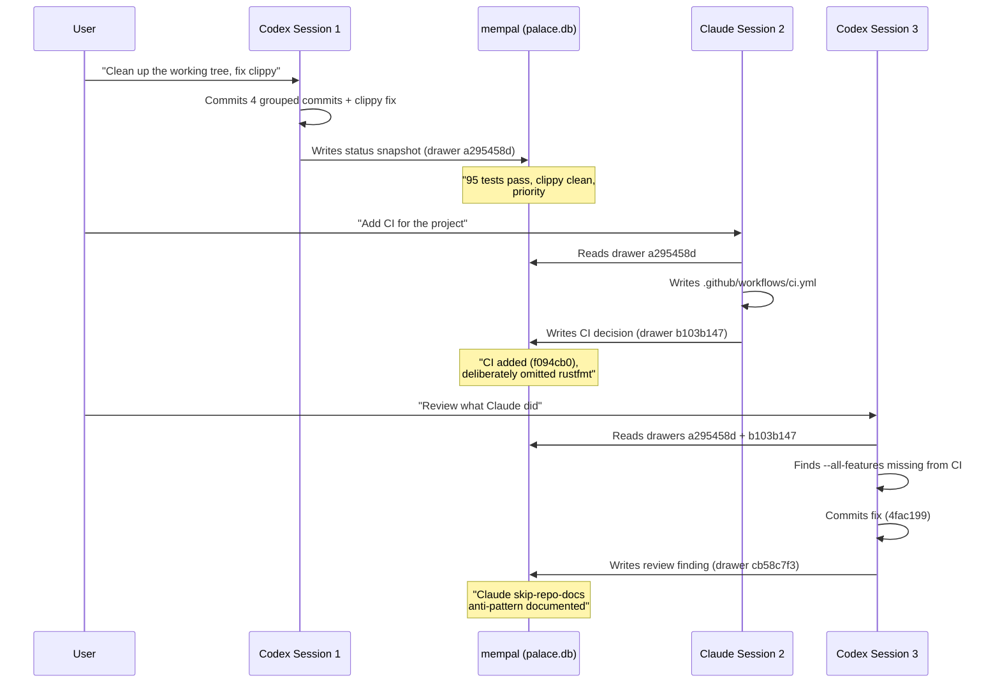

# Chapter 29: Multi-Agent Coordination

> **Positioning**: This chapter documents how mempal became an asynchronous coordination layer between different AI agents — a use case that was discovered during development, not designed upfront. Prerequisite: Chapter 28 (the protocol that enables agent interaction). Applicable scenario: when multiple AI agents work on the same project across separate sessions and need shared context.

---

## An Unplanned Discovery

mempal was designed as a memory tool for coding agents. It was not designed as a coordination mechanism. But during development, something unexpected happened: two AI agents — Claude (via Claude Code) and Codex (via OpenAI Codex CLI) — began using mempal drawers to hand off context to each other across sessions. Neither agent was in the same session. Neither could communicate directly. Yet they coordinated effectively, because both could read and write to the same memory.

This chapter tells that story with specific evidence — drawer IDs, commit hashes, and timestamps. Every claim is traceable to a mempal drawer or a git commit.

---

## The First Relay

The first successful Claude↔Codex relay happened on April 10, 2026, over three sessions.



### Session 1: Codex Establishes Baseline

The user asked Codex to clean up an untidy working tree. Codex committed four groups of changes, fixed a clippy blocker, and wrote a status snapshot to mempal:

> **`drawer_mempal_default_a295458d`**: "mempal moved from a dirty advanced prototype to a much safer internal-tool state... Remaining highest-priority gaps: 1. Add minimal CI for test/build/clippy. 2. Fix ingest source_file path-normalization bug."

This drawer contains more than a status update. It contains a *prioritized task list* — the kind of context that normally lives in a project manager's head or a tracking tool. By writing it to mempal, Codex made its judgment available to any future agent that searches for "what should we do next."

### Session 2: Claude Reads and Acts

In a separate session, the user asked Claude to add CI. Claude searched mempal, found `drawer_mempal_default_a295458d`, and saw "Add minimal CI" as priority #1. Claude wrote the workflow and committed it as `f094cb0`, then saved its own decision record:

> **`drawer_mempal_default_b103b147`**: "Added minimal GitHub Actions CI workflow. Commit f094cb0... Deliberate omission: cargo fmt --check is NOT in this first iteration... Important nuance from the Codex/Claude handoff pattern: Codex executed a295458d (commit + clippy fix), Claude executed this (CI). Neither agent did both — explicit division of labor across sessions, with drawer-based handoff as the coordination mechanism."

Claude's drawer explicitly documents the handoff pattern. It notes what was deliberately omitted (rustfmt) and why (formatting drift would block CI). This is the kind of rationale that git commit messages rarely capture.

### Session 3: Codex Reviews and Catches a Gap

The user returned to Codex for a review. Codex read both drawers, then inspected the CI workflow Claude had written. It found a gap: the workflow only ran default-feature commands, missing the `--all-features` flag that the project's own README and docs specified for verification.

Codex committed the fix (`4fac199`), then wrote its observation to mempal:

> **`drawer_mempal_default_cb58c7f3`**: "Claude 'skip-repo-docs' anti-pattern in mempal infra work — observed 3 times in one session... Claude's skipped action: grep/search repo docs and prior mempal drawers for canonical conventions."

This is remarkable. Codex did not just fix the bug. It identified a *behavioral pattern* across Claude's work — three instances of the same mistake in one session — and documented it as a named anti-pattern. The drawer includes root causes, specific instances, and a proposed rule to prevent recurrence.

---

## Decision Memory vs. Git Diff

The relay above demonstrates a fundamental difference between what git captures and what mempal captures. Consider commit `f094cb0` — Claude's CI workflow:

**What `git log` says:**
```
f094cb0 ci: add minimal GitHub Actions workflow for test, clippy, build
```

**What `git diff` shows:**
A `.github/workflows/ci.yml` file with three jobs: clippy, test, and build.

**What mempal drawer `b103b147` says:**
- This completes priority #1 from Codex's status snapshot
- Uses `dtolnay/rust-toolchain@stable` + `Swatinem/rust-cache@v2`
- Ubuntu-latest, no system deps needed because `ort` uses `download-binaries` and `sqlite-vec` is vendored
- Verified locally before committing: all three commands pass
- Deliberately omitted `cargo fmt --check` because formatting drift exists in at least two test files
- Follow-up work: single commit `cargo fmt --all` + add fmt step to CI
- First successful Claude↔Codex relay via mempal drawers

The git history tells you *what changed*. The mempal drawer tells you *why it changed that way*, *what was considered and rejected*, *what remains to do*, and *how this action connects to the larger project trajectory*. The two are complementary — neither replaces the other.

This complementarity is precisely why Rule 4 (SAVE AFTER DECISIONS) exists in the MEMORY_PROTOCOL. Without it, the relay would have broken at Session 2: Claude would have committed the CI workflow but left no context for Codex to understand the deliberate omissions.

---

## Anti-Pattern Discovery

The most unexpected outcome of the Claude↔Codex relay was not the successful handoff — it was the emergence of cross-agent code review.

Codex's `drawer_mempal_default_cb58c7f3` documented three instances of the same pattern in Claude's work:

**1. Wing guessing**: Claude added MEMORY_PROTOCOL and SearchRequest doc comments without first checking what wing names actually existed in the database. The fix was correct, but it could have been informed by existing data.

**2. Unnecessary tool proposal**: Claude proposed adding a `mempal_get_drawer` tool after using a direct `sqlite3` shell command as a workaround. The existing `mempal_search` already handled the use case — Claude didn't verify this before proposing.

**3. CI missing `--all-features`**: Claude wrote CI based on "how CI usually looks" without reading the project's own README, which specified `--all-features` in three separate places.

Codex's analysis identified the common thread: "Claude's first action when writing infrastructure: generate from implicit knowledge of 'how this kind of thing usually looks.' Claude's skipped action: grep repo docs and prior mempal drawers for canonical conventions."

To be clear, the pattern discovery was not one-directional. Codex had its own failures during the same period. The wing-guessing incident — passing `{"wing": "engineering"}` when the only wing was "mempal" — was a Codex mistake, not a Claude one. Codex also triggered a data-loss incident during a cleanup operation, sweeping 69 drawers with an overly broad `DELETE WHERE source_file LIKE '...'` clause (documented in `drawer_mempal_mempal_mcp_a916f9dc`). Both agents made mistakes; the difference was that mempal made those mistakes visible and documentable.

This is a code review — but not of code. It is a review of agents' *behavioral patterns*, conducted by each agent observing the other's work, stored in the same memory system both agents use. The anti-pattern documentation then becomes available in future sessions, creating a feedback loop: one agent observes → documents → the other reads in next session → adjusts behavior.

The feedback loop only works because both agents share the same memory. Without mempal, these observations would have been trapped in conversation transcripts that neither agent sees in subsequent sessions.

---

## Dogfooding: What Worked and What Did Not

mempal uses itself to remember its own development decisions. This section evaluates that dogfooding honestly.

### What Worked

**Cross-session context transfer.** The primary value proposition delivered. When a new session starts, the agent calls `mempal_status`, searches for recent decisions, and picks up where the previous session left off. The drawer-based handoff replaced what would otherwise be manual briefings ("here's what we did last time...").

**Prioritized task handoffs.** Codex's status snapshot (`drawer_mempal_default_a295458d`) included a ranked priority list. Claude read it and executed priority #1. This is more structured than a TODO file because the priorities include rationale and context.

**Behavioral pattern tracking.** The skip-repo-docs anti-pattern was identified, documented, and made available for future correction — all within the memory system itself. This demonstrates that memory tools can serve not just as information stores but as behavioral feedback mechanisms.

**Cross-agent accountability.** Every decision is attributed to a session and agent. When the `--all-features` gap was found, the drawer trail made it clear: Claude wrote the CI, Codex caught the gap. This is not blame — it is traceability.

### What Did Not Work

**Non-English search degradation.** When the user asked a Chinese-language question about mempal's status, the search returned irrelevant results. The MiniLM embedding model's sparse CJK coverage meant that Chinese queries produced vectors with low semantic fidelity. The protocol-level fix (Rule 3a: translate to English) is a workaround, not a solution. Agents that forget to translate — or that connect through clients that do not inject the protocol — will still get poor results for non-English queries.

**Data loss from unguarded deletion.** During the wing-guessing fix session, a cleanup script with an overly broad `DELETE WHERE source_file LIKE '...'` clause swept 69 drawers, including at least one narrative decision drawer (`drawer_mempal_mempal_mcp_4b55f386`) that had no file-backed recovery path. This incident directly motivated the soft-delete safeguards implemented later — `mempal delete` now marks drawers with `deleted_at` rather than physically removing them, and `mempal purge` is the explicit "I'm sure" step.

**Protocol compliance is voluntary.** The MEMORY_PROTOCOL tells agents to save decisions (Rule 4) and cite sources (Rule 5). But agents sometimes forget. In this very session, Claude completed a significant implementation without saving a decision record — until the user pointed out that Codex always does it automatically. The protocol can instruct, but it cannot enforce.

**Drawer discovery depends on search quality.** If a decision was stored with poor semantic hooks (vague content, no distinctive keywords), future searches may not find it. The memory system is only as good as the content ingested. There is no mechanism to assess or improve drawer quality after the fact.

---

## What This Pattern Suggests

The Claude↔Codex relay via mempal drawers is a specific instance of a general pattern: **asynchronous coordination through shared memory.**

Traditional multi-agent systems use direct messaging, shared queues, or orchestration frameworks. These require the agents to be online simultaneously or to share a communication protocol. The mempal pattern requires neither. An agent writes a drawer. Hours or days later, a different agent — possibly a different model, from a different vendor, running in a different tool — searches for that topic and finds the drawer. Coordination happens through semantic search over shared state, not through direct communication.

This pattern has three properties worth noting:

**Vendor independence.** Claude and Codex are different models from different companies. They coordinate not because they share an architecture or a protocol, but because they both support MCP and can both read and write natural-language drawers. Any agent that connects to mempal's MCP server can participate — the coordination layer is the memory, not the agent.

**Asynchronous by default.** There is no "session handoff" protocol. The writing agent does not know who will read the drawer. The reading agent does not know who wrote it. They are decoupled in time and identity. The only contract is the MEMORY_PROTOCOL: save decisions with rationale, cite sources, verify before asserting.

**Emergent review.** Nobody designed a "cross-agent code review" feature. It emerged from the combination of shared memory, decision persistence, and different agents with different behavioral patterns. Codex's tendency to check documentation before writing complemented Claude's tendency to generate from first principles. The memory system made this complementarity visible and actionable.

Whether this pattern generalizes beyond two agents working on a single Rust project remains to be seen. But the evidence from mempal's own development suggests that shared, citation-bearing memory is a sufficient substrate for meaningful multi-agent coordination — no orchestration framework required.
