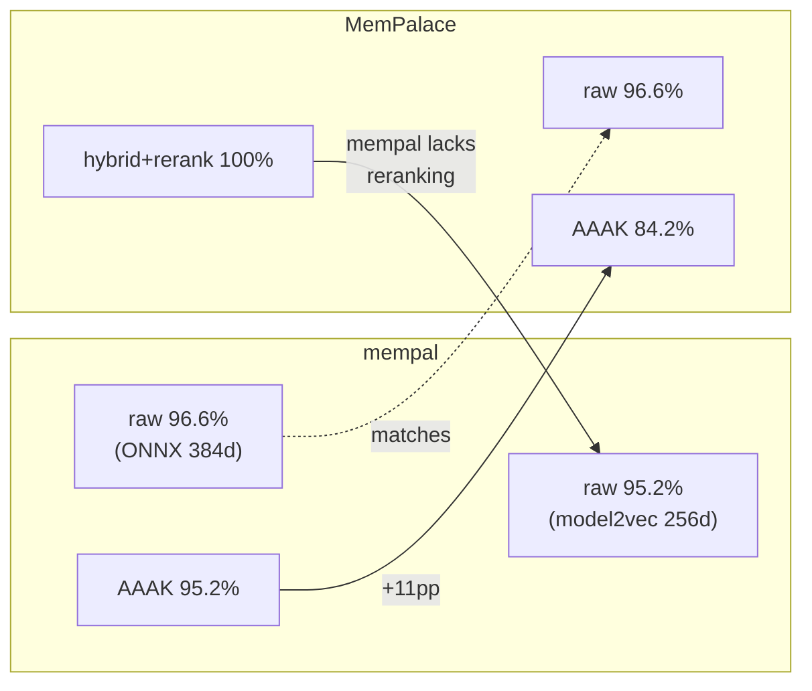

# Chapter 30: The Honest Gap

> **Positioning**: This chapter documents what mempal is not yet, with data. Rather than letting readers discover limitations, we state them first. Prerequisite: Chapters 26-29 (what was built). Applicable scenario: when evaluating whether mempal fits your use case.

---

## The Numbers

Before discussing gaps, here are the benchmark results that ground this chapter. All data from `benchmarks/longmemeval_s_summary.md`, run locally on the LongMemEval `s_cleaned` dataset (500 questions, 53 sessions).

### 384d Baseline (ONNX MiniLM-L6-v2)

| Mode | R@1 | R@5 | R@10 | NDCG@10 | Time |
|------|-----|-----|------|---------|------|
| raw + session | 0.806 | **0.966** | 0.982 | 0.889 | 415s |
| aaak + session | 0.830 | 0.952 | 0.974 | 0.892 | 502s |
| rooms + session | 0.734 | 0.878 | 0.896 | 0.808 | 422s |

### 256d Model2Vec (potion-base-8M)

| Mode | R@1 | R@5 | R@10 | NDCG@10 | Time |
|------|-----|-----|------|---------|------|
| raw + session | 0.816 | **0.952** | 0.976 | 0.888 | 102s |
| aaak + session | 0.806 | 0.948 | 0.972 | 0.883 | 116s |
| rooms + session | 0.744 | 0.868 | 0.890 | 0.808 | 84s |

### Comparison with MemPalace

| System | Mode | R@5 | API Calls |
|--------|------|-----|-----------|
| mempal (384d) | raw | **96.6%** | Zero |
| mempal (256d) | raw | **95.2%** | Zero |
| MemPalace | raw | **96.6%** | Zero |
| mempal (384d) | AAAK | **95.2%** | Zero |
| MemPalace | AAAK | **84.2%** | Zero |
| MemPalace | hybrid+rerank | **100%** | API calls |

The honest reading: mempal matches MemPalace on raw retrieval and significantly outperforms on AAAK (95.2% vs 84.2%, an 11 percentage-point improvement from the BNF grammar + jieba rework). But mempal does not reach MemPalace's hybrid+rerank 100% — that path requires API calls for reranking, which mempal deliberately omits in its zero-dependency default configuration.

---

## Gap 1: Model2Vec vs Full Transformer Quality

The switch from ONNX MiniLM (384d) to model2vec (256d) trades retrieval quality for deployment simplicity:

| Metric | 384d | 256d | Delta |
|--------|------|------|-------|
| R@5 (raw) | 0.966 | 0.952 | **-1.4pp** |
| NDCG@10 | 0.889 | 0.888 | -0.001 |
| Speed | 415s | 102s | **4x faster** |
| Native deps | ONNX Runtime (~200MB) | None | **Zero** |

The tradeoff is measurable: 1.4 percentage points of R@5 for zero native dependencies and 4x speed. For a personal developer tool, this is likely acceptable. For a system where every fraction of a percent matters (medical records, legal discovery), it would not be.

The `onnx` feature flag preserves the full-transformer path for users who want maximum quality at the cost of a heavier install.

---

## Gap 2: Non-English Search Degradation

Tested empirically during development: the Chinese query "它不再是一个高级原型" returned irrelevant AAAK documentation instead of the target status snapshot. The same query translated to English — "no longer just an advanced prototype" — hit the correct drawer immediately.

The model2vec multilingual model (`potion-multilingual-128M`) improves this — Chinese queries no longer completely miss — but English queries still retrieve more reliably. The practical gap:

- **English query**: target drawer typically in top-1 or top-3
- **Chinese query**: target drawer may appear in top-3 but with lower similarity, or be pushed out by false positives

MEMORY_PROTOCOL Rule 3a ("TRANSLATE QUERIES TO ENGLISH") is a workaround that leverages the fact that all mempal consumers are LLMs capable of translation. This is not a model-level fix. A proper solution would require either a stronger multilingual embedding model or a Chinese-specific FTS5 tokenizer — both of which add complexity that conflicts with the zero-dependency goal.

---

## Gap 3: No Reranking

MemPalace achieves 100% R@5 with hybrid search + reranking (using API-based cross-encoder). mempal's hybrid search (BM25 + vector + RRF) reaches 95-96% without reranking.

The `Reranker` trait exists (`crates/mempal-search/src/rerank.rs`) with a `NoopReranker` default. An ONNX cross-encoder implementation would close the gap, but it would add ~50-600MB of model weight depending on the reranker chosen, breaking the "light binary" promise.

The architectural decision: reranking is an optional enhancement, not a default. The 4-5 percentage point gap between RRF-only and reranked results is real, but for the typical use case (finding a decision made last week, not searching a million-document corpus), RRF is sufficient.

---

## Gap 4: Knowledge Graph Is Manual

mempal's triples table is activated — agents can add, query, invalidate, and browse timelines. But there is no automatic extraction. When an agent saves "Kai recommended Clerk over Auth0 based on pricing and DX" via `mempal_ingest`, no triples are automatically created. The agent must explicitly call `mempal_kg add "Kai" "recommends" "Clerk"`.

MEMORY_PROTOCOL does not yet include a rule for automatic triple extraction (the proposed Rule 4a was discussed but not implemented in protocol). This means the knowledge graph grows only when agents remember to populate it — which, based on our experience with Rule 4 (SAVE AFTER DECISIONS), they sometimes forget.

The alternative — LLM-based extraction at ingest time — conflicts with the local-first, zero-API-call philosophy. Every ingest would require an LLM call to extract entities and relationships. For a tool that processes hundreds of drawers during `mempal ingest`, this would be prohibitively slow and expensive.

---

## Gap 5: Taxonomy Routing Underperforms

The benchmark data reveals an uncomfortable truth: taxonomy-based room routing (`rooms` mode) consistently underperforms raw search.

| Mode | 384d R@5 | 256d R@5 |
|------|----------|----------|
| raw | 0.966 | 0.952 |
| rooms | 0.878 | 0.868 |

Room routing loses 8-9 percentage points compared to raw search. This means the taxonomy is currently *hurting* retrieval precision on LongMemEval, not helping it.

The likely cause: LongMemEval's question distribution does not align well with mempal's default taxonomy. Questions that span multiple rooms get routed to the wrong scope. Chapter 7's 34% improvement from Wing/Room filtering was measured on MemPalace's benchmark, where the taxonomy was presumably tuned for the data. mempal's auto-detected taxonomy from `mempal init` may not be well-calibrated for arbitrary datasets.

This does not invalidate spatial structure as a concept — it validates the design decision to make taxonomy editable rather than fixed. But it does mean that out-of-the-box taxonomy routing needs improvement, either through better auto-detection heuristics or through a "tune taxonomy from search feedback" mechanism that does not yet exist.

---

## Gap 6: Tunnel Discovery Is Forward-Looking

Tunnels work — we demonstrated this with a live example (the `mempal-mcp` room appearing in both `mempal` and `hermes-agent` wings). But with most users having only one wing, tunnels provide zero value in practice.

The feature is architecturally sound (dynamic SQL discovery, inline search hints, zero storage cost) but awaits the multi-project use case to prove its worth. This is a feature that was built from analysis (Chapter 6) rather than from user demand — the honest assessment is that it may never be used by most users.

---

## What These Gaps Mean

The gaps fall into three categories:

**Acceptable tradeoffs** (Gaps 1, 3): model2vec quality and lack of reranking are deliberate choices — speed and simplicity over marginal precision. The `onnx` feature and `Reranker` trait preserve upgrade paths.

**Known limitations with workarounds** (Gaps 2, 4): non-English search and manual KG are real limitations, but protocol-level workarounds (Rule 3a, potential Rule 4a) mitigate them for the target audience (AI agents that can translate and extract).

**Unproven features** (Gaps 5, 6): taxonomy routing regression and tunnel underuse suggest that some features were built from analysis rather than validated by usage. They need real-world feedback to prove or disprove their value.

---

## The Remaining Blockers

For **crates.io public release**: the main blocker is no longer code quality (CI is green, tests pass, clippy is clean) but release process — token management, publish order, version policy. The benchmark data in this chapter provides the credibility foundation that was previously missing.

For **broad adoption**: the gap between "works for the author" and "works for anyone" is still uncrossed. Installation is a single `cargo install`, but the first-run experience (model download, `mempal init`, understanding wing/room concepts) has not been tested with users who did not build the tool.

For **the book itself**: this chapter closes the narrative loop that Part 10 opened. Twenty-five chapters analyzed MemPalace. Five chapters documented the rewrite. This chapter provides the honest self-assessment that makes the analysis credible — because a book that only praises its subject is marketing, not engineering.
