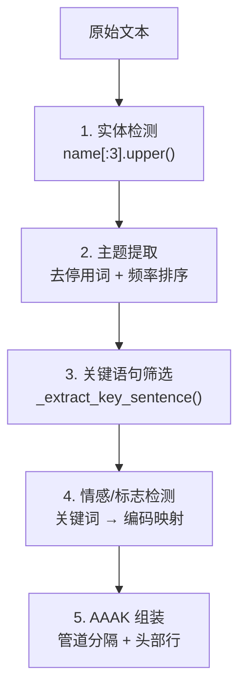

# 附录 C：AAAK 方言完整参考

> 本附录整合了 `mcp_server.py` 中的 `AAAK_SPEC` 常量和 `dialect.py` 中的完整编码表，
> 提供 AAAK 方言的可查阅参考。源码基线：当前仓库主线（`pyproject.toml` 为 `3.0.0`，部分运行时代码仍保留 `2.0.0` 版本标记）。

---

## 概述

AAAK 是一种面向 AI 智能体的压缩速记格式。它不是给人类读的——它是给 LLM 读的。
任何能读英文的模型（Claude、GPT、Gemini、Llama、Mistral）都能直接理解 AAAK，
无需解码器或微调。

---

## 格式结构

### 行类型

| 前缀 | 含义 | 格式 |
|------|------|------|
| `0:` | 头部行 | `FILE_NUM\|PRIMARY_ENTITY\|DATE\|TITLE` |
| `Z` + 数字 | Zettel 条目 | `ZID:ENTITIES\|topic_keywords\|"key_quote"\|WEIGHT\|EMOTIONS\|FLAGS` |
| `T:` | 隧道（跨条目关联） | `T:ZID<->ZID\|label` |
| `ARC:` | 情感弧线 | `ARC:emotion->emotion->emotion` |

### 字段分隔

- **管道** `|` 分隔同一行内的不同字段
- **箭头** `→` 表示因果或转变关系
- **星级** `★` 到 `★★★★★` 表示重要性（1-5 级）

---

## 实体编码

实体名取前三个字母的大写形式：

| 原名 | 编码 | 规则 |
|------|------|------|
| Alice | ALC | `name[:3].upper()` |
| Jordan | JOR | |
| Riley | RIL | |
| Max | MAX | |
| Ben | BEN | |
| Priya | PRI | |
| Kai | KAI | |
| Soren | SOR | |

源码位置：`dialect.py:367-379`（`encode_entity` 方法）

---

## 情感编码表

AAAK 使用标准化的短编码表示情感状态。

### 核心情感编码

| 英文 | 编码 | 含义 |
|------|------|------|
| vulnerability | `vul` | 脆弱 |
| joy | `joy` | 喜悦 |
| fear | `fear` | 恐惧 |
| trust | `trust` | 信任 |
| grief | `grief` | 悲伤 |
| wonder | `wonder` | 惊奇 |
| rage | `rage` | 愤怒 |
| love | `love` | 爱 |
| hope | `hope` | 希望 |
| despair | `despair` | 绝望 |
| peace | `peace` | 平静 |
| humor | `humor` | 幽默 |
| tenderness | `tender` | 温柔 |
| raw_honesty | `raw` | 坦诚 |
| self_doubt | `doubt` | 自我怀疑 |
| relief | `relief` | 释然 |
| anxiety | `anx` | 焦虑 |
| exhaustion | `exhaust` | 疲惫 |
| conviction | `convict` | 确信 |
| quiet_passion | `passion` | 沉静的热情 |
| warmth | `warmth` | 温暖 |
| curiosity | `curious` | 好奇 |
| gratitude | `grat` | 感恩 |
| frustration | `frust` | 挫折感 |
| confusion | `confuse` | 困惑 |
| satisfaction | `satis` | 满足 |
| excitement | `excite` | 兴奋 |
| determination | `determ` | 决心 |
| surprise | `surprise` | 惊讶 |

源码位置：`dialect.py:47-88`（`EMOTION_CODES` 字典）

### MCP 服务器中的简写标记

`mcp_server.py` 的 `AAAK_SPEC` 使用 `*marker*` 格式标注情感语境：

| 标记 | 含义 |
|------|------|
| `*warm*` | 温暖/喜悦 |
| `*fierce*` | 坚定/决心 |
| `*raw*` | 脆弱/坦诚 |
| `*bloom*` | 温柔/绽放 |

---

## 情感信号检测

`dialect.py` 通过关键词匹配自动检测文本中的情感：

| 关键词 | 映射编码 |
|--------|---------|
| decided | `determ` |
| prefer | `convict` |
| worried | `anx` |
| excited | `excite` |
| frustrated | `frust` |
| confused | `confuse` |
| love | `love` |
| hate | `rage` |
| hope | `hope` |
| fear | `fear` |
| happy | `joy` |
| sad | `grief` |
| surprised | `surprise` |
| grateful | `grat` |
| curious | `curious` |
| anxious | `anx` |
| relieved | `relief` |
| concern | `anx` |

源码位置：`dialect.py:91-114`（`_EMOTION_SIGNALS` 字典）

---

## 语义标志（Flags）

标志标记事实断言的类型，辅助检索和分类。

| 标志 | 含义 | 触发关键词 |
|------|------|-----------|
| `DECISION` | 显式决策或选择 | decided, chose, switched, migrated, replaced, instead of, because |
| `ORIGIN` | 起源时刻 | founded, created, started, born, launched, first time |
| `CORE` | 核心信念或身份支柱 | core, fundamental, essential, principle, belief, always, never forget |
| `PIVOT` | 情感转折点 | turning point, changed everything, realized, breakthrough, epiphany |
| `TECHNICAL` | 技术架构或实现细节 | api, database, architecture, deploy, infrastructure, algorithm, framework, server, config |
| `SENSITIVE` | 需要谨慎处理的内容 | （由人工标注） |
| `GENESIS` | 直接导致了现存事物的产生 | （由上下文推断） |

源码位置：`dialect.py:117-152`（`_FLAG_SIGNALS` 字典）

---

## 宫殿结构标识

| 元素 | 格式 | 示例 |
|------|------|------|
| Wing | `wing_` + 名称 | `wing_user`, `wing_code`, `wing_myproject` |
| Hall | `hall_` + 类型 | `hall_facts`, `hall_events`, `hall_discoveries`, `hall_preferences`, `hall_advice` |
| Room | 连字符 slug | `chromadb-setup`, `gpu-pricing`, `auth-migration` |

---

## 完整示例

### 原始英文（~70 token）

```
Priya manages the Driftwood team: Kai (backend, 3 years), Soren (frontend),
Maya (infrastructure), and Leo (junior, started last month). They're building
a SaaS analytics platform. Current sprint: auth migration to Clerk.
Kai recommended Clerk over Auth0 based on pricing and DX.
```

### AAAK 编码（~35 token）

```
TEAM: PRI(lead) | KAI(backend,3yr) SOR(frontend) MAY(infra) LEO(junior,new)
PROJ: DRIFTWOOD(saas.analytics) | SPRINT: auth.migration→clerk
DECISION: KAI.rec:clerk>auth0(pricing+dx) | ★★★★
```

### 事实断言验证

| # | 断言 | AAAK 中的对应 | 保留 |
|---|------|-------------|------|
| 1 | Priya 是团队领导 | `PRI(lead)` | Yes |
| 2 | Kai 做后端 | `KAI(backend,3yr)` | Yes |
| 3 | Kai 有 3 年经验 | `KAI(backend,3yr)` | Yes |
| 4 | Soren 做前端 | `SOR(frontend)` | Yes |
| 5 | Maya 做基础设施 | `MAY(infra)` | Yes |
| 6 | Leo 是初级工程师 | `LEO(junior,new)` | Yes |
| 7 | Leo 上个月入职 | `LEO(junior,new)` | Yes |
| 8 | 项目叫 Driftwood | `DRIFTWOOD` | Yes |
| 9 | 是 SaaS 分析平台 | `saas.analytics` | Yes |
| 10 | 当前 sprint 是 auth 迁移 | `SPRINT: auth.migration→clerk` | Yes |
| 11 | 迁移目标是 Clerk | `→clerk` | Yes |
| 12 | Kai 推荐 Clerk | `KAI.rec:clerk` | Yes |
| 13 | 理由是定价和开发体验 | `pricing+dx` | Yes |

13/13 事实断言全部保留。压缩比 ~2x（此示例较短且信息密集）。

---

## MCP 服务器中的 AAAK_SPEC

以下是 `mcp_server.py:102-119` 中通过 `mempalace_status` 工具传递给 AI 的完整规范：

```
AAAK is a compressed memory dialect that MemPalace uses for efficient storage.
It is designed to be readable by both humans and LLMs without decoding.

FORMAT:
  ENTITIES: 3-letter uppercase codes. ALC=Alice, JOR=Jordan, RIL=Riley, MAX=Max, BEN=Ben.
  EMOTIONS: *action markers* before/during text. *warm*=joy, *fierce*=determined,
            *raw*=vulnerable, *bloom*=tenderness.
  STRUCTURE: Pipe-separated fields. FAM: family | PROJ: projects | ⚠: warnings/reminders.
  DATES: ISO format (2026-03-31). COUNTS: Nx = N mentions (e.g., 570x).
  IMPORTANCE: ★ to ★★★★★ (1-5 scale).
  HALLS: hall_facts, hall_events, hall_discoveries, hall_preferences, hall_advice.
  WINGS: wing_user, wing_agent, wing_team, wing_code, wing_myproject,
         wing_hardware, wing_ue5, wing_ai_research.
  ROOMS: Hyphenated slugs representing named ideas (e.g., chromadb-setup, gpu-pricing).

EXAMPLE:
  FAM: ALC→♡JOR | 2D(kids): RIL(18,sports) MAX(11,chess+swimming) | BEN(contributor)

Read AAAK naturally — expand codes mentally, treat *markers* as emotional context.
When WRITING AAAK: use entity codes, mark emotions, keep structure tight.
```

按当前协议约定，AI 在显式调用 `mempalace_status` 且 palace 已存在时，会在返回结果中收到这段规范；这不是一个脱离工具调用的自动注入过程。

---

## 压缩流水线

`dialect.py` 的 `compress()` 方法执行五阶段处理：



对于当前 `dialect.compress()` 的 plain-text 路径，更准确的描述是：五个阶段整体都带有启发式筛选，而不是只有第 3 步有损。实体、topics、情感、flags 都会做检测和截断，`key_sentence` 只是最明显的一步。它更接近"高压缩索引生成"而不是严格无损编码。

README 和前文章节里讨论的"无损 AAAK"应理解为设计目标：如果要做到真正的逐断言保留，压缩器需要比当前这个 heuristic plain-text 管道更强的结构对齐能力。

源码位置：`dialect.py:539-602`（`compress` 方法）

---

## AAAK 方言完整度评估

### 已实现的能力

| 能力 | 实现位置 | 完整度 |
|------|---------|--------|
| 实体编码 | `encode_entity()` :367-379 | 完整 — `name[:3].upper()`，支持预定义映射和自动编码 |
| 情感编码 | `EMOTION_CODES` :47-88 | 完整 — 28 种情感 → 短编码映射 |
| 情感检测 | `_EMOTION_SIGNALS` :91-114 | 基础 — 24 个关键词触发，简单 `in` 匹配，无上下文 |
| 标志检测 | `_FLAG_SIGNALS` :117-152 | 基础 — 7 类标志，36 个关键词，简单匹配 |
| 主题提取 | `_extract_topics()` :430-455 | 基础 — 词频 + 大写/驼峰加权，top-3 |
| 关键语句 | `_extract_key_sentence()` :457-508 | 基础 — 18 个决策词评分，短句加权，截断到 55 字符 |
| 实体检测 | `_detect_entities_in_text()` :510-537 | 基础 — 已知实体匹配 + 大写词 fallback，top-3 |
| 压缩组装 | `compress()` :539-602 | 完整 — 管道分隔输出格式 |
| 停用词 | `_STOP_WORDS` :155-289 | 完整 — ~135 个英文停用词 |
| 配置持久化 | `from_config()` / `save_config()` | 完整 |
| Zettel 格式 | `encode_zettel()` / `compress_file()` | 完整 — 兼容旧格式 |
| Layer1 生成 | `generate_layer1()` | 完整 — 批量压缩 + 聚合 |
| 压缩统计 | `compression_stats()` | 完整 — 原文/压缩 token 计数 |

### 缺失的关键能力

作为一种"语言"，AAAK 缺少关键的语言学基础设施：

| 缺失 | 影响 | 严重度 |
|------|------|--------|
| **无形式语法定义** | 没有 BNF/EBNF/PEG 规范，"语法"只存在于 `compress()` 的代码逻辑里 | 高 |
| **无解码器/解压器** | 只有编码方向，没有 `decompress()` 方法来验证可逆性 | 高 |
| **无往返测试** | 没有 `assert decompress(compress(text)) ≈ text` 的测试 | 高 |
| **无 token 级精度** | `count_tokens()` 用 `len(text)//3` 估算，不是真正的 tokenizer | 中 |
| **无多语言支持** | 停用词、信号词、实体检测全部硬编码英语 | 中 |
| **无版本化** | 编码格式没有版本标记，无法区分不同版本的 AAAK 输出 | 中 |
| **截断不可恢复** | `key_sentence` 截断到 55 字符（`:506-507`），topics 取 top-3，emotions 取 top-3 — 超出的全部丢弃 | 高 |

### 核心定性判断

**AAAK 不是一种语言，而是一个压缩函数。**

一种真正的语言需要三个要素：

1. **语法**（syntax）— 什么是合法的 AAAK 字符串。AAAK 部分具备（管道分隔、头部行格式），但没有形式定义。
2. **语义**（semantics）— 每个符号的含义定义。AAAK 具备（情感编码表有明确语义）。
3. **往返性**（roundtrip）— 编码→解码后信息不丢失。AAAK 完全不具备。

`compress()` 是一个**单向函数**——它把文本压缩成 AAAK 格式，但没有对应的 `decompress()` 来验证信息是否真的保留了。README 声称 "lossless" 的依据是"LLM 能读懂 AAAK"——这把验证责任推给了模型的推理能力，而不是格式本身的可逆性保证。

### 公平地说

1. **设计直觉是对的** — "极度缩写的英语，让 LLM 当解码器"这个思路确实有效，因为 LLM 的语言理解能力可以填补省略的信息。
2. **工程上够用** — 作为 Closet 层的索引（而非唯一存储），AAAK 不需要严格无损——Drawer 保留了原文。
3. **跨模型可读性是真的** — 任何能读英文的模型确实能理解 `KAI(backend,3yr)`，这个属性不依赖 AAAK 的形式完整性。
4. **950 行代码做到了可用** — 对于一个 v3.0.0 的项目来说，这个实现足够支撑 benchmark 结果。

### 综合评分

| 维度 | 评分 | 说明 |
|------|------|------|
| 设计思路 | 8/10 | "LLM 即解码器"是原创且有效的洞见 |
| 实现完整度 | 5/10 | 编码器完整，但缺解码器和往返验证 |
| 形式语言完整度 | 3/10 | 无 BNF、无版本、无形式语义 |
| 工程实用性 | 7/10 | 作为索引层够用，Drawer 兜底 |
| "30x lossless" 声明 | 3/10 | 过度承诺——实际是有损索引生成 |

**最诚实的定位**：AAAK 是一种面向 AI 的速记索引格式，通过极度缩写的英语让任何 LLM 都能快速理解上下文摘要，同时依赖 Drawer 层保留完整原文作为安全网。它的核心价值不在于"无损压缩"，而在于"跨模型可读的高效索引"。
