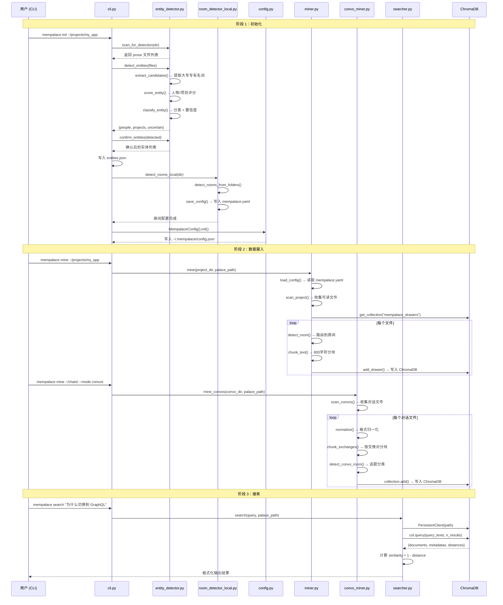

# 附录 A：E2E Trace — 从 mempalace init 到第一次搜索

> 本附录追踪一个完整的用户旅程：从 `pip install mempalace` 到第一次搜索返回结果。每一步都标注源码位置，每一条数据流都可以在代码中验证。
> 涉及章节：第 5 章（Wing-Hall-Room 结构）、第 16-18 章（归一化-实体检测-分块管道）、第 14-15 章（记忆层与混合检索）。

## 场景

用户 Alex 有一个项目目录 `~/projects/my_app`，里面包含前端代码（`components/`）、后端代码（`api/`）、文档（`docs/`）和若干 Claude Code 对话导出文件。他希望：

1. 让 MemPalace 自动识别项目结构，生成房间分类
2. 把项目文件和对话记录都摄入记忆宫殿
3. 搜索"为什么我们切换到了 GraphQL"，找到当时的决策对话

整个流程涉及三个命令：`mempalace init`、`mempalace mine`、`mempalace search`。

## 序列图



## 阶段 1：初始化（mempalace init）

初始化是整个系统中最关键的一步——它决定了数据的组织方式，而这个组织方式在写入时就已经固化。初始化做两件事：检测实体（谁和什么）、检测房间（如何分类）。

### 1.1 入口：CLI 解析

用户执行 `mempalace init ~/projects/my_app`，`argparse` 将 `dir` 参数传递给 `cmd_init` 函数（`cli.py:37`）。这个函数是整个初始化流程的编排器，它依次调用实体检测和房间检测两个子系统。

### 1.2 实体检测：Pass 1 — 扫描文件

`cmd_init` 首先调用 `scan_for_detection(args.dir)`（`cli.py:45`）。这个函数定义在 `entity_detector.py:813`，它的工作是收集适合做实体检测的文件。

关键设计决策：**优先扫描散文文件**。`PROSE_EXTENSIONS`（`entity_detector.py:400-405`）只包含 `.txt`、`.md`、`.rst`、`.csv`，因为代码文件中的大写标识符（类名、函数名）会产生大量假阳性。只有当散文文件不足 3 个时，才会回退到包含代码文件（`entity_detector.py:834`）。每次最多扫描 10 个文件（`max_files` 参数），每个文件只读前 5KB（`entity_detector.py:652`）——这不是偷懒，而是因为实体如果重要到需要记住，它一定会在文件开头反复出现。

### 1.3 实体检测：Pass 2 — 提取与评分

`detect_entities(files)`（`entity_detector.py:632`）执行三步管道：

**提取候选词**：`extract_candidates()`（`entity_detector.py:443`）用正则 `r"\b([A-Z][a-z]{1,19})\b"` 找出所有大写开头的单词，过滤掉停用词表（`STOPWORDS`，约 200 个常见英文词，`entity_detector.py:92-396`），只保留出现 3 次以上的词。同时用 `r"\b([A-Z][a-z]+(?:\s+[A-Z][a-z]+)+)\b"` 提取多词专有名词（如 "Memory Palace"、"Claude Code"）。

**信号评分**：对每个候选词，`score_entity()`（`entity_detector.py:486`）用两组正则模式打分：

- 人物信号（`PERSON_VERB_PATTERNS`，`entity_detector.py:27-48`）：`{name} said`、`{name} asked`、`hey {name}` 等动作模式。对话标记（`DIALOGUE_PATTERNS`）权重最高，每次匹配 +3 分。代词邻近性检测会检查名字前后 3 行内是否出现 `she`/`he`/`they` 等代词。
- 项目信号（`PROJECT_VERB_PATTERNS`，`entity_detector.py:72-89`）：`building {name}`、`import {name}`、`{name}.py` 等技术模式。版本号标记和代码引用权重最高，每次匹配 +3 分。

**分类**：`classify_entity()`（`entity_detector.py:562`）根据人物/项目得分比例做出判断。一个重要的保护机制：即使人物得分占比超过 70%，如果只有一种信号类型（比如只有代词匹配），也会被降级为"不确定"（`entity_detector.py:605-609`）。这避免了"Click"这样的词因为频繁出现在 `Click said` 模式中而被误判为人名。

### 1.4 实体确认与保存

`confirm_entities()`（`entity_detector.py:717`）让用户交互式审核检测结果。如果传入 `--yes` 标志，则自动接受所有检测到的人物和项目，跳过不确定项（`entity_detector.py:739-744`）。确认后的实体保存为 `entities.json`（`cli.py:54-56`），供后续 miner 使用。

### 1.5 房间检测

实体检测完成后，`cmd_init` 调用 `detect_rooms_local(project_dir)`（`cli.py:62`）。这个函数定义在 `room_detector_local.py:270`，执行以下步骤：

**文件夹扫描**：`detect_rooms_from_folders()`（`room_detector_local.py:97`）遍历项目顶层目录和第二层目录，将文件夹名与 `FOLDER_ROOM_MAP`（`room_detector_local.py:20-94`）做匹配。这个映射表覆盖了 40+ 种常见文件夹命名：`frontend/client/ui/components` 都映射到 "frontend" 房间，`backend/server/api/routes/models` 都映射到 "backend" 房间。

对于我们的场景，`components/` 会被匹配到 "frontend"，`api/` 会被匹配到 "backend"，`docs/` 会被匹配到 "documentation"。如果某个顶层文件夹不在映射表中但看起来像合法名字（长度 > 2，字母开头），它会被直接用作房间名（`room_detector_local.py:128-130`）。

**回退策略**：如果文件夹结构只产生了一个 "general" 房间，系统会调用 `detect_rooms_from_files()`（`room_detector_local.py:168`），通过文件名中的关键词来检测房间。

**配置保存**：`save_config()`（`room_detector_local.py:255`）将 wing 名（取自目录名）和房间列表写入项目目录下的 `mempalace.yaml`。对于 `~/projects/my_app`，生成的配置大致为：

```yaml
wing: my_app
rooms:
  - name: frontend
    description: Files from components/
  - name: backend
    description: Files from api/
  - name: documentation
    description: Files from docs/
  - name: general
    description: Files that don't fit other rooms
```

### 1.6 全局配置

最后，`MempalaceConfig().init()`（`cli.py:63`）在 `~/.mempalace/` 下创建全局配置文件 `config.json`（`config.py:126-138`），包含宫殿路径（默认 `~/.mempalace/palace`）、集合名（`mempalace_drawers`）、话题翼列表和关键词映射。

### 初始化产出物清单

| 文件 | 位置 | 作用 |
|------|------|------|
| `entities.json` | `~/projects/my_app/` | 确认的人物和项目列表 |
| `mempalace.yaml` | `~/projects/my_app/` | Wing 名 + 房间定义 |
| `config.json` | `~/.mempalace/` | 全局配置（宫殿路径等） |

## 阶段 2：数据摄入（mempalace mine）

### 2.1 项目文件摄入

执行 `mempalace mine ~/projects/my_app`，`cmd_mine`（`cli.py:66`）在默认 `projects` 模式下调用 `mine()`（`miner.py:315`）。

**配置加载**：`load_config()`（`miner.py:66`）读取项目目录下的 `mempalace.yaml`，获取 wing 名和房间列表。

**文件扫描**：`scan_project()`（`miner.py:287`）递归遍历项目目录，收集 `READABLE_EXTENSIONS`（`miner.py:19-40`）定义的 20 种文件类型（`.py`、`.js`、`.ts`、`.md` 等），跳过 `SKIP_DIRS`（`miner.py:42-54`）中的目录（`.git`、`node_modules`、`__pycache__` 等）。

**获取 ChromaDB 集合**：`get_collection()`（`miner.py:183`）以 `PersistentClient` 模式连接 ChromaDB，创建或获取名为 `mempalace_drawers` 的集合。ChromaDB 使用默认的 `all-MiniLM-L6-v2` 模型自动生成嵌入向量——无需 API 密钥。

**逐文件处理**：`process_file()`（`miner.py:233`）对每个文件执行三步管道：

1. **去重检查**：`file_already_mined()`（`miner.py:192`）查询 ChromaDB，如果该源文件已经被摄入过，直接跳过。
2. **房间路由**：`detect_room()`（`miner.py:89`）按优先级匹配：文件夹路径 → 文件名 → 内容关键词 → 回退到 "general"。对于 `components/Header.tsx`，第一优先级（路径包含 "components"，匹配 "frontend" 房间）就会命中。
3. **分块**：`chunk_text()`（`miner.py:135`）将文件内容切成 800 字符的块（`CHUNK_SIZE`，`miner.py:56`），相邻块之间有 100 字符重叠（`CHUNK_OVERLAP`，`miner.py:57`）。分割点优先选择段落边界（`\n\n`），其次是行边界（`\n`），确保不会在句子中间断开。最小块大小为 50 字符（`MIN_CHUNK_SIZE`，`miner.py:58`），更短的片段会被丢弃。

**写入 ChromaDB**：`add_drawer()`（`miner.py:201`）为每个块生成唯一 ID（`drawer_{wing}_{room}_{md5_hash}`），连同六项元数据一起写入：

```python
{
    "wing": wing,           # 项目名
    "room": room,           # 房间名
    "source_file": source,  # 原始文件路径
    "chunk_index": index,   # 块在文件中的序号
    "added_by": agent,      # 摄入代理
    "filed_at": timestamp,  # ISO 8601 时间戳
}
```

这些元数据在写入时就已确定——搜索时的过滤能力完全取决于此时标注的完整度。

### 2.2 对话文件摄入

执行 `mempalace mine ~/chats/ --mode convos`，`cmd_mine`（`cli.py:69`）调用 `mine_convos()`（`convo_miner.py:252`）。对话摄入和项目摄入共享同一个 ChromaDB 集合，但使用不同的分块策略。

**格式归一化**：每个文件先经过 `normalize()`（`convo_miner.py:302`）处理，将 Claude Code、ChatGPT、Slack 等不同格式统一为 `> 用户提问\n AI 回答` 的规范格式。

**交换对分块**：`chunk_exchanges()`（`convo_miner.py:52`）检测文件中 `>` 标记的数量。如果 `>` 标记超过 3 个，判定为对话格式，调用 `_chunk_by_exchange()`（`convo_miner.py:66`）——一个用户提问（`>` 行）加上紧随的 AI 回答构成一个不可分割的块。如果不是对话格式，回退到 `_chunk_by_paragraph()`（`convo_miner.py:102`）按段落分块。

**话题房间检测**：`detect_convo_room()`（`convo_miner.py:194`）对内容的前 3000 字符用 `TOPIC_KEYWORDS`（`convo_miner.py:127-191`）做关键词打分。五个话题房间——technical、architecture、planning、decisions、problems——各自有 10-13 个关键词。得分最高的话题成为该对话的房间。对于包含 "switched"、"chose"、"alternative" 的 GraphQL 讨论，"decisions" 房间会拿到最高分。

**写入时的额外元数据**：对话块比项目块多两个元数据字段——`"ingest_mode": "convos"` 和 `"extract_mode": "exchange"`（`convo_miner.py:368-369`）。这使得搜索时可以区分项目知识和对话记忆。

## 阶段 3：搜索（mempalace search）

### 3.1 搜索入口

执行 `mempalace search "为什么切换到 GraphQL"`，`cmd_search`（`cli.py:94`）调用 `search()`（`searcher.py:15`）。

### 3.2 连接宫殿

`search()` 首先用 `PersistentClient` 连接 ChromaDB 并获取 `mempalace_drawers` 集合（`searcher.py:21-22`）。如果宫殿不存在，立即报错并建议用户先执行 `init` 和 `mine`（`searcher.py:24-26`）。

### 3.3 构建过滤器

如果用户指定了 `--wing` 或 `--room`，`search()` 会构建 ChromaDB 的 `where` 过滤器（`searcher.py:29-35`）。当两者同时指定时，使用 `$and` 组合查询：

```python
where = {"$and": [{"wing": wing}, {"room": room}]}
```

这是 MemPalace 混合搜索的核心：先用元数据做精确过滤（缩小搜索范围），再在过滤后的子集上做向量相似度搜索。对于"为什么切换到 GraphQL"这个查询，如果用户加上 `--wing my_app --room decisions`，搜索空间可能从上千个 drawer 缩小到几十个。

### 3.4 执行查询

`col.query()`（`searcher.py:46`）将查询文本向量化（ChromaDB 内部使用 `all-MiniLM-L6-v2` 模型），然后在集合中找到 `n_results` 个最近邻向量。返回三个并行数组：`documents`（原文）、`metadatas`（元数据）、`distances`（向量距离）。

### 3.5 结果格式化

`searcher.py:68-83` 将结果格式化输出。相似度通过 `1 - distance` 计算（`searcher.py:69`），因为 ChromaDB 默认使用余弦距离。输出包括：

```
  [1] my_app / decisions
      Source: graphql-migration.md
      Match:  0.847

      > Why did we switch from REST to GraphQL?
      We discussed this on Tuesday. The main reasons were...
```

每条结果都标注了 wing（来自哪个项目）、room（属于哪个分类）、source（原始文件名）和 match（相似度分数），以及完整的原文——不是摘要，不是释义，而是用户当时写下的原话。

### 3.6 程序化搜索接口

除了 CLI 输出，`search_memories()`（`searcher.py:87`）提供了返回字典的程序化接口，供 MCP 服务器和其他调用方使用。返回格式：

```python
{
    "query": "为什么切换到 GraphQL",
    "filters": {"wing": "my_app", "room": "decisions"},
    "results": [
        {
            "text": "原始文本...",
            "wing": "my_app",
            "room": "decisions",
            "source_file": "graphql-migration.md",
            "similarity": 0.847,
        }
    ],
}
```

## 这个追踪揭示了什么

回顾完整的数据流，三个设计原则浮现出来：

**结构先于内容**。`init` 阶段在任何数据摄入之前就确定了宫殿的骨架——wing 名、房间列表、实体映射。这不是技术偷懒，而是刻意选择：如果你不知道自己的世界里有谁和有什么，再多的向量嵌入也帮不了你。实体检测的两类信号模式（人物动词 vs 项目动词）和双信号保护机制（`entity_detector.py:601`），都是为了在数据进入宫殿之前就把分类做对。

**元数据在写入时确定**。每个 drawer 的 wing、room、source_file 都在 `add_drawer()` 时刻写死。搜索时的过滤能力完全来自写入时的标注质量。这意味着如果 `detect_room()` 的路由逻辑有误，错误会被永久保存——但也意味着搜索时不需要任何额外的分类计算，速度极快。`miner.py:201-225` 的六个元数据字段就是 MemPalace 搜索能力的上限。

**相同的宫殿，不同的摄入策略**。项目文件和对话文件最终都写入同一个 `mempalace_drawers` 集合（`miner.py:188`、`convo_miner.py:217`），但它们的分块逻辑完全不同：项目文件按 800 字符固定窗口切割（`miner.py:56`），对话文件按交换对的语义边界切割（`convo_miner.py:66`）。两种策略为同一种查询服务——当你搜索"为什么切换到 GraphQL"时，来自代码注释和对话记忆的结果会并排出现，由相似度分数统一排序。这就是第 5 章 Wing-Hall-Room 结构的实际效果：结构提供分类，向量提供关联，两者互不干扰。
