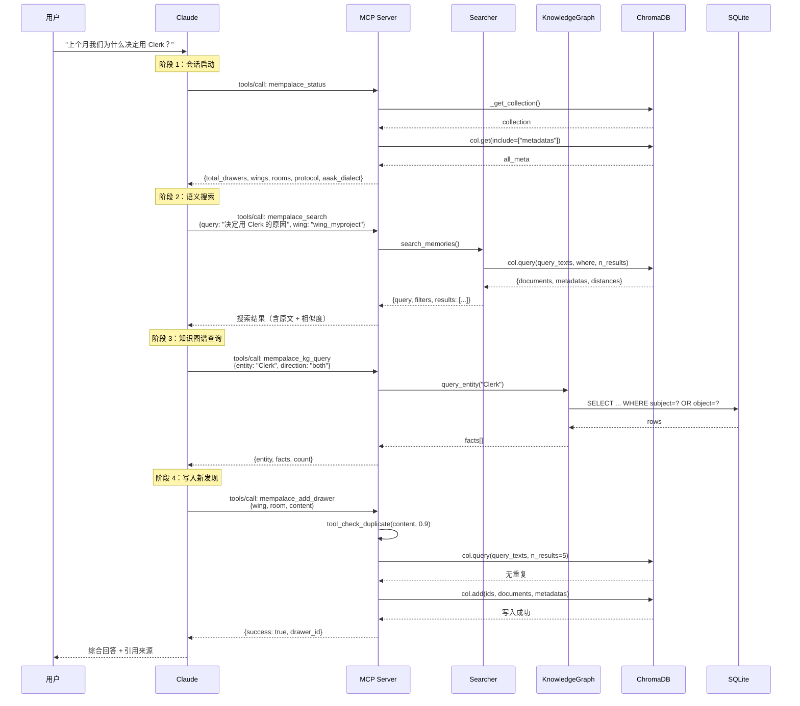

# 附录 B：E2E Trace — MCP 工具调用的完整生命周期

> 本附录追踪一次真实的 AI 与 MemPalace 交互，从用户提问到最终回答，逐帧展示 MCP 协议下的数据流动。
> 涉及章节：第 19 章（MCP 服务器）、第 11 章（知识图谱）、第 9 章（AAAK）。

## 场景

用户打开 Claude Code，输入一个看似简单的问题：

> "上个月我们为什么决定用 Clerk？"

这个问题暗含三层需求：时间过滤（"上个月"）、决策追溯（"为什么"）、实体识别（"Clerk"）。Claude 不能凭空猜测——它需要去宫殿里查。接下来的几百毫秒内，MCP 协议将驱动四个阶段的工具调用，每一次调用都有精确的输入输出边界。

## 序列图：完整生命周期



## 阶段 1：会话启动（mempalace_status）

每次 Claude 与 MemPalace 交互，第一个调用永远是 `mempalace_status`。这不是可选操作——`PALACE_PROTOCOL` 的第一条规则就写着：

> "ON WAKE-UP: Call mempalace_status to load palace overview + AAAK spec."

（`mcp_server.py:94`）

### 请求

MCP 客户端发送一个 JSON-RPC 请求：

```json
{
  "jsonrpc": "2.0",
  "id": 1,
  "method": "tools/call",
  "params": {
    "name": "mempalace_status",
    "arguments": {}
  }
}
```

这个请求被 `handle_request()` 路由到 `tools/call` 分支（`mcp_server.py:719`），再通过 `TOOLS` 字典分派到 `tool_status()` 函数（`mcp_server.py:63`）。

### 执行路径

`tool_status()` 首先调用 `_get_collection()`（`mcp_server.py:41-49`）获取 ChromaDB 集合。如果集合不存在——比如用户从未运行过 `mempalace init`——函数返回 `_no_palace()`（`mcp_server.py:52-57`），给出明确的修复指引：

```python
def _no_palace():
    return {
        "error": "No palace found",
        "palace_path": _config.palace_path,
        "hint": "Run: mempalace init <dir> && mempalace mine <dir>",
    }
```

宫殿存在时，`tool_status()` 遍历所有元数据，统计 wing 和 room 分布（`mcp_server.py:70-78`），然后返回一个包含六个字段的字典。

### 三重载荷

`tool_status()` 的返回值不只是统计数据。它携带了三重载荷（`mcp_server.py:79-86`）：

```python
return {
    "total_drawers": count,          # 载荷 1：宫殿概览
    "wings": wings,
    "rooms": rooms,
    "palace_path": _config.palace_path,
    "protocol": PALACE_PROTOCOL,     # 载荷 2：行为协议
    "aaak_dialect": AAAK_SPEC,       # 载荷 3：AAAK 规范
}
```

**载荷 1：宫殿概览。** `total_drawers`、`wings`、`rooms` 告诉 AI 这个宫殿有多大、有哪些领域。AI 据此决定后续搜索应该限定在哪个 wing。

**载荷 2：行为协议。** `PALACE_PROTOCOL`（`mcp_server.py:93-100`）是五条行为规则，其中最关键的是第二条和第三条：

> "BEFORE RESPONDING about any person, project, or past event: call mempalace_kg_query or mempalace_search FIRST. Never guess — verify."
>
> "IF UNSURE about a fact: say 'let me check' and query the palace. Wrong is worse than slow."

这两条规则将 AI 从"生成模式"切换到"查证模式"。没有这个协议，AI 会直接编造答案。

**载荷 3：AAAK 规范。** `AAAK_SPEC`（`mcp_server.py:102-119`）教会 AI 如何读写 AAAK 压缩格式——实体代码（`ALC=Alice`）、情感标记（`*warm*=joy`）、结构分隔符（管道符分隔字段）。这意味着后续搜索返回的 AAAK 文本，AI 能直接理解。

这三重载荷的设计意图是：一次调用，AI 就获得了操作宫殿所需的全部上下文。不需要读配置文件，不需要额外的初始化步骤。

## 阶段 2：搜索（mempalace_search）

收到 status 后，Claude 解析了用户的问题，构造搜索请求。它知道"Clerk"大概率与项目决策相关，于是将搜索限定在 `wing_myproject`。

### 请求

```json
{
  "jsonrpc": "2.0",
  "id": 2,
  "method": "tools/call",
  "params": {
    "name": "mempalace_search",
    "arguments": {
      "query": "决定用 Clerk 的原因",
      "wing": "wing_myproject",
      "limit": 5
    }
  }
}
```

### 执行路径

`tool_search()`（`mcp_server.py:173-180`）是一个薄代理——它把参数直接透传给 `search_memories()`：

```python
def tool_search(query: str, limit: int = 5, wing: str = None, room: str = None):
    return search_memories(
        query,
        palace_path=_config.palace_path,
        wing=wing,
        room=room,
        n_results=limit,
    )
```

真正的搜索逻辑在 `searcher.py:87-142` 的 `search_memories()` 函数中。这个函数做三件事：

**第一步：构建 where 过滤器**（`searcher.py:100-107`）。当同时指定 wing 和 room 时，使用 ChromaDB 的 `$and` 复合条件；只指定一个时，直接传单条件。这个分支逻辑看似简单，但它决定了搜索是在整个宫殿中进行，还是限定在某个特定区域：

```python
where = {}
if wing and room:
    where = {"$and": [{"wing": wing}, {"room": room}]}
elif wing:
    where = {"wing": wing}
elif room:
    where = {"room": room}
```

**第二步：执行语义查询**（`searcher.py:109-118`）。调用 `col.query()` 时传入 `query_texts`（向量化后的查询）、`n_results`（返回数量）、`include`（需要返回的字段），以及可选的 `where` 过滤器。ChromaDB 在内部将查询文本嵌入为向量，与所有 drawer 的向量做余弦距离计算，返回最近的 N 个结果。

**第三步：组装返回值**（`searcher.py:126-142`）。每条搜索结果包含五个字段：`text`（原文）、`wing`、`room`、`source_file`（来源文件名）、`similarity`（相似度得分，由 `1 - distance` 计算而来）。

```python
hits.append({
    "text": doc,
    "wing": meta.get("wing", "unknown"),
    "room": meta.get("room", "unknown"),
    "source_file": Path(meta.get("source_file", "?")).name,
    "similarity": round(1 - dist, 3),
})
```

### 返回结果示例

```json
{
  "query": "决定用 Clerk 的原因",
  "filters": {"wing": "wing_myproject", "room": null},
  "results": [
    {
      "text": "AUTH.DECISION:2026-03|chose.Clerk→Auth0.rejected|*pragmatic*...",
      "wing": "wing_myproject",
      "room": "decisions",
      "source_file": "meeting-2026-03-12.md",
      "similarity": 0.847
    }
  ]
}
```

注意返回的 `text` 是 AAAK 格式。因为阶段 1 已经把 AAAK 规范加载到了 Claude 的上下文中，Claude 能直接展开 `AUTH.DECISION:2026-03|chose.Clerk→Auth0.rejected` 为自然语言。

## 阶段 3：知识图谱查询（mempalace_kg_query）

搜索返回了"选择 Clerk"的原始记录，但 Claude 想知道更多：Clerk 与项目其他组件的关系是什么？它是否替代了之前的方案？这类关系查询正是知识图谱的用武之地。

### 请求

```json
{
  "jsonrpc": "2.0",
  "id": 3,
  "method": "tools/call",
  "params": {
    "name": "mempalace_kg_query",
    "arguments": {
      "entity": "Clerk",
      "direction": "both"
    }
  }
}
```

### 执行路径

`tool_kg_query()`（`mcp_server.py:309-312`）将请求转发给 `KnowledgeGraph.query_entity()`：

```python
def tool_kg_query(entity: str, as_of: str = None, direction: str = "both"):
    results = _kg.query_entity(entity, as_of=as_of, direction=direction)
    return {"entity": entity, "as_of": as_of, "facts": results, "count": len(results)}
```

`query_entity()`（`knowledge_graph.py:186-241`）是知识图谱的核心查询方法。它接受三个参数：`name`（实体名）、`as_of`（时间点过滤）、`direction`（查询方向）。

**实体 ID 规范化。** 首先通过 `_entity_id()`（`knowledge_graph.py:92-93`）将实体名转为小写下划线格式：`"Clerk"` 变成 `"clerk"`。这保证了大小写不敏感的匹配。

**双向查询。** 当 `direction="both"` 时，函数执行两条 SQL 查询。第一条查 outgoing 关系（`knowledge_graph.py:198-217`）——"Clerk 指向什么"：

```sql
SELECT t.*, e.name as obj_name
FROM triples t JOIN entities e ON t.object = e.id
WHERE t.subject = ?
```

第二条查 incoming 关系（`knowledge_graph.py:219-238`）——"什么指向 Clerk"：

```sql
SELECT t.*, e.name as sub_name
FROM triples t JOIN entities e ON t.subject = e.id
WHERE t.object = ?
```

**时间过滤。** 如果传入了 `as_of` 参数，两条查询都会追加时间窗口条件（`knowledge_graph.py:201-203`）：

```sql
AND (t.valid_from IS NULL OR t.valid_from <= ?)
AND (t.valid_to IS NULL OR t.valid_to >= ?)
```

这意味着只返回在 `as_of` 那个时间点仍然有效的事实。已经被 `invalidate()` 标记过期的事实（`valid_to` 不为 NULL）会被自动排除。

### 返回结果结构

每条 fact 包含完整的时间戳和有效性标记：

```json
{
  "entity": "Clerk",
  "as_of": null,
  "facts": [
    {
      "direction": "outgoing",
      "subject": "Clerk",
      "predicate": "replaces",
      "object": "Auth0",
      "valid_from": "2026-03-12",
      "valid_to": null,
      "confidence": 1.0,
      "source_closet": "drawer_wing_myproject_decisions_a3f2...",
      "current": true
    },
    {
      "direction": "incoming",
      "subject": "MyProject",
      "predicate": "uses",
      "object": "Clerk",
      "valid_from": "2026-03-12",
      "valid_to": null,
      "confidence": 1.0,
      "source_closet": null,
      "current": true
    }
  ],
  "count": 2
}
```

`current: true` 表示这个事实至今有效（`valid_to` 为 NULL）。`source_closet` 如果存在，指向知识图谱事实的原始出处——ChromaDB 中某个 drawer 的 ID，形成知识图谱到向量存储的反向链接。

## 阶段 4：记忆写入（mempalace_add_drawer）

Claude 综合了搜索结果和知识图谱查询，给用户做了回答。对话中可能产生了新的信息——比如用户补充说"对，当时 Auth0 的定价涨了 40%，这也是一个原因"。Claude 决定把这条新发现存入宫殿。

### 请求

```json
{
  "jsonrpc": "2.0",
  "id": 4,
  "method": "tools/call",
  "params": {
    "name": "mempalace_add_drawer",
    "arguments": {
      "wing": "wing_myproject",
      "room": "decisions",
      "content": "AUTH.COST:2026-03|Auth0.price↑40%→triggered.Clerk.eval|★★★",
      "added_by": "mcp"
    }
  }
}
```

### 执行路径

`tool_add_drawer()`（`mcp_server.py:250-287`）的第一件事不是写入，而是查重。

**幂等性保护。** 函数在第 259 行调用 `tool_check_duplicate(content, threshold=0.9)`。`tool_check_duplicate()`（`mcp_server.py:183-215`）对传入内容执行语义搜索，返回相似度大于等于 0.9 的已有 drawer。如果找到重复，写入直接中止：

```python
dup = tool_check_duplicate(content, threshold=0.9)
if dup.get("is_duplicate"):
    return {
        "success": False,
        "reason": "duplicate",
        "matches": dup["matches"],
    }
```

这个设计解决了一个实际问题：AI 在多轮对话中可能反复尝试写入相同内容，或者两个 agent 在同一个会话中独立发现了同一个事实。0.9 的阈值允许措辞上的微小差异，但阻止语义重复。

**ID 生成。** 通过内容前 100 字符加当前时间戳的 MD5 哈希生成唯一 ID（`mcp_server.py:267`）：

```python
drawer_id = f"drawer_{wing}_{room}_{hashlib.md5(
    (content[:100] + datetime.now().isoformat()).encode()
).hexdigest()[:16]}"
```

ID 格式 `drawer_{wing}_{room}_{hash}` 是自描述的——仅凭 ID 就能知道这个 drawer 属于哪个 wing 和 room。

**写入 ChromaDB。** 最终调用 `col.add()`（`mcp_server.py:270-284`），写入 document（原文）和 metadata（wing、room、source_file、chunk_index、added_by、filed_at）。ChromaDB 在写入时自动计算文档的嵌入向量，后续搜索就能匹配到这条新记录。

### 元数据设计

写入的元数据（`mcp_server.py:276-283`）值得注意：

```python
{
    "wing": wing,
    "room": room,
    "source_file": source_file or "",
    "chunk_index": 0,
    "added_by": added_by,        # "mcp" 表示 AI 写入
    "filed_at": datetime.now().isoformat(),
}
```

`added_by` 字段区分了记忆的来源：`"mcp"` 表示 AI 通过 MCP 写入，`"mine"` 表示由 `mempalace mine` 命令从文件中提取。`filed_at` 是写入时间而非事件发生时间——事件时间编码在 AAAK 内容本身中（如 `AUTH.COST:2026-03`）。

## 这个追踪揭示了什么

### Status 的三重载荷是刻意设计

将行为协议和 AAAK 规范嵌入 `tool_status()` 的返回值，而非作为独立工具，是一个架构决策。它利用了 AI 的一个行为特性：AI 会阅读工具返回的全部内容。通过把规则"捎带"在状态查询中，确保了 AI 在做任何操作之前就已经知道应该遵循什么协议。如果将协议和规范拆成独立工具，AI 可能会忘记调用它们。

但这也意味着一个前提条件：宫殿必须已经初始化。当 `_get_collection()` 返回 `None` 时，`tool_status()` 返回的是 `_no_palace()`（`mcp_server.py:64-65`），不包含 `protocol` 和 `aaak_dialect` 字段。换句话说，没有宫殿的 AI 不会获得行为协议——这既是防御（避免协议作用在空宫殿上），也是提示（AI 看到 `hint` 字段后会引导用户初始化）。

### 搜索的元数据过滤是分层架构

`searcher.py` 中的 `where` 过滤器构建逻辑（`searcher.py:100-107`）实现了三级搜索粒度：全宫殿搜索（不传 wing/room）、wing 级搜索（只传 wing）、room 级搜索（同时传 wing 和 room）。这对应了记忆宫殿的空间隐喻——你可以在整个宫殿中找东西，也可以只在某个翼楼的某个房间里找。

语义搜索发生在 ChromaDB 的向量空间中，元数据过滤发生在 SQLite 索引中。两者的结合意味着即使用户的查询在语义上匹配了多个 wing 的内容，wing 过滤器也能确保只返回相关领域的结果。

### 写入的幂等性是对 AI 行为的补偿

AI 的一个已知问题是重复操作——在多轮对话中，它可能忘记自己已经写过某条记忆，于是再次写入。`tool_add_drawer()` 中的 `tool_check_duplicate()` 调用（`mcp_server.py:259`）正是对这个问题的工程补偿。0.9 的相似度阈值是一个经验值：足够高以允许措辞变体（"Auth0 涨价了" vs "Auth0 的价格上升了"），又足够严以捕获实质重复。

注意查重和写入使用的是同一个 ChromaDB 集合，查重本身就是一次向量搜索。这意味着查重的成本与一次普通搜索相当——在典型的个人知识库规模（数千到数万条记录）下，这个开销可以忽略。

### MCP 协议层的透明性

整个交互链路中，`handle_request()`（`mcp_server.py:691-743`）扮演的角色极其简单：解析 JSON-RPC、路由到对应的 handler、把返回值包装为 JSON-RPC 响应。它不做任何业务逻辑。所有工具的 handler 都是普通的 Python 函数，接受基本类型参数，返回字典。这意味着这些函数可以被直接调用（比如在测试中），不依赖 MCP 协议层。

MCP 协议层的透明性也体现在错误处理上：如果 handler 抛出异常，`handle_request()` 捕获它并返回 JSON-RPC 错误对象（`mcp_server.py:735-737`），包含错误码 `-32000` 和异常消息。AI 收到这个错误后，可以决定是重试、换一种查询方式，还是直接告诉用户出了问题。

---

这四个阶段——启动、搜索、图谱查询、写入——构成了 MemPalace MCP 交互的基本循环。每次对话可能不会走完所有阶段（有时搜索就够了，不需要图谱查询或写入），但阶段 1 的 status 调用是不可跳过的起点。它加载的三重载荷，决定了 AI 在这次会话中的一切行为边界。
