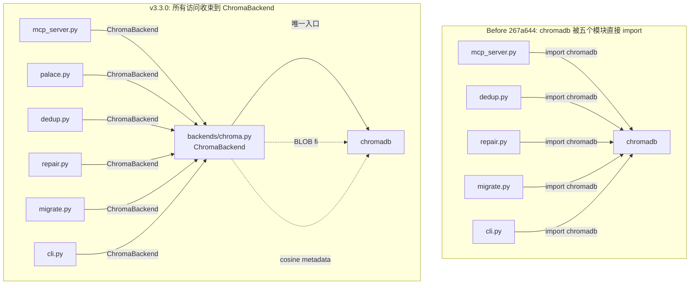

# 附录 E：存储后端抽象层

> **定位**：本附录剖析 v3.3.0 引入的 `backends/` 目录——一个把"所有 ChromaDB 访问"收束到单一接缝（seam）的薄抽象层。它不是"已完成的可插拔存储"，而是"**为未来可插拔存储而准备的最小必要重构**"。理解这一层，有助于判断：MemPalace 离摆脱 ChromaDB 有多远，以及 v3.0.0 的"所有模块都直接 `import chromadb`"这个历史包袱是如何被拆解的。

---

## 为什么这层抽象在 v3.3.0 才出现

v3.3.0 之前的 MemPalace 有一个在任何长期演化的代码库里都会遇到的问题：**数据存储的依赖被所有消费模块直接引用**。第 14 章和附录 D 已经提过，但没有展开到模块级。

在 `267a644` 这次 refactor 之前，调用图大致是这样：

- `mcp_server.py` `import chromadb` 建 `PersistentClient`
- `dedup.py` 自己 `import chromadb`
- `repair.py` 自己 `import chromadb`
- `migrate.py` 自己 `import chromadb`
- `cli.py` 至少两处独立 `import chromadb`

五个模块，每个都以略微不同的方式设置客户端：有的传 `settings`，有的不传；有的处理 chromadb 0.6→1.5 的 BLOB seq_id 迁移 bug，有的不处理；有的显式设置 `hnsw:space=cosine`，有的不设。这直接导致了附录 D 提到的一个现象——"不同代码路径下，同一个 palace 的底层行为可能不一致"。

v3.2 的 issue #807 就是这种不一致的典型产物：某些 collection 创建点有 `{"hnsw:space": "cosine"}`，某些没有——在 ChromaDB 默认落到 L2 距离的情况下，第 15 章依赖的"0.9 余弦相似度阈值去重"在不同代码路径下跑的根本不是同一种距离。

v3.3.0 的提交 `267a644`（"refactor: route all chromadb access through ChromaBackend"）把这个问题从根上切了：**所有 ChromaDB 访问必须经过 `ChromaBackend`**。上面列出的五个模块，没有一个还直接 `import chromadb`——它们全部改为 `from .backends.chroma import ChromaBackend`。与此同时，v3.2 引入的 `palace.py` 从一开始就经由 `ChromaBackend` 访问，共同构成了 v3.3.0 当前"所有访问收束到单一接缝"的结构。这是最低调但影响面最大的结构性变更。

---

## BaseCollection：契约的最小化

`backends/base.py` 只有 49 行，定义了整个存储抽象的接口——`BaseCollection`（`backends/base.py:7-49`）：

```python
class BaseCollection(ABC):
    """Smallest collection contract the rest of MemPalace relies on."""

    @abstractmethod
    def add(self, *, documents, ids, metadatas=None): ...

    @abstractmethod
    def upsert(self, *, documents, ids, metadatas=None): ...

    @abstractmethod
    def update(self, **kwargs): ...

    @abstractmethod
    def query(self, **kwargs): ...

    @abstractmethod
    def get(self, **kwargs): ...

    @abstractmethod
    def delete(self, **kwargs): ...

    @abstractmethod
    def count(self): ...
```

七个方法。这个列表有两个不寻常之处：

**第一，没有 `embed` 或 `create_index` 方法**。嵌入是 ChromaDB 在内部做的——你 `add` 一段文本，它自动用配置的 embedding function 转成向量。`BaseCollection` 没有把这件事暴露出来，意味着"换后端"的隐式假设是：**新后端也得自己处理嵌入**，或者 MemPalace 得在调用点外面再加一层 `embedder` 抽象。后者目前还没做。

**第二，`query` / `get` / `update` / `delete` 都是 `**kwargs`**。表面看起来很松——但反过来说，这个契约**承认**了：它不是一个干净的数据库抽象，而是**对 ChromaDB API 形状的一次剥离**。`query` 期望的关键字参数（`query_texts`、`n_results`、`where`、`include`）全是 ChromaDB 的原生命名。

这个选择的含义非常具体：**`BaseCollection` 的目的不是兼容多种向量数据库，而是给 ChromaDB 的调用语义加上一个可替换的接缝**。真要接入 Qdrant 或 LanceDB，还需要在每个具体后端里把 `**kwargs` 翻译到该后端的原生 API。

这是一种常见但被低估的抽象姿态——**不过早泛化**。v3.3.0 选择了"先把 ChromaDB 的调用面统一"，而不是"一步到位抽象出通用向量存储"。后者更诱人，但也更容易在还不知道 Qdrant/LanceDB 实际长什么样时就把契约定错。

---

## ChromaCollection：薄适配器

`backends/chroma.py:46-71` 里的 `ChromaCollection` 是 `BaseCollection` 的唯一实现。它非常薄——26 行代码，做的事情只有一件：**把方法调用透传给底下的 chromadb collection 对象**。

```python
class ChromaCollection(BaseCollection):
    """Thin adapter over a ChromaDB collection."""

    def __init__(self, collection):
        self._collection = collection

    def add(self, *, documents, ids, metadatas=None):
        self._collection.add(documents=documents, ids=ids, metadatas=metadatas)

    def query(self, **kwargs):
        return self._collection.query(**kwargs)

    # ... upsert / update / get / delete / count 都是同样的透传
```

这种"薄到几乎不存在"的适配器有一个明确的工程目的：**让重构在语义上是零成本的**。

如果 `ChromaCollection` 在 `add` 里做了参数归一化、在 `query` 里做了结果重塑、在 `delete` 里做了额外审计——那从 v3.0.0 的直接 `collection.add(...)` 切换到 v3.3.0 的 `ChromaCollection.add(...)` 就不是"等价替换"，而是"行为变更"。这会让 `267a644` 这次大范围 refactor 需要配套的行为回归测试。

而"纯透传"让 `267a644` 变成了一次**零行为变更的 rewiring**。所有调用点的语义不变，只是路径换了。这让 refactor 的安全性接近于"搬代码"，不需要重新跑 benchmark 去证明行为一致。

**代价是什么？** `ChromaCollection` 现在几乎没有"抽象价值"——它只是 `chromadb.Collection` 多了一层间接。如果未来要加通用逻辑（跨后端的审计日志、跨后端的写入限流、跨后端的 metrics），就需要把它从"透传"升级成"装饰"。v3.3.0 没有走到这一步——这是**有意为之的延迟决策**。

---

## ChromaBackend：palace 级的生命周期管理

`ChromaBackend` 类（`backends/chroma.py:74-152`）比 `ChromaCollection` 重得多，做了四类事情：

**1. 客户端缓存。** 每个 `palace_path` 缓存一个 `chromadb.PersistentClient`。多次调用 `get_collection` 不会重复打开同一个 palace 目录，避免 ChromaDB 在并发或重复打开下产生的 HNSW 索引状态漂移。

```python
def _client(self, palace_path: str):
    if palace_path not in self._clients:
        _fix_blob_seq_ids(palace_path)
        self._clients[palace_path] = chromadb.PersistentClient(path=palace_path)
    return self._clients[palace_path]
```

注意 `_fix_blob_seq_ids(palace_path)` 在 `PersistentClient` 创建**之前**被调用。这是下一类事情。

**2. ChromaDB 0.6→1.5 迁移的 BLOB 修复。** v3.2 的 PR `#664` 引入的 `_fix_blob_seq_ids`（`backends/chroma.py:14-43`）现在被收束到这一层——在任何客户端打开之前，直接操作 `chroma.sqlite3` 把 `embeddings` 和 `max_seq_id` 表里 `typeof(seq_id) = 'blob'` 的行转成整数。

```python
updates = [(int.from_bytes(blob, byteorder="big"), rowid) for rowid, blob in rows]
conn.executemany(f"UPDATE {table} SET seq_id = ? WHERE rowid = ?", updates)
```

这段代码的存在感很重要，因为它体现了**为什么这层抽象必须存在**。v3.0.0 时，这个修复散落在各个 `import chromadb` 的模块里——意味着有些调用路径会触发修复，有些不会。v3.3.0 把这个修复钉死在**客户端创建这个唯一入口上**，只要过 `ChromaBackend`，就一定先修 BLOB。

**3. Cosine 距离度量的强制落地。** `get_collection(create=True)`（`backends/chroma.py:115-133`）里硬编码了 `metadata={"hnsw:space": "cosine"}`。`create_collection`（`backends/chroma.py:145-152`）暴露了 `hnsw_space` 参数但默认仍是 `cosine`。这正是 issue #807 的修复落地点——不再依赖调用方记得传元数据。

**4. Palace 目录权限。** `os.makedirs(palace_path, exist_ok=True)` 之后 `os.chmod(palace_path, 0o700)`——只有 owner 可读写执行。这是一个小小的隐私堡垒，与本书第 24 章"本地优先不是妥协"的论述一致：palace 的内容不仅物理上不出机器，在文件系统权限层面也不向同机其他用户敞开。

---

## 调用图的变化

下面这张 Mermaid 图展示的是 `267a644` 之前和之后的调用图对比。



左边：五个模块各自直接调用 `chromadb`，BLOB 修复和 cosine 元数据设置分散在不同代码路径。右边：六个模块（含 v3.2 新增的 `palace.py`）全部经由 `ChromaBackend`，客户端缓存、迁移修复、距离度量在单点保证。

具体的引用变动可以从 grep 结果看到（`mempalace/*.py`）：

- `mcp_server.py:35`：`from .backends.chroma import ChromaBackend, ChromaCollection`
- `mcp_server.py:180`：`_client_cache = ChromaBackend.make_client(_config.palace_path)`（长驻 MCP 进程的专属路径，见下文）
- `palace.py:11`：`from .backends.chroma import ChromaBackend`
- `palace.py:39`：`_DEFAULT_BACKEND = ChromaBackend()`——模块级单例
- `dedup.py:133`, `dedup.py:165`：`col = ChromaBackend().get_collection(...)`
- `cli.py:196`, `cli.py:321`：`backend = ChromaBackend()`
- `migrate.py:155`：`target_version = ChromaBackend.backend_version()`
- `migrate.py:211`：`fresh_backend = ChromaBackend()`
- `repair.py:93`, `repair.py:176`, `repair.py:223`：三处独立引用

值得注意的是 `palace.py:39` 的 `_DEFAULT_BACKEND = ChromaBackend()`——这是一个**模块级单例**。而 `dedup.py` / `repair.py` / `cli.py` 里是**每次调用创建新实例**。这两种模式的共存说明 v3.3.0 还没有完全统一 backend 的生命周期策略。对长驻进程（MCP server、`palace` 模块的直接消费者）来说，单例是合理的——客户端缓存会跨请求复用。对一次性脚本（`cli.py` 的子命令、`dedup.py` 的运维调用）来说，新实例就够用——反正进程马上退出。

---

## mcp_server.py 的特殊路径：`make_client`

`ChromaBackend` 还暴露了一个静态方法 `make_client`（`backends/chroma.py:96-104`）：

```python
@staticmethod
def make_client(palace_path: str):
    """Create and return a fresh PersistentClient (fix BLOB seq_ids first).

    Intended for long-lived callers (e.g. mcp_server) that keep their own
    inode/mtime-based client cache.
    """
    _fix_blob_seq_ids(palace_path)
    return chromadb.PersistentClient(path=palace_path)
```

注释说得很直接："给那些自己管理客户端缓存的长期运行调用者使用。"这对应的是 `mcp_server.py:180` 的用法——MCP server 自己维护一个基于 inode + mtime 的客户端缓存（PR `#757` 的 bug fix：检测 mtime 变化，防止 HNSW 索引跟外部 CLI 修改脱节）。

这类特殊路径的存在说明：**`ChromaBackend` 不是一个密不透风的 façade**。它允许调用方在有合理理由时"穿透"到底层 `chromadb.PersistentClient`。对那些愿意接受耦合成本换取精细控制的场景（MCP server 的 stale index 检测）开了一个口子。

这种妥协是务实的。一个密不透风的抽象能给出形式上的优雅，但会把 `#757` 那种低层级的问题挤到"更糟糕的地方去解决"——比如在 `ChromaBackend` 里加一整套通用的 inode/mtime 感知缓存接口，而那个接口在其他五个调用点都用不上。**暴露 `make_client` 作为一个被承认的逃生口，比设计一个臃肿的通用接口更诚实。**

---

## 还未走到的一步：真正的 pluggable backend

`backends/__init__.py` 只导出了 `BaseCollection` / `ChromaBackend` / `ChromaCollection`。没有 `register_backend`、没有 `load_backend_from_config`、没有 `BackendRegistry`。**v3.3.0 的抽象是"有一个接缝"，不是"有一个可插拔注册机制"**。

要真的换后端需要的其他东西：

1. **`BaseBackend` 抽象**（目前只有 `BaseCollection`）。`ChromaBackend` 的方法没有 `abstractmethod` 签名——它直接就是 chromadb 的工厂。要换后端需要先把 `get_collection / get_or_create_collection / delete_collection / create_collection / backend_version` 这五个方法提炼到一个 `BaseBackend` ABC 里。
2. **嵌入模型的抽象**。目前嵌入被 ChromaDB 自己处理。换一个不自带嵌入的后端（Qdrant、LanceDB、自建 SQLite + sqlite-vec），就必须把 embedder 独立出来。第 21 章讨论的"本地模型"目前是与 ChromaDB 绑定的。
3. **元数据 / where 子句的翻译层**。各家向量数据库的过滤语法不同：ChromaDB 是 Python dict（`{"wing": "wing_user"}`），Qdrant 是 `Filter` 对象，LanceDB 是 SQL-like 字符串。`BaseCollection.query(**kwargs)` 的 `where` 现在假设 ChromaDB 的 dict 格式——换后端就得在 adapter 里翻译。
4. **HNSW 参数的语义对齐**。`hnsw:space=cosine` 是 ChromaDB 的专有元数据键。其他后端有类似概念但键名不同。
5. **配置层**。`config.py` 里没有 `backend` 字段。换后端需要读取什么、写入什么、用什么默认值——目前硬编码到代码里。

这张未竟清单不是在说 v3.3.0 的工作不够。恰恰相反——**它清楚地告诉你剩余的距离有多远**。从"所有模块直接 `import chromadb`"走到"有一个接缝"的价值，不在于"现在就能换后端"，而在于：

- 下次再引入一个 ChromaDB 的配置调整（比如 `#807` 那种类型的修复），只需要改一个文件
- 未来真要换后端时，有了一个明确的起点而不是散乱的六个调用点
- Part 10 的 mempal（Rust 重铸版）用 SQLite + sqlite-vec 而非 ChromaDB——这个方向上 MemPalace 有了一个松耦合点，即便不完整

换句话说：**v3.3.0 的 `backends/` 不是一个"已完成的可插拔存储"，而是"一次必要的去耦合首付"。** 它把五个模块散布的隐式依赖（共十几处 `import chromadb`）收束到 1 模块的显式接缝。这是在大多数长期维护的软件里都会经历的阶段，只是 MemPalace 走到这一步花了三个小版本的时间。

---

## 对本书其他章节的影响

这一层抽象的存在修正了几个章节里需要轻微调整的表述：

- **第 14 章（L0-L3 分层）**：L3 的存储层在 v3.3.0 多了一个单点入口，对跨进程一致性（MCP server 的 stale index 问题）的处理有了统一着落。
- **第 15 章（混合检索）**：issue #807 的 cosine 距离修复现在是 `ChromaBackend.get_collection` 里硬编码的一行，而不是六个调用点各自记得传——详见该章版本演化说明。
- **第 19 章（MCP 服务器）**：`mcp_server.py:180` 的客户端缓存现在通过 `ChromaBackend.make_client` 走"被认可的逃生口"，而不是自己 `import chromadb`。
- **第 22-23 章（Benchmark / 竞品对比）**：任何跨 ChromaDB 版本的行为对比，BLOB 修复和 cosine 落地都是 v3.3.0 下的默认前提——v3.0.0 的历史数据需要标注"在 L2 + 可能未修复 BLOB 的环境下测得"。
- **Part 10（mempal）**：第 27 章的"SQLite + sqlite-vec 取代 ChromaDB"在 v3.3.0 的背景下有了新的对比点——MemPalace 自己也开始把 ChromaDB 的依赖向一个可替换位置收束，只是走的比 mempal 慢。这**减弱了**"Python 版已经停滞不前"这种读者侧的叙事印象——事实上 v3.3.0 证明了 Python 版还在做结构性重构。第 26 章本身没有断言"无法修补"，只是主张"修补不会长成 coding agent 需要的形态"——这个主张不受影响。

---

## 小结

`backends/` 是 v3.3.0 里代码量最小但**结构影响最大**的变更：三个文件、约 200 行代码、零新功能。它的价值不在于提供了什么新能力，而在于把多个版本积累下来的"所有模块直接耦合 ChromaDB"这个技术债，从"散布在五个模块的隐式依赖"变成"一个文件里的显式接缝"。

这个抽象本身还不完整——没有 `BaseBackend` ABC、没有 embedder 抽象、没有 where 子句翻译层、没有配置层支持。但对一个 3 岁的 Python 项目来说，走到这一步已经是一个明显的拐点：**下一次 ChromaDB 的修复只需要改一个文件，下一次考虑换存储后端时有了明确的起点**。

这就是这一层抽象的全部意义。它没有试图一步到位，也没有试图为未来的所有场景提前设计。它只做一件事：把已经发生的耦合收束到一个可管理的位置，然后把"下一步"留给下一步。

对于任何一个在类似规模 Python 项目里维护代码的人来说，`backends/base.py` 49 行的克制和 `backends/chroma.py` 152 行的薄透传，都是值得研究的一次**对抽象节制的示范**。
