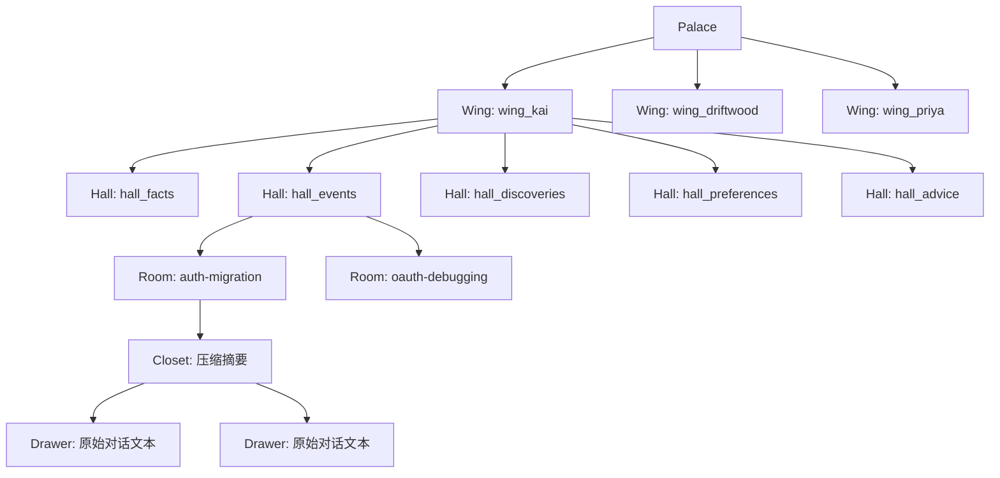
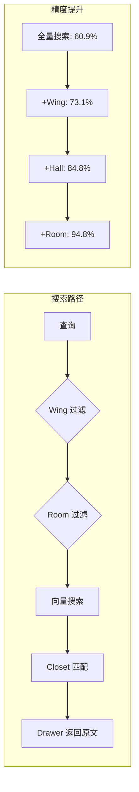

# 第5章：Wing / Hall / Room / Closet / Drawer

> **定位**：MemPalace 五层结构的设计动机、实现细节与工程权衡——从源码中理解每一层为什么存在、为什么是这个形状。

---

## 五层，不多不少

上一章建立了核心论点：空间结构作为检索先验能够显著提升信息检索精度。但"空间结构"是一个抽象概念——它可以是两层的（分区/文档），可以是十层的（层层嵌套的分类体系），也可以是完全扁平的（一个大型向量空间加元数据标签）。MemPalace 选择了五层。这个选择不是任意的。

五层结构是：**Wing（翼）** -> **Hall（厅）** -> **Room（房间）** -> **Closet（壁橱）** -> **Drawer（抽屉）**。每一层对应一个不同粒度的语义分区，每一层解决一个不同的检索失败模式。

在进入逐层分析之前，先看整体架构：



这幅图展示的是从 Palace 到 Drawer 的**概念路径**。一个查询"Kai 上周在 auth 迁移上做了什么"，在认知模型上会沿着这条路径导航：首先进入 `wing_kai`（限定人物），然后进入 `hall_events`（限定记忆类型为事件），然后到达 `auth-migration`（限定具体概念），最后从壁橱中找到指向原始文本的抽屉。需要补一句实现口径上的区分：当前 MCP/CLI 搜索显式暴露的是 `wing` 和 `room` 过滤；Hall 和 Closet 在 v3.0.0 中更多是解释设计的中间层，而不是独立的查询参数。

每一步都在做同一件事：**缩小搜索空间，同时保持语义连贯性。**

---

## 第一层：Wing——语义边界

### Wing 是什么

Wing 是最粗粒度的组织单元。每个人物、项目或主题领域拥有自己的 Wing。在 MemPalace 的 AAAK 规范中，预定义的 Wing 包括：

```
wing_user, wing_agent, wing_team, wing_code,
wing_myproject, wing_hardware, wing_ue5, wing_ai_research
```

（`mcp_server.py:112`）

但 Wing 并不限于这些预定义名称。`config.py` 中的配置系统允许用户定义任意 Wing：

```python
DEFAULT_TOPIC_WINGS = [
    "emotions", "consciousness", "memory",
    "technical", "identity", "family", "creative",
]
```

（`config.py:14-22`）

在搜索层面，Wing 是一个 ChromaDB 的 `where` 过滤条件。当你指定 `wing="wing_kai"` 进行搜索时，`searcher.py` 构建如下过滤器：

```python
where = {"wing": wing}
```

（`searcher.py:33`）

这意味着向量检索只在属于 `wing_kai` 的文档中进行——其他 Wing 的文档完全不参与距离计算。

### 为什么这样设计

Wing 的设计动机是解决**跨领域语义干扰**问题。

考虑一个具体场景。你在一个项目（Driftwood）中讨论了"auth 迁移到 Clerk"的决策，同时在另一个项目（Orion）中也讨论了 auth 相关的话题。如果没有 Wing 分隔，搜索"我们为什么选择 Clerk"可能会同时返回两个项目的结果——因为在向量空间中，两段关于 auth 的讨论确实在语义上相近。但你的意图明确指向 Driftwood。

Wing 通过硬过滤（不是软加权）消除了这种干扰。这是一个有代价的设计选择——如果用户确实想跨项目搜索 auth 相关的所有内容，他们需要省略 Wing 过滤。但 MemPalace 的基准测试表明，在绝大多数真实查询中，用户确实只关心一个特定领域内的信息。

### 权衡

Wing 使用硬过滤而非软加权，这意味着：

**优势**：搜索空间的缩减是确定性的。如果 Palace 有 8 个 Wing，指定 Wing 后搜索空间大约缩减到 1/8。在 22,000 条记忆的规模下，这意味着从 22,000 缩小到约 2,750——向量检索的精度在较小的候选集上显著提升。

**代价**：如果 Wing 分配错误，目标文档会被完全排除。这不是"排名下降"的问题——是"完全看不到"的问题。这就是为什么 Wing 的分配必须是高置信度的决策，通常基于明确的元数据（文件来自哪个项目目录、对话中提到了哪个人名），而不是模糊的语义推断。

---

## 第二层：Hall——认知分类

### Hall 是什么

Hall 是 Wing 内部的第二级分区，按照**记忆的认知类型**进行分类。MemPalace 定义了五种固定的 Hall：

```
hall_facts       — 已确定的事实和决策
hall_events      — 事件、会议、里程碑
hall_discoveries — 突破、新发现、洞见
hall_preferences — 偏好、习惯、观点
hall_advice      — 建议、推荐、解决方案
```

（`mcp_server.py:111`）

这五种 Hall 在每一个 Wing 中都存在。它们是"走廊"——连接同一个 Wing 内的不同 Room，同时按认知类型给记忆打上标签。

在宫殿图（palace graph）中，Hall 作为边的属性出现。`palace_graph.py` 在构建图时将每个 Room 关联到它所属的 Hall：

```python
room_data[room]["halls"].add(hall)
```

（`palace_graph.py:60`）

在图的边中，Hall 描述了连接两个 Wing 的隧道所经过的"走廊"类型：

```python
edges.append({
    "room": room,
    "wing_a": wa,
    "wing_b": wb,
    "hall": hall,
    "count": data["count"],
})
```

（`palace_graph.py:75-84`）

### 为什么固定五种

五种 Hall 的选择不是随意的——它反映了一个关于人类认知分类的假设：**人们倾向于用相对固定的几种方式对记忆进行分类。**

你记住的每一件事，大致可以归入以下类别之一：它是一个事实（"我们用 PostgreSQL"）、一个事件（"昨天的部署出了问题"）、一个发现（"原来连接池设置太小了"）、一个偏好（"我更喜欢用 Terraform 而不是 Pulumi"）、还是一个建议（"下次遇到这种情况应该先检查日志"）。

这个分类体系的关键特征是**互斥且穷举**。同一条记忆通常只属于一种类型——"我们决定用 Clerk"是一个事实，不是一个事件；"Kai 推荐了 Clerk"是一条建议，不是一个偏好。少数边界情况可能模糊（一个发现可能同时也是一个事实），但绝大多数记忆的分类是清晰的。

为什么不是三种？因为三种（比如事实/事件/观点）太粗糙——"Kai 推荐了 Clerk"和"我更喜欢 Clerk"在三分类下都是"观点"，但它们的查询意图完全不同。一个是关于"谁说了什么"（回溯建议来源），另一个是关于"我的立场是什么"（确认偏好）。

为什么不是十种？因为分类越细，分类决策的准确率就越低。五种是一个在区分度和分类准确度之间的平衡点。每种 Hall 有足够明确的语义边界，使得自动分类（无论是基于关键词还是基于 LLM）能达到较高的准确率。

### 权衡

Hall 的固定性既是它的优势也是它的局限。

**优势**：因为 Hall 的类型是预定义的，所有 Wing 的内部结构是一致的。这使得跨 Wing 的比较变得可能——你可以对比 `wing_kai/hall_advice` 和 `wing_priya/hall_advice`，看不同人对同一话题给出了什么建议。如果每个 Wing 的内部分类方案不同，这种比较将无法实现。

**局限**：五种 Hall 可能无法覆盖所有类型的记忆。例如，"情感记忆"（"当时我对这个决定感到非常焦虑"）和"元认知记忆"（"这次调试让我意识到我对连接池的理解有误"）可能不完全适合任何一种现有 Hall。`config.py` 中的 `DEFAULT_HALL_KEYWORDS` 实际上定义了一组不同于五种 Hall 的分类维度（emotions, consciousness, memory 等），这暗示了系统在演化过程中曾经考虑过不同的分类方案。

---

## 第三层：Room——命名概念节点

### Room 是什么

Room 是宫殿中最重要的语义单元。每个 Room 代表一个**命名的概念**——一个足够具体、足够独立、值得拥有自己空间的想法。

Room 使用 slug 格式命名：连字符分隔的小写英文字符串。例如：

```
auth-migration
chromadb-setup
gpu-pricing
riley-college-apps
```

（`mcp_server.py:113`）

在搜索层面，Room 是与 Wing 平行的另一个过滤维度。当同时指定 Wing 和 Room 时，`searcher.py` 构建一个组合过滤器：

```python
if wing and room:
    where = {"$and": [{"wing": wing}, {"room": room}]}
```

（`searcher.py:30-31`）

在宫殿图中，Room 是图的节点。`palace_graph.py` 的 `build_graph()` 函数遍历 ChromaDB 中的所有元数据，为每个 Room 构建一个节点记录：

```python
room_data = defaultdict(lambda: {
    "wings": set(), "halls": set(),
    "count": 0, "dates": set()
})
```

（`palace_graph.py:47`）

每个 Room 节点记录了它出现在哪些 Wing 中、属于哪些 Hall、包含多少条记忆、以及最近的日期。当一个 Room 出现在多个 Wing 中时，它就形成了一个 Tunnel——这是下一章的主题。

### 为什么用 slug

更准确地说，MemPalace **鼓励** Room 使用 slug 风格命名，而不是在运行时严格强制某一种唯一格式。AAAK 规范里给出的例子是连字符风格（`auth-migration`、`gpu-pricing`），但当前代码对 `room` 元数据本身没有额外校验，交互式新增 room 时甚至会把空格转成下划线。也正因为如此，这里的讨论应理解为"推荐的工程命名风格"，而不是"代码已经强制执行的规范"。

Room 名称使用 slug 风格（`auth-migration` 而非 "Auth Migration" 或带空格的自由文本）有三个工程原因：

**第一，slug 是无歧义的标识符。** 它不包含空格、大写字母、特殊字符或日期后缀。这意味着同一个概念在不同 Wing 中的 Room 名称是完全相同的字符串——`auth-migration` 就是 `auth-migration`，不会因为一个 Wing 写成 "Auth Migration" 而另一个写成 "auth_migration" 而导致隧道检测失败。

**第二，slug 是人类可读的。** 不同于哈希值或数字 ID，slug 携带语义信息。当你看到 `gpu-pricing` 这个 Room 名称时，你立即知道它是关于 GPU 定价的。这对于调试、日志分析和用户界面展示都至关重要。

**第三，slug 是可组合的。** 在 ChromaDB 的元数据系统中，slug 可以直接用作 `where` 过滤条件的值，不需要任何编码或转义。在文件系统中，slug 可以直接作为目录名使用。在 URL 中，slug 可以直接出现在路径中。这种通用性减少了在不同系统之间传递 Room 标识时的摩擦。

### Room 的涌现性

一个关键的设计决策是：Room 不是预先定义的，而是从数据中涌现的。没有一个"Room 列表"规定你只能有哪些 Room。当 MemPalace 挖掘你的对话时，它根据对话内容创建 Room——如果你讨论了 GraphQL 迁移，就会出现一个 `graphql-switch` Room；如果你讨论了 Riley 的大学申请，就会出现一个 `riley-college-apps` Room。

这与 Hall 的设计形成了鲜明对比：Hall 是预定义的、固定的、全局一致的；Room 是动态的、数据驱动的、每个 Wing 可以不同的。这个对比反映了一个深层的设计直觉：**记忆的类型是有限的，但记忆的内容是无限的。** Hall 编码类型（你在记住什么样的东西），Room 编码内容（你在记住什么东西）。类型可以预定义，内容必须从数据中生长。

---

## 第四层：Closet——压缩的入口

### Closet 是什么

在五层模型中，Closet 是一个中间层，位于 Room 和 Drawer 之间。**作为概念层**，它包含原始内容的压缩索引——足够让 AI 判断"这个抽屉里是否有我需要的信息"，但不包含原始文本的全部细节。

在当前的实现中，Closet 还没有变成一个显式的数据结构。它的功能主要通过 ChromaDB 的嵌入向量和元数据系统**隐式**实现。每条记忆的嵌入向量就是它的"壁橱门上的标签"——搜索引擎通过比对嵌入向量来决定是否"打开这个壁橱"查看里面的抽屉。`searcher.py` 的 `search_memories()` 函数返回的结果中包含原始文本（Drawer 内容）和少量元数据（当前可见的 Closet 线索）：

```python
hits.append({
    "text": doc,           # Drawer: 原始文本
    "wing": meta.get("wing", "unknown"),
    "room": meta.get("room", "unknown"),
    "source_file": ...,    # Closet: 来源信息
    "similarity": ...,     # Closet: 匹配度
})
```

（`searcher.py:128-134`）

README 中提到了 AAAK 压缩将在未来版本中被引入 Closet 层："In our next update, we'll add AAAK directly to the closets, which will be a real game changer --- the amount of info in the closets will be much bigger, but it will take up far less space and far less reading time for your agent."

### 为什么需要中间层

Closet 的存在解决了一个信息检索中的经典问题：**你需要在"读所有内容"和"只看标题"之间找到一个平衡点。**

如果 AI 需要读取 Room 中每一个 Drawer 的完整内容才能判断相关性，那么当一个 Room 包含数百条记忆时，token 消耗会变得不可接受。但如果 AI 只看 Room 名称就做出判断，精度又不够——`auth-migration` 这个 Room 可能包含关于迁移原因、迁移过程、迁移中遇到的 bug 和迁移后的回顾等完全不同的内容。

Closet 提供了一个中间精度的视图：它告诉 AI "这个壁橱里大概有什么"，让 AI 决定是否要打开抽屉查看原文。在当前 v3.0.0 中，这个视图主要由 embedding + metadata 近似承担；README 所描述的"把 AAAK 直接放进 Closet"则属于下一阶段，让这个中间层从隐式索引进一步升级为显式的压缩表达。

---

## 第五层：Drawer——原始真相

### Drawer 是什么

Drawer 是 MemPalace 中存储原始内容的最底层单元。每个 Drawer 包含一段原文——对话的一个片段、文档的一个章节、代码的一个注释。MemPalace 的核心承诺是：**Drawer 中的内容永远是原始的、逐字的、未经任何摘要或修改的。**

在 MCP 服务器中，添加一个 Drawer 的工具函数明确要求内容是"verbatim"的：

```python
"content": {
    "type": "string",
    "description": "Verbatim content to store "
                   "--- exact words, never summarized",
},
```

（`mcp_server.py:626-629`）

当添加一个新 Drawer 时，系统会先进行重复检查——如果内容与已有 Drawer 的相似度超过 90%，添加会被拒绝：

```python
dup = tool_check_duplicate(content, threshold=0.9)
if dup.get("is_duplicate"):
    return {
        "success": False,
        "reason": "duplicate",
        "matches": dup["matches"],
    }
```

（`mcp_server.py:259-265`）

每个 Drawer 的 ID 包含 Wing、Room 和内容哈希，确保唯一性：

```python
drawer_id = f"drawer_{wing}_{room}_{hashlib.md5(
    (content[:100] + datetime.now().isoformat()
).encode()).hexdigest()[:16]}"
```

（`mcp_server.py:267`）

### 为什么必须是原始的

这是 MemPalace 最核心的设计决策之一，也是它与绝大多数竞争系统的根本分歧点。

主流 AI 记忆系统的典型做法是：在存储阶段就让 LLM 提取"重要信息"。Mem0 使用 LLM 提取事实；Mastra 使用 GPT 观察对话并生成结构化记录。这些系统在存储阶段就做了一个不可逆的决策——什么是"重要的"。

问题在于，"重要性"是上下文相关的。在存储时看起来不重要的细节（"Kai 提到他之前在一家用 Auth0 的公司工作过"），在未来的某个查询中可能变得至关重要（"谁有 Auth0 的实际使用经验？"）。一旦存储阶段丢弃了这个细节，它就永远无法被检索到。

MemPalace 的立场是：**存储一切，让检索阶段决定什么是重要的。** Drawer 中保存原始文本，Closet 提供快速导航，Wing/Hall/Room 提供结构化过滤——但信息本身永远不被修改或丢弃。

---

## MCP API 中的五层结构

在 MCP 服务器中，五层结构通过一组工具暴露给 AI 智能体：

```
mempalace_list_wings     — 列出所有 Wing（第一层）
mempalace_list_rooms     — 列出 Wing 内的 Room（第三层）
mempalace_get_taxonomy   — 完整的 Wing -> Room -> 计数树
mempalace_search         — 搜索，可选 Wing/Room 过滤
mempalace_add_drawer     — 添加原始内容到指定 Wing/Room
```

（`mcp_server.py:441-637`）

`tool_get_taxonomy()` 函数构建了完整的层级视图：

```python
for m in all_meta:
    w = m.get("wing", "unknown")
    r = m.get("room", "unknown")
    if w not in taxonomy:
        taxonomy[w] = {}
    taxonomy[w][r] = taxonomy[w].get(r, 0) + 1
```

（`mcp_server.py:163-168`）

返回的 taxonomy 对象是一个嵌套字典：`{wing: {room: count}}`。这让 AI 智能体可以在一次调用中了解整个宫殿的结构，然后决定在哪个 Wing 和 Room 中搜索。

注意一个微妙的设计决策：MCP API 直接暴露了 Wing 和 Room，但没有单独暴露 Hall。Hall 作为元数据存在于 Drawer 中，但不是一个独立的过滤维度。这反映了一个务实的判断：在当前的使用模式中，Wing + Room 的组合已经提供了足够的搜索精度（+34%），Hall 的额外过滤收益相对较小，但会增加 API 的复杂性和分类错误的风险。

---

## 设计的完整图景



五层结构的检索效果是累积的——每增加一层结构约束，R@10 从 60.9% 逐步提升到 94.8%，总计 +34 个百分点（详见第 7 章的完整基准测试分析）。这不是因为每一层都做了"更精细的过滤"——而是因为每一层都消除了一类特定的干扰源。Wing 消除跨领域干扰，Hall 消除跨类型干扰，Room 消除跨概念干扰。

这三种干扰在向量空间中的表现是不同的。跨领域干扰是最强的（两个不同项目的 auth 讨论在语义上高度相似），跨类型干扰是中等的（同一项目中关于 auth 的事实和关于 auth 的建议语义相关但不相同），跨概念干扰是最弱的（同一项目中 auth 和 billing 的讨论语义相关度较低）。这就解释了为什么每一层带来的提升是递减的：12% -> 12% -> 10%。越容易区分的干扰源，越不需要结构约束来消除。

---

## 回到古希腊

五层结构的设计可以被理解为西蒙尼德斯位置法的一个高保真翻译。

在位置法中，你首先选择一栋建筑（Wing），然后进入一层楼或一个功能区域（Hall），然后到达一个具体的房间（Room），然后注意到房间中的一个特定物品（Closet），最后从物品中取出你需要的信息（Drawer）。

MemPalace 没有试图"改进"位置法——它试图尽可能忠实地将位置法的结构翻译成可计算的形式。Wing 不是"数据库分区"——它是"建筑的一翼"。Room 不是"文件夹"——它是"你在脑海中行走时会经过的一个特定位置"。这些命名不是装饰性的隐喻——它们约束着设计决策。

当一个工程师听到"数据库分区"时，他会追求均匀的数据分布。当他听到"建筑的一翼"时，他会接受不同的翼有不同的大小——因为在真实建筑中，厨房和卧室不需要一样大。这种微妙的认知框架差异会影响数十个后续的设计选择，最终导向一个与纯工程驱动的设计显著不同的系统。

下一章将讨论五层结构中最独特的涌现性特征——隧道（Tunnel）：当同一个 Room 出现在多个 Wing 中时，自动形成的跨领域连接。
