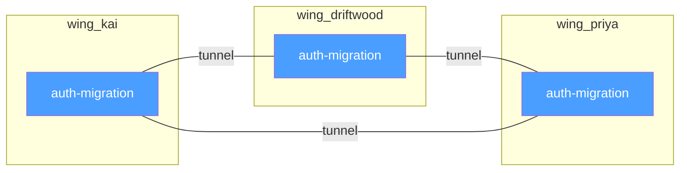

# 第6章：隧道——跨领域发现

> **定位**：Tunnel 机制的设计与实现——一个零成本的图构建策略如何从 ChromaDB 的元数据中自动涌现出跨领域的知识连接。

---

## 同一个房间，不同的翼

上一章描述了 Wing、Hall、Room 如何逐层缩小搜索空间。但这些层级结构有一个固有的副作用：它们倾向于创建孤岛。如果所有搜索都限定在单一 Wing 内，你就永远无法发现"Kai 在 auth 迁移上的经验"和"Driftwood 项目的 auth 迁移决策"之间的联系——因为它们分属不同的 Wing。

MemPalace 用一个极其简洁的机制解决了这个问题：**隧道（Tunnel）。**

隧道的定义只有一句话：**当同一个 Room 出现在两个或更多 Wing 中时，这些 Wing 之间就自动形成了一条隧道。** 不需要任何人工链接，不需要任何额外的索引构建，不需要任何 LLM 推理。同名即连接。



在这个例子中，`auth-migration` 这个 Room 出现在三个 Wing 中——`wing_kai`（Kai 的个人经验和工作记录）、`wing_driftwood`（项目级别的决策和进展）和 `wing_priya`（Priya 作为技术负责人的审批和建议）。三个 Wing 通过这个共享的 Room 自动形成了三条隧道。

README 中的例子清晰地展示了这种连接的语义含义：

```
wing_kai       / hall_events / auth-migration
    -> "Kai debugged the OAuth token refresh"
wing_driftwood / hall_facts  / auth-migration
    -> "team decided to migrate auth to Clerk"
wing_priya     / hall_advice / auth-migration
    -> "Priya approved Clerk over Auth0"
```

同一个话题（auth 迁移），三个视角（执行者、项目、决策者），三种记忆类型（事件、事实、建议）。隧道把这些视角连接起来，让你可以从任何一个起点出发，发现其他相关的记忆。

但这里也要补一句实现口径上的区分：这组例子来自 README 的 hall-rich 宫殿叙事。当前公开源码里，`projects` / `convos` 两条主摄入链路稳定写入的是 `wing`、`room`、`source_file` 一类元数据；`hall` 只有在 diary 等少数写入路径、或者 benchmark/README 里的实验性结构中才会稳定出现。也就是说，Tunnel 在当前产品里的最小成立条件是"同名 room 跨 wing 复现"，而不是"每条 drawer 都已经带着完整 hall 坐标"。

---

## 图从元数据构建

隧道的实现依赖于 `palace_graph.py` 中的 `build_graph()` 函数。这个函数是整个隧道机制的核心，它的设计体现了一个关键的工程洞见：**不需要额外的图数据库。**

`build_graph()` 的工作方式是遍历 ChromaDB 中所有文档的元数据，从中提取 Room、Wing，并在元数据存在时顺带收集 Hall 信息，然后在内存中构建一个图。代码如下：

```python
room_data = defaultdict(lambda: {
    "wings": set(), "halls": set(),
    "count": 0, "dates": set()
})
```

（`palace_graph.py:47`）

对每一条记忆记录，函数提取其元数据并更新对应 Room 的节点信息：

```python
for meta in batch["metadatas"]:
    room = meta.get("room", "")
    wing = meta.get("wing", "")
    hall = meta.get("hall", "")
    if room and room != "general" and wing:
        room_data[room]["wings"].add(wing)
        if hall:
            room_data[room]["halls"].add(hall)
        room_data[room]["count"] += 1
```

（`palace_graph.py:52-63`）

注意 `room_data[room]["wings"]` 是一个 `set`。当同一个 Room 从不同的 Wing 被添加时，这个集合自然地积累了该 Room 跨越的所有 Wing。隧道的检测就是检查这个集合的大小是否大于 1：

```python
for room, data in room_data.items():
    wings = sorted(data["wings"])
    if len(wings) >= 2:
        for i, wa in enumerate(wings):
            for wb in wings[i + 1:]:
                for hall in data["halls"]:
                    edges.append({
                        "room": room,
                        "wing_a": wa, "wing_b": wb,
                        "hall": hall,
                        "count": data["count"],
                    })
```

（`palace_graph.py:70-84`）

这段代码的逻辑值得仔细分析。对于每一个跨越两个以上 Wing 的 Room，函数会先在 `nodes` 里记录它跨越了哪些 wing；如果该 Room 同时带有 `hall` 元数据，再进一步为每个 hall 生成 Wing 两两组合的边。如果一个 Room 出现在 3 个 Wing 中，就可能生成 3 条边（A-B, A-C, B-C）；但这个"可能"依赖于 `data["halls"]` 非空。当前默认写入链路往往只有 `wing`/`room`，没有 `hall`，因此跨 wing 关系在 `nodes` 和 `find_tunnels()` 中仍然成立，但 `edges` 与 `halls` 列表可能为空。

**零额外存储成本。** 这是设计中最值得注意的一点。图不存储在 ChromaDB 中，也不存储在任何外部数据库中。它在每次需要时从 ChromaDB 的元数据动态构建。对当前产品运行时来说，真正稳定存在的是 `wing` 和 `room`；`hall` 更像可选增强字段，而不是所有写入路径都保证携带的坐标。隧道仍然可以从这些已有元数据中**涌现**出来，不需要额外的数据写入；只是当 `hall` 缺席时，图会退化成"按 room 跨 wing 连接"的更简版本。

这种设计的权衡是显而易见的：每次查询都需要重新构建图。在 22,000 条记忆的规模下，`build_graph()` 需要分批读取所有元数据（每批 1000 条），这意味着至少 22 次 ChromaDB 调用。对于实时交互场景，这可能引入可感知的延迟。但 MemPalace 的选择是接受这个延迟，换取零额外存储和零数据一致性维护成本。

---

## BFS 遍历：从一个房间出发

知道了图的存在还不够——你需要能在图上行走。`palace_graph.py` 中的 `traverse()` 函数实现了广度优先搜索（BFS）遍历，让你可以从一个起始 Room 出发，发现所有可达的相关 Room。

```python
def traverse(start_room, col=None, config=None,
             max_hops=2):
```

（`palace_graph.py:99`）

遍历的逻辑是标准的 BFS，但连接关系的定义是独特的：两个 Room 之间有连接，当且仅当它们共享至少一个 Wing。

```python
frontier = [(start_room, 0)]
while frontier:
    current_room, depth = frontier.pop(0)
    if depth >= max_hops:
        continue
    current_wings = set(current.get("wings", []))
    for room, data in nodes.items():
        if room in visited:
            continue
        shared_wings = current_wings & set(data["wings"])
        if shared_wings:
            visited.add(room)
            results.append({
                "room": room,
                "hop": depth + 1,
                "connected_via": sorted(shared_wings),
            })
```

（`palace_graph.py:128-154`）

`max_hops` 参数（默认为 2）控制遍历的深度。设定为 2 意味着你可以发现"与起始 Room 直接共享 Wing 的 Room"（1 跳），以及"与那些 Room 又共享了另一个 Wing 的 Room"（2 跳）。两跳之内通常已经能覆盖所有在语义上有意义的连接；更远的连接往往太间接，失去了信息价值。

遍历结果按 `(hop_distance, -count)` 排序：

```python
results.sort(key=lambda x: (x["hop"], -x["count"]))
return results[:50]
```

（`palace_graph.py:157-158`）

优先展示跳数最少的连接，在同等跳数下优先展示出现次数最多的 Room。出现次数高的 Room 通常是更重要的概念节点——它们积累了更多的记忆条目，意味着这个话题被更频繁地讨论。

---

## 隧道发现

除了从某个起点出发的图遍历，MemPalace 还提供了一个专门的隧道发现工具：`find_tunnels()`。

```python
def find_tunnels(wing_a=None, wing_b=None,
                 col=None, config=None):
```

（`palace_graph.py:161`）

这个函数的目的不是导航——而是发现。它回答的问题是："哪些话题连接了这两个领域？"

```python
for room, data in nodes.items():
    wings = data["wings"]
    if len(wings) < 2:
        continue
    if wing_a and wing_a not in wings:
        continue
    if wing_b and wing_b not in wings:
        continue
    tunnels.append({
        "room": room, "wings": wings,
        "halls": data["halls"],
        "count": data["count"],
    })
tunnels.sort(key=lambda x: -x["count"])
```

（`palace_graph.py:169-189`）

你可以不指定任何 Wing（查看所有隧道），指定一个 Wing（查看与该 Wing 相关的所有隧道），或指定两个 Wing（查看这两个特定领域之间的桥接话题）。

在 MCP 服务器中，这个功能通过 `mempalace_find_tunnels` 工具暴露给 AI 智能体：

```python
"mempalace_find_tunnels": {
    "description": "Find rooms that bridge two wings "
        "--- the hallways connecting different "
        "domains.",
    ...
}
```

（`mcp_server.py:571-581`）

工具描述中将隧道称为"connecting different domains"的"hallways"。这个措辞反映了隧道的本质：它不是一个人工创建的索引或链接，而是当你在不同领域讨论相同话题时**自然涌现**的连接。

---

## 隧道的信息论意义

隧道机制看起来简单到近乎平凡——不就是"同名房间自动关联"吗？但这种简单性掩盖了一个深层的设计洞见。

在知识管理系统中，最有价值的信息通常不在领域内部，而在领域之间的交叉点。一个完全在 `wing_code` 内部的搜索可以告诉你"我们的 auth 模块怎么工作"，但无法告诉你"为什么 auth 模块是这样设计的"——因为设计的原因可能记录在 `wing_team` 的某次会议纪要中，或者在 `wing_priya` 的某条技术建议中。

传统的知识管理系统处理这种跨领域连接的方式有两种：

**手动链接。** 让用户或管理员显式地创建跨领域的关联。这种方式精确但脆弱——它依赖人的记忆和勤勉，而随着数据量增长，维护这些链接的成本会指数级增加。

**全局语义搜索。** 放弃领域分区，在整个数据库中做向量检索。这种方式不需要维护链接，但会回到本书第四章讨论的问题——在大规模向量空间中的高维退化导致检索精度下降。

MemPalace 的隧道机制是第三条路：**让结构自动产生连接。** 你不需要手动标注"Kai 的 auth 经验和 Driftwood 的 auth 决策有关"——当你在两个不同的 Wing 中使用了相同的 Room 名称 `auth-migration`，这个关联就已经存在了。当前实现里，`build_graph()` 做的是对 `room` 元数据的字符串精确匹配；如果团队采用稳定的 slug 风格命名，这种匹配会更可靠，但这不是运行时自动保证的约束。

这种设计的前提是一个合理的假设：**如果两个不同领域的记忆被归入了同一个 Room 名称，那么它们之间确实存在语义关联。** 这个假设在绝大多数情况下成立——你不会偶然地在两个无关的领域使用完全相同的 Room 名称。

---

## 图统计：宫殿的全局视图

`graph_stats()` 函数提供了宫殿图的全局统计信息：

```python
def graph_stats(col=None, config=None):
    nodes, edges = build_graph(col, config)
    tunnel_rooms = sum(
        1 for n in nodes.values()
        if len(n["wings"]) >= 2
    )
    return {
        "total_rooms": len(nodes),
        "tunnel_rooms": tunnel_rooms,
        "total_edges": len(edges),
        "rooms_per_wing": dict(wing_counts...),
        "top_tunnels": [...],
    }
```

（`palace_graph.py:193-213`）

这个统计视图让用户和 AI 智能体可以了解宫殿的整体拓扑：有多少个 Room，其中有多少个形成了隧道，Wing 之间的连接有多密集，最活跃的隧道是哪些。

`top_tunnels` 列表按 Wing 数量降序排列——出现在最多 Wing 中的 Room 排在前面。这些高连接度的 Room 通常代表用户最核心的关切——那些在多个项目、多个人际关系、多个时间段中反复出现的主题。

---

## 设计权衡的诚实清单

隧道机制的优雅不应掩盖它的局限性。以下是需要正视的权衡：

**命名一致性依赖。** 隧道检测完全依赖 Room 名称的精确匹配。如果一个 Wing 中用 `auth-migration`，另一个 Wing 中用 `clerk-migration`，即使它们讨论的是同一件事，也不会形成隧道。这对 Room 命名的一致性提出了很高的要求，但要注意：这是数据侧的命名纪律，不是当前运行时已经强制执行的 slug 规范。命名函数或人工校对必须足够稳定，才能让同一概念在不同上下文中获得相同的 Room 名称。

**图的动态重建成本。** 如前所述，每次图操作都需要重新从 ChromaDB 构建图。在大规模数据（数万条记忆）下，这意味着数十次数据库读取操作。一个可能的改进方向是引入图的缓存层——但这会引入缓存一致性的复杂性。

**稠密隧道的噪声。** 如果一个 Room 出现在所有 Wing 中（比如一个极为通用的概念如 `general-discussion`），它会形成过多的隧道连接，降低隧道的信息价值。`build_graph()` 通过过滤掉 `room == "general"` 来缓解这个问题（`palace_graph.py:57`），但对于其他高频但低信息量的 Room，目前没有系统性的过滤机制。

这些限制都是可解的工程问题，不是根本性的设计缺陷。隧道机制的核心价值——从已有的元数据中零成本地涌现跨领域连接——是完整的，不受这些实现层面的限制所动摇。

---

## 连接的价值

隧道机制在概念上完成了记忆宫殿从"建筑"到"网络"的转变。

在前两章描述的结构中，宫殿是一棵严格的层级树：Palace -> Wing -> Hall -> Room -> Closet -> Drawer。信息的组织是从上到下的，搜索是在树的某个子树中进行的。这种结构高效且清晰，但它是封闭的——每个子树是独立的岛屿。

隧道打破了这种封闭性。它在树的横向方向上添加了边，把一棵树变成了一个图。你不再只能在一个 Wing 内上下移动——你可以通过隧道从一个 Wing 跨越到另一个 Wing，发现在纯层级结构中不可见的连接。

这就是为什么 `palace_graph.py` 的文件头注释中将这个模块描述为"a navigable graph"——不是"a navigable tree"。树是层级的、确定性的、自上而下的；图是网络的、涌现的、可以从任意节点开始探索的。MemPalace 的五层结构提供了树的效率，隧道机制提供了图的发现能力。

下一章将用基准测试数据证明，这种"结构 + 连接"的组合带来的检索提升不是理论推演——它是可量化的、可复现的 34%。
