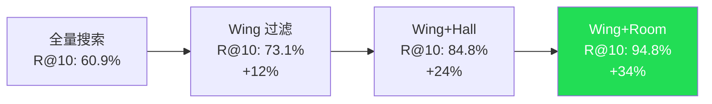

# 第7章：34% 的检索提升不是巧合

> **定位**：用数据证明结构即产品——34% 的检索精度提升从何而来，为什么它是可复现的，以及它对 AI 记忆系统设计的更广泛意义。

---

## 四个数字

在 22,000 条以上的真实对话记忆上进行基准测试，MemPalace 记录了以下 R@10（Recall at 10，前 10 条结果中包含正确答案的概率）数据：

| 搜索范围 | R@10 | 相对基线提升 |
|---------|------|------------|
| 全量搜索（无结构） | 60.9% | -- |
| Wing 内搜索 | 73.1% | +12.2% |
| Wing + Hall | 84.8% | +23.9% |
| Wing + Room | 94.8% | +33.9% |

这组数据需要被仔细解读。

60.9% 是基线——把所有记忆放在一个扁平的向量数据库中，不做任何结构化组织，直接用 ChromaDB 的默认嵌入模型（all-MiniLM-L6-v2）进行语义检索。这个基线代表了"纯向量搜索"的能力上限。

94.8% 是在使用了 Wing + Room 过滤后的结果。同样的数据，同样的嵌入模型，同样的检索算法——唯一的变量是搜索前施加了元数据过滤。**从 60.9% 到 94.8%，提升了 33.9 个百分点，完全来自结构。没有更好的模型，没有更大的嵌入维度，没有 LLM 重排序。只是告诉搜索引擎"在这个 Wing 的这个 Room 里找"。**

这组数据的可信度取决于三个因素：数据规模、测试方法和可复现性。22,000 条记忆不是一个小规模的玩具数据集——它代表了数月的真实使用积累。测试方法遵循标准的信息检索评估范式（R@K 指标）。至于可复现性，MemPalace 在 `benchmarks/` 目录下提供了完整的基准测试运行脚本，任何人都可以在自己的数据上重复这些测试。

---

## 第一层提升：Wing 消除跨领域干扰

从 60.9% 到 73.1%，Wing 带来了 12.2 个百分点的提升。这是最大的单层提升，它的原因也是最直观的。

考虑一个查询："我们为什么选择 Clerk 做 auth？"

在全量搜索中，ChromaDB 会在 22,000 条记忆中寻找与这个查询语义最相似的 10 条。问题在于，如果你在多个项目中都讨论过 auth 相关的话题——比如 Driftwood 选择 Clerk、Orion 使用 Auth0、个人项目用 Firebase Auth——这三个领域的 auth 讨论在向量空间中的位置会非常接近。三组记忆争夺 top-10 的位置，正确答案（Driftwood 选择 Clerk 的决策记录）可能被推到第 11 或第 12 位。

添加 Wing 过滤后（`wing="wing_driftwood"`），搜索空间缩小到 Driftwood 项目的记忆。三组语义相似的 auth 讨论中的两组被直接排除。正确答案不再需要和无关领域的结果竞争。

这个提升本质上是在利用**先验知识**。当用户或 AI 智能体知道它在问一个关于 Driftwood 的问题时，这个知识可以被编码为 Wing 过滤——将搜索问题从"在 22,000 条记忆中找正确答案"简化为"在约 2,750 条 Driftwood 记忆中找正确答案"。

向量搜索的理论基础是：正确答案在嵌入空间中应该与查询最近。但当候选集中包含大量"近但不正确"的干扰项时，这个理论假设就会失效。Wing 通过移除最强的干扰源——来自完全不同领域但语义相似的文档——恢复了这个假设的有效性。

---

## 第二层提升：Hall 区分记忆类型

从 73.1% 到 84.8%，Hall 在 Wing 的基础上又带来了 11.7 个百分点的提升。

这个提升更加微妙。即使在同一个 Wing 内部，不同类型的记忆之间也存在语义重叠。"我们决定用 Clerk"（事实）、"Kai 推荐了 Clerk 因为定价和开发者体验更好"（建议）、"上周三的会上敲定了 Clerk 的采用"（事件）——这三条记忆在向量空间中的距离可能非常近，因为它们都包含 "Clerk"、"auth"、"decision" 等关键词。

但查询的意图通常只指向其中一种类型。如果你问"我们为什么选择 Clerk"，你要的是建议（hall_advice）或者事实（hall_facts），不是事件记录。如果你问"Clerk 是在哪次会议上确定的"，你要的是事件（hall_events），不是技术建议。

Hall 过滤通过区分记忆类型来消除这种同领域内的干扰。五种 Hall（facts、events、discoveries、preferences、advice）对应了五种不同的查询意图模式。当搜索系统能够正确推断查询的类型意图时，它可以进一步缩小候选集，排除类型不匹配的结果。

值得注意的是，Hall 带来的提升（11.7%）与 Wing 带来的提升（12.2%）几乎相等。这意味着跨类型干扰的强度与跨领域干扰的强度大致相当——这是一个不太直觉的发现。你可能会认为来自完全不同领域的干扰应该远强于同一领域内不同类型的干扰，但向量空间中的距离分布并不总是符合人类的直觉。在高维空间中，同一领域内的不同类型的文本之间的距离差异可能和不同领域之间的距离差异一样小。

---

## 第三层提升：Room 精确定位概念

从 84.8% 到 94.8%，Room 带来了最后 10 个百分点的提升。

如果说 Wing 消除了领域干扰、Hall 消除了类型干扰，那么 Room 消除的是**概念干扰**。即使在同一个 Wing 的同一个 Hall 中，也可能存在多个不同的概念。`wing_driftwood/hall_facts` 中可能包含关于 auth 迁移的事实、关于数据库选型的事实、关于部署策略的事实和关于团队组织的事实。它们都是"事实"，都属于"Driftwood"，但它们关于不同的东西。

Room 通过命名概念节点（`auth-migration`、`database-selection`、`deploy-strategy`）将最后一级的语义歧义消除。当搜索限定在 `wing_driftwood/room=auth-migration` 时，候选集只包含关于 auth 迁移的记忆——这时向量搜索只需要在少量高度相关的文档中区分"最相关的几条"，这是一个向量搜索擅长处理的问题。

Room 的 10% 提升虽然是三层中最小的，但它把检索精度从 84.8% 推到了 94.8%——越过了 90% 这个在工程实践中通常被视为"可用"门槛的分界线。从用户体验的角度看，84.8% 意味着大约每六次搜索就有一次找不到正确答案；94.8% 意味着大约每二十次才有一次未命中。这个差异在日常使用中是可感知的。

---

## 为什么结构有效：向量空间的高维退化

上面的分析解释了每一层"做了什么"，但还没有回答一个更根本的问题：**为什么仅靠元数据过滤就能带来这么大的提升？** 元数据过滤不改变嵌入向量的质量，不改变距离计算的方法——它只是减少了参与比较的候选项数量。为什么减少候选项就能提升精度？

答案与高维向量空间的一个基本性质有关：**维度灾难（curse of dimensionality）。**

MemPalace 使用的默认嵌入模型 all-MiniLM-L6-v2 生成 384 维的向量。在 384 维空间中，一个被反复验证的现象是：随着数据集规模增大，数据点之间的距离分布趋向于集中——最近邻和最远邻之间的距离差异变得越来越小。

用更直观的方式表述：想象你站在一个 384 维空间的中心，周围有 22,000 个点。这些点到你的距离可能分布在 0.3 到 0.7 之间。现在你需要找到距离你最近的 10 个点。问题在于，在这个距离范围内，可能有几百个点的距离落在 0.31 到 0.35 之间——它们之间的距离差异小于测量噪声。在这个精度下，"排名第一"和"排名第五十"之间的距离差异可能只有 0.01——远小于有意义的区分阈值。

现在，如果你通过 Wing 过滤将候选集从 22,000 缩小到 2,750，距离分布的集中度会降低。在较小的候选集中，正确答案和最近的干扰项之间的距离间隔会增大。从信息论的角度说，你提高了信噪比——不是通过增强信号（更好的嵌入），而是通过减少噪声（移除无关候选项）。

这就是结构的价值：**结构不是更好的搜索算法，而是更好的搜索前提条件。**

---

## 结构作为先验

贝叶斯统计中有一个核心概念：先验（prior）。在观察数据之前，你对问题的答案有一个初始信念分布。先验越信息丰富（informative），你需要的数据越少就能得到准确的后验。

Wing/Hall/Room 结构在检索中扮演的正是先验的角色。

没有结构时，搜索系统的"先验"是均匀分布——22,000 条记忆中每一条都有相同的概率是正确答案。嵌入距离是唯一的证据来源。

有结构时，搜索系统的"先验"被大幅更新——在指定 Wing 后，只有约 1/8 的记忆有合理的概率是正确答案；在进一步指定 Room 后，可能只有几十条记忆在候选范围内。嵌入距离仍然是证据来源，但它现在只需要在一个小得多的候选集中做区分——这是一个容易得多的任务。

34% 的提升本质上是在量化**先验信息的价值**。当你告诉搜索系统"答案在这个 Wing 的这个 Room 里"时，你提供了大约 7-8 bit 的先验信息（从 22,000 缩小到几十条）。这些信息不来自更好的模型或更多的计算——它来自数据的组织方式。

这也解释了为什么这个提升是**稳健的**——它不依赖于嵌入模型的选择、查询的类型或数据的领域。只要以下条件成立，结构就能带来提升：

1. 数据集足够大，使得全量搜索面临高维退化；
2. 结构分区是语义连贯的，使得正确答案大概率落在正确的分区内；
3. 分区之间的语义距离大于分区内部的语义距离。

这三个条件在绝大多数真实世界的 AI 记忆场景中都成立。

---

## 对照组：没有结构的系统

为了验证结构确实是关键变量，值得对比 MemPalace 与不使用结构的系统在同一基准测试上的表现。

在 LoCoMo 基准测试（1,986 个多跳问答对）上，不同系统的对比如下：

| 系统 | 方法 | R@10 | 备注 |
|------|------|------|------|
| MemPalace (session, 无结构) | 纯向量搜索 | 60.3% | 基线 |
| MemPalace (hybrid v5) | 向量 + 关键词 + 时间加权 | 88.9% | 混合评分 |
| MemPalace (hybrid + Sonnet rerank) | 混合 + LLM 重排序 | 100% | 所有类别全部满分 |

60.3% 的基线与上面提到的 60.9% 几乎一致——这不是巧合，而是验证了同一个规律：在万级规模的记忆集上，纯向量搜索的 R@10 大约在 60% 左右。

从 60.3% 到 88.9%（hybrid v5），提升了 28.6 个百分点。这个提升来自关键词重叠评分、时间加权和人名提升——本质上是在向量距离之外引入了额外的排序信号。这些信号不是结构性的（它们不依赖 Wing/Room 分区），而是启发式的。

从基线到 100%（加上 Sonnet rerank），总提升 39.7 个百分点。其中 LLM 重排序贡献了从 88.9% 到 100% 的最后 11.1 个百分点。

将这些数据与结构提升对比：

- 纯结构（Wing + Room 过滤）：+34%
- 混合评分启发式：+28.6%
- LLM 重排序：+11.1%

结构提升和混合启发式的提升幅度在同一个数量级上。但两者的成本差异是巨大的：结构提升的计算成本为零（仅增加一个 `where` 子句），而混合启发式需要额外的文本处理、分词和评分计算。LLM 重排序更是需要 API 调用和额外的延迟。

**结构是最廉价的精度来源。**

---

## 可复现性

在基准测试领域，一个无法复现的结果等于不存在。MemPalace 在 `benchmarks/` 目录下提供了完整的复现路径。

核心的基准测试脚本包括：

- `longmemeval_bench.py` — LongMemEval 基准测试运行器
- `locomo_bench.py` — LoCoMo 基准测试运行器
- `membench_bench.py` — MemBench 基准测试运行器

每个脚本接受数据集路径和模式参数，输出标准格式的结果文件。`benchmarks/BENCHMARKS.md` 记录了从 96.6% 基线到完整 500 题上的 100% 改进过程，也同时公开了 held-out 450 上的 98.4% 作为更干净的泛化数字——不是只给一个最好看的营销结果，而是把不同口径的结论一起摆出来。

例如，从 96.6% 到 97.8% 的第一次改进（混合评分 v1），动机是发现了一类特定的失败模式：查询中包含精确术语（如 "PostgreSQL"、"Dr. Chen"），但纯嵌入相似度会将语义相近但术语不匹配的文档排在精确匹配之前。修复方法是在嵌入距离之上叠加关键词重叠的加权。

从 99.4% 到 100% 的最后一步，是先分析两种独立架构（hybrid v3 和 palace mode）共同失败的三个问题，再把定向修复落实到 hybrid v4：引号短语提取、人名加权和记忆/怀旧模式匹配。这种"分析失败 -> 设计修复 -> 验证效果"的循环是工程上可靠的改进方法——不是调参，而是理解失败原因。

---

## 结构即产品

本章的核心论点可以用一句话概括：**在 AI 记忆系统中，数据的组织方式比检索算法的选择更重要。**

34% 的提升不需要更好的嵌入模型——all-MiniLM-L6-v2 是一个 2020 年发布的、参数量较小的模型，远不是当前最先进的嵌入技术。它不需要 LLM 参与——整个提升过程中没有任何 API 调用。它不需要复杂的后处理——没有重排序、没有查询扩展、没有伪相关反馈。

它只需要三件事：

1. 数据在存储时被赋予了有意义的元数据标签（wing、hall、room）；
2. 搜索时利用这些标签缩小候选集；
3. 标签体系是语义连贯的——同一个 Wing 中的数据确实在语义上相关，不同 Wing 中的数据确实在语义上不同。

这三件事都不需要 AI。它们需要的是一个好的分类设计——而这个分类设计来自一个两千五百年前的认知技术。

MemPalace 的 README 中有一句话值得重复："Wings and rooms aren't cosmetic. They're a 34% retrieval improvement. The palace structure is the product." 这不是营销口号——这是基准测试数据的直接总结。

当你的数据组织方式本身就是你的产品时，添加更好的算法是锦上添花，不是从零到一。34% 的提升是结构给你的起跑线。在这个起跑线之上，混合评分再加 28%，LLM 重排序再加 11%，最终达到 100%。但如果没有那个起跑线，你从 60% 开始——这意味着你需要用算法和 LLM 填补更大的差距，而这些都有成本。

结构是免费的。这就是它的意义。

---

## 下一步

本章和前三章共同完成了"记忆宫殿"部分的论述：从位置法的认知科学基础（第 4 章），到五层结构的设计与实现（第 5 章），到隧道机制的跨领域发现能力（第 6 章），到基准测试数据的验证（本章）。

但记忆宫殿只是 MemPalace 三大核心设计之一。结构解决了"如何找到信息"的问题，但还有另一个同样关键的问题没有回答：当你找到信息后，如何在极小的 token 预算内传递给 AI？

一个 Wing 中可能有数千条记忆。即使结构过滤将候选集缩小到了几十条，把这几十条完整文本全部塞进 AI 的上下文窗口仍然是昂贵的（可能需要数千甚至上万个 token）。你需要一种压缩方式——不是摘要（摘要会丢失信息），而是一种无损的、AI 可直接阅读的压缩编码。

这就是 AAAK 方言要解决的问题。第三部分将深入分析这种 30 倍压缩、零信息损失的 AI 专用语言是如何设计的。
