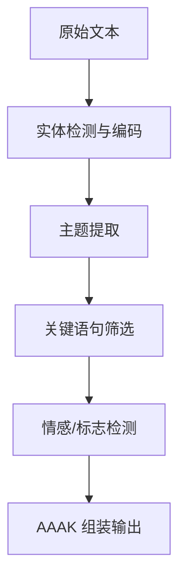

# 第9章：AAAK 的语法设计

> **定位**：上一章通过约束满足分析，推导出可行的压缩方案必须是"极度缩写的自然语言"。本章进入具体的语法层面：AAAK 用了哪些缩写规则、什么分隔符、什么标记系统，以及这些选择如何在 `dialect.py` 中被实现。从这里开始，我们将看到真实的代码和真实的压缩对照。

---

## 从英文到 AAAK：一个完整的对照

在分析语法规则之前，先看一个完整的对照示例。这是 MemPalace README 中给出的核心演示：

**英文原文（约 1000 token）：**

```
Priya manages the Driftwood team: Kai (backend, 3 years),
Soren (frontend), Maya (infrastructure), and Leo (junior,
started last month). They're building a SaaS analytics platform.
Current sprint: auth migration to Clerk. Kai recommended Clerk
over Auth0 based on pricing and DX.
```

**AAAK 压缩（约 120 token）：**

```
TEAM: PRI(lead) | KAI(backend,3yr) SOR(frontend) MAY(infra) LEO(junior,new)
PROJ: DRIFTWOOD(saas.analytics) | SPRINT: auth.migration->clerk
DECISION: KAI.rec:clerk>auth0(pricing+dx) | ****
```

原文约 250 个字符的自然语言段落，被压缩成约 180 个字符的 AAAK 表示。但 token 层面的压缩比更加显著，因为 AAAK 的结构化格式对分词器更友好——英文原文的冠词、介词、连接词各自占据独立 token，而 AAAK 中这些冗余全部被移除。

更关键的是信息的完整性。让我们逐项核对：

| 英文原文中的事实 | AAAK 中的对应表示 |
|---|---|
| Priya 是团队负责人 | `PRI(lead)` |
| Kai 做后端，3 年经验 | `KAI(backend,3yr)` |
| Soren 做前端 | `SOR(frontend)` |
| Maya 做基础设施 | `MAY(infra)` |
| Leo 是初级，刚入职 | `LEO(junior,new)` |
| 团队名叫 Driftwood | `DRIFTWOOD` |
| 在做 SaaS 分析平台 | `saas.analytics` |
| 当前 sprint 是认证迁移 | `SPRINT: auth.migration` |
| 迁移目标是 Clerk | `->clerk` |
| Kai 推荐了 Clerk | `KAI.rec:clerk` |
| Clerk 优于 Auth0 | `clerk>auth0` |
| 原因是价格和开发体验 | `(pricing+dx)` |
| 这是一个重要决策 | `****` |

十三个事实断言，全部保留。零损失。而 token 数从原文的约 70 个降低到压缩后的约 35 个——实际上这个简短示例的压缩比约为 2 倍。但当应用到更长的文本（数千 token 的完整对话记录）时，自然语言中的叙事冗余、过渡句、重复引用被大量消除，30 倍的压缩比便成为可能。

---

## 六种核心语法元素

AAAK 的语法可以分解为六种核心元素。每一种都对应一个具体的压缩策略。

### 元素一：三字母实体编码

这是 AAAK 最基础的语法规则：人名、项目名和其他命名实体被缩写为三个大写字母。

```
Priya → PRI    Kai → KAI    Soren → SOR
Maya → MAY     Leo → LEO    Driftwood → DRI
```

规则很简单：取名字的前三个字符，转为大写。`dialect.py` 中的实现如下：

```python
# dialect.py:378-379
def encode_entity(self, name: str) -> Optional[str]:
    ...
    # Auto-code: first 3 chars uppercase
    return name[:3].upper()
```

这个实现位于 `Dialect.encode_entity` 方法中（`dialect.py:367-379`）。方法首先检查是否有预定义的实体映射（通过构造函数传入的 `entities` 参数），如果没有，则回退到"取前三字符"的自动编码策略。

三个字母的选择不是任意的。两个字母（如 PR、KA）的碰撞概率太高——26^2 = 676 种组合在一个有几十个实体的系统中很容易产生歧义。四个字母（如 PRIY、KAIS）的收益递减——额外的一个字符带来的区分度提升不值得它在每次出现时多占的 token 空间。三个字母（26^3 = 17,576 种组合）在区分度和紧凑性之间取得了最佳平衡。

更重要的是，三字母编码保持了对原始名字的直觉关联。当一个模型看到 `PRI` 时，如果上下文中曾出现过 Priya，它能立即建立联系。这正是第 8 章中讨论的"自解释"要求：编码本身携带足够的语义线索，不需要外部编码表。

### 元素二：管道分隔符

AAAK 使用竖线 `|` 作为字段分隔符，替代自然语言中的逗号、句号和换行。

```
0:PRI+KAI|backend_auth|"switched to Clerk"|determ+convict|DECISION
```

这个结构在 `dialect.py` 的 `compress` 方法中被构建（`dialect.py:539-602`）。方法将检测到的实体、主题、关键引语、情感和标记分别作为字段，用管道符连接：

```python
# dialect.py:600-602
parts = [f"0:{entity_str}", topic_str]
if quote_part:
    parts.append(quote_part)
...
lines.append("|".join(parts))
```

管道符的选择有两个工程理由。第一，它在自然语言中极少出现，因此不会与内容本身产生歧义——不像逗号，既是分隔符又是英语标点。第二，大语言模型在训练数据中见过大量的管道分隔格式（命令行输出、Markdown 表格、日志文件），已经学会了将 `|` 解释为"字段边界"。

### 元素三：箭头因果关系

AAAK 使用 `->` 表示因果、方向或转变关系：

```
auth.migration->clerk          # 迁移方向
fear->trust->peace            # 情感弧线
KAI.rec:clerk>auth0           # 推荐（克拉克优于 Auth0）
```

箭头的语义在不同上下文中略有不同：在动作上下文中表示方向（从 A 到 B），在情感弧线中表示时间推移（先恐惧，后信任，最后平静），在比较中表示偏好。但核心含义始终是"从左到右的流动"——这是一个几乎所有文化和所有语言模型都理解的隐喻。

情感弧线在 `dialect.py` 中通过 `ARC:` 前缀标记（`dialect.py:742`），模型可以从 `ARC:fear->trust->peace` 中直接读出一个人的情感变化轨迹。

### 元素四：星级重要性标记

AAAK 使用一到五颗星来标记信息的重要程度：

```
DECISION: KAI.rec:clerk>auth0(pricing+dx) | ****
```

这个标记系统的精妙之处在于它的认知透明性。任何人（以及任何模型）看到四颗星就知道"这很重要"，不需要解释什么是"importance level 4"。星级在 MCP 服务器的 AAAK 规范中被定义（`mcp_server.py:109`）：

```
IMPORTANCE: * to ***** (1-5 scale).
```

在 `dialect.py` 的 zettel 编码路径中，重要性通过 `emotional_weight` 数值（0.0-1.0）表达（`dialect.py:697`），而在 AAAK 规范层面，星级提供了一种更直觉的替代表示。

### 元素五：情感标记

AAAK 用简短的情感代码标记文本的情感基调。`dialect.py` 中定义了一个完整的情感编码表（`dialect.py:47-88`）：

```python
# dialect.py:47-52 (节选)
EMOTION_CODES = {
    "vulnerability": "vul",
    "joy": "joy",
    "fear": "fear",
    "trust": "trust",
    "grief": "grief",
    "wonder": "wonder",
    ...
}
```

编码规则是取情感词的前三到四个字符作为缩写：vulnerability 变成 `vul`，tenderness 变成 `tender`，exhaustion 变成 `exhaust`。`encode_emotions` 方法（`dialect.py:381-388`）将情感列表转换为 `+` 连接的紧凑字符串，最多保留三个情感标记：

```python
# dialect.py:381-388
def encode_emotions(self, emotions: List[str]) -> str:
    codes = []
    for e in emotions:
        code = EMOTION_CODES.get(e, e[:4])
        if code not in codes:
            codes.append(code)
    return "+".join(codes[:3])
```

情感标记在 AI 记忆系统中可能看起来多余——为什么记忆需要记录情感？但 MemPalace 的设计者显然意识到，人类的决策上下文往往包含情感维度。"我们在极度焦虑中选择了 Clerk"和"我们在充分论证后冷静地选择了 Clerk"传达的不仅是情感差异，更是决策质量的信号。当模型在后续对话中被问到"那个决策靠谱吗"时，情感标记提供了额外的判断依据。

在 MCP 服务器中，AAAK 规范使用了一种更具表现力的情感标记语法（`mcp_server.py:107`）：

```
EMOTIONS: *action markers* before/during text.
*warm*=joy, *fierce*=determined, *raw*=vulnerable, *bloom*=tenderness.
```

这种以星号包裹的动作标记更接近文学写作中的"舞台指示"——它不只是标注"这里有悲伤"，而是标注"这里的语气是脆弱的"。这为 AI 在回忆过去事件时提供了语气线索。

### 元素六：语义标志位

AAAK 定义了一组固定的标志位来标记信息的类型和性质（`dialect.py:29-36`）：

```
ORIGIN   = 起源时刻（某事物的诞生）
CORE     = 核心信念或身份支柱
SENSITIVE = 需要极度小心处理
PIVOT    = 情感转折点
GENESIS  = 直接导致了某个现存事物
DECISION = 显式的决策或选择
TECHNICAL = 技术架构或实现细节
```

`_FLAG_SIGNALS` 字典（`dialect.py:117-152`）定义了从自然语言关键词到标志位的映射规则：

```python
# dialect.py:117-125 (节选)
_FLAG_SIGNALS = {
    "decided": "DECISION",
    "chose": "DECISION",
    "switched": "DECISION",
    "founded": "ORIGIN",
    "created": "ORIGIN",
    "turning point": "PIVOT",
    "core": "CORE",
    ...
}
```

当压缩引擎在文本中检测到 "decided"、"chose"、"switched" 等关键词时，自动添加 `DECISION` 标志。这些标志位的作用类似于数据库中的索引标签——它们不改变内容本身，但极大地加速了后续的检索和过滤。当 AI 被问到"我们做过哪些重要决策"时，只需过滤 `DECISION` 标志即可，不必对全部记忆做语义匹配。

---

## 压缩流水线：从原始文本到 AAAK

理解了六种语法元素之后，来看它们如何在 `Dialect.compress` 方法中被组合。这是 MemPalace 中将任意文本转换为 AAAK 的核心入口（`dialect.py:539-602`）。

压缩流水线分为五个阶段：

**阶段一：实体检测。** `_detect_entities_in_text` 方法（`dialect.py:510-537`）在文本中寻找已知实体（通过预定义映射）或自动检测首字母大写的单词作为潜在实体名。检测到的实体被编码为三字母代码，用 `+` 连接。

**阶段二：主题提取。** `_extract_topics` 方法（`dialect.py:430-455`）从文本中提取关键主题词。它的策略是统计词频，同时加权处理大写词（可能是专有名词）和包含下划线或连字符的词（可能是技术术语）。停用词列表（`dialect.py:155-289`）确保 "the"、"is"、"was" 等无信息量的词不会污染主题提取结果。

**阶段三：关键句抽取。** `_extract_key_sentence` 方法（`dialect.py:457-508`）选出文本中最"重要"的一个句子片段作为引语。评分标准偏好包含决策词（"decided"、"because"、"instead"）的短句——这些句子通常携带最高的信息密度。

**阶段四：情感和标志检测。** `_detect_emotions`（`dialect.py:408-417`）和 `_detect_flags`（`dialect.py:419-428`）分别通过关键词匹配检测情感基调和语义标志。

**阶段五：组装。** 所有检测到的组件被组装成管道分隔的 AAAK 格式行：

```python
# dialect.py:596-602
parts = [f"0:{entity_str}", topic_str]
if quote_part:
    parts.append(quote_part)
if emotion_str:
    parts.append(emotion_str)
if flag_str:
    parts.append(flag_str)
lines.append("|".join(parts))
```

如果有元数据（来源文件、所属翼、房间、日期），则会在内容行之前添加一个头部行（`dialect.py:583-589`）。



整个流水线的设计哲学是：宁可多保留，不可少保留。每个阶段都有上限（情感最多 3 个，标志最多 3 个，主题最多 3 个），但没有下限——如果检测到的信息少于上限，全部保留。

---

## 压缩比的计算

`Dialect` 类提供了一个 `compression_stats` 方法（`dialect.py:936-946`）来量化压缩效果：

```python
# dialect.py:932-934
@staticmethod
def count_tokens(text: str) -> int:
    """Rough token count (1 token ~ 3 chars for structured text)."""
    return len(text) // 3
```

这个 token 计数使用了"每 3 个字符约等于 1 个 token"的近似——这对于结构化文本来说是合理的估计（自然英语约为每 4 个字符 1 个 token，但 AAAK 的大写字母和符号使得分词更密集）。

在实际使用中，压缩比取决于原始文本的性质。纯叙述性的对话记录（充满"well, I think that maybe we should consider..."这样的表达）可以达到 30 倍以上的压缩比。结构化的技术描述（已经比较紧凑）的压缩比通常在 5-10 倍。MemPalace README 中宣称的 30 倍是对典型对话记录的代表性数字。

---

## Zettel 编码：结构化数据的压缩路径

除了纯文本压缩，`dialect.py` 还保留了一条面向结构化 zettel 数据的编码路径。这是 AAAK 的原始设计——针对已经被分解为 zettel（卡片）格式的记忆条目进行编码。

`encode_zettel` 方法（`dialect.py:681-710`）处理单张 zettel 卡片：

```python
# dialect.py:681-685
def encode_zettel(self, zettel: dict) -> str:
    zid = zettel["id"].split("-")[-1]
    entity_codes = [self.encode_entity(p) for p in zettel.get("people", [])]
    entity_codes = [e for e in entity_codes if e is not None]
    ...
```

输出格式遵循 `dialect.py` 头部注释中定义的规范（`dialect.py:15-18`）：

```
Header:   FILE_NUM|PRIMARY_ENTITY|DATE|TITLE
Zettel:   ZID:ENTITIES|topic_keywords|"key_quote"|WEIGHT|EMOTIONS|FLAGS
Tunnel:   T:ZID<->ZID|label
Arc:      ARC:emotion->emotion->emotion
```

`encode_file` 方法（`dialect.py:720-751`）将一个完整的 zettel JSON 文件（包含多张 zettel 和它们之间的 tunnel 连接）编码为一个多行的 AAAK 文本块。头部行包含文件编号、主要实体、日期和标题，随后是每张 zettel 的编码行和 tunnel 连接行。

这两条路径——纯文本压缩和 zettel 编码——服务于不同的使用场景。纯文本压缩（`compress` 方法）用于实时处理新输入的内容，zettel 编码（`encode_zettel` / `encode_file`）用于处理已经过预处理和结构化的历史数据。

---

## AAAK 规范的传递机制

一个语法设计再精妙，如果模型不知道它的规则，也毫无用处。AAAK 解决这个问题的方式出人意料地直接：在 MCP 服务器的状态响应中内嵌完整的规范文本。

`mcp_server.py` 中定义了一个 `AAAK_SPEC` 常量（`mcp_server.py:102-119`）：

```python
# mcp_server.py:102-103
AAAK_SPEC = """AAAK is a compressed memory dialect
that MemPalace uses for efficient storage.
It is designed to be readable by both humans
and LLMs without decoding.
...
"""
```

这个规范被嵌入到 `mempalace_status` 工具的响应中（`mcp_server.py:85-86`）：

```python
# mcp_server.py:84-86
return {
    ...
    "protocol": PALACE_PROTOCOL,
    "aaak_dialect": AAAK_SPEC,
}
```

这意味着：当 AI 第一次调用 `mempalace_status`，并且 palace collection 已经存在时，它在响应中就收到了 AAAK 的完整语法规范。从这一刻起，它就知道如何读写 AAAK 了。源码里的前置条件也要一并看到：如果 palace 尚未初始化，`status` 会先返回 `_no_palace()` 的错误与提示，而不是这段规范文本。

这个设计的精彩之处在于：**规范本身也是自然语言文本**。模型不需要"学习"一种新的编码——它只需要阅读一段关于这种编码的说明，就像人类阅读一份格式说明书一样。AAAK 规范可以用 AAAK 的术语来自我描述，这是一个递归的自洽性。

在实测中，Claude、GPT-4、Gemini 等模型在第一次看到 AAAK 规范后就能正确地读取和生成 AAAK 文本。不需要微调，不需要 few-shot 示例，不需要迭代训练。这验证了第 8 章的核心论点：AAAK 不是一种新语言，而是一种极度缩写的英语，模型已有的语言能力足以"解码"它。

---

## 模型的第一次接触

为了更具体地说明"第一次看到就能读写"这个性质，考虑以下场景：

一个从未见过 AAAK 的模型收到了这段文本：

```
TEAM: PRI(lead) | KAI(backend,3yr) SOR(frontend) MAY(infra) LEO(junior,new)
```

即使没有任何规范说明，模型也能推断出：这描述了一个团队；PRI 是某个人的缩写，可能是 team lead；KAI 做 backend，有 3 年经验；SOR 做 frontend；等等。因为这些缩写和结构利用的是英语的通用模式——括号内是属性，逗号分隔属性，大写缩写是名字。

而当模型同时收到了 AAAK 规范时，理解变得更加确定：它不再需要"猜测" PRI 是人名缩写，因为规范明确说了"ENTITIES: 3-letter uppercase codes"。

这种"即使没规范也能大致理解，有规范后就能精确理解"的性质，正是 AAAK 设计的关键成就。它让压缩格式在两个层面上都"工作"：在语言直觉层面（利用模型的语言理解能力），以及在规范层面（通过显式的格式说明消除歧义）。

---

## 情感信号的自动检测

`dialect.py` 中一个值得注意的设计是情感的自动检测机制。`_EMOTION_SIGNALS` 字典（`dialect.py:91-114`）将日常英语中的情感关键词映射到 AAAK 情感代码：

```python
# dialect.py:91-99 (节选)
_EMOTION_SIGNALS = {
    "decided": "determ",
    "prefer": "convict",
    "worried": "anx",
    "excited": "excite",
    "frustrated": "frust",
    "love": "love",
    "hope": "hope",
    ...
}
```

这意味着当你写 "I'm worried about the deadline"，压缩引擎会自动检测到 "worried" 并标记 `anx`（anxiety）。你不需要手动注释情感——系统从文本本身推断。

类似地，`_FLAG_SIGNALS`（`dialect.py:117-152`）通过关键词检测自动添加语义标志。"decided to use GraphQL" 触发 `DECISION`，"this was a turning point" 触发 `PIVOT`，"I created a new repo" 触发 `ORIGIN`。

这种基于关键词的检测显然不是完美的——它会漏掉委婉表达（"I'm not sure this is the right approach" 不会触发 `doubt`），也可能误判（"I love this bug" 中的 "love" 显然是反讽）。但在 MemPalace 的设计哲学中，粗粒度的自动检测优于无检测。即使只标记了 60% 的情感信号，这 60% 在后续检索中仍然提供了有价值的过滤维度。

---

## 层级一生成：全局压缩

`dialect.py` 中最复杂的方法是 `generate_layer1`（`dialect.py:784-902`），它从全部 zettel 文件中提取最关键的记忆，生成一个压缩的"层级一"唤醒文件。

这个方法的逻辑分三步：

1. **筛选**：遍历所有 zettel，只保留情感权重超过阈值（默认 0.85）或带有 `ORIGIN`、`CORE`、`GENESIS` 标志的条目。
2. **分组**：按日期对筛选后的条目进行分组，生成 `=MOMENTS[date]=` 段落。
3. **编码**：对每个条目应用 AAAK 编码，输出管道分隔的紧凑行。

输出示例：

```
## LAYER 1 -- ESSENTIAL STORY
## Auto-generated from zettel files. Updated 2026-04-07.

=MOMENTS[2025-11]=
PRI+KAI|auth decision|"chose Clerk for DX and pricing"|0.92|DECISION
KAI|backend architecture|"GraphQL over REST"|0.88|DECISION+TECHNICAL

=MOMENTS[2025-12]=
LEO|onboarding|"first PR merged"|0.85|ORIGIN

=TUNNELS=
auth decision connects KAI and PRI
```

这更准确地说是 AAAK 工具链里**可以生成**的一种 Layer 1 产物——把整个团队数月的关键历史浓缩到不到 120 个 token 中。需要和当前默认运行时区分的是：公开仓库里的 `mempalace wake-up` 目前走的仍然是 `layers.py` 的 L0 + L1 文本路径，典型输出约 600-900 token，而不是直接加载这里的 `generate_layer1()` 结果。

---

## 一个语法设计的总结

回顾 AAAK 的六种核心语法元素，一个模式变得清晰：每一种元素都遵循同一个原则——利用模型已有的语言直觉，而不是发明模型需要学习的新规则。

- 三字母编码利用了"大写缩写 = 名字"的直觉
- 管道分隔利用了"竖线 = 字段边界"的直觉
- 箭头利用了"从左到右 = 因果/方向"的直觉
- 星级利用了"更多星 = 更重要"的直觉
- 情感代码利用了"缩写 = 原词"的直觉
- 标志位利用了"大写词 = 标签"的直觉

没有一种元素需要模型"学习"新的语义。它们全部建立在模型训练数据中已经大量出现的模式之上。这不是巧合，而是第 8 章推导出的约束的直接后果：当你不能使用解码器时，你唯一的"解码器"就是模型的既有知识。而利用既有知识的最可靠方式，就是使用它已经理解的模式。

下一章将探讨这个设计选择的一个深远后果：因为 AAAK 只是缩写的英语，而不是某种模型特定的编码，它天然地具备跨模型通用性。
