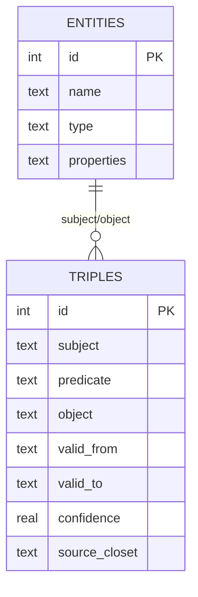

# 第11章：时态知识图谱

> **定位**：第四部分"时间维度"的起始章。从 MemPalace 的知识图谱源码出发，解析时态三元组的设计哲学：事实不是永恒的，它们有生命周期。本章是理解第 12 章矛盾检测和第 13 章时间线叙事的基础。

---

## 事实会过期

在讨论技术实现之前，先说一个最基本的认知问题。

"Kai 在做 Orion 项目。" 这句话在 2025 年 6 月是事实。到了 2026 年 3 月，Kai 转去了另一个项目，这句话就不再成立了。但在一个传统的知识图谱里，这条记录仍然静静地躺在那里，没有人告诉系统它已经过期。下一次有人问"Kai 现在在做什么项目"，系统会自信地给出一个错误答案。

这不是假设。这是几乎所有基于静态三元组的知识系统都面临的真实问题。Wikipedia 的信息框里，每天都有成千上万条过期事实等待人类志愿者手动更新。企业知识库里，项目归属、人员职责、技术栈选型——这些信息的保鲜期通常以周计算，而更新频率以月甚至年计算。

MemPalace 对这个问题的回应是：**不要假装事实是永恒的。给每一条事实一个明确的时间窗口。**

这就是时态知识图谱（Temporal Knowledge Graph）的核心思想。

---

## 静态 KG 与时态 KG

传统的知识图谱存储的是三元组：主语-谓语-宾语。比如 `(Kai, works_on, Orion)`。这条三元组表达了一个关系，但它没有回答三个关键问题：

1. **这个关系从什么时候开始的？**
2. **这个关系现在还成立吗？**
3. **在某个特定的历史时间点，这个关系是否成立？**

静态 KG 无法回答这些问题，因为它的数据模型里根本没有时间维度。你能做的只是覆盖旧值（丢失历史）或者追加新值（产生矛盾）。

时态 KG 在三元组的基础上增加了两个时间戳：`valid_from`（生效时间）和 `valid_to`（失效时间）。同一对主语和宾语之间可以存在多条同类关系，每条关系覆盖不同的时间段。这样，知识图谱就从一张静态快照变成了一本编年史。

用一个表格来对比：

| 能力 | 静态 KG | 时态 KG |
|------|---------|---------|
| 存储当前事实 | 可以 | 可以 |
| 存储历史事实 | 覆盖即丢失 | 完整保留 |
| 回答"现在 X 是否成立" | 可以（但可能过期） | 精确回答 |
| 回答"2025 年 1 月 X 是否成立" | 不可以 | 可以 |
| 检测过期信息 | 不可以 | 可以 |
| 支持时间线叙事 | 不可以 | 可以 |

MemPalace 选择了时态 KG。这个选择的直接后果是：每一条进入知识图谱的事实都必须携带时间信息，而每一条从知识图谱出去的查询结果都可以按时间过滤。

---

## Schema 设计

打开 `knowledge_graph.py`，从 `_init_db()` 方法（`knowledge_graph.py:55`）可以看到完整的数据库结构。MemPalace 的时态 KG 建立在两张 SQLite 表之上。

### entities 表

```sql
CREATE TABLE IF NOT EXISTS entities (
    id TEXT PRIMARY KEY,
    name TEXT NOT NULL,
    type TEXT DEFAULT 'unknown',
    properties TEXT DEFAULT '{}',
    created_at TEXT DEFAULT CURRENT_TIMESTAMP
);
```

（`knowledge_graph.py:58-63`）

实体表的设计极简。`id` 是实体名称的标准化形式（小写、空格替换为下划线），`name` 保留原始显示名称，`type` 标记实体类型（人、项目、工具、概念），`properties` 是一个 JSON 字段，用于存储实体的附加属性（比如生日、性别等）。

值得注意的是 `type` 字段默认值为 `'unknown'`。这意味着实体可以在没有完整类型信息的情况下被创建——系统不会因为缺少元数据而拒绝存储一条关系。这是一个典型的"宽容输入"设计：先把信息存下来，类型信息以后再补。

### triples 表

```sql
CREATE TABLE IF NOT EXISTS triples (
    id TEXT PRIMARY KEY,
    subject TEXT NOT NULL,
    predicate TEXT NOT NULL,
    object TEXT NOT NULL,
    valid_from TEXT,
    valid_to TEXT,
    confidence REAL DEFAULT 1.0,
    source_closet TEXT,
    source_file TEXT,
    extracted_at TEXT DEFAULT CURRENT_TIMESTAMP,
    FOREIGN KEY (subject) REFERENCES entities(id),
    FOREIGN KEY (object) REFERENCES entities(id)
);
```

（`knowledge_graph.py:65-78`）

这是时态 KG 的核心。除了标准的 `subject`/`predicate`/`object` 三元组字段之外，有五个额外字段值得逐一解读：

**`valid_from` 和 `valid_to`** —— 时间窗口。两个字段都允许 `NULL`。`valid_from` 为空表示"不知道什么时候开始的"（而不是"从创世之初就存在"）；`valid_to` 为空表示"目前仍然有效"。这个约定至关重要：通过检查 `valid_to IS NULL`，系统可以立刻区分当前事实和历史事实。

**`confidence`** —— 置信度，默认 1.0（完全确信）。这个字段为将来的概率推理留了空间。当一条事实来自不太可靠的来源（比如从非正式对话中推断出的关系），可以将置信度设为低于 1.0 的值。

**`source_closet`** —— 指向记忆宫殿中的 closet 的可选指针。这是知识图谱和宫殿结构之间预留出来的桥梁：如果调用方在 `add_triple()` 或 `mempalace_kg_add` 时提供了这个字段，三元组就可以追溯到它来自哪个 closet，从而继续追溯到原始记忆。需要更谨慎地说的是：当前公开源码把它暴露成一个可选输入，但并没有在默认挖掘流程里自动填充它。

**`source_file`** —— 原始文件路径。比 `source_closet` 更底层、也通常更容易在当前实现中实际落地的溯源信息。

**`extracted_at`** —— 三元组被录入系统的时间。注意这与 `valid_from` 不同：一条事实可能在 2025 年就开始生效，但直到 2026 年才被录入系统。

最后，看索引设计（`knowledge_graph.py:82-84`）：

```sql
CREATE INDEX IF NOT EXISTS idx_triples_subject ON triples(subject);
CREATE INDEX IF NOT EXISTS idx_triples_object ON triples(object);
CREATE INDEX IF NOT EXISTS idx_triples_predicate ON triples(predicate);
CREATE INDEX IF NOT EXISTS idx_triples_valid ON triples(valid_from, valid_to);
```

四个索引，分别覆盖三元组的三个维度加上时间窗口。`idx_triples_valid` 是复合索引，同时索引 `valid_from` 和 `valid_to`，这使得时间范围查询可以高效执行。



---

## 写入：add_triple()

`add_triple()` 方法（`knowledge_graph.py:110-167`）是知识图谱的主要写入接口。方法签名如下：

```python
def add_triple(
    self,
    subject: str,
    predicate: str,
    obj: str,
    valid_from: str = None,
    valid_to: str = None,
    confidence: float = 1.0,
    source_closet: str = None,
    source_file: str = None,
):
```

有几个设计细节值得注意。

**自动创建实体。** 在插入三元组之前，方法会自动为 subject 和 object 创建实体记录（如果它们不存在的话）：

```python
conn.execute("INSERT OR IGNORE INTO entities (id, name) VALUES (?, ?)", (sub_id, subject))
conn.execute("INSERT OR IGNORE INTO entities (id, name) VALUES (?, ?)", (obj_id, obj))
```

（`knowledge_graph.py:134-135`）

`INSERT OR IGNORE` 意味着如果实体已存在就跳过。这让调用方不需要关心"这个实体是否已经被注册过"——你只管添加三元组，实体会自动出现在图里。这进一步强化了"宽容输入"的设计理念。

**去重检查。** 在插入新三元组之前，方法会检查是否已经存在一条完全相同的、尚未失效的三元组：

```python
existing = conn.execute(
    "SELECT id FROM triples WHERE subject=? AND predicate=? AND object=? AND valid_to IS NULL",
    (sub_id, pred, obj_id),
).fetchone()

if existing:
    conn.close()
    return existing[0]  # Already exists and still valid
```

（`knowledge_graph.py:139-146`）

注意查询条件中的 `valid_to IS NULL`——只检查当前有效的三元组。如果同一条关系曾经存在过但已经被标记为结束（`valid_to` 不为空），那么重新添加同一条关系会创建一条新记录，而不是复活旧记录。这符合直觉：如果 Kai 曾经在 Orion 项目上工作，后来离开了，现在又回来了，那应该是两段独立的工作经历，而不是一段连续的。

**三元组 ID 生成。** 每条三元组的 ID 是一个组合字符串：`t_{subject}_{predicate}_{object}_{hash}`，其中 hash 基于 `valid_from` 和当前时间戳的 MD5 值取前 8 位（`knowledge_graph.py:148`）。这保证了即使同一对实体之间存在多条同类关系（覆盖不同时间段），每条记录也有唯一 ID。

---

## 查询：query_entity()

`query_entity()` 方法（`knowledge_graph.py:186-241`）是最核心的查询接口。它的参数设计精确地体现了时态 KG 的查询模型：

```python
def query_entity(self, name: str, as_of: str = None, direction: str = "outgoing"):
```

三个参数，三个维度：

- **`name`**：查询的实体。
- **`as_of`**：可选的时间快照。如果提供，只返回在该时间点有效的事实。
- **`direction`**：关系方向。`"outgoing"` 查询该实体作为主语的关系（实体 -> ?），`"incoming"` 查询该实体作为宾语的关系（? -> 实体），`"both"` 查询两个方向。

`as_of` 参数的 SQL 实现是这段查询逻辑的精华（`knowledge_graph.py:201-203`）：

```python
if as_of:
    query += " AND (t.valid_from IS NULL OR t.valid_from <= ?) AND (t.valid_to IS NULL OR t.valid_to >= ?)"
    params.extend([as_of, as_of])
```

这个条件的含义是：一条事实在 `as_of` 时间点有效，当且仅当：
1. 它的生效时间在 `as_of` 之前或等于 `as_of`（或者生效时间未知），**且**
2. 它的失效时间在 `as_of` 之后或等于 `as_of`（或者尚未失效）。

`valid_from IS NULL` 被当作"始终有效"处理，`valid_to IS NULL` 被当作"尚未结束"处理。这意味着一条没有时间信息的事实会在所有时间点都被视为有效——这是一个合理的默认行为，因为它避免了"因为缺少时间标注就把事实过滤掉"的情况。

查询结果中包含一个 `current` 字段（`knowledge_graph.py:215`）：

```python
"current": row[5] is None,
```

`row[5]` 是 `valid_to`。如果为 `None`（即 `NULL`），说明这条事实仍然有效。这让调用方可以一眼区分当前事实和历史事实。

### 一个具体的查询例子

假设知识图谱中存在以下三元组：

```
Kai → works_on → Orion   (valid_from: 2025-06-01, valid_to: 2026-03-01)
Kai → works_on → Nova    (valid_from: 2026-03-15, valid_to: NULL)
Kai → recommended → Clerk (valid_from: 2026-01-01, valid_to: NULL)
```

调用 `kg.query_entity("Kai")` 不带 `as_of` 参数，返回所有三条记录，其中第一条的 `current` 为 `False`，后两条为 `True`。

调用 `kg.query_entity("Kai", as_of="2025-12-01")`，只返回第一条（Orion），因为在 2025 年 12 月，Kai 还没有推荐 Clerk，也还没有转去 Nova。

调用 `kg.query_entity("Kai", as_of="2026-04-01")`，返回后两条（Nova 和 Clerk），因为到 2026 年 4 月，Kai 已经离开了 Orion。

这就是时态查询的力量：同一个实体在不同时间点呈现不同的事实面貌。

---

## 失效：invalidate()

`invalidate()` 方法（`knowledge_graph.py:169-182`）用于标记一条事实的结束：

```python
def invalidate(self, subject: str, predicate: str, obj: str, ended: str = None):
    """Mark a relationship as no longer valid (set valid_to date)."""
    sub_id = self._entity_id(subject)
    obj_id = self._entity_id(obj)
    pred = predicate.lower().replace(" ", "_")
    ended = ended or date.today().isoformat()

    conn = self._conn()
    conn.execute(
        "UPDATE triples SET valid_to=? WHERE subject=? AND predicate=? AND object=? AND valid_to IS NULL",
        (ended, sub_id, pred, obj_id),
    )
    conn.commit()
    conn.close()
```

设计要点：

1. **只更新当前有效的记录**（`valid_to IS NULL`）。不会意外修改已经结束的历史记录。
2. **默认结束日期是今天**（`ended or date.today().isoformat()`）。大多数时候你是在"现在"意识到某件事不再成立的。
3. **不删除数据**。失效不是删除，而是设置结束时间。历史查询仍然可以看到这条记录。

这种"软删除"策略意味着知识图谱是一个只增长、不收缩的数据结构。每一条曾经为真的事实永远留在图谱中。这听起来可能会带来存储压力，但对于个人或小团队规模的知识图谱来说，SQLite 数据库文件即使积累几万条三元组也不过几 MB——完全不是问题。

---

## 为什么是 SQLite

MemPalace 的时态知识图谱直接竞争的对象是 Zep 的 Graphiti。README 中有一段直接的对比（`README.md:359-366`）：

| 特性 | MemPalace | Zep (Graphiti) |
|------|-----------|----------------|
| 存储 | SQLite (local) | Neo4j (cloud) |
| 成本 | Free | $25/mo+ |
| 时态 | Yes | Yes |
| 自托管 | Always | Enterprise only |
| 隐私 | Everything local | SOC 2, HIPAA |

Zep 的 Graphiti 使用 Neo4j 作为底层图数据库。Neo4j 是图数据库领域的标杆产品，支持原生图遍历、Cypher 查询语言、分布式集群部署。它的能力毋庸置疑——但对于 MemPalace 的使用场景来说，这些能力大部分是过剩的。

MemPalace 的知识图谱查询模式非常集中：以实体为中心查询直接关系，带可选的时间过滤。它不需要多跳遍历（"找到与 Kai 有三度关系的所有人"），不需要复杂的图算法（最短路径、社区检测），不需要水平扩展到多节点集群。

对于这种查询模式，SQLite 有三个决定性的优势：

**零运维。** SQLite 是一个嵌入式数据库，不需要启动服务、配置连接、管理进程。它就是一个文件。`~/.mempalace/knowledge_graph.sqlite3`，仅此而已。不需要 Docker，不需要数据库管理员，不需要凌晨三点被告警叫醒。

**本地优先。** 数据永远在你的机器上。不需要网络连接，不需要身份验证，不需要担心第三方服务的隐私政策变更。你的知识图谱就在你的文件系统里，和你的代码、你的笔记、你的照片放在一起。

**够用。** 一个人或一个小团队在几年内能积累多少知识图谱数据？几千个实体，几万条三元组，这已经是相当充实的知识图谱了。SQLite 处理这个量级的数据，查询时间在毫秒级。MemPalace 的索引设计（四个索引覆盖主要查询路径）保证了即使数据量翻十倍，性能也不会成为瓶颈。

当然，选择 SQLite 也意味着放弃了一些东西：没有原生的图遍历算法，没有可视化查询界面，没有多用户并发写入的能力。但这些在个人 AI 记忆系统的场景下都不是硬需求。这是一个典型的工程权衡：用放弃不需要的能力来换取运维成本为零。

---

## query_relationship()：按关系类型查询

除了以实体为中心的查询，MemPalace 还提供了以关系类型为中心的查询接口（`knowledge_graph.py:243-272`）：

```python
def query_relationship(self, predicate: str, as_of: str = None):
```

这个方法返回所有具有特定关系类型的三元组。比如 `kg.query_relationship("works_on")` 返回所有"在做某个项目"的关系，`kg.query_relationship("works_on", as_of="2026-01-01")` 则只返回在 2026 年 1 月 1 日仍然有效的工作关系。

这种查询模式在矛盾检测中特别有用。当系统需要验证"Soren 完成了 auth migration"这个声明时，它可以调用 `query_relationship("assigned_to")` 来查看 auth-migration 项目实际上分配给了谁。我们将在第 12 章详细讨论这个机制。

---

## 从已知事实播种

`seed_from_entity_facts()` 方法（`knowledge_graph.py:338-384`）展示了知识图谱如何被初始化。它接受一个结构化的实体事实字典，然后批量创建实体和三元组：

```python
def seed_from_entity_facts(self, entity_facts: dict):
    """
    Seed the knowledge graph from fact_checker.py ENTITY_FACTS.
    This bootstraps the graph with known ground truth.
    """
```

这个方法处理多种关系类型：`child_of`（亲子关系）、`married_to`（婚姻关系）、`is_sibling_of`（兄弟姐妹关系）、`is_pet_of`（宠物关系），以及 `loves`（兴趣爱好）。每种关系都带有适当的 `valid_from` 时间戳——亲子关系从出生日期开始，兴趣爱好从 `2025-01-01` 开始。

注释中提到数据来自 `fact_checker.py ENTITY_FACTS`，这意味着存在一个独立的事实验证模块，维护着一组已验证的基准事实。知识图谱的播种过程本质上是将这些基准事实从一种数据结构（Python 字典）转换为另一种数据结构（SQLite 三元组）。这种设计将"事实来源"和"事实存储"解耦——你可以更换知识图谱的实现而不影响事实验证逻辑，反之亦然。

---

## stats()：图谱概览

`stats()` 方法（`knowledge_graph.py:315-334`）提供了知识图谱的全局统计信息：

```python
return {
    "entities": entities,
    "triples": triples,
    "current_facts": current,
    "expired_facts": expired,
    "relationship_types": predicates,
}
```

`current_facts` 和 `expired_facts` 的区分特别有意义。如果一个知识图谱中 `expired_facts` 远大于 `current_facts`，说明这个图谱覆盖了很长的时间跨度，积累了大量历史。如果 `current_facts` 远大于 `expired_facts`，说明大部分事实都是新近录入且仍然有效的。这个比例本身就是一种元数据，告诉你知识图谱的"年龄"和"活跃度"。

---

## 实体 ID 标准化

一个看似微小但非常重要的设计细节是实体 ID 的生成方式（`knowledge_graph.py:92-93`）：

```python
def _entity_id(self, name: str) -> str:
    return name.lower().replace(" ", "_").replace("'", "")
```

所有实体名称在存储前都被标准化：转为小写，空格替换为下划线，撇号被删除。这意味着 `"Kai"`、`"kai"`、`"KAI"` 都会被映射到同一个实体 ID `"kai"`。

这个设计解决了一个非常实际的问题：当从多个来源（对话、文档、代码注释）提取事实时，同一个实体几乎一定会以不同的大小写和格式出现。如果不做标准化，知识图谱中会出现 `kai`、`Kai`、`KAI` 三个实体，它们之间没有任何关系——但实际上它们是同一个人。

标准化函数故意设计得非常简单。它不尝试处理复杂的同义词问题（比如"张三"和"Zhang San"是同一个人），也不尝试做实体消歧（同名不同人）。它只处理最常见的变体情况。更复杂的实体解析留给上游的实体检测模块。

---

## 设计哲学总结

回顾整个 `knowledge_graph.py` 的设计，有几个贯穿始终的原则：

**时间是一等公民。** 每一条写入操作都接受时间参数，每一条查询操作都支持时间过滤。时间不是事后添加的标注，而是数据模型的核心维度。

**宽容输入，精确输出。** 写入时，允许缺少时间信息、缺少实体类型、缺少溯源信息。查询时，精确地根据时间窗口过滤，精确地区分当前事实和历史事实。系统不会因为数据不完美而拒绝工作，但也不会因为数据不完美而给出模糊的答案。

**只增长，不收缩。** `invalidate()` 不删除数据，只标记结束时间。`add_triple()` 不覆盖已结束的记录，而是创建新记录。知识图谱是一部编年史，每一页都被保留。

**本地优先，零依赖。** SQLite 作为存储引擎，不需要外部服务，不需要网络连接，不需要额外的进程管理。整个知识图谱就是你文件系统里的一个 `.sqlite3` 文件。

这些原则共同构成了 MemPalace 时态知识图谱的设计哲学。它不追求图数据库的全部能力，而是在个人 AI 记忆系统这个具体场景下，用最小的复杂度实现了最关键的时态功能。

下一章，我们将看到时态 KG 的一个重要应用：矛盾检测。当一条新的声明与知识图谱中的已有事实不一致时，系统如何发现并报告这种不一致？答案就藏在时间窗口的交叉比对之中。
