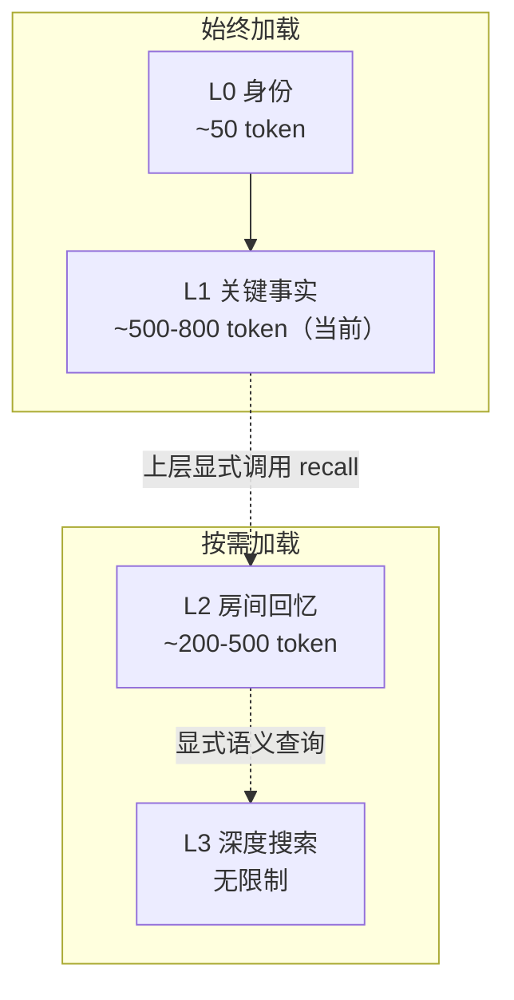

# 第14章：L0-L3——四层记忆栈的分层设计

> **定位**：本章拆解 MemPalace 四层记忆栈的设计理由与实现。我们将逐层分析每一层解决什么问题、占用多少 token、何时加载，以及这种分层为何是四层而非其他数目。源码分析基于 `mempalace/layers.py`。

---

## 一个关于"唤醒"的问题

当你的 AI 助手从零开始一个新会话时，它对你一无所知。它不知道你叫什么名字，不知道你在做什么项目，不知道你昨天做了一个关键的架构决策。每一次新会话都是一次彻底的失忆。

解决这个问题的朴素方法是：把所有历史对话塞进上下文窗口。但正如本书前面章节分析的那样，六个月的日常 AI 使用大约产生 1950 万 token——这远超任何模型的上下文窗口。即使将来上下文窗口扩大到一亿 token，这种暴力装载的方式也有根本性的成本问题：每一次对话都要为数百万 token 付费，而其中 99% 在当前对话中毫无用处。

另一个常见方法是让 LLM 在每次对话后提取"重要信息"，存成摘要。但正如我们反复讨论的，这种方法在存储阶段就引入了不可逆的信息损失。

MemPalace 的答案是一个四层记忆栈：不是存更多，也不是存更少，而是在正确的时机加载正确的量。

---

## 为什么是"栈"而不是"数据库"

在讨论具体的层级之前，值得先理解为什么 MemPalace 选择了"栈"这个隐喻。

传统数据库是扁平的：所有数据住在同一个层面，通过查询语言按需提取。但人类的记忆不是这样工作的。你不需要回忆自己的名字——这个信息始终在意识表面；你不需要刻意去想今天早上做了什么——这些近期经历在"工作记忆"中随时可用；但如果有人问你三年前某次旅行的细节，你需要主动去"搜索"长期记忆。

这种分层不是偶然的。认知科学将人类记忆分为感觉记忆、短期（工作）记忆和长期记忆，每一层有不同的容量、持续时间和提取成本。MemPalace 的四层栈直接映射了这种认知结构——不是因为仿生是目的，而是因为这种分层恰好解决了 AI 上下文管理中的实际工程问题。

核心问题是：**如何在有限的 token 预算中最大化信息效用？**

答案是按频率和紧迫性分层。有些信息每次对话都需要（"我是谁"），有些只在特定话题出现时需要（"这个项目的最近讨论"），有些只在明确提问时才需要（"去年三月关于 GraphQL 的讨论"）。把它们全部放在同一层处理，要么太贵，要么太慢，要么两者兼有。

---

## 四层全景

在进入每一层的细节之前，先看完整的栈结构：

| 层级 | 内容 | 典型大小 | 加载时机 | 设计动机 |
|------|------|---------|---------|---------|
| L0 | 身份——"我是谁" | ~50-100 token | 始终加载 | AI 需要知道自己的角色和基本人际关系 |
| L1 | 关键事实——最重要的记忆 | ~500-800 token（当前实现） | 始终加载 | 最小可用上下文：团队、项目、核心偏好 |
| L2 | 房间回忆——按需检索 | ~200-500 token/次 | 显式 `recall()` 时 | 当前话题的一批相关上下文 |
| L3 | 深度搜索——语义检索 | 无上限 | 明确提问时 | 全量语料的语义搜索 |



在当前 v3.0.0 源码里，L0 + L1 构成的"唤醒成本"大约是 600-900 token。README 同时给出了一个更激进的目标口径：如果将 AAAK 真正接入唤醒路径，L0 + L1 可压到约 170 token。两者不能混为一谈。本章以下分析，凡是讨论 `layers.py` 的现状，都以 600-900 token 为准；凡是讨论更长期的压缩方向，才引用 README 中的 170 token 目标。

这意味着：即使不引入 AAAK，MemPalace 的默认唤醒也仍然是一个相对便宜的常驻上下文层；而 README 中的 170 token，则代表这个设计在压缩路径完全接通后的上限目标。

---

## L0：身份层

```
Layer 0: Identity       (~100 tokens)   — Always loaded. "Who am I?"
```

L0 是整个栈中最简单的一层，也是最不可省略的一层。它回答一个根本性的问题：**这个 AI 助手是谁？**

在 `layers.py` 的实现中，`Layer0` 类从一个纯文本文件读取身份信息（`layers.py:34-69`）：

```python
class Layer0:
    """
    ~100 tokens. Always loaded.
    Reads from ~/.mempalace/identity.txt — a plain-text file the user writes.
    """
    def __init__(self, identity_path: str = None):
        if identity_path is None:
            identity_path = os.path.expanduser("~/.mempalace/identity.txt")
        self.path = identity_path
        self._text = None

    def render(self) -> str:
        if self._text is not None:
            return self._text
        if os.path.exists(self.path):
            with open(self.path, "r") as f:
                self._text = f.read().strip()
        else:
            self._text = (
                "## L0 — IDENTITY\n"
                "No identity configured. Create ~/.mempalace/identity.txt"
            )
        return self._text
```

几个设计选择值得注意。

**纯文本，用户手写。** 身份不是从对话中自动提取的，而是用户自己写的。这是一个深思熟虑的决策。身份是一种声明性知识——"我是 Atlas，Alice 的个人 AI 助手"——不需要从海量对话中挖掘。让用户自己定义身份，意味着身份永远是精确的、有意的、可控的。

**文件系统，不是数据库。** L0 读取的是 `~/.mempalace/identity.txt`——一个普通的文本文件，用任何编辑器都能修改。这消除了所有"如何更新身份"的复杂性。想改身份？改文件就行。

**缓存读取。** `render()` 方法使用 `_text` 做了简单的缓存（`layers.py:52-65`）。文件只读取一次，之后直接返回缓存内容。这对 L0 来说足够了——身份在一次会话中不会变化。

**优雅降级。** 如果身份文件不存在，L0 不会报错，而是返回一段提示文字，引导用户创建文件（`layers.py:61-63`）。系统永远可以启动，无论配置是否完整。

**Token 估算。** `token_estimate()` 方法用一个简单的启发式：字符数除以 4（`layers.py:67-68`）。这不是精确的 tokenizer 计算，而是一个够用的近似值。在 L0 的规模（通常几十到一百个 token），这个精度完全可以接受。

一个典型的 identity.txt 大概长这样：

```
I am Atlas, a personal AI assistant for Alice.
Traits: warm, direct, remembers everything.
People: Alice (creator), Bob (Alice's partner).
Project: A journaling app that helps people process emotions.
```

这大约 50 个 token。看起来微不足道，但它给了 AI 一个至关重要的锚点：它知道自己是"谁"，它服务于"谁"，它的行为风格应该是什么样的。没有这个锚点，每次对话都要从"你好，我是你的 AI 助手"开始重新建立关系。

---

## L1：关键事实层

```
Layer 1: Essential Story (~500-800)  — Always loaded. Top moments from the palace.
```

如果说 L0 是"我是谁"，L1 就是"我知道什么最重要的事"。

L1 的设计目标是在最小的 token 预算内，装载对当前对话最可能有用的核心事实。它不需要包含所有记忆——那是 L3 的工作——而是提供一个"最小可用上下文"，让 AI 在没有任何主动搜索的情况下就能表现出"记得你"的能力。

在 `layers.py:76-168` 中，`Layer1` 类的实现揭示了几个关键设计：

**自动生成，不是手动维护。** 与 L0 不同，L1 不需要用户手写。它从 ChromaDB 中的宫殿数据自动提取最重要的记忆片段（`layers.py:91-168`）。

**重要性排序。** L1 使用一个评分机制来决定哪些记忆最值得加载。评分逻辑在 `layers.py:116-128`：

```python
scored = []
for doc, meta in zip(docs, metas):
    importance = 3
    for key in ("importance", "emotional_weight", "weight"):
        val = meta.get(key)
        if val is not None:
            try:
                importance = float(val)
            except (ValueError, TypeError):
                pass
            break
    scored.append((importance, meta, doc))

scored.sort(key=lambda x: x[0], reverse=True)
top = scored[: self.MAX_DRAWERS]
```

代码尝试从多个元数据键中读取重要性评分——`importance`、`emotional_weight`、`weight`——体现了一种务实的兼容性策略：不同来源的数据可能使用不同的键名来标记重要性，L1 会依次尝试，找到第一个有效值就使用。默认值为 3（中等重要性），保证即使没有显式标记，记忆也能参与排序。

**按房间分组。** 排序后的 top N 记忆不是简单地列成一个列表，而是按房间（room）分组展示（`layers.py:135-139`）：

```python
by_room = defaultdict(list)
for imp, meta, doc in top:
    room = meta.get("room", "general")
    by_room[room].append((imp, meta, doc))
```

这个设计让 L1 的输出具有结构性——AI 看到的不是一堆散乱的事实，而是按主题组织的信息。这与记忆宫殿的核心理念一致：空间结构本身就是索引。

**硬性 token 上限。** L1 有两个硬性约束：最多 15 条记忆（`MAX_DRAWERS = 15`），总字符不超过 3200（`MAX_CHARS = 3200`，约 800 token）。当接近上限时，生成过程会优雅地截断，并添加 `"... (more in L3 search)"` 提示 AI 可以通过深度搜索获取更多（`layers.py:160-163`）。

**为什么当前是 ~500-800 token，而 README 又会写到 ~120 token？** 这是"当前实现"与"压缩路线图"之间的区别。`layers.py` 当前的 `Layer1.generate()` 仍然输出按 room 分组的原文片段，因此源码里的预算是 500-800 token。README 提到的 ~120 token，则对应另一种尚未接入 `wake_up()` 主路径的设想：把同一批关键事实压成 AAAK，再作为 L1 输送给模型。

这两种口径背后的设计方法是一致的：先确定"唤醒后，AI 至少该知道什么"，再反推需要多少上下文。不同之处只在于表达介质。当前介质是压缩过的原文片段，所以预算落在 500-800 token；路线图中的介质是 AAAK，因此目标可以进一步降到约 120 token 的 L1。

---

## L2：按需检索层

```
Layer 2: On-Demand      (~200-500 each)  — Loaded when a topic/wing comes up.
```

L2 是"被动记忆"和"主动搜索"之间的中间地带。

从概念设计上看，L0 和 L1 始终在场，它们构成了 AI 的"常驻意识"。L3 是深度搜索，需要明确的查询。L2 的角色则位于两者之间：当上层已经知道当前对话聚焦在哪个 wing 或 room 时，它可以先用一次轻量的元数据过滤，把相关 drawer 成批拉回，而不必立刻触发全量语义搜索。

需要补一句当前实现的边界：**v3.0.0 里的 L2 还不是一个会自动监听对话、自动在话题切换时注入上下文的运行时机制。** 它目前只是一个显式的 `retrieve()` / `recall()` 接口，供上层编排层在合适的时候手动调用。

在 `layers.py:176-233` 中，`Layer2` 的实现相当直接：

```python
class Layer2:
    """
    ~200-500 tokens per retrieval.
    Loaded when a specific topic or wing comes up in conversation.
    Queries ChromaDB with a wing/room filter.
    """
    def retrieve(self, wing: str = None, room: str = None, 
                 n_results: int = 10) -> str:
```

L2 的核心机制是**过滤而非搜索**。它不使用语义查询，而是通过元数据过滤（wing 和 room）来缩小范围（`layers.py:195-205`）：

```python
where = {}
if wing and room:
    where = {"$and": [{"wing": wing}, {"room": room}]}
elif wing:
    where = {"wing": wing}
elif room:
    where = {"room": room}

kwargs = {"include": ["documents", "metadatas"], "limit": n_results}
if where:
    kwargs["where"] = where

results = col.get(**kwargs)
```

注意这里用的是 `col.get()` 而非 `col.query()`。`get()` 是 ChromaDB 的元数据过滤方法，不涉及向量相似度计算——它只是按条件返回匹配的文档。这意味着 L2 的检索是确定性的、零语义成本的。更准确地说，当上层已经把"我们来看看 Driftwood 项目"解析成 `wing="driftwood"` 并显式调用 `recall(wing="driftwood")` 时，L2 不需要理解自然语言本身，它只需要返回所有匹配该过滤条件的 drawer。

**为什么是 200-500 token？** 这个范围对应的是一次取回 5-10 个过滤结果。每条片段被截断到 300 字符以内（`layers.py:226-228`），加上元数据标签，总量控制在一到两段话的长度。需要说清楚的是：当前实现没有按 `filed_at` 或 `date` 排序，因此这里更准确的表述是"一批过滤命中的片段"，而不是严格意义上的"近期历史"。这个量足以让 AI 快速补齐当前话题的局部上下文，但不会挤占对话本身的上下文空间。

L2 的存在解决了一个微妙但重要的编排问题：如果没有 L2，上层系统要么只能依赖 L1 的浅层常驻信息，要么每次都直接跳进 L3 的全量语义搜索。L2 提供了一个更便宜的中间层，让调用方可以在识别出当前 wing/room 后，先拉回一批相关 drawer，再决定是否需要更深的搜索。也正因为如此，"自然地切换话题"在当前版本里仍然是**上层代理或界面可以实现的体验**，而不是 `layers.py` 已经自动完成的行为。

---

## L3：深度搜索层

```
Layer 3: Deep Search    (unlimited)      — Full ChromaDB semantic search.
```

L3 是唯一使用语义搜索的层级。

前两层都在做"预加载"——在对话开始前注入常驻信息。L2 则是一个轻量的显式召回接口；L3 不同，它是按需触发的全量搜索，用于回答需要在整个记忆库中检索的问题。

`Layer3` 的核心方法 `search()` 在 `layers.py:251-303`：

```python
class Layer3:
    """
    Unlimited depth. Semantic search against the full palace.
    """
    def search(self, query: str, wing: str = None, 
               room: str = None, n_results: int = 5) -> str:
        # ...
        kwargs = {
            "query_texts": [query],
            "n_results": n_results,
            "include": ["documents", "metadatas", "distances"],
        }
        if where:
            kwargs["where"] = where

        results = col.query(**kwargs)
```

这里用的是 `col.query()`——ChromaDB 的语义搜索方法。它将查询文本转化为向量，在整个集合中按余弦相似度排序，返回最接近的结果。

L3 的输出格式设计也值得注意（`layers.py:287-303`）：

```python
lines = [f'## L3 — SEARCH RESULTS for "{query}"']
for i, (doc, meta, dist) in enumerate(zip(docs, metas, dists), 1):
    similarity = round(1 - dist, 3)
    wing_name = meta.get("wing", "?")
    room_name = meta.get("room", "?")
    # ...
    lines.append(f"  [{i}] {wing_name}/{room_name} (sim={similarity})")
    lines.append(f"      {snippet}")
```

每条结果包含三类信息：位置（wing/room）、相似度分数和内容摘要。位置信息让 AI 知道这条记忆"在宫殿的哪里"，相似度分数让 AI 判断结果的可信度，内容摘要提供实际信息。

**与 `searcher.py` 的关系。** `layers.py` 中的 L3 实现与 `searcher.py` 中的搜索功能在逻辑上是重叠的。`searcher.py` 提供了两个函数：`search()`（打印格式化输出，`searcher.py:15-84`）和 `search_memories()`（返回结构化数据，`searcher.py:87-142`）。两者都使用相同的 ChromaDB `query()` 调用，区别在于输出格式——前者用于 CLI，后者用于 MCP 服务器等程序化调用。

L3 还提供了一个 `search_raw()` 方法（`layers.py:305-352`），返回原始字典列表而非格式化文本。这为上层应用（如 MCP 工具）提供了灵活的数据接口。

---

## 统一接口：MemoryStack

四个层级通过 `MemoryStack` 类统一暴露（`layers.py:360-438`）：

```python
class MemoryStack:
    def __init__(self, palace_path=None, identity_path=None):
        self.l0 = Layer0(self.identity_path)
        self.l1 = Layer1(self.palace_path)
        self.l2 = Layer2(self.palace_path)
        self.l3 = Layer3(self.palace_path)

    def wake_up(self, wing=None) -> str:
        """L0 (identity) + L1 (essential story). ~600-900 tokens."""
        parts = []
        parts.append(self.l0.render())
        parts.append("")
        if wing:
            self.l1.wing = wing
        parts.append(self.l1.generate())
        return "\n".join(parts)

    def recall(self, wing=None, room=None, n_results=10) -> str:
        """On-demand L2 retrieval."""
        return self.l2.retrieve(wing=wing, room=room, n_results=n_results)

    def search(self, query, wing=None, room=None, n_results=5) -> str:
        """Deep L3 semantic search."""
        return self.l3.search(query, wing=wing, room=room, n_results=n_results)
```

三个方法，三种使用场景：

- `wake_up()`：每次会话开始时调用一次。注入系统提示词或第一条消息。
- `recall()`：由上层在识别出特定 wing/room 时显式调用。它提供 L2 的轻量过滤召回，但当前不会自己监听对话。
- `search()`：用户明确提问时调用。语义检索全量数据。

`wake_up()` 方法还支持 wing 参数（`layers.py:380-399`），允许按项目过滤 L1 的内容。如果你在做 Driftwood 项目，`wake_up(wing="driftwood")` 会只加载与 Driftwood 相关的关键事实，进一步减少 token 消耗，同时提高信息相关性。

`status()` 方法（`layers.py:409-438`）提供了栈的整体状态诊断，包括身份文件是否存在、token 估算和记忆总数。这对调试和运维很有用。

---

## 为什么是四层，不是两层或八层

这是一个值得认真回答的设计问题。

**为什么不是两层（始终加载 + 搜索）？** 因为"始终加载"和"搜索"之间存在一个重要的灰色地带。想象一下只有 L0+L1 和 L3 的系统：你的 AI 知道你的名字和当前项目（L1），如果被问到具体问题可以搜索（L3），但当上层已经明确知道"现在在聊 Driftwood"时，它仍然只能直接跳到全量语义搜索。L2 填补了这个空隙——它把"按 wing/room 轻量召回"单独抽出来，让上层编排层不必每次都走最重的路径。当前版本里，这个收益体现为一个显式 API，而不是自动话题监听。

**为什么不是三层（去掉 L0，把身份合并进 L1）？** 因为身份和事实在本质上不同。身份是声明性的、用户控制的、几乎永不变化的。L1 的关键事实是从数据中自动生成的、按重要性排序的、随新数据更新的。把它们混在一起，要么让用户的身份声明被自动生成的内容挤掉，要么让自动生成的逻辑需要小心翼翼地避开用户手写的部分。分开更干净。

**为什么不是更多层？** 因为每增加一个层级，就增加了一个"何时加载"的决策点。四层已经覆盖了所有关键的时间语义：始终（L0、L1）、按过滤召回（L2）、按查询搜索（L3）。你很难定义出第五种有意义的加载时机。如果试图把 L2 拆分成"近期话题"和"远期话题"，或者把 L3 拆分成"浅度搜索"和"深度搜索"，带来的复杂性很可能超过收益。

四层是一个**最小完备集**：少一层则功能缺失，多一层则过度设计。

---

## Token 预算的经济学

最后，让我们算一笔账。

如果严格按当前 `layers.py` 计算，MemPalace 的默认唤醒成本是 ~600-900 token，而不是 170 token。README 中的 ~170 token 和 ~$0.70/年，代表的是将 AAAK 接入唤醒主路径后的目标经济性，不是今天 `mempalace wake-up` 命令的实测口径。

但这不改变这里真正重要的原则：**最好的成本优化不是让每次调用更便宜，而是让大多数调用不发生。**

无论是今天的 600-900 token，还是 README 设想中的 170 token，L0 + L1 的核心都不是"把所有历史塞进去"，而是"只把最值得常驻的那一小部分选出来"。通过四层分层，绝大多数记忆永远不需要加载到任何单次对话中。它们安静地待在 ChromaDB 里，只有在被明确需要时才通过 L2 或 L3 出场。

这就是分层的价值：不是让你存更少的东西，而是让你在正确的时刻加载正确的量。六个月的完整记忆仍然在那里，一条都没有丢。当前实现里，AI 用 600-900 token 醒来；按 README 的压缩路线，它未来可以用更小的代价做到同样的事。

栈不是文件柜。它是一套关于"什么值得现在就记住"的分层决策系统。
