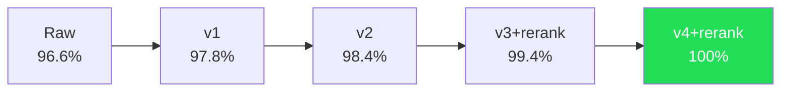

# 第15章：混合检索——从 96.6% 到 100%

> **定位**：本章分析 MemPalace 如何从纯向量检索的 96.6% R@5 跃迁到混合模式的 100%（500/500）。我们将拆解 3.4% 的失败案例类型、逐步改进的技术路径、Haiku 重排序的成本与原理，以及为什么不应将 100% 简单等同于"永远完美"。

---

## 96.6% 意味着什么

在 LongMemEval 基准测试的 500 个问题中，MemPalace 的纯 ChromaDB 模式——不调用任何外部 API，不使用任何 LLM，完全在本地运行——命中了 483 个。这是一个需要放在上下文中理解的数字。

LongMemEval 是一个标准化的 AI 记忆基准测试，包含六种问题类型：知识更新、多会话推理、时间推理、单会话用户问题、单会话偏好问题和单会话助手问题。R@5（Recall at 5）的含义是：在系统返回的前 5 个结果中，正确答案是否存在。96.6% 意味着在 500 个问题中，只有 17 个问题的正确答案不在前 5 个检索结果中。

做到这个成绩的系统，总共依赖了一个组件：ChromaDB 的默认嵌入模型（all-MiniLM-L6-v2）。没有任何后处理，没有任何重排序，没有任何"智能提取"。存储原始文本，嵌入，按余弦相似度排序，返回。

如果把这个基线落回产品代码，它对应的正是 `searcher.py` 里的默认搜索路径。`search_memories()` 的核心逻辑非常朴素：

```python
kwargs = {
    "query_texts": [query],
    "n_results": n_results,
    "include": ["documents", "metadatas", "distances"],
}
if where:
    kwargs["where"] = where

results = col.query(**kwargs)
```

（`searcher.py:109-117`）

也就是说，今天 `mempalace search` 和 MCP 里的 `mempalace_search`，默认仍然走这条 raw retrieval 路径：可选 `wing/room` 过滤，加上一轮 ChromaDB 语义查询，然后直接返回原文。后面要讨论的 hybrid、rerank、Palace mode，主要存在于 benchmark/实验脚本里，它们解释了系统如何从 96.6% 冲到 100%，但不应被误读成"当前 CLI 默认已经这样工作"。

这里还需要补上 `BENCHMARKS.md` 里的另一条口径：同一份文档在给出 full-500 的 `100%` 之外，也明确发布了 `hybrid_v4` 在 held-out 450 上的 `98.4% R@5 / 99.8% R@10`，并把它称为 "honest publishable number"。因此，本章中的 `100%` 应理解为完整 benchmark 上的 competitive story；若讨论这些修复在未见数据上的泛化，更应该同时把 `98.4%` 摆在旁边。

正如 `BENCHMARKS.md` 中写的：

> Nobody published this result because nobody tried the simple thing and measured it properly.

这句话指向了一个更深层的发现：整个 AI 记忆领域在存储阶段过度工程化了。当 Mem0 用 LLM 提取"用户偏好 PostgreSQL"并丢弃原始对话，当 Mastra 用 GPT 观察对话并生成摘要，它们都在存储阶段引入了不可逆的信息损失。MemPalace 证明了一个反直觉的事实：保留原始文本、依靠好的嵌入模型来检索，已经是一个极其强大的基线。

但 96.6% 不是 100%。那 17 个失败的问题告诉了我们什么？

---

## 3.4%：失败案例的解剖

对失败案例的分析揭示了几个清晰的模式。这些模式不是随机的——它们指向了向量检索的系统性盲区。

### 类型一：嵌入模型低估特定名词

`HYBRID_MODE.md` 中记录了典型案例：

- **"What degree did I graduate with?"** 正确答案是 "Business Administration"。嵌入模型将 "Business Administration" 和 "Computer Science" 视为语义上同样接近 "what degree"——两者都是学位名称，在嵌入空间中距离很近。但只有一个文档同时包含 "degree" 和 "Business Administration" 这两个词。
- **"What kitchen appliance did I buy?"** 正确答案是 "stand mixer"。"厨房电器" 在嵌入空间中是一个宽泛的语义区域，很多文档都与之相关。但 "stand mixer" 作为一个具体名词，只出现在一个特定的文档中。
- **"Where did I study abroad?"** 正确答案是 "Melbourne"。城市名在被大量上下文词汇包围时，其嵌入信号会被稀释。

共同特征：正确答案取决于一个具体的名词或短语，而嵌入模型倾向于捕捉"语义相近性"而非"精确匹配"。当多个文档在语义上都与查询相关时，嵌入模型无法区分哪个包含了那个具体的答案词。

### 类型二：时间锚点被嵌入忽略

"What was the significant business milestone I mentioned four weeks ago?" 这类问题包含一个时间锚——"四周前"。嵌入模型完全不处理时间信息。它不知道"四周前"对应哪个日期，也无法根据文档的时间戳来调整排序。正确的文档在语义上确实与查询相关（它确实是关于"商业里程碑"的），但在 top-50 的语义结果中，它的排名不够靠前，因为时间信号被忽略了。

### 类型三：偏好的间接表达

"What database do I prefer?" 这类问题在嵌入空间中与很多涉及数据库的文档都相关。但用户表达偏好的方式往往是间接的——"I find Postgres more reliable in my experience" 或 "I usually go with Postgres for new projects"。嵌入模型将这些句子理解为"关于 Postgres 的陈述"，而非"关于偏好的表达"。当 top-5 结果中有其他更"语义接近"的数据库讨论文档时，真正包含偏好的文档可能排在第 6 或第 7 位。

### 类型四：对助手回复的引用

"You suggested X, can you remind me..." 这类问题指的是 AI 助手说过的话，而非用户说的话。但标准的索引只存储用户发言。助手的回复不在搜索范围内，自然无法匹配。

---

## 从 96.6% 到 100%：五步跃迁

MemPalace 的改进路径是一系列针对具体失败模式的定向修复，不是猜测性的泛化优化。每一步都回应了上面分析的某个失败类型。`BENCHMARKS.md` 中记录了完整的演进轨迹。



### 第一步：混合评分 v1（96.6% -> 97.8%）

**回应的问题：** 类型一——特定名词被嵌入低估。

**方法：** 在嵌入相似度之上叠加关键词重叠评分。从查询中提取有意义的关键词（去掉停用词），计算每个候选文档中关键词的匹配比例，用这个比例来调整距离分数。

`HYBRID_MODE.md` 中记录了融合公式：

```python
fused_dist = dist * (1.0 - 0.30 * overlap)
```

- `dist`：ChromaDB 的余弦距离（越低越好）
- `overlap`：查询关键词在文档中出现的比例（0.0 到 1.0）
- `0.30`：提升权重——最多 30% 的距离缩减

一个具体的例子：文档 A 语义距离 0.45，关键词重叠为 0；文档 B 语义距离 0.52，但关键词完全匹配。融合后 A 的分数仍是 0.450，而 B 变成 0.364，从排名落后翻转到排名领先。

关键设计选择是候选池的扩大：从 top-10 扩大到 **top-50**。更大的候选池给了关键词重排序更多的工作空间——如果正确答案在语义排名第 45 位但关键词完全匹配，需要它在池子里才有机会被提升上来。

**为什么 30% 而不是更高？** `HYBRID_MODE.md` 中解释了这个权重的调优过程。在完整的 500 题测试中，0.30 和 0.40 的效果基本相同，高于 0.40 则开始出现过拟合的迹象（100 题子集上看起来更好，但在全部 500 题上并无改善）。30% 足以翻转边缘案例，但不会强到覆盖明显更好的语义结果。

停用词列表本身也经过了审慎的设计：

```python
STOP_WORDS = {
    "what", "when", "where", "who", "how", "which", "did", "do",
    "was", "were", "have", "has", "had", "is", "are", "the", "a",
    "an", "my", "me", "i", "you", "your", ...
}
```

只有 3 个字符以上且不在停用词表中的词才被视为关键词。这过滤掉了问句中的功能词，保留了有检索价值的内容词。

### 第二步：混合评分 v2（97.8% -> 98.4%）

**回应的问题：** 类型二——时间锚点被忽略。

**方法：** 对包含时间引用的问题（"四周前"、"上个月"、"最近"），计算每个候选文档的日期与目标日期的距离，给时间上接近的文档一个额外的评分提升。

```python
days_diff = abs((session_date - target_date).days)
temporal_boost = max(0.0, 0.40 * (1.0 - days_diff / window_days))
fused_dist = fused_dist * (1.0 - temporal_boost)
```

最大 40% 的时间提升——足以把时间正确的文档推到前面，但不会完全覆盖语义信号。`HYBRID_MODE.md` 中特别解释了为什么不用 100%：时间接近是一个强信号但不是决定性信号，它是"提示"而非"规则"。

此外，v2 还引入了两轮检索机制来处理类型四（助手引用问题）：第一轮用仅包含用户发言的索引找到最可能的 5 个会话，第二轮对这 5 个会话重新建立包含助手发言的索引，再次查询。这种"先粗后精"的策略避免了全局索引助手发言带来的语义信号稀释。

整个 v2 的关键特征是：**零 LLM 调用**。所有改进都是基于字符串匹配和日期运算——完全在本地完成，不需要 API 密钥，不需要网络连接。

### 第三步：混合评分 v2 + Haiku 重排序（98.4% -> 98.8%）

这是系统第一次引入 LLM。

`longmemeval_bench.py:2765-2860` 中实现的 `llm_rerank()` 函数揭示了重排序的完整机制：

```python
def llm_rerank(question, rankings, corpus, corpus_ids, api_key, 
               top_k=10, model="claude-haiku-4-5-20251001"):
```

工作流程极其简洁：取检索返回的 top-K 个候选文档，每个截取前 500 个字符，与问题一起发送给 Haiku，让它从中选出"最可能包含答案"的那一个。被选中的文档提升到第 1 名，其余保持原有顺序。

提示词的设计刻意保持简单（`longmemeval_bench.py:2807-2814`）：

```
Question: {question}

Below are {N} conversation sessions from someone's memory. 
Which single session is most likely to contain the answer? 
Reply with ONLY a number between 1 and {N}. Nothing else.

Session 1: {text[:500]}
...

Most relevant session number:
```

**为什么只选一个，而不是做完整重排序？** `HYBRID_MODE.md` 中的解释很直接：要求完整重排序会增加提示复杂度和错误率。选一个最好的是"果断且可靠的"。剩余的排名保持混合评分的顺序——这个顺序本身已经很好了。

**容错设计也值得注意。** 如果 API 调用失败（超时、限流、没有密钥），函数会捕获异常并返回原始排名，不做任何修改（`longmemeval_bench.py:2851-2858`）。系统不会因为重排序步骤出错而崩溃。这是一个可选的增强，不是必要的依赖。

### 第四步：混合评分 v3 + Haiku 重排序（98.8% -> 99.4%）

**回应的问题：** 类型三——偏好的间接表达。

这一步引入了**偏好提取**——用 16 个正则表达式模式在索引阶段检测用户的偏好表达：

```python
PREF_PATTERNS = [
    r"i've been having (?:trouble|issues?|problems?) with X",
    r"i prefer X",
    r"i usually X",
    r"i want to X",
    r"i'm thinking (?:about|of) X",
    # ...
]
```

当某个会话中检测到偏好表达时，系统生成一个合成文档——例如 `"User has mentioned: battery life issues on phone; looking at phone upgrade options"`——并将它添加到 ChromaDB 中，与原始会话使用相同的 `corpus_id`。这个合成文档直接桥接了查询词汇和会话内容之间的语义鸿沟。

同时，v3 将 Haiku 重排序的候选池从 top-10 扩大到 top-20。一些助手引用类型的失败案例中，正确的会话排在第 11-12 名——刚好在 Haiku 看得见的窗口之外。扩大到 20 个捕获了这些边缘案例，而增加的提示成本可以忽略不计。

99.4% 是一个值得标记的里程碑：在 500 个问题中只剩 3 个未命中。更重要的是，`BENCHMARKS.md` 中记录了一个独立验证——Palace 模式（一种完全不同的检索架构，基于 hall 分类和两轮导航）也恰好达到了 99.4%。两种独立架构收敛在同一个分数上，这强烈暗示 99.4% 接近这个问题的架构性上限。

### 第五步：混合评分 v4 + Haiku 重排序（99.4% -> 100%）

最后 3 个失败问题被逐一分析和修复。`BENCHMARKS.md` 中记录了每一个：

**问题 1：引用短语。** 某个问题包含一个用单引号括起来的精确短语。修复：检测引号内的短语，对包含该短语的会话给予 60% 的距离缩减。

**问题 2：人名权重不足。** 某个关于特定人物的时间推理问题。嵌入模型对专有名词给予的权重不够。修复：从查询中提取大写的专有名词，对提及该名字的会话给予 40% 的距离缩减。

**问题 3：记忆/怀旧模式。** 某个偏好问题涉及高中经历。修复：在偏好提取模式中增加 `"I still remember X"`、`"I used to X"`、`"when I was in high school X"` 等模式。

结果：500/500。所有 6 种问题类型全部 100%。

**交叉验证：Haiku 与 Sonnet。** `BENCHMARKS.md` 报告了一个细节：使用 Haiku 和 Sonnet 作为重排序器都能达到 100% R@5，NDCG@10 分别为 0.976 和 0.975——统计上无差异。Haiku 便宜约 3 倍，因此被推荐为默认选择。

但同一份 `BENCHMARKS.md` 也紧接着给出了一个更克制的数字：`hybrid_v4` 在一个未参与调参的 held-out 450 split 上，无 rerank 条件下拿到 `98.4% R@5 / 99.8% R@10`。这组数字不能和 "100% + rerank" 直接并排比较，但它提供了一个关键的边界感：v4 的修复并非完全失效，它们在未见数据上仍然泛化；只是"dev set 500/500"并不是理解泛化能力的唯一数字。

---

## 向量距离 vs 语义理解

这五步改进的历程揭示了一个根本性的区分：**向量距离不等于语义理解。**

向量距离衡量的是两段文本在嵌入空间中的几何距离。当你问 "What database do I prefer?" 而系统中有三个关于数据库的会话时，嵌入模型会告诉你"这三个都跟数据库有关，距离差不多"。但回答这个问题需要的不是"找到关于数据库的文档"，而是"找到用户表达了数据库偏好的那个文档"。这是一个语义推理任务，不是一个距离计算任务。

这就是为什么 Haiku 重排序如此有效。嵌入模型只能说"这些文档跟查询相关"。Haiku 能做的是读取查询和候选文档，然后推理哪个文档实际上回答了这个问题。前者是几何运算，后者是阅读理解。

但值得注意的是：96.6% 的问题不需要这种推理。对于绝大多数问题，向量距离就是语义理解的一个足够好的近似。只有 3.4% 的边缘案例需要真正的阅读理解能力来区分"语义相关"和"实际回答"。

这个比例很重要。它意味着：

1. 向量检索本身是一个极强的基线，不应该被低估。
2. LLM 重排序不是核心功能的替代，而是边缘案例的补丁。
3. 系统在没有任何 LLM 的情况下已经是可用的、有竞争力的。

---

## 成本：$0.70/年的算术

让我们计算 Haiku 重排序的实际成本。

每次重排序调用发送的内容：1 个问题 + 10 个候选文档各 500 字符 = 大约 5000 字符 = ~1250 token 的输入。Haiku 的回复是一个数字——大约 2 token。按 Haiku 的定价，每次调用成本约 $0.001。

如果一个用户每天进行 5 次需要深度搜索的对话，每次搜索触发一次 Haiku 重排序：

```
5 次/天 * 365 天 * $0.001/次 = $1.83/年
```

但实际上不是每次搜索都需要重排序。大多数查询在纯向量检索阶段就能得到正确结果（96.6% 的情况）。如果只对低置信度的结果触发重排序，实际调用频率会更低。

这里还要把两笔账分开。README 中引用的 "$0.70/年" 更具体地指向唤醒成本；而这里讨论的是 **rerank 的增量成本**。两者相关，但不是同一个预算项。对读者来说，更重要的结论是：96.6% 是默认产品路径的零 API 成绩；100% 则来自 benchmark 中额外叠加的混合检索与重排序。

对比之下，MemPalace 的年度成本（纯本地 $0，加 Haiku 重排序 ~$1-2）与竞品（Mem0、Zep 等年费 $228-$2,988）之间的差异不是百分之几十——是三个数量级。完整的竞品对比数据详见第 23 章。

---

## 不要将 100% 当作"永远完美"

这一点必须说清楚，因为 MemPalace 的团队自己也反复强调了这个警告。

100% R@5 是在 LongMemEval 的完整 500 个问题上测得的。这 500 个问题覆盖了六种类型，由学术团队设计，是目前 AI 记忆系统最标准的评估基准。这个分数是可重复的、经过验证的、有完整的复现脚本的。

但 `BENCHMARKS.md` 自己也没有让读者停在这里。它同时公布了一个 held-out 450 split：`hybrid_v4` 在这组未参与调参的问题上拿到 `98.4% R@5 / 99.8% R@10`，并明确称之为 "honest publishable number"。这提醒我们，500/500 是一个真实的 benchmark 成绩，但理解泛化时，还要看更克制的 held-out 数字。

但它仍然是一个特定测试集上的特定指标。以下是几个需要注意的边界条件：

**测试集规模。** 500 个问题足以进行有统计意义的对比（置信区间足够窄），但不足以代表所有可能的记忆检索场景。真实世界的查询多样性远超 500 个问题。

**问题类型分布。** LongMemEval 的六种问题类型是学术团队定义的分类。真实用户的查询可能包含这六种之外的类型——比如跨模态引用（"上次你给我画的那个架构图"）或元认知问题（"我在这个问题上反复改变了几次主意"）。

**数据特征。** 基准测试使用的是研究团队准备的对话数据。不同用户的对话风格、话题分布和表达习惯可能显著不同。

**v4 的定向修复。** 从 v3 到 v4 的三个修复（引用短语提取、人名提升、怀旧模式检测）是针对特定失败问题设计的。这些修复在测试集上完美工作，但在面对全新的失败模式时不一定适用。这是任何数据驱动优化的固有局限。

`BENCHMARKS.md` 中对此有一个诚实的表述：

> The 96.6% is the product story: free, private, one dependency, no API key, runs entirely offline.
> The 100% is the competitive story: a perfect score on the standard benchmark for AI memory.
> Both are real. Both are reproducible. Neither is the whole picture alone.

96.6%、100% 和 98.4% 是同一个系统的三个侧面。96.6% 是产品默认路径的底线能力——不依赖任何外部服务，在任何环境下都能工作；100% 是完整 benchmark 上的竞争成绩——但需要额外的 rerank 路径；98.4% 则是 benchmark 文档自己公布的 held-out 泛化数字。三者一起看，才是比较完整的技术画像。

---

## 两条独立路径的收敛

在结束本章之前，值得再提一个验证 MemPalace 检索上限的有力证据。

在混合评分路径（hybrid v1 -> v2 -> v3 -> v4）之外，团队独立开发了 **Palace 模式**——一种完全不同的检索架构，基于 hall 分类和两轮导航。Palace 模式将每个会话分类到五个 hall 之一（偏好、事实、事件、助手建议、通用），查询时先在最可能的 hall 内做紧凑搜索（减少噪声），再在全量数据上做 hall 加权搜索（防止分类错误导致遗漏）。

这两条路径在 99.4% R@5 精确收敛。`BENCHMARKS.md` 将此称为"独立架构收敛"——不同的设计、不同的代码路径、相同的分数上限。当两种独立方法在同一个天花板碰头，这比任何单一实验都更有力地说明了天花板的真实性。

最终的 v4 突破 99.4% 达到 100%，靠的是三个极其定向的修复——本质上是把最后三个边缘案例"手动解开"了。这些修复有效，但它们的定向性本身就说明了一个事实：在这个问题上，"通用改进"已经到达了它的极限，剩下的只能靠"逐个击破"。

这不是贬义。恰恰相反，它说明了 MemPalace 的基础架构——原始文本 + 结构化存储 + 嵌入检索——已经足够强，以至于只有极少数的、高度特殊的案例需要额外处理。96.6% 是架构的力量。3.4% 到 0% 的旅程是精细工程的力量。两者缺一不可，但重点不同：前者可迁移，后者需适配。

如果你在设计自己的记忆系统，96.6% 的设计原则（存储原文、结构化组织、嵌入检索）是可以直接借鉴的。从 96.6% 到 100% 的定向优化则需要根据你自己的失败案例来定制。这是本章最核心的启示：**不要从优化开始。从基线开始，然后让失败案例告诉你该优化什么。**
