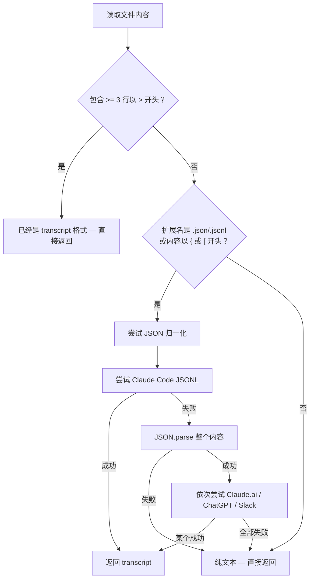

# 第16章：格式归一化

> **定位**：数据进入记忆宫殿的第一道关卡。五种聊天格式，五种不同的数据结构，但宫殿只接受一种。本章讲 normalize.py 如何用不到 250 行代码完成这个翻译工作——不用任何 ML，不调任何 API，纯粹的模式匹配和结构转换。

---

## 问题：每个平台都发明了自己的格式

如果你和 AI 对话，你的对话历史可能散落在五个不同的地方。

Claude Code 把会话存成 JSONL——每行一个 JSON 对象，`type` 字段区分 `human` 和 `assistant`。Claude.ai 的 Web 端导出的是标准 JSON 数组，每个元素有 `role` 和 `content`。ChatGPT 用一种树形结构——`mapping` 字段下挂着一棵节点树，每个节点有 `parent` 和 `children`，消息埋在 `message.content.parts` 里。Slack 导出的是消息列表，`type` 固定为 `"message"`，用户身份藏在 `user` 字段里。还有一种最朴素的格式：纯文本，人类的话用 `>` 标记，AI 的回复直接跟在后面。

五种格式，五种数据结构，五种关于"什么是一轮对话"的理解。

如果你要对这些对话做任何下游处理——分块、检索、实体检测——你有两个选择。

**选择 A：每种格式单独处理。** 写五套分块逻辑，五套实体检测逻辑，五套检索逻辑。每加一种新格式，所有下游模块都要改一遍。这是 N x M 问题——N 种输入格式乘以 M 个处理步骤。

**选择 B：先统一格式，再处理。** 写五个格式转换器和一套下游逻辑。每加一种新格式，只需要多写一个转换器。这是 N + M 问题。

MemPalace 选了 B。`normalize.py` 就是那个 N 到 1 的翻译层。

---

## 统一输出：transcript 格式

不管输入是什么格式，`normalize()` 的输出永远是同一种文本格式：

```
> 用户说的话
AI 的回复

> 用户的下一个问题
AI 的下一个回复

```

规则很简单：

- 用户的话以 `>` 开头（借用 Markdown 引用语法）
- AI 的回复紧跟在用户的话后面，不加任何前缀
- 每轮问答之间用空行分隔

这就是 MemPalace 内部的"通用语"。后续的分块器（第 18 章）、实体检测器（第 17 章）、检索引擎——它们只需要认识这一种格式。

为什么选这种格式而不是 JSON？因为下游最终需要的是纯文本。向量嵌入需要文本，语义搜索需要文本，展示给用户看的也是文本。用 JSON 做中间格式意味着每个下游消费者都要解析 JSON 再提取文本，多了一层不必要的间接。直接用文本，省去这一步。

`>` 标记的设计也有讲究。它让"区分谁在说话"变成了一个 `O(1)` 操作——看行首有没有 `>`，有就是用户，没有就是 AI。不需要维护状态机，不需要解析 JSON，一个 `startswith(">")` 就够了。

---

## 检测分支：五种格式的识别逻辑

`normalize()` 函数（`normalize.py:22`）是整个模块的入口。它的检测逻辑分三层：



第一层判断在 `normalize.py:37-39`：

```python
lines = content.split("\n")
if sum(1 for line in lines if line.strip().startswith(">")) >= 3:
    return content
```

如果文件里已经有 3 行以上以 `>` 开头的内容，认为它已经是 transcript 格式，直接返回。阈值选 3 而不是 1 或 2，是为了避免 Markdown 文件里偶尔出现的引用块触发误判。

第二层判断在 `normalize.py:43`：

```python
ext = Path(filepath).suffix.lower()
if ext in (".json", ".jsonl") or content.strip()[:1] in ("{", "["):
    normalized = _try_normalize_json(content)
```

这里用了双重条件——既看扩展名，也看内容的第一个字符。扩展名能覆盖正常命名的文件，内容嗅探能覆盖扩展名不对（比如 `.txt` 实际存的是 JSON）的情况。

第三层是 fallback。如果既不是 transcript，也不是 JSON，就当纯文本原样返回。纯文本会在后续的分块阶段用段落分块策略处理（见第 18 章）。

---

## 五种格式的具体解析

### 格式一：Claude Code JSONL

Claude Code 的会话导出是 JSONL 格式——每行一个独立的 JSON 对象。解析函数是 `_try_claude_code_jsonl()`（`normalize.py:71`）。

输入示例：

```jsonl
{"type": "human", "message": {"content": "解释一下 Python 的 GIL"}}
{"type": "assistant", "message": {"content": "GIL 是全局解释器锁..."}}
{"type": "human", "message": {"content": "那多线程还有意义吗？"}}
{"type": "assistant", "message": {"content": "有意义，取决于你的场景..."}}
```

关键识别信号是 `type` 字段——`"human"` 或 `"assistant"`。解析逻辑逐行读取，跳过解析失败的行，跳过非字典的行，只提取 `type` 和 `message.content`。

最后的验证条件在 `normalize.py:92`：

```python
if len(messages) >= 2:
    return _messages_to_transcript(messages)
return None
```

至少需要 2 条消息才认为解析成功。这是所有格式解析器共享的最低门槛——一问一答才构成一次有意义的对话。

注意这个函数在 `_try_normalize_json()` 中的位置（`normalize.py:54`）——它排在所有 JSON 解析器的最前面，而且在 `json.loads()` 之前执行。原因是 JSONL 不是合法的 JSON，对整个内容调 `json.loads()` 会失败。所以必须先尝试逐行解析。

### 格式二：Claude.ai JSON

Claude.ai 网页端导出的是标准 JSON。解析函数是 `_try_claude_ai_json()`（`normalize.py:97`）。

输入示例：

```json
[
  {"role": "user", "content": "什么是记忆宫殿？"},
  {"role": "assistant", "content": "记忆宫殿是一种古老的记忆术..."}
]
```

或者包裹在外层对象里：

```json
{
  "messages": [
    {"role": "human", "content": "..."},
    {"role": "ai", "content": "..."}
  ]
}
```

这个解析器的灵活性体现在两个地方。一是外层结构——既接受直接的数组，也接受包含 `messages` 或 `chat_messages` 键的对象（`normalize.py:99-100`）。二是角色名——`"user"` 和 `"human"` 都认为是用户，`"assistant"` 和 `"ai"` 都认为是 AI（`normalize.py:109-112`）。这种宽松的解析策略不是马虎，是实用主义——Claude 的 API 和 Web 端在不同版本里用过不同的字段名，与其猜"当前版本用的是哪个"，不如全部支持。

### 格式三：ChatGPT conversations.json

ChatGPT 的导出格式是所有格式中最复杂的。解析函数是 `_try_chatgpt_json()`（`normalize.py:118`）。

ChatGPT 不用线性数组存储对话，而是用一棵树。为什么？因为 ChatGPT 支持"编辑之前的消息并重新生成"——用户可以回到对话中的任意一点，修改自己的提问，生成一个新的分支。这棵树就是用来表示这些分支的。

输入示例（简化版）：

```json
{
  "mapping": {
    "root-id": {
      "parent": null,
      "message": null,
      "children": ["msg-1"]
    },
    "msg-1": {
      "parent": "root-id",
      "message": {
        "author": {"role": "user"},
        "content": {"parts": ["什么是向量数据库？"]}
      },
      "children": ["msg-2"]
    },
    "msg-2": {
      "parent": "msg-1",
      "message": {
        "author": {"role": "assistant"},
        "content": {"parts": ["向量数据库是一种专门用于..."]}
      },
      "children": []
    }
  }
}
```

识别信号是顶层有 `mapping` 键（`normalize.py:120`）。解析策略是找到根节点（`parent` 为 `null` 且没有 `message` 的节点），然后沿着每个节点的第一个 `children` 一路走下去，形成一条线性路径。

这里有一个设计决策：当一个节点有多个 `children`（即用户编辑过消息产生了分支），只取第一个分支（`normalize.py:153`）。这意味着会丢失分支历史。这是一个有意识的取舍——对于记忆存储来说，保留"最终的对话走向"比保留"所有可能的分支"更有价值。如果保留所有分支，后续检索时会产生大量近似重复的结果。

遍历过程还有一个 `visited` 集合（`normalize.py:140`）防止循环引用——虽然正常的 ChatGPT 导出不应该有环，但防御性编程总是值得的。

### 格式四：Slack JSON

Slack 的频道导出是消息数组。解析函数是 `_try_slack_json()`（`normalize.py:159`）。

输入示例：

```json
[
  {"type": "message", "user": "U123", "text": "部署之前要跑测试吗？"},
  {"type": "message", "user": "U456", "text": "必须跑。CI 里有配置。"},
  {"type": "message", "user": "U123", "text": "好的，我先跑一遍本地的。"}
]
```

Slack 和其他格式有一个本质区别：它不是"用户 vs AI"的对话，而是"人 vs 人"的对话。没有天然的"提问者"和"回答者"角色。

解析器的处理策略很巧妙（`normalize.py:177-186`）：第一个出现的用户被标记为 `"user"`，第二个出现的用户被标记为 `"assistant"`。如果有第三、第四个参与者，它们的角色取决于当时 `last_role` 的值——交替分配 `user` 和 `assistant`。

```python
if not seen_users:
    seen_users[user_id] = "user"
elif last_role == "user":
    seen_users[user_id] = "assistant"
else:
    seen_users[user_id] = "user"
```

这不是在声称"某人是 AI"，而是在用 user/assistant 的交替结构来保证后续的问答对分块能正常工作。在 transcript 格式中，`>` 标记的是"提问方"，没有标记的是"回答方"。对于 Slack DM 来说，谁是提问方谁是回答方其实是交替的——你问我一个问题，我回答，然后我问你一个问题，你回答。交替分配角色，恰好匹配了这种自然的对话节奏。

### 格式五：纯文本

纯文本没有专门的解析器。如果一个文件既不是 transcript 格式也不是 JSON 格式，`normalize()` 直接返回原始内容（`normalize.py:48`）。

这些文件会在分块阶段被 `convo_miner.py` 的 `_chunk_by_paragraph()` 处理（见第 18 章），按段落或按行组分块。

---

## 内容提取：统一处理多态内容

五种格式中，"消息内容"的表示方式各不相同。Claude Code 的 `content` 可能是字符串，可能是包含 `{"type": "text", "text": "..."}` 的数组；ChatGPT 的内容藏在 `content.parts` 里，是字符串数组；Claude.ai 的也可能是字符串或数组。

`_extract_content()` 函数（`normalize.py:192`）是处理这种多态性的统一入口：

```python
def _extract_content(content) -> str:
    if isinstance(content, str):
        return content.strip()
    if isinstance(content, list):
        parts = []
        for item in content:
            if isinstance(item, str):
                parts.append(item)
            elif isinstance(item, dict) and item.get("type") == "text":
                parts.append(item.get("text", ""))
        return " ".join(parts).strip()
    if isinstance(content, dict):
        return content.get("text", "").strip()
    return ""
```

三种类型，三条分支，最后兜底返回空字符串。这个函数被所有格式解析器共享，避免了每个解析器各自处理内容多态的重复代码。

值得注意的是 `list` 分支中对数组元素的两种处理：如果元素是字符串就直接取，如果元素是字典且 `type` 为 `"text"` 就取 `text` 字段。这覆盖了 Claude API 的内容块格式（`[{"type": "text", "text": "..."}, {"type": "image", ...}]`），同时自动跳过了图片等非文本内容块。

---

## 转录生成：从消息列表到 transcript

所有格式解析器最终都会调用 `_messages_to_transcript()`（`normalize.py:209`），把 `[(role, text), ...]` 列表转成 transcript 文本。

这个函数的核心逻辑是配对——找到一个 `user` 消息后，看下一条是不是 `assistant`，如果是就配成一对，如果不是（比如连续两条 `user`）就单独输出用户消息。

```python
while i < len(messages):
    role, text = messages[i]
    if role == "user":
        if _fix is not None:
            text = _fix(text)
        lines.append(f"> {text}")
        if i + 1 < len(messages) and messages[i + 1][0] == "assistant":
            lines.append(messages[i + 1][1])
            i += 2
        else:
            i += 1
    else:
        lines.append(text)
        i += 1
    lines.append("")
```

这里还有一个细节：用户消息会经过拼写检查（`spellcheck_user_text`，通过可选导入引入）。为什么只检查用户的文本？因为 AI 的输出几乎不会有拼写错误，而用户在聊天框里打字经常会有 typo。归一化阶段修正这些拼写错误，可以提高后续向量检索的准确度——"waht is GIL" 和 "what is GIL" 在嵌入空间中可能会有不小的距离。

---

## 架构选择的深层逻辑

回到开头的 N + M vs N x M 问题。MemPalace 的归一化层不仅仅是"少写点代码"这么简单。它带来了三个更深层的好处。

**第一，解耦了输入和处理。** 当 2025 年底某个新的 AI 对话平台出现时（比如 Gemini 的导出格式），你只需要在 `normalize.py` 里加一个 `_try_gemini_json()` 函数。分块器不需要改，检索器不需要改，实体检测器不需要改。

**第二，让测试变得可控。** 下游模块只需要用 transcript 格式写测试用例。不需要准备五种格式的测试数据，不需要维护五套测试矩阵。格式转换的正确性由 `normalize.py` 的单元测试单独保证。

**第三，尽量保持了数据的语义。** 归一化过程主要做格式转换，不做摘要或裁剪（拼写检查除外）。原始的问答结构和对话顺序大体会被保留下来，但"说话人身份"并不是所有格式里都能完整保留：例如 Slack 的 3+ 人对话会被折叠成 `user/assistant` 交替结构，以便后续的 exchange chunking 工作。这一点很重要：归一化是近乎无损的，但分支历史和部分原始角色信息会被简化。

整个 `normalize.py` 文件只有 253 行，没有外部依赖（只用了 `json`、`os`、`pathlib` 这些标准库），没有调用任何网络 API。它在本地运行，速度几乎是瞬时的。这种极简性不是偶然的——它是"数据管道第一层应该尽可能简单可靠"这个工程原则的直接体现。如果归一化层本身就复杂到需要调试，那它就失去了存在的意义。

---

## 小结

格式归一化解决的是一个看起来不起眼但极其重要的问题：在混乱的现实世界数据和整洁的内部表示之间建一座桥。五种格式进来，一种格式出去。下游模块永远不需要关心"这个数据原来是从 ChatGPT 导出的还是从 Slack 导出的"这种问题。

关键设计点：

- **检测优先级**：transcript 直通 > JSONL 逐行尝试 > JSON 整体解析 > 纯文本兜底
- **宽松解析**：多种角色名都接受（`user`/`human`、`assistant`/`ai`），外层结构灵活（数组或对象）
- **统一输出**：`> user turn` + `assistant response` + 空行，极简但信息完整
- **近乎无损转换**：不做摘要，但会在分支和部分角色标记上做简化
- **零外部依赖**：标准库足矣

下一章，我们将看到归一化后的文本如何被扫描以发现其中提到的人物和项目——不用机器学习，不用 NER 模型，只用正则表达式和一套评分算法。
