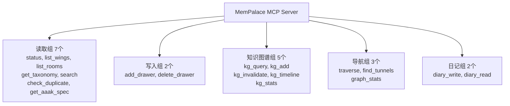

# 第19章：MCP 服务器——19 个工具的 API 设计

> **定位**：本章剖析 MemPalace 如何通过 19 个 MCP 工具将记忆宫殿暴露给 AI，以及为什么 `mempalace_status` 的响应结构不仅返回数据，还同时教会 AI 一种语言和一套行为协议。

---

## 一个工具就够了，为什么是 19 个？

设计 API 的经典张力是粒度问题。给得太粗——一个万能工具——AI 需要在调用参数中表达所有意图，prompt 变成了微型编程语言。给得太细——每个操作一个工具——AI 淹没在选择中，每次决策都增加 token 消耗。

MemPalace 选择了 19 个工具，不是因为恰好有 19 种操作，而是因为这 19 个工具映射到 5 个认知类别，每个类别对应 AI 在记忆交互中的一种角色。这不是功能清单，而是角色模型。

让我们从源码出发。打开 `mcp_server.py`，工具注册在第 441-688 行的 `TOOLS` 字典中。每个工具是一个键值对：名称映射到包含 `description`、`input_schema`、`handler` 三个字段的字典。注册方式极其朴素——没有装饰器，没有注册中心，就是一个 Python 字典：

```python
TOOLS = {
    "mempalace_status": {
        "description": "Palace overview — ...",
        "input_schema": {"type": "object", "properties": {}},
        "handler": tool_status,
    },
    # ... 18 more tools
}
```

这种朴素不是偷懒。MCP 协议本身就是 JSON-RPC——客户端发送 `tools/list`，服务器返回工具列表；客户端发送 `tools/call`，服务器执行并返回结果。`mcp_server.py:708-718` 中的 `handle_request` 函数处理 `tools/list` 请求时，直接遍历 `TOOLS` 字典生成响应。整个协议交互不超过 30 行代码。朴素意味着透明，透明意味着任何开发者都能在五分钟内理解整个注册机制。

---

## 五组工具，五种角色

19 个工具按认知角色分为五组。先看全貌，再逐一拆解为什么这样分。

**读取组（7 个）**——让 AI 感知宫殿的结构和内容：`status`、`list_wings`、`list_rooms`、`get_taxonomy`、`search`、`check_duplicate`、`get_aaak_spec`。

**写入组（2 个）**——让 AI 往宫殿里存东西：`add_drawer`、`delete_drawer`。

**知识图谱组（5 个）**——让 AI 操作实体关系：`kg_query`、`kg_add`、`kg_invalidate`、`kg_timeline`、`kg_stats`。

**导航组（3 个）**——让 AI 在宫殿中行走和探索：`traverse`、`find_tunnels`、`graph_stats`。

**日记组（2 个）**——让 AI 保持跨会话的自我意识：`diary_write`、`diary_read`。

这个分组不是按技术实现分的。`search` 和 `traverse` 底层都查询 ChromaDB，但前者是"找内容"，后者是"走路径"。`kg_query` 和 `search` 都是检索，但前者检索的是结构化关系，后者检索的是非结构化文本。分组标准是 AI 在调用这个工具时扮演的角色：它是在观察、在记录、在推理、在探索、还是在反思？



为什么写入组只有 2 个，而读取组有 7 个？因为记忆系统的核心不对称性：**写入是简单的（把东西放进去），读取是复杂的（从不同角度把东西找出来）**。一个房间只有一扇门可以进入，但有七扇窗户可以观察。`list_wings` 是鸟瞰，`list_rooms` 是局部放大，`get_taxonomy` 是完整地图，`search` 是语义定位，`check_duplicate` 是入库前的去重门禁，`get_aaak_spec` 是语言参考手册。每一扇窗户对应一种不同的认知需求。

---

## mempalace_status：一个工具调用，三重载荷

在 19 个工具中，`mempalace_status` 的地位是特殊的。它不仅返回数据——它教会 AI 两样东西：一种语言（AAAK）和一套行为协议（记忆协议）。

看 `mcp_server.py:63-86` 中 `tool_status` 的返回结构：

```python
def tool_status():
    col = _get_collection()
    if not col:
        return _no_palace()
    count = col.count()
    wings = {}
    rooms = {}
    # ... count logic ...
    return {
        "total_drawers": count,
        "wings": wings,
        "rooms": rooms,
        "palace_path": _config.palace_path,
        "protocol": PALACE_PROTOCOL,
        "aaak_dialect": AAAK_SPEC,
    }
```

前四个字段是常规状态数据——抽屉总数、wing 分布、room 分布、存储路径。后两个字段是关键：`protocol` 和 `aaak_dialect`。

**第一重载荷：宫殿概览。** `total_drawers`、`wings`、`rooms` 告诉 AI "你的记忆有多大、分成几块、每块有什么"。这是空间感知——AI 看到这些数字后，知道在 `wing_user` 里搜索个人偏好，在 `wing_code` 里搜索技术决策。

**第二重载荷：记忆协议。** `PALACE_PROTOCOL` 是一段纯文本指令，定义在 `mcp_server.py:93-100`。它规定了 AI 的五步行为规范：

```
1. ON WAKE-UP: Call mempalace_status to load palace overview + AAAK spec.
2. BEFORE RESPONDING about any person, project, or past event:
   call mempalace_kg_query or mempalace_search FIRST. Never guess — verify.
3. IF UNSURE about a fact: say "let me check" and query the palace.
4. AFTER EACH SESSION: call mempalace_diary_write to record what happened.
5. WHEN FACTS CHANGE: call mempalace_kg_invalidate on the old fact,
   mempalace_kg_add for the new one.
```

这不是建议，而是协议。它把 AI 从"有记忆可用的工具调用者"提升为"主动维护记忆的代理"。第 2 条尤其关键——"Never guess, verify"——它直接对抗 LLM 的核心弱点：幻觉。当 AI 被问到"Max 几岁了"时，协议要求它先查询知识图谱，而不是从训练数据中猜一个答案。

**第三重载荷：AAAK 方言规范。** `AAAK_SPEC` 定义在 `mcp_server.py:102-119`，是一份完整的压缩语言规范。它教会 AI 三样东西：实体编码（`ALC=Alice, JOR=Jordan`）、情绪标记（`*warm*=joy, *fierce*=determined`）、和结构语法（管道分隔、星级评分、hall/wing/room 命名法）。

为什么把语言规范嵌入 status 响应，而不是单独放一个工具？因为 MCP 的调用时机。AI 第一次连接宫殿时，最自然的动作就是调用 `status`——"看看这里有什么"。如果 AAAK 规范在另一个工具里，AI 需要两次调用才能完成初始化。把它塞进 status，一次调用完成三件事：了解宫殿结构、学会行为协议、掌握压缩语言。

这个设计的底层哲学是：**API 不仅传递数据，还传递行为模式。** 传统 API 假设调用者已经知道如何使用数据。但当调用者是一个没有持久记忆的 LLM 时，API 必须在每次会话中重新教育调用者。`mempalace_status` 的三重载荷正是为此设计的。

---

## mempalace_search：语义检索的接口克制

`mempalace_search` 是使用频率最高的工具，但它的接口设计极其克制。看 `mcp_server.py:587-600` 中的 schema：

```python
"mempalace_search": {
    "input_schema": {
        "type": "object",
        "properties": {
            "query": {"type": "string"},
            "limit": {"type": "integer"},
            "wing": {"type": "string"},
            "room": {"type": "string"},
        },
        "required": ["query"],
    },
    "handler": tool_search,
}
```

四个参数，只有 `query` 是必填的。`wing` 和 `room` 是可选过滤器。没有排序选项、没有分页、没有嵌入模型选择、没有距离度量参数。

这种克制是刻意的。它的底层逻辑来自宫殿结构带来的检索增益：在 22,000+ 记忆上的测试中，不加过滤的全量搜索只有 60.9% 的 R@10，加上 wing 过滤跳到 73.1%，加上 wing + room 过滤跳到 94.8%。也就是说，过滤器是主要的精度杠杆，而非搜索算法本身。

所以接口的设计重心放在过滤器上——让 AI 很容易表达"在这个 wing 的这个 room 里找"——而把搜索算法的复杂度完全封装掉。AI 不需要知道底层用的是 ChromaDB 的余弦相似度还是欧氏距离，它只需要知道"给我一个词、一个可选的范围"。

handler 实现同样简洁。`tool_search` 在 `mcp_server.py:173-180` 中只有一行有效代码——直接调用 `searcher.py` 中的 `search_memories` 函数：

```python
def tool_search(query, limit=5, wing=None, room=None):
    return search_memories(
        query, palace_path=_config.palace_path,
        wing=wing, room=room, n_results=limit,
    )
```

`search_memories`（`searcher.py:87-142`）返回一个结构化的字典，包含每条结果的原文、wing、room、来源文件和相似度分数。注意它返回的是原文——"the actual words, never summaries"——这是 MemPalace 的核心承诺。AI 拿到的是逐字记忆，不是某个摘要模型对记忆的再解读。

---

## mempalace_add_drawer：写入即去重

写入工具只有两个，但 `add_drawer` 的实现比它的接口暗示的更复杂。看 `mcp_server.py:250-287`：

```python
def tool_add_drawer(wing, room, content,
                    source_file=None, added_by="mcp"):
    col = _get_collection(create=True)
    # Duplicate check
    dup = tool_check_duplicate(content, threshold=0.9)
    if dup.get("is_duplicate"):
        return {
            "success": False,
            "reason": "duplicate",
            "matches": dup["matches"],
        }
    # ... generate ID, store, return success
```

关键行为：在存储之前，它自动调用 `tool_check_duplicate` 做语义去重。阈值是 0.9——如果宫殿里已经有一条记忆与新内容的余弦相似度超过 90%，写入被拒绝，并返回已有的匹配记录。

这个设计把去重逻辑从 AI 的责任中移除了。没有这个机制，AI 需要在每次写入前手动调用 `check_duplicate`，而 LLM 经常"忘记"做这种防御性操作。内建去重意味着即使 AI 试图重复存储相同内容——比如在不同会话中多次被告知同一件事——宫殿也不会膨胀。

drawer ID 的生成方式（`mcp_server.py:267`）也值得注意：它用内容前 100 字符加当前时间戳的 MD5 哈希前 16 位，拼上 wing 和 room 前缀。这意味着同一内容在不同时间存入会产生不同 ID——但在去重阈值为 0.9 的情况下，语义相同的内容已经被拦截了。ID 的命名方式（`drawer_wing_room_hash`）也让调试变得直观：看到一个 ID 就知道它属于哪个 wing 和 room。

---

## mempalace_kg_query：结构化记忆的时间轴

知识图谱组的五个工具是 MemPalace 与纯向量检索系统的根本区别。其中 `kg_query` 是最常用的。看 `mcp_server.py:309-312`：

```python
def tool_kg_query(entity, as_of=None, direction="both"):
    results = _kg.query_entity(
        entity, as_of=as_of, direction=direction)
    return {"entity": entity, "as_of": as_of,
            "facts": results, "count": len(results)}
```

三个参数——实体名、时间点、方向——对应三种查询模式：

- `kg_query("Max")` —— Max 的所有关系，过去和现在。
- `kg_query("Max", as_of="2026-01-15")` —— 2026 年 1 月 15 日 Max 的关系快照。
- `kg_query("Max", direction="incoming")` —— 谁与 Max 有关系。

`as_of` 参数的底层实现在 `knowledge_graph.py:199-203`：它通过 SQL 的 `valid_from <= ? AND (valid_to IS NULL OR valid_to >= ?)` 条件，只返回在指定日期有效的事实。这意味着当 AI 被问到"Max 去年在做什么"时，它能看到去年有效的事实，而不是今天的事实。

时间维度与 `kg_invalidate` 配合使用。当一个事实不再为真——比如 Max 从游泳队退出了——AI 调用 `kg_invalidate("Max", "does", "swimming", ended="2026-03-01")`。这条事实不会被删除，而是被标记了结束日期。历史查询仍然能看到它，但当前查询不会返回它。

这种"软删除"设计反映了一个深层认知：**记忆不是数据库，事实的终止和事实的存在一样重要。** 删除一条记忆意味着假装它从未发生过。标记它的结束日期意味着承认时间的流逝。AI 需要后一种能力才能正确回答"Max 以前做什么"和"Max 现在做什么"之间的区别。

---

## 导航组：从"找东西"到"走路径"

导航组的三个工具——`traverse`、`find_tunnels`、`graph_stats`——与读取组的 `search` 有本质区别。`search` 是"我知道要找什么，帮我找到"。导航是"我不知道要找什么，带我走走看"。

`mempalace_traverse`（`mcp_server.py:553-569`）的 description 说得最清楚："Like following a thread through the palace: start at 'chromadb-setup' in wing_code, discover it connects to wing_myproject (planning) and wing_user (feelings about it)."

它的实现委托给 `palace_graph.py` 的 `traverse` 函数。底层逻辑是从 ChromaDB 的元数据中构建一个房间级别的图——当同一个 room 名出现在不同 wing 中时，它们之间就形成了一条"隧道"。AI 从一个 room 出发，沿隧道走到另一个 wing 的同名 room，再看那个 wing 里还有什么 room 与起点有关。

`find_tunnels` 更直接——给定两个 wing（或者不给，看所有 wing 之间的桥梁），返回连接它们的 room。当 AI 需要理解"技术决策和团队动态之间有什么关联"时，它可以调用 `find_tunnels(wing_a="wing_code", wing_b="wing_team")`，得到的是一组共享的 room 名——这些 room 就是两个领域交叉的主题。

这三个导航工具的存在解释了为什么工具总数是 19 而不是 14 或 15。如果只有读取和写入，AI 只能做精确检索。加上知识图谱，AI 能做结构化推理。加上导航，AI 能做开放式探索。19 个工具覆盖了记忆交互的完整频谱：从存储到检索到推理到探索到反思。

---

## 协议层：JSON-RPC 的极简实现

最后看一眼 MCP 协议层本身。`mcp_server.py:746-768` 中的 `main` 函数是整个服务器的入口：

```python
def main():
    logger.info("MemPalace MCP Server starting...")
    while True:
        line = sys.stdin.readline()
        if not line:
            break
        request = json.loads(line.strip())
        response = handle_request(request)
        if response is not None:
            sys.stdout.write(json.dumps(response) + "\n")
            sys.stdout.flush()
```

stdin 读入，json 解析，分发处理，stdout 写出。没有 HTTP，没有 WebSocket，没有框架。MCP 协议走的是 stdio 通道——进程间通信的最原始形式。

这个选择有两个后果。第一，启动成本几乎为零——不需要端口绑定、不需要 TLS 证书、不需要服务发现。`claude mcp add mempalace -- python -m mempalace.mcp_server` 一行命令完成注册。第二，安全模型极其简单——MCP 服务器是 Claude Code 的子进程，继承父进程的权限，不需要额外的认证机制。

`handle_request`（`mcp_server.py:691-743`）处理四种 method：`initialize`（握手）、`notifications/initialized`（确认）、`tools/list`（工具清单）、`tools/call`（工具调用）。工具调用时，它从 `TOOLS` 字典中查找 handler，用 `**tool_args` 解包参数，调用函数，把返回值序列化为 JSON。整个分发逻辑不到 50 行。

这种极简实现不是技术限制，而是设计哲学：**协议层应该是透明的——所有的复杂性应该在工具的语义设计中，而非在传输机制中。** 19 个工具的分组逻辑、status 的三重载荷、add_drawer 的内建去重、kg_query 的时间过滤——这些才是值得投入设计精力的地方。协议层做到能用就行。

---

## 设计的不可见之处

回到开头的问题：为什么是 19 个工具？

答案不在数字本身。19 个工具是以下约束的自然结果：

**读取必须多于写入。** 因为记忆的价值在于被检索，而检索有多种粒度——全局概览、wing 级列表、room 级列表、语义搜索、去重检查、语言规范查阅。每种粒度服务一种不同的认知时刻。

**知识图谱必须独立于向量检索。** 因为向量检索回答"什么内容与这个查询相似"，而知识图谱回答"这个实体与谁有什么关系、在什么时间"。前者是模糊匹配，后者是精确推理。AI 需要两种能力。

**导航必须独立于搜索。** 因为搜索假设用户知道要找什么，而导航假设用户想探索未知。`traverse` 和 `find_tunnels` 让 AI 能够发现连接，而不仅仅是检索已知。

**日记必须存在。** 因为没有日记，AI 只是一个在别人的记忆里搜索的工具。有了日记，它是一个有自己观察历史的代理。这两者之间的差距不是功能差距，是角色差距。

19 是这些约束的最小完备集。不是 18，因为那意味着砍掉一种认知能力。不是 20，因为没有第 20 种不能被前 19 种覆盖的需求。

每个 API 最终都是一种世界观的编码。MemPalace 的 19 个工具编码的世界观是：AI 不仅需要存取记忆，还需要在结构化关系中推理，在空间拓扑中探索，在时间线上追溯，在私有日记中反思。这五种能力合在一起，才构成完整的记忆交互。
