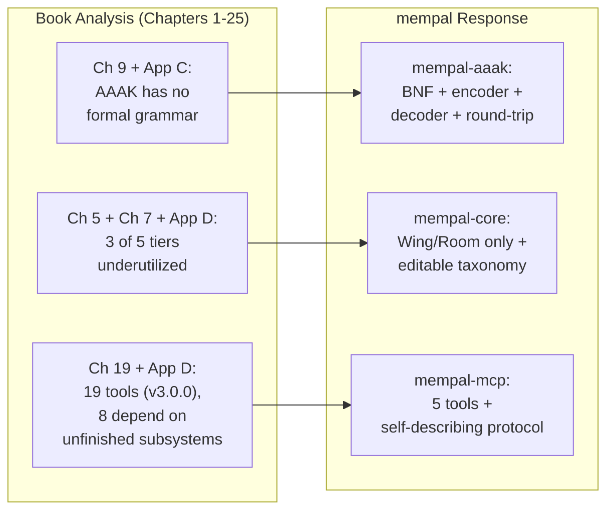

# 第26章：为什么用 Rust 重铸

> **定位**：本章追溯从分析 MemPalace 到决定用 Rust 重铸的全过程。前置阅读：第1-25章（揭示结构性缺陷的分析）。适用场景：当你已经彻底分析了一个现有系统，需要决定是打补丁还是重建。

---

## 分析本身成为了蓝图

这本书最初是一份第三方设计分析。我们着手理解 MemPalace 的架构——它的空间隐喻、压缩语言、本地优先的哲学——并评估实现对这些理念的交付程度。二十五章加四个附录之后，分析完成了。但过程中发生了意料之外的事：分析本身变成了一份新实现的蓝图。

前面的二十五章并非 Rust 项目的铺垫。它们是 Rust 项目存在的原因。mempal——我们的 Rust 重新实现——中的每一个设计决策，都可以追溯到本书中的某个具体发现。本章记录这些关联。

这不是一个"MemPalace 很差，所以我们重写了"的故事。MemPalace 的设计理念是合理的——逐字存储、空间检索、AAAK 压缩、本地优先架构。真正的故事是："MemPalace 的理念好到值得一个更严谨的实现。"

---

## 触发点：分析揭示了什么

本书分析中的三项发现汇聚成一个结论：MemPalace 的设计意图与实现之间的差距是结构性的，而非偶然性的。

### AAAK：一门没有文法的语言

第9章梳理了 AAAK 的六种语法元素——三字母实体编码、管道分隔符、星级评分、情感标签、语义标志和隧道。语法设计颇为精巧。然而附录 C 试图提供完整的方言参考时，暴露出一个关键缺口：没有形式化文法。

`dialect.py` 编码器是一条启发式管道。它选取关键句子，提取高频主题，截断实体和情感列表，再用管道符拼接。没有 BNF 规范来定义什么是合法的 AAAK 文档。没有解码器——文本一旦压缩，唯一的"解压"方式是让 LLM 去阅读它。也没有往返测试来验证编码和解码是否保留了所有事实断言。

正如附录 D 所言：如果把 AAAK 当作设计方向来读，它是可信的。如果当作已交付的完整产品能力来读，则不是。编码器产出的内容看起来像 AAAK，但无法通过机械方式验证其合法性，因为"合法的 AAAK"根本没有形式化定义。

这不是一个可以打补丁修复的 bug。形式化文法、符合规范的编码器、解码器和往返验证测试，共同构成了从规范层开始的 AAAK 子系统重新设计。在 mempal 中，这成为了 `mempal-aaak` crate（`crates/mempal-aaak/`），实现了基于 BNF 的文法定义、结构化编码器、解码器和往返属性测试——`dialect.py` 所缺失的完整栈。

### 五层结构，三层闲置

第5章记录了五层空间层级：Wing → Hall → Room → Closet → Drawer。第7章展示了检索效果的提升：从 60.9% 基准到 94.8%（通过 Wing、Hall 和 Room 过滤），提高了 33.9 个百分点。但我们的分析发现，这一提升在各层级间并非均匀分布。

检索增益的大部分来自 Wing 过滤（+12.2 个百分点）。加入 Hall 再提升 +11.7 个百分点。Room 又贡献了 +10 个百分点。而更深的层级——Closet 和 Drawer——没有被单独基准测试过，在 Room 之下也没有可测量的检索收益。

更重要的是，附录 D 发现"Hall / Closet / agent 架构的叙述完整度远超实现完整度"。当前的 `searcher.py` 支持显式的 Wing 和 Room 过滤。Hall 作为分类概念存在，但不是默认的路由目标。Closet 作为存储层的概念存在，但运行时主要直接操作 Drawer。

这意味着空间层级中五层里有三层在实践中要么利用不足，要么仅停留在愿景阶段。重新设计可以简化为两层——Wing 和 Room——同时保留绝大部分检索收益，并用可编辑的分类体系替代静态层级，使其能适应实际使用模式。在 mempal 中，这一简化体现在 `mempal-core`（`crates/mempal-core/src/db.rs`），其中 `drawers` 表包含 `wing` 和 `room` 列，并由可编辑的 `taxonomy` 表驱动查询路由——没有 Hall，没有 Closet，没有静态层级体系。

### 19 个工具，5 种认知角色

第19章分析了 v3.0.0 时 MCP 服务器的 19 个工具，按 5 种认知角色组织：Read（7个）、Write（2个）、Knowledge Graph（5个）、Navigation（3个）和 Diary（2个）。基于角色的组织方式在智识层面是自洽的。但对于一个需要做工具选择决策的 AI agent 来说，19 个选项已形成一个巨大的决策空间。[^v33-tools]

每次工具调用都消耗 token——不仅是调用本身，还有 LLM 在 19 个工具中评估哪个最匹配当前意图的开销。Knowledge Graph 组（5个工具）和 Navigation 组（3个工具）依赖的子系统，正是附录 D 标记为"叙述多于实际运行"的部分。Diary 组假设了一种专家 agent 架构，而这并非当前默认运行时的一部分。

问题变成了：一个更小的工具面——聚焦于实际可用于生产的功能——能否更好地服务 agent？不是因为更少的工具天然就更好，而是因为更小的集合中每个工具可以携带更丰富的自描述文档，且 agent 在工具选择上消耗的 token 更少。mempal 的答案是 5 个工具——`mempal_status`、`mempal_search`、`mempal_ingest`、`mempal_delete` 和 `mempal_taxonomy`——注册在 `crates/mempal-mcp/src/server.rs` 中。每个工具的输入 schema 都携带文档注释，教 agent 如何正确使用它（详见第28章）。

[^v33-tools]: 本章引用的 19 个工具是 v3.0.0 的快照。截至 v3.3.0，`TOOLS` 字典（`mcp_server.py:1111`）已扩展到 29 个工具——新增的是 Tunnel CRUD（4 个）、Drawer 读写 CRUD（3 个）、运维工具（3 个）。详见第19章章末的版本演化说明。对 mempal 的 29→5 对比来说，精简幅度更显著——基础论点不受影响。

---

## 判断：为什么打补丁不够

有了这三项发现，我们面临一个选择：向 MemPalace 贡献补丁，还是基于相同的设计原则构建新的实现。

我们选择了重建。原因如下。

### 耦合使定向修复代价高昂

AAAK 子系统触及多个层。`dialect.py` 被 `cli.py` 调用来做压缩，而 `mcp_server.py` 硬编码了一个 `AAAK_SPEC` 字符串用于状态响应。编码器的输出格式被 `palace_graph.py` 的存储路径和 `searcher.py` 的检索逻辑引用。添加形式化文法不仅需要修改编码器，还需要修改压缩、存储和检索之间的接口。在一个拥有 21 个模块的 Python 代码库中，模块之间通过 ChromaDB collection 和内存缓存共享状态，改变一个子系统的契约会波及其他子系统。

同样，将五层层级简化为两层也不是删除三个层那么简单。层级结构嵌入在存储 schema、查询路由逻辑和 MCP 工具语义中。一个定向的"移除 Hall 和 Closet"补丁需要触及 `palace_graph.py`、`searcher.py`、`mcp_server.py` 和 `layers.py`——实质上是在保持与现有 palace 向后兼容的同时重写数据模型。

### 设计文档已经存在

当我们完成本书的分析时，手上有了一样不寻常的东西：一份详尽的、基于证据的规范，描述了实现应该是什么样子。书中的 25 章识别了哪些有效（逐字存储、Wing/Room 过滤、MCP 接口），哪些无效（启发式 AAAK、未使用的层级、过大的工具面），以及设计意图是什么（本地优先、跨模型、单文件存储）。

这份规范比大多数重写项目的起点要完整得多。我们不是在猜测需求——我们从 25 章的分析中推导出了它们。"基于详尽规范重建"的风险，低于"在保持向后兼容的同时修补现有系统"的风险。

### 不同的产品形态，不同的语言

MemPalace 是一个 Python 库。它需要 `pip install`、Python 运行时和 ChromaDB 作为向量存储。作为开发者的个人工具，这是可以接受的。但作为一个每个 coding agent 都应该能使用的工具——Claude Code、Codex、Cursor、Gemini CLI——安装摩擦就很重要了。

重新实现的产品愿景不同：单一二进制、零外部依赖、秒级就绪。这种产品形态无法通过对 Python 代码库打补丁实现——它需要从一个完全不同的基础开始。

---

## 单一二进制哲学

产品形态驱动了许多技术决策。单一二进制意味着：

**零安装摩擦。** 一条命令，一个二进制，无运行时，无包管理器冲突，无虚拟环境。AI agent 的 MCP 配置只需指向二进制路径即可工作。

**单文件数据库。** SQLite 取代 ChromaDB。整个记忆宫殿就是一个文件：`~/.mempal/palace.db`。备份就是 `cp`。迁移就是 `scp`。没有需要管理的服务进程，没有需要配置的端口，没有需要定位的数据目录。

**内嵌推理。** ONNX Runtime 编译进二进制。默认嵌入模型（MiniLM-L6-v2，384 维）下载一次后本地运行。无需 API 密钥，首次运行后无网络依赖，无按查询计费。

**自包含的 MCP 服务器。** `mempal serve --mcp` 从同一个二进制启动基于 stdio 的 MCP 服务器。无需独立的服务进程，无需端口分配，无需进程管理。

这不是为了极简而极简。这是对一个具体问题的设计回应：coding agent 运行在多样化的环境中——本地终端、CI 管道、远程 SSH 会话、容器化开发环境。一个需要 `pip install` 加 ChromaDB 实例加 Python 运行时的工具，在其中部分环境可行。单一二进制则在所有环境都可行。

---

## 为什么偏偏是 Rust

鉴于单一二进制的要求，多种语言都能胜任：Go、Zig、C++ 或 Rust。我们选择 Rust 是基于 mempal 使用场景的特定原因，而非语言层面的泛泛推崇。

**MCP 服务器是长驻进程。** 当 AI agent 通过 MCP 连接到 mempal 时，服务进程在整个会话期间保持存活——可能长达数小时。一个持有 SQLite 连接、管理嵌入模型状态并服务并发工具调用的长驻进程，受益于确定性的资源清理。Rust 的所有权模型确保数据库连接在其作用域结束时准确释放，内存释放不依赖于垃圾回收器的时机——对于一个可能在整个编码会话中无人看管运行的进程来说，这种可预测性至关重要。

**类型系统执行接口契约。** mempal 有 8 个 crate，边界清晰：`mempal-core` 定义数据类型，`mempal-embed` 定义 `Embedder` trait，`mempal-search` 消费两者。Rust 的类型系统确保当我们在 `mempal-core` 中修改一个类型时，所有下游消费者在编译时就会被检查。在一个需要重新设计子系统接口的重写中——正是本书分析之后我们所需要的——这不是奢侈品，而是必需品。

**crates.io 分发。** `cargo install mempal` 就是完整的安装故事。Rust 生态的包注册中心和构建系统与单一二进制的产品形态完美契合。没有 PyPI wheel 兼容性问题，没有平台特定的构建脚本，没有运行时版本冲突。

**SQLite 和 ONNX 有成熟的 Rust 绑定。** `rusqlite`（bundled SQLite）和 `ort`（ONNX Runtime）是生产级的 crate。`sqlite-vec` 以 SQLite 扩展形式提供向量搜索。mempal 所需的特定技术栈——嵌入式数据库加向量搜索加 ML 推理——在 Rust 生态中有强有力的支持。

### Rust 解决不了什么

语言选择不解决设计问题。Rust 不会告诉我们把五层简化为两层，或给 AAAK 添加形式化文法，或把 MCP 工具缩减为 5 个（v3.0.0 是 19 个，v3.3.0 是 29 个）。这些决策来自本书的分析。Rust 提供的是一个载体，让我们能以一种良好服务 coding agent 的产品形态来实施这些决策。

Rust 也没有消除所有挑战。嵌入模型（MiniLM）以英语为中心，这降低了非英语查询的搜索质量——我们在自用过程中发现了这个问题，并通过协议层的变通方案而非语言层的方案来解决（详见第28章）。类型系统能捕获接口不匹配，但无法验证搜索结果是否语义相关。静态分析能防止内存损坏，但防不了过宽的删除查询导致的数据丢失——这是我们在开发过程中吃到的教训（详见第29章）。

选择 Rust 的决策是务实的，而非意识形态的。一个部署约束不同的项目，合理地可能选择 Go、Zig，甚至继续用 Python。重要的不是语言，而是规范的清晰度——而那份规范，是二十五章分析的产物。

---

## 从分析到实践

本章标志着全书叙事的一个转折。在前二十五章中，我们分析了别人的设计。我们识别了哪些有效、哪些需要改进、实现差距在哪里。从这里开始，我们把分析转化为实践。

第10部分的后续章节追踪了随之而来的具体设计决策：

- **第27章**详述了我们从 MemPalace 中保留了什么、改变了什么，以及每个决策的依据。
- **第28章**审视了自描述协议——mempal 如何教 AI agent 正确使用它，以及每条协议规则为何存在——因为背后都有一次真实的失败。
- **第29章**记录了多 agent 协作——一个意想不到的发现：记忆工具会变成不同 AI agent 之间的协调机制。

从分析到实现的闭环尚未完全合拢。尚未针对 MemPalace 公布的数据运行基准测试。时序知识图谱仍然是 schema 中的预留位，而非一个可用的功能。这些诚实的缺口将在未来的章节中解决。眼下，后续章节将展示：当二十五章的批判遇上 Rust 编译器，会发生什么。
