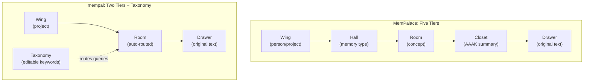

# 第27章：保留了什么、改变了什么

> **定位**：本章逐维度对比 MemPalace（Python）与 mempal（Rust）——哪些设计理念在重写中存活下来，哪些实现结构发生了变化，以及背后的原因。前置阅读：详见第26章（为什么要重写）。适用场景：评估现有设计中哪些部分值得保留、哪些需要重新设计。

---

## 值得保留的五个理念

在逐项梳理变更之前，先明确哪些东西没有改变。mempal 保留了 MemPalace 的五个核心设计理念——每一个都经过了本书分析的验证。

**1. 原文存储**（详见第3章）。原始对话文本在导入时按原样存储。mempal 的 `drawers` 表（`crates/mempal-core/src/db.rs:16-25`）中的 Drawer 保存的是原始内容，永远不是摘要或提取物。第3章的经济性论证依然成立：六个月内 1950 万 token 的对话数据大约是 100 MB 的原始文本——存储成本可以忽略不计。真正的难题是检索，而非存储。mempal 在导入时不做压缩。

**2. 空间结构辅助检索**（详见第5章和第7章）。语义分区能提升检索精度这一理念——将记忆组织到命名区域中，而非全部倾倒进一个扁平的向量空间——被完整保留了下来。第7章的数据显示，从基线到完整空间过滤，检索精度提升了 33.9 个百分点。mempal 通过在每个 Drawer 上设置 Wing 和 Room 列来实现这一点，并通过索引让过滤查询保持高效（`db.rs:51-52` 中的 `idx_drawers_wing`、`idx_drawers_wing_room`）。

**3. AAAK 是输出格式化器，而非存储编码器**（详见第8章）。MemPalace 的设计文档将 AAAK 描述为压缩层。mempal 遵循相同原则，但把边界划得更加明确：AAAK 从不在导入或存储阶段使用。它只存在于输出路径上——当 CLI 的 `wake-up` 命令或 MCP 的 status 响应需要为 token 受限的 AI 压缩近期上下文时才会调用。`mempal-aaak` crate 对 `mempal-ingest` 和 `mempal-search` 没有任何依赖，这由 Cargo workspace 的依赖图强制保证。

**4. MCP 作为主要的 AI 接口**（详见第19章）。MemPalace 通过 MCP 工具暴露其记忆宫殿。mempal 延续了这一做法：`mempal serve --mcp` 启动一个基于 stdio 的 MCP 服务器。AI agent 需要结构化的工具接口——而非仅仅是 REST API 或命令行包装器——这一信念被直接继承了下来。

**5. 本地优先架构**（详见第24章）。不依赖云服务，核心功能不需要 API key，数据不离开本机。mempal 的全部状态是一个 SQLite 文件。嵌入模型通过 ONNX Runtime 在本地运行。这不是一种妥协，而是设计选择——第24章关于"认知 X 光"的论述同样适用于 mempal。

这五个理念是设计的承重墙。其他一切——层级数量、存储引擎、压缩实现、工具接口——都是可以重新布局的室内装修。

---

## 维度一：空间结构——从五层到两层

这是最显眼的架构变更。

### MemPalace 的做法

MemPalace 定义了五个层级：Wing → Hall → Room → Closet → Drawer。第5章分析了每个层级的用途。Wing 按人或项目划分范围。Hall 按记忆类型分类（事实、事件、发现、偏好、建议）。Room 标识一个具体概念。Closet 存放 AAAK 压缩摘要。Drawer 存放原始文本。



### mempal 的做法

mempal 使用两个层级：Wing 和 Room。`drawers` 表包含 `wing TEXT NOT NULL` 和 `room TEXT` 列。一个独立的 `taxonomy` 表（`db.rs:43-49`）将 `(wing, room)` 对映射到显示名称和关键词列表。当查询到达时，`mempal-search` 的路由模块（`crates/mempal-search/src/route.rs`）将查询词与 taxonomy 关键词匹配，以确定要过滤的 Wing 和 Room。

### 为什么改变

第7章的检索数据说明了一切。仅做 Wing 过滤就能提升 +12.2 个百分点。加上 Room 过滤（Wing+Room 组合）总计提升 +33.9 个百分点。但附录 D 发现 Hall "被叙述得比被实现得更完整"——`searcher.py` 显式支持 Wing 和 Room 过滤，但 Hall 并非一等路由目标。

实际情况是，绝大部分检索收益来自两个操作：按项目/领域缩小范围（Wing）和按概念缩小范围（Room）。Hall 按记忆类型分类（事实 vs. 事件 vs. 偏好）在理论上有用，但并不在 MemPalace 实际代码的默认检索路径中。

Closet——AAAK 压缩摘要层——与 mempal 输出侧的 AAAK 格式化功能等价。mempal 不再将压缩摘要作为持久层存储，而是在请求时按需生成。这样就不需要维护摘要与源 Drawer 之间的同步一致性。

可编辑的 taxonomy 是关键的设计替代方案。与其使用一个必须预先定义的静态五层级结构，mempal 的 taxonomy 可以在运行时修改。`mempal taxonomy edit <wing> <room> --keywords "auth,migration,clerk"` 更新路由关键词。通过 MCP 连接的 agent 可以使用 `mempal_taxonomy` 工具做同样的事。taxonomy 会随实际使用模式自适应，而不要求用户在还不知道会存什么内容时就提前确定分类体系。

这并不是说两层总比五层好。而是说，根据第7章和附录 D 的证据，两层加上可编辑的 taxonomy 能捕获大部分检索收益，同时消除了三个在 MemPalace 代码库中只是愿景的层级所带来的实现复杂度。

---

## 维度二：存储——从 ChromaDB 到 SQLite + sqlite-vec

### MemPalace 的做法

MemPalace 使用 ChromaDB 作为向量存储。`palace_graph.py` 将 Drawer 写入 ChromaDB collection，`searcher.py` 查询它们进行语义检索。ChromaDB 在一个包中提供了嵌入存储、相似性搜索和元数据过滤。

### mempal 的做法

mempal 使用 SQLite 配合 `sqlite-vec` 扩展。`drawers` 表存储内容和元数据。`drawer_vectors` 虚拟表（`db.rs:27-30`）使用 `vec0` 存储 384 维浮点向量。搜索查询使用 `embedding MATCH vec_f32(?)` 进行 k-NN 检索，并与 `drawers` 表连接以进行元数据过滤。

整个数据库是一个文件：`~/.mempal/palace.db`。

### 为什么改变

三个工程需求驱动了这次切换：

**事务和 schema 迁移。** SQLite 提供 ACID 事务和 `PRAGMA user_version` 用于 schema 版本管理。mempal 的 `apply_migrations()` 函数（`db.rs`）在打开数据库时自动应用前向迁移。当我们添加 `deleted_at` 以支持软删除时，只需在版本化迁移中加一行 `ALTER TABLE`。ChromaDB 没有等价机制——schema 变更需要重建 collection。

**单文件可移植性。** SQLite 数据库就是一个文件。备份就是 `cp palace.db palace.db.bak`。跨机器传输就是 `scp`。没有服务器进程，没有端口，没有包含多个文件的数据目录。对于一个可能放在 dotfiles 仓库里或跨机器同步的个人开发工具来说，单文件存储消除了一整类部署问题。

**嵌入式部署。** SQLite 通过 `rusqlite` 的 `bundled` feature 编译进二进制文件。`sqlite-vec` 同样以 bundled 方式集成。不需要启动外部进程，不需要管理版本兼容性，不需要连接向量数据库的网络。二进制文件自包含。

我们放弃了什么：ChromaDB 的嵌入管理（mempal 通过 `mempal-embed` crate 和 `Embedder` trait 单独处理），以及 ChromaDB 内建的 collection 级别隔离（mempal 使用 Wing/Room 列配合 SQL 索引替代）。这个取舍是值得的，因为上述工程需求——事务、单文件、嵌入式——对于单二进制产品形态来说不可妥协。

---

## 维度三：AAAK——从启发式到形式化

这是 MemPalace 的设计意图与其实现之间差距最大的维度。

### MemPalace 的做法

`dialect.py` 实现了一个 AAAK 编码器。它接受对话文本，选择关键句子，提取高频主题，检测实体（三个大写字母），分配情感代码和语义标记，然后用管道符分隔符将一切拼接在一起。输出看起来像 AAAK。但正如附录 C 所记录的，这里没有定义合法 AAAK 的形式化文法，没有从 AAAK 重建文本的解码器，也没有验证信息保存度的往返测试。

### mempal 的做法

`mempal-aaak` crate（`crates/mempal-aaak/`）实现了 `dialect.py` 缺失的四个组件：

**BNF 文法。** 设计文档（`docs/specs/2026-04-08-mempal-design.md:209-229`）正式定义了 AAAK 语法：

```
document    ::= header NEWLINE body
header      ::= "V" version "|" wing "|" room "|" date "|" source
zettel      ::= zid ":" entities "|" topics "|" quote "|" weight "|" emotions "|" flags
tunnel      ::= "T:" zid "<->" zid "|" label
arc         ::= "ARC:" emotion ("->" emotion)*
```

**符合文法的解析器。** `parse.rs` 按照这套文法验证文档——检查实体代码是否恰好是 3 个大写 ASCII 字符，情感代码是否为 3-7 个小写字符，以及 tunnel 引用是否指向已有的 zettel。这意味着"合法的 AAAK"有了机械化的定义，而非仅仅是视觉上的相似。

**成对的编码器和解码器。** `codec.rs` 提供了 `AaakCodec::encode()`（从原始文本生成 `AaakDocument`）和 `decode()`（通过双向哈希表将实体代码展开回全名，从而将 AAAK 重建为可读文本）。MemPalace 只有编码方向。

**往返验证。** `verify_roundtrip()`（`codec.rs:281-302`）将文本编码为 AAAK，再解码回来，然后计算覆盖率指标：`preserved / (preserved + lost)`。`aaak_test.rs` 中的测试验证往返覆盖率达到阈值（>=80%），并且任何丢失的断言都被显式报告。这是最重要的新增——它使 AAAK 的信息保存度可以被经验性地度量，而不是靠假设。

### 中文处理：从 bigram 到词性标注

MemPalace 的 `dialect.py` 通过生成 CJK 字符 bigram 处理中文——这是一种字符级方法，可能会切碎有意义的词。"知识图谱"（knowledge graph）会被切成 bigram "知识"、"识图"、"图谱"——其中两个是无意义的碎片。

mempal 使用 `jieba-rs`（jieba 中文分词器的 Rust 移植版）配合词性标注。`codec.rs:579-609` 调用 jieba 的词性标注器来识别专有名词（`nr`、`ns`、`nt`、`nz` 标签）以用于实体提取。`codec.rs:611-643` 提取内容词（`n*`、`v*`、`a*` 标签）以用于主题提取，同时过滤代词和助词等功能词。差异是结构性的：bigram 是字符级启发式方法；词性标注是词级语言学分析。

测试显式覆盖了中文编码：`test_aaak_encode_chinese_text`（第326行）、`test_aaak_encode_mixed_script_text_extracts_cjk_and_ascii_entities`（第377行）、`test_aaak_roundtrip_does_not_split_on_chinese_commas`（第421行）。

---

## 维度四：时序知识图谱——Schema 预留，逻辑推迟

### MemPalace 的做法

详见第11-13章对 MemPalace 时序知识图谱的分析：带有 `valid_from` 和 `valid_to` 时间戳的三元组、跨时间的矛盾检测、以及时间线叙事生成。这些是设计中最具学术雄心的特性。

### mempal 的做法

mempal 保留了 schema。`triples` 表存在于 `db.rs:32-41`：

```sql
CREATE TABLE triples (
    id TEXT PRIMARY KEY,
    subject TEXT NOT NULL,
    predicate TEXT NOT NULL,
    object TEXT NOT NULL,
    valid_from TEXT,
    valid_to TEXT,
    confidence REAL DEFAULT 1.0,
    source_drawer TEXT REFERENCES drawers(id)
);
```

`types.rs:23-32` 中的 `Triple` 结构体镜像了这个 schema，包含 `valid_from: Option<String>` 和 `valid_to: Option<String>`。但 mempal 没有实现从对话中自动提取三元组、矛盾检测或时间线叙事生成。

### 为什么推迟

这是一个优先级判断，而非设计上的分歧。

时序知识图谱特性依赖于可靠的知识图谱填充。在 MemPalace 中，`kg_add` 是一个手动的 MCP 工具——AI 显式写入三元组。从对话文本自动提取（识别出"Kai 在三月转到了 Orion 项目"）要么需要每次导入时调用 LLM，要么需要一套复杂的 NLP 管道。两者都会引入外部依赖，与零依赖的本地优先理念冲突。

mempal v1 的优先级是让核心管道可靠运行：ingest → embed → search → cite。该管道中的每个环节都必须先正确工作，然后才能在其上叠加时序推理。schema 预留意味着当时序知识图谱被实现时，现有数据库已经就绪——triples 表本身无需迁移。但这个实现坦率地说还没有为 v1 做好准备，发布一个不可靠的时序推理器比不发布更糟糕。

附录 D 的观察在这里同样适用：发布能用的东西，好过叙述计划中的东西。

---

## 维度五：MCP 工具接口——从19个到5个

### MemPalace 的做法

详见第19章记录的 5 个认知组中的 19 个 MCP 工具。这个设计在学理上是自洽的——每个组对应 AI 与记忆交互时扮演的一个角色。

### mempal 的做法

mempal 暴露 5 个工具：`mempal_status`、`mempal_search`、`mempal_ingest`、`mempal_delete` 和 `mempal_taxonomy`。它们对应的是已投入生产且在日常开发中实际使用的操作。

### 为什么精简

精简并不是在判定 19 个工具是错误的。它反映的是不同的实现成熟度阶段，以及关于自文档化的设计选择。

MemPalace 19 个工具中有 8 个属于 Knowledge Graph（5个）和 Navigation（3个）组。它们依赖于完整填充的知识图谱和可工作的图遍历引擎——附录 D 指出这些子系统"被叙述得多于被实际使用"。为尚不可靠的子系统提供工具，会误导 agent 去调用它们并得到糟糕的结果。

5 个工具的接口还能提供更丰富的逐工具文档。mempal 中每个工具都携带详细的字段级文档——`SearchRequest` 上的 `wing` 字段（`crates/mempal-mcp/src/tools.rs:11-16`）详细解释了何时应该省略它，并警告盲猜会静默返回零结果。如果有 19 个工具，这种粒度的字段文档会让工具列表响应不堪重负。5 个工具的情况下，每个都可以做到充分的自文档化。

使 5 个工具足够的协议级设计——嵌入 MCP 服务器指令中的 MEMORY_PROTOCOL——是第28章的主题。

---

## 设计决策表

mempal 的设计文档（`docs/specs/2026-04-08-mempal-design.md`）在两张表中记录了这些决策。以下是合并视图：

| 维度 | MemPalace | mempal | 理由 |
|------|-----------|--------|------|
| 空间结构 | Wing/Hall/Room/Closet/Drawer | Wing/Room + 可编辑 taxonomy | Wing+Room 带来 33.9pp 提升；Hall/Closet 利用不足（附录 D） |
| 存储 | ChromaDB | SQLite + sqlite-vec | 事务、单文件、嵌入式部署 |
| 嵌入 | ChromaDB 内建 | ONNX (MiniLM) 通过 `Embedder` trait | 离线优先，可换模型 |
| AAAK | 仅启发式编码器 | BNF 文法 + 编码器 + 解码器 + 往返验证 | 修复附录 C 的缺陷 |
| CJK 处理 | 字符 bigram | jieba 词性标注 | 词级 vs 字符级 |
| 检索 | 纯向量（ChromaDB） | **混合：BM25 (FTS5) + 向量 + RRF 融合** | 精确关键词匹配（错误码、函数名）是纯向量搜索的弱点；借鉴 qmd 的混合检索范式 |
| 时序知识图谱 | 三元组 + 矛盾检测 + 时间线 | **三元组已激活（手动 CRUD）**，矛盾检测/时间线推迟 | 关系查询是向量搜索无法回答的；v1 手动写入避免 LLM 依赖 |
| 隧道 | 自动跨 Wing 链接 | **动态 SQL 发现** | 与 MemPalace 第6章相同概念，通过 `GROUP BY room HAVING COUNT(DISTINCT wing) > 1` 零存储成本实现 |
| MCP 工具 | 5 组 19 个 | 7 个工具 + 自描述协议 | 发布能用的；新增 `mempal_kg` 和 `mempal_tunnels` 用于知识图谱和跨 Wing 发现 |
| 语言 | Python | Rust | 单二进制，零运行时依赖（详见第26章） |

这张表中的每一行都可以追溯到本书前 25 章或附录中的某项发现。"理由"列不是事后补充的正当化——而是先于实现的分析。

---

## 这次对比揭示了什么

五个维度呈现出一致的模式：mempal 保留了 MemPalace 的设计理念，同时简化或完善了它们的实现。

- 空间结构：相同的理念（语义分区提升检索），更简的实现（两层而非五层）
- 存储：相同的理念（本地单文件），不同的引擎（SQLite 而非 ChromaDB）
- AAAK：相同的理念（AI 可读的压缩），完整的实现（文法 + 解码器 + 往返验证）
- 时序知识图谱：相同的理念（事实会过期），诚实的推迟（schema 就绪，逻辑未实现）
- MCP 工具：相同的理念（结构化 AI 接口），聚焦的接口（5 个生产就绪的工具）

这不是巧合。这是基于详细分析而非从零开始构建的自然结果。分析告诉我们什么该保留、什么该改变——实现只是照此执行。
