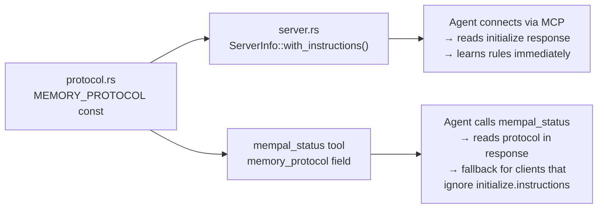

# 第28章：自描述协议

> **定位**：本章分析 mempal 最具辨识度的设计——将行为指令直接嵌入工具接口，让任何 AI agent 仅通过工具本身就能学会正确使用 mempal，无需外部文档，无需配置 system prompt。前置章节：第27章（架构层面的变化）。适用场景：为 AI agent 设计"无人引导即可自主发现和使用"的工具。

---

## 问题：不会"教"的工具

AI agent 连接到一个 MCP 服务器时，收到的是一份工具列表。每个工具有名称、描述和输入 schema。agent 必须仅凭这些信息判断——何时调用哪个工具、传什么参数、如何解读返回结果。

详见第19章对 MemPalace 19 个 MCP 工具的分析。工具描述告诉 agent 每个工具*做什么*，但没有告诉 agent *什么时候*该用记忆而非直接 grep 文件、*怎样*在过滤前先发现合法的 wing 名称、以及*为什么*引用很重要。这些行为模式写在 README 和项目指南里——MCP 连接的 agent 永远看不到的地方。

mempal 的答案不是更好的工具描述，而是一套嵌入工具接口本身的行为协议。

---

## 协议即代码

MEMORY_PROTOCOL 以 Rust 字符串常量的形式存放在 `crates/mempal-core/src/protocol.rs`：

```rust
pub const MEMORY_PROTOCOL: &str = r#"MEMPAL MEMORY PROTOCOL (for AI agents)

You have persistent project memory via mempal. Follow these rules...
"#;
```

这个常量被编译进 mempal 二进制文件。它通过两条路径到达 AI agent：



主路径是 `crates/mempal-mcp/src/server.rs` 中的 `ServerInfo::with_instructions()`。MCP 规范在 server info 响应中定义了 `instructions` 字段——大多数 MCP 客户端在连接时会将其注入 LLM 的 system prompt。通过将协议放在这里，mempal 在 agent 发起第一次工具调用之前就教会了它所有行为规则。

备用路径是 `mempal_status` 工具，它在响应的 `memory_protocol` 字段中返回相同的协议文本。这覆盖了那些忽略 `initialize.instructions` 字段的客户端——agent 仍然可以通过调用 status 来发现协议。

协议文本与代码放在一起，而非单独的文档文件。`protocol.rs` 的模块级文档注释解释了原因：

```rust
//! This is embedded in MCP status responses and CLI wake-up output,
//! following the same self-describing principle as `mempal-aaak::generate_spec()`:
//! the protocol lives next to the code so it cannot drift.
```

如果协议说"调用 mempal_status 来发现 wing"，但 `mempal_status` 不再返回 wing 数据，协议就错了。通过将它们放在同一个代码库中——并在 `mcp_test.rs` 中测试 `MEMORY_PROTOCOL` 包含预期的关键词——文本与行为保持同步。

---

## 七条规则，七次失败

MEMORY_PROTOCOL 包含七条规则（编号 0 到 5，外加 3a）。每条规则的存在都是因为 mempal 开发过程中发生了一次真实的失败。这不是理论上的 API 设计——而是将事后复盘编码为行为指令。

### Rule 0: FIRST-TIME SETUP

> *Call mempal_status() once at the start of any session to discover available wings and their drawer counts.*

**故障现场**：在一个全新的 Codex 会话中，用户询问 AAAK 的中文分词实现。Codex 正确地调用了 `mempal_search`——但传入了 `{"wing": "engineering"}`。mempal 的 wing 过滤是严格相等匹配。数据库中唯一的 wing 是 "mempal"。查询返回零结果，Codex 回退到直接读取源代码，完全绕过了记忆。

**根因**（记录于 `drawer_mempal_mempal_mcp_a916f9dc`）：三个因素叠加。`SearchRequest.wing` 没有文档注释，因此 JSON Schema 没有给出何时应省略它的指引。字段名 "wing" 诱导 agent 去猜测。而且没有任何东西告诉新客户端应先调用 `mempal_status` 来发现合法的 wing 名称。

**修复方案**：Rule 0 告诉 agent 在每个会话开始时调用一次 `mempal_status()`，然后再使用 wing 过滤器。status 响应包含一个 `scopes` 数组，列出每个 `(wing, room, drawer_count)` 三元组。读取之后，agent 就知道了确切的 wing 名称，可以正确过滤——或者不设过滤器进行全局搜索。

### Rule 1: WAKE UP

> *Some clients pre-load recent wing/room context. Others do NOT — for those, step 0 is how you wake up.*

**故障现场**：最初的 Rule 1 假设所有客户端都通过 session-start hook 预加载上下文。对 Claude Code（有 SessionStart hook）成立，但对 Codex、Cursor 和原始 MCP 客户端不成立。这个假设导致 Rule 0 最初并不存在——它是在 Codex 猜测 wing 名称的事故之后才加入的。

**修复方案**：Rule 1 现在明确区分有预加载机制的客户端和没有的客户端，将后者引导到 Rule 0。

### Rule 2: VERIFY BEFORE ASSERTING

> *Before stating project facts, call mempal_search to confirm. Never guess from general knowledge.*

**故障现场**（记录于 `drawer_mempal_default_cb58c7f3`）：观察到 Claude 在未查询记忆的情况下做出项目相关的断言。一个实例中，Claude 声称"mempal_search 无法通过 drawer_id 检索，我们需要一个新的 mempal_get_drawer 工具。"实际上，Claude 使用了 `sqlite3` shell 命令作为旁路，然后将限制表述为 MCP 的缺口。实际的 MCP 搜索在给定语义查询（而非不透明的 ID）时工作正常。

**修复方案**：Rule 2 要求 agent 在断言项目事实之前先调用 `mempal_search`。这防止 agent 基于错误假设幻觉出项目状态或提出不必要的工具添加。

### Rule 3: QUERY WHEN UNCERTAIN

> *When the user asks about past decisions or historical context, call mempal_search. Do not rely on conversation memory alone.*

**故障现场**：在多个会话中，agent 会用训练数据中的通用知识来回答"我们为什么选择 X？"这类问题，而非从项目的实际决策历史中获取。用户问"我们为什么从 ChromaDB 切换到 SQLite？"，得到的是关于 SQLite 优势的泛泛回答，而非 mempal drawer 中记录的具体工程考量。

**修复方案**：Rule 3 显式地对 "why did we..."、"last time we..."、"what was the decision about..." 等模式触发——这些措辞都暗示着项目特定的历史问题。

### Rule 3a: TRANSLATE QUERIES TO ENGLISH

> *The embedding model (MiniLM) is English-centric. Non-English queries produce poor vector representations.*

**故障现场**：在本次会话的 dogfooding 过程中，一条中文查询——"它不再是一个高级原型"——返回了完全无关的结果（AAAK 文档而非目标状态快照）。同一查询翻译成英文——"no longer just an advanced prototype"——立即命中了正确的 drawer。

**根因**：MiniLM-L6-v2 的 CJK token 覆盖率很低。中文文本碎片化为 unknown-token embedding，语义保真度差。中文查询的向量表示质量太差，匹配靠的是偶然而非语义。

**修复方案**：Rule 3a 告诉 agent 在传给 `mempal_search` 之前将非英文查询翻译为英文。这是零成本修复——执行搜索的 agent 本身就是能原生翻译的 LLM。规则中包含了一个具体示例，使预期行为毫无歧义。

### Rule 4: SAVE AFTER DECISIONS

> *When a decision is reached in conversation, call mempal_ingest to persist it. Include the rationale, not just the decision.*

**故障现场**：在一个早期会话中，Claude 完成了一项重要实现（添加 CI 工作流）后立即问"要 commit 吗？"——没有将决策记录保存到 mempal。Codex 在接手下一个会话时，没有任何记录说明 CI *为什么*是这样设计的、哪些内容是刻意省略的（rustfmt）、或者后续优先事项是什么。交接完全依赖 git commit message，而 commit message 只记录了改了什么，不记录为什么。

**修复方案**：Rule 4 使决策持久化成为显式要求。"Include the rationale, not just the decision"是关键措辞——一个只写"added CI"的 drawer 几乎没用；而一个写着"added CI with default + all-features matrix, deliberately omitted rustfmt because formatting drift exists, follow-up: cargo fmt --all then add fmt check"的 drawer，才是实现跨会话连续性的上下文。

### Rule 5: CITE EVERYTHING

> *Every mempal_search result includes drawer_id and source_file. Reference them when you answer.*

**故障现场**：没有这条规则时，agent 会搜索 mempal、找到相关信息，然后当作自己的知识呈现——"我们决定使用 SQLite 是因为单文件可移植性"——不带任何出处。用户无法验证这个断言、追溯其来源或评估其时效性。

**修复方案**：Rule 5 要求显式引用："according to drawer_mempal_default_2fd6f980, we decided..."。引用有三重作用：让用户能验证来源，让 agent 的推理链可审计，以及区分有记忆支撑的断言和幻觉。

---

## 字段级文档：通过 Schema 教学

协议传授行为规则。但还有第二层自文档化：工具输入类型上的字段级文档注释，会传播到 MCP schema 中。

`crates/mempal-mcp/src/tools.rs` 中的 `SearchRequest` 展示了这一模式：

```rust
#[derive(Debug, Clone, Deserialize, JsonSchema)]
pub struct SearchRequest {
    /// Natural-language query. Use the user's actual question verbatim
    /// when possible — the embedding model handles paraphrase and translation.
    pub query: String,

    /// Optional wing filter. OMIT (leave null) unless you already know the
    /// EXACT wing name from a prior mempal_status call or the user named it
    /// explicitly. Wing filtering is a strict equality match, so guessing a
    /// wing name (e.g. "engineering", "backend") will silently return zero
    /// results. When in doubt, leave this field unset for a global search
    /// across all wings.
    pub wing: Option<String>,
    // ...
}
```

`schemars` 的 `#[derive(JsonSchema)]` 宏将这些文档注释转换为 JSON Schema 的 `description` 字段。当 MCP 客户端调用 `tools/list` 时，它收到的工具输入 schema 中就包含了这些描述。agent 在考虑调用该工具之前，就已经从工具定义中读到了 "guessing a wing name will silently return zero results"。

传播链如下：

**Rust doc comment** → `schemars` derive → **JSON Schema description** → MCP `tools/list` 响应 → **agent 的工具选择上下文**

这条链意味着，改进 Rust 源码中的一条文档注释，会自动改进每个 agent 收到的指引。无需更新文档站点，无需修改 system prompt，无需更改客户端配置。指引随工具定义一同传播。

`mcp_test.rs` 中有一个测试守护着这一点：`test_mempal_search_schema_warns_about_wing_guessing` 列出工具、找到 `mempal_search`，然后断言序列化后的 `input_schema` 包含 "OMIT" 和 "global search"。这防止了未来的重构意外地剥离掉指引。

---

## 19 个工具到 5 个：少即是多（附带上下文）

详见第19章对 MemPalace 按 5 种认知角色组织的 19 个工具的分析。mempal 只有 5 个工具。本节解释为什么精简是可行的——以及它依赖什么条件。

### 5 个工具覆盖了什么

| Tool | Role | Replaces from MemPalace |
|------|------|------------------------|
| `mempal_status` | Observe | `status`, `list_wings`, `list_rooms`, `get_aaak_spec` |
| `mempal_search` | Retrieve | `search`, `check_duplicate` |
| `mempal_ingest` | Write | `add_drawer` |
| `mempal_delete` | Write | `delete_drawer` |
| `mempal_taxonomy` | Configure | `get_taxonomy` (read) + taxonomy edit (new) |

### 缺失了什么

MemPalace 的 8 个工具在 mempal 中没有对应物：

- **Knowledge Graph 组**（5 个工具：`kg_query`、`kg_add`、`kg_invalidate`、`kg_timeline`、`kg_stats`）：依赖时序 KG，详见第27章的分析——mempal 中 schema 已预留但逻辑延后。
- **Navigation 组**（3 个工具：`traverse`、`find_tunnels`、`graph_stats`）：需要详见第6章分析的跨域隧道机制。mempal 的两层结构目前未实现隧道。

这些不是被拒绝，而是被延后——直到它们依赖的子系统达到生产就绪。为未完成的子系统提供工具，只会误导 agent 去调用它们，得到空的或错误的结果。

### 为什么 5 个就够了

5 个工具的表面积之所以可行，源于 MemPalace 所不具备的两个设计决策：

**1. 协议弥补了缺失的工具。** MemPalace 需要 `list_wings` 和 `list_rooms` 作为独立工具，因为没有机制告诉 agent 何时使用它们。mempal 的 `mempal_status` 返回 wing/room 数据，*同时*协议告诉 agent（Rule 0）在会话开始时调用它。一个工具取代三个，因为行为上下文已经内嵌。

**2. 自文档化字段减少了单次调用的困惑。** MemPalace 需要 `check_duplicate` 作为独立工具，因为 agent 无法在写入前知道某个 drawer 是否已存在。mempal 的 `mempal_ingest` 在内部处理去重——`drawer_exists()` 在插入前被调用。agent 不需要单独检查。

教训不是"工具越少越好"，而是工具和协议是互补的表面积。当协议承载行为指引时，每个工具可以用更少的认知负担做更多的事。

---

## 自描述原则

MEMORY_PROTOCOL 背后的设计模式并非 mempal 独有。它延伸到了系统的其他部分：

- **AAAK spec 生成**：`mempal-aaak` 的 `generate_spec()` 函数从编解码器自身的常量（emotion code、flag 名称、分隔符规则）动态生成 AAAK 格式规范。spec 始终与编码器保持一致，因为它是从同一源生成的。

- **CLI wake-up**：`mempal wake-up` 将相同的 MEMORY_PROTOCOL 文本输出到 stdout。通过读取 CLI 输出（而非 MCP 连接）的 AI agent 同样能学到行为规则。

- **Status 响应**：`mempal_status` 返回的不只是数据，还有协议文本和 AAAK spec。单次工具调用就能给 agent 正确操作所需的一切。

共同的原则是：**工具从自身教会 agent 如何使用它。** 不需要外部文档，不假设 system prompt 配置，文档与实现之间不存在版本漂移。

这一原则有其局限：它只在消费者是能够阅读并遵循自然语言指令的 AI agent 时才有效。如果 mempal 获得了通过 GUI 交互的人类用户，自描述协议对他们毫无帮助。这一设计是刻意为 AI 消费者优化的——而这也是 mempal 唯一的目标受众。

---

## 这对工具设计意味着什么

mempal 的自描述协议是一个更广泛设计问题的具体实例：工具应该如何教会它的用户？

传统工具依赖文档——man page、README 文件、API 参考站点。文档写一次，然后与代码分开维护。它会漂移。通过包管理器或工具注册表发现该工具的用户，可能永远找不到文档。

对于 AI 消费的工具，工具定义*就是*文档。MCP `tools/list` 响应是 agent 拥有的唯一上下文。任何不在工具定义中的指引——不在 description 中、不在字段级 schema 中、不在 `initialize.instructions` 中——对 agent 来说就不存在。

mempal 的做法是将行为指引放在三个 agent 必定会看到的位置：`initialize.instructions`（连接时自动获取）、`mempal_status` 响应（首次调用时自动获取）、以及每个输入类型上的字段级 `description`（每次工具调用时可见）。冗余是刻意的——不同的客户端读取接口的不同部分。

这种方式的开销是协议文本消耗 agent 上下文中的 token。MEMORY_PROTOCOL 大约 500 token。对于拥有 100K+ 上下文窗口的 agent，这可以忽略不计。对于假想的 4K 窗口 agent，代价就很高了。mempal 押注的是上下文窗口增长的趋势，而非缩减。
