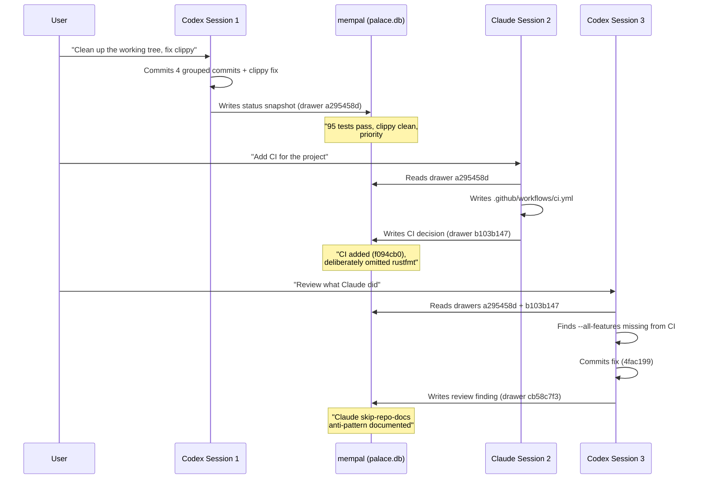

# 第29章：多 Agent 协作

> **定位**：本章记录 mempal 如何意外成为不同 AI agent 之间的异步协作层——这是开发过程中发现的用法，而非预先设计。前置阅读：详见第28章（使 agent 交互成为可能的协议）。适用场景：多个 AI agent 在不同会话中参与同一项目，需要共享上下文。

---

## 一个计划之外的发现

mempal 的设计初衷是 coding agent 的记忆工具，而非协作机制。但在开发过程中，意想不到的事情发生了：两个 AI agent——Claude（通过 Claude Code）和 Codex（通过 OpenAI Codex CLI）——开始利用 mempal drawer 在不同会话之间互相传递上下文。它们不在同一个会话中，也无法直接通信。但它们高效地完成了协作，因为双方都能读写同一份记忆。

本章用具体证据讲述这个故事——drawer ID、commit hash 和时间戳。每一个断言都可追溯到某个 mempal drawer 或 git commit。

---

## 第一次接力

第一次成功的 Claude↔Codex 接力发生在 2026 年 4 月 10 日，跨越三个会话。



### 会话 1：Codex 建立基线

用户让 Codex 清理一棵混乱的工作树。Codex 分四组提交了变更，修复了一个 clippy 阻断问题，然后将状态快照写入 mempal：

> **`drawer_mempal_default_a295458d`**: "mempal moved from a dirty advanced prototype to a much safer internal-tool state... Remaining highest-priority gaps: 1. Add minimal CI for test/build/clippy. 2. Fix ingest source_file path-normalization bug."

这个 drawer 不只是状态更新，它包含一份*带优先级的任务清单*——通常存在于项目经理脑中或任务追踪工具里的那种上下文。写入 mempal 后，Codex 的判断就对任何未来搜索"下一步该做什么"的 agent 可见了。

### 会话 2：Claude 读取并执行

在另一个独立会话中，用户让 Claude 添加 CI。Claude 搜索 mempal，找到 `drawer_mempal_default_a295458d`，看到"Add minimal CI"排在优先级第一位。Claude 编写了 workflow 并提交为 `f094cb0`，然后保存了自己的决策记录：

> **`drawer_mempal_default_b103b147`**: "Added minimal GitHub Actions CI workflow. Commit f094cb0... Deliberate omission: cargo fmt --check is NOT in this first iteration... Important nuance from the Codex/Claude handoff pattern: Codex executed a295458d (commit + clippy fix), Claude executed this (CI). Neither agent did both — explicit division of labor across sessions, with drawer-based handoff as the coordination mechanism."

Claude 的 drawer 明确记录了交接模式。它说明了哪些被刻意省略（rustfmt）以及原因（格式漂移会阻断 CI）。这类推理过程是 git commit message 极少能捕获的。

### 会话 3：Codex 审查并发现遗漏

用户回到 Codex 进行审查。Codex 读取了两个 drawer，然后检查 Claude 编写的 CI workflow，发现了一个缺口：workflow 只运行了默认 feature 的命令，遗漏了项目自身 README 和文档中指定的 `--all-features` 标志。

Codex 提交了修复（`4fac199`），然后将观察记录写入 mempal：

> **`drawer_mempal_default_cb58c7f3`**: "Claude 'skip-repo-docs' anti-pattern in mempal infra work — observed 3 times in one session... Claude's skipped action: grep/search repo docs and prior mempal drawers for canonical conventions."

这很值得注意。Codex 不仅修复了问题，还识别出 Claude 工作中的一个*行为模式*——同一会话中三次犯同样的错误——并将其记录为一个命名的反模式。该 drawer 包含根因分析、具体实例以及防止复发的建议规则。

---

## 决策记忆 vs. Git Diff

上述接力揭示了 git 所捕获的信息与 mempal 所捕获的信息之间的本质差异。以 commit `f094cb0`——Claude 的 CI workflow——为例：

**`git log` 显示的内容：**
```
f094cb0 ci: add minimal GitHub Actions workflow for test, clippy, build
```

**`git diff` 显示的内容：**
一个包含三个 job（clippy、test、build）的 `.github/workflows/ci.yml` 文件。

**mempal drawer `b103b147` 记录的内容：**
- 完成了 Codex 状态快照中的优先级 #1
- 使用 `dtolnay/rust-toolchain@stable` + `Swatinem/rust-cache@v2`
- Ubuntu-latest，无需系统依赖，因为 `ort` 使用 `download-binaries`，`sqlite-vec` 是 vendored 的
- 提交前在本地验证通过：三条命令全部通过
- 刻意省略 `cargo fmt --check`，因为至少两个测试文件存在格式漂移
- 后续工作：单次 commit `cargo fmt --all` + 在 CI 中添加 fmt 步骤
- 首次成功的 Claude↔Codex 经由 mempal drawer 的接力

git 历史告诉你*改了什么*。mempal drawer 告诉你*为什么这样改*、*考虑过但放弃了什么*、*还剩什么要做*，以及*这个动作如何与更大的项目轨迹相连*。两者互补，谁也不能取代谁。

这种互补性正是 MEMORY_PROTOCOL 中 Rule 4（SAVE AFTER DECISIONS）存在的原因。没有它，接力在会话 2 就会断裂：Claude 会提交 CI workflow 但不留下任何上下文，让 Codex 无法理解那些刻意的省略。

---

## 反模式发现

Claude↔Codex 接力中最出人意料的结果不是成功的交接——而是跨 agent 代码审查的自发涌现。

Codex 的 `drawer_mempal_default_cb58c7f3` 记录了 Claude 工作中同一模式的三个实例：

**1. Wing 猜测**：Claude 在添加 MEMORY_PROTOCOL 和 SearchRequest 的文档注释时，没有先检查数据库中实际存在哪些 wing 名称。修复本身是正确的，但本可以参考已有数据。

**2. 不必要的工具提案**：Claude 在使用直接的 `sqlite3` shell 命令作为临时方案后，提议添加一个 `mempal_get_drawer` 工具。实际上已有的 `mempal_search` 就能覆盖这个场景——Claude 在提议前没有验证这一点。

**3. CI 缺少 `--all-features`**：Claude 基于"CI 通常长什么样"来编写 CI，没有阅读项目自身的 README——该文件在三个不同位置指定了 `--all-features`。

Codex 的分析提炼出共性："Claude's first action when writing infrastructure: generate from implicit knowledge of 'how this kind of thing usually looks.' Claude's skipped action: grep repo docs and prior mempal drawers for canonical conventions."

需要说明的是，模式发现并非单向的。同一时期 Codex 也有自己的失误。Wing 猜测事件——传入 `{"wing": "engineering"}` 而实际唯一的 wing 是 "mempal"——就是 Codex 的错误，不是 Claude 的。Codex 还在一次清理操作中引发了数据丢失事件，用过于宽泛的 `DELETE WHERE source_file LIKE '...'` 子句扫掉了 69 个 drawer（记录在 `drawer_mempal_mempal_mcp_a916f9dc` 中）。两个 agent 都会犯错；区别在于 mempal 让这些错误变得可见、可记录。

这是一种代码审查——但审查的不是代码，而是 agent 的*行为模式*，由每个 agent 观察对方的工作来完成，存储在双方共用的同一个记忆系统中。反模式文档随后在未来的会话中可被检索，形成反馈循环：一个 agent 观察 → 记录 → 另一个在下次会话中读取 → 调整行为。

这个反馈循环之所以有效，是因为两个 agent 共享同一份记忆。没有 mempal，这些观察只会困在对话记录中，后续会话中任何 agent 都看不到。

---

## Dogfooding：哪些有效，哪些没有

mempal 用自己来记忆自身的开发决策。本节诚实评估这一 dogfooding 实践。

### 有效的部分

**跨会话上下文传递。** 核心价值主张兑现了。新会话启动时，agent 调用 `mempal_status`，搜索近期决策，从上次中断的地方继续。基于 drawer 的交接取代了原本需要手动简报的过程（"上次我们做了这些……"）。

**带优先级的任务交接。** Codex 的状态快照（`drawer_mempal_default_a295458d`）包含一份排序的优先级列表。Claude 读取后执行了优先级 #1。这比 TODO 文件更结构化，因为优先级附带了推理和上下文。

**行为模式追踪。** skip-repo-docs 反模式被识别、记录，并可供未来纠正——全部在记忆系统自身内完成。这表明记忆工具不仅可以作为信息存储，还可以作为行为反馈机制。

**跨 agent 可追责性。** 每个决策都归属到具体的会话和 agent。当 `--all-features` 遗漏被发现时，drawer 链条清晰表明：Claude 编写了 CI，Codex 发现了遗漏。这不是追责——而是可追溯性。

### 未奏效的部分

**非英语搜索质量下降。** 当用户用中文询问 mempal 的状态时，搜索返回了不相关的结果。MiniLM 嵌入模型对 CJK 的覆盖稀疏，导致中文查询产生的向量语义保真度低。协议层面的修复（Rule 3a：翻译为英语）只是权宜之计，不是解决方案。忘记翻译的 agent——或通过不注入协议的客户端连接的 agent——仍然会在非英语查询上得到差结果。

**无保护删除导致数据丢失。** 在修复 Wing 猜测问题的会话中，一个清理脚本用过于宽泛的 `DELETE WHERE source_file LIKE '...'` 子句扫掉了 69 个 drawer，其中至少包括一个叙事性决策 drawer（`drawer_mempal_mempal_mcp_4b55f386`），且没有基于文件的恢复路径。这一事件直接推动了后来实现的软删除保护——`mempal delete` 现在用 `deleted_at` 标记 drawer 而非物理删除，`mempal purge` 才是明确的"我确定"步骤。

**协议遵从是自愿的。** MEMORY_PROTOCOL 告诉 agent 要保存决策（Rule 4）并引用来源（Rule 5）。但 agent 有时会忘记。就在这次会话中，Claude 完成了一项重要实现却没有保存决策记录——直到用户指出 Codex 总是自动这样做。协议可以指导，但无法强制。

**Drawer 发现依赖搜索质量。** 如果一个决策存储时语义钩子不佳（内容模糊、缺乏特征性关键词），未来的搜索可能找不到它。记忆系统的效果取决于所摄入内容的质量。目前没有机制来评估或事后改善 drawer 质量。

---

## Agent 日记：跨 Session 行为学习

Dogfooding 的经验催生了一种结构化记录行为观察的方式：**agent 日记**。MEMORY_PROTOCOL Rule 5a 告诉 agent 将日记写入 `wing="agent-diary"`，`room` 设为 agent 名称，使用标准化前缀：

- **OBSERVATION**：事实性行为观察（"Claude 提交后忘记保存决策"）
- **LESSON**：可操作的教训（"FTS5 BM25 是本次 session 价值最高的改进"）
- **PATTERN**：跨 session 的重复行为模式（"Codex 先读文档再写，Claude 先写再验证"）

日记不是独立功能——它使用相同的 `mempal_ingest` 工具加 wing/room 约定。但结构化前缀使日记条目可按类型搜索：

```bash
mempal search "lesson" --wing agent-diary --room claude
```

结合 Claude Code 的 auto-dream 功能（在 session 间自动整理记忆），日记形成了一个反馈循环：agent 观察自身行为 → 记录模式 → 未来 session 阅读日记 → 调整行为。这是无状态 LLM 最接近"从经验中学习"的方式——不是改变权重，而是在共享记忆中积累可搜索的观察。

---

## 这一模式的启示

Claude↔Codex 经由 mempal drawer 的接力是一个通用模式的具体实例：**通过共享记忆实现异步协作。**

传统的多 agent 系统使用直接消息传递、共享队列或编排框架。这些方案要求 agent 同时在线或共享通信协议。mempal 模式两者都不需要。一个 agent 写入一个 drawer。数小时或数天后，另一个 agent——可能是不同的模型、来自不同的厂商、运行在不同的工具中——搜索该主题并找到这个 drawer。协作通过对共享状态的语义搜索实现，而非通过直接通信。

这一模式有三个值得注意的特性：

**厂商无关性。** Claude 和 Codex 是来自不同公司的不同模型。它们之所以能协作，不是因为共享架构或协议，而是因为双方都支持 MCP，都能读写自然语言 drawer。任何连接到 mempal MCP 服务器的 agent 都可以参与——协作层是记忆，而非 agent。

**默认异步。** 没有"会话交接"协议。写入方不知道谁会读取 drawer，读取方不知道谁写了它。它们在时间和身份上解耦。唯一的契约是 MEMORY_PROTOCOL：保存带推理的决策、引用来源、断言前先验证。

**涌现式审查。** 没有人设计过"跨 agent 代码审查"功能。它从共享记忆、决策持久化以及不同 agent 具有不同行为模式的组合中涌现出来。Codex 倾向于在写代码前检查文档，这与 Claude 倾向于从第一性原理生成形成了互补。记忆系统让这种互补性变得可见且可行动。

这一模式能否推广到两个 agent 协作同一个 Rust 项目之外的场景，尚待观察。但 mempal 自身开发中的证据表明，共享的、带引用的记忆是实现有意义的多 agent 协作的充分基底——无需编排框架。
