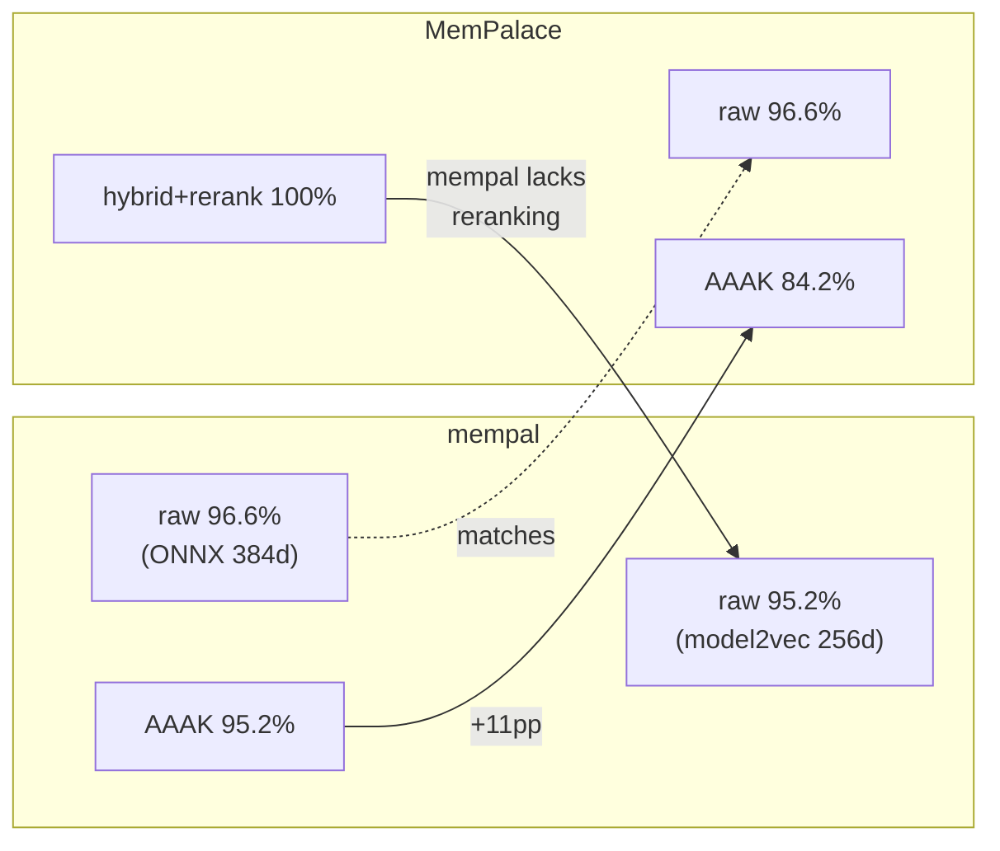

# 第30章：诚实的差距

> **定位**：本章用数据记录 mempal 目前还不是什么。与其让读者自行发现局限性，不如先行坦白。前置阅读：详见第26-29章（构建了什么）。适用场景：评估 mempal 是否适合你的使用场景。

---

## 数据

在讨论差距之前，先看支撑本章的 benchmark 结果。所有数据来自 `benchmarks/longmemeval_s_summary.md`，在 LongMemEval `s_cleaned` 数据集（500 个问题，53 个会话）上本地运行。

### 384d 基线 (ONNX MiniLM-L6-v2)

| Mode | R@1 | R@5 | R@10 | NDCG@10 | Time |
|------|-----|-----|------|---------|------|
| raw + session | 0.806 | **0.966** | 0.982 | 0.889 | 415s |
| aaak + session | 0.830 | 0.952 | 0.974 | 0.892 | 502s |
| rooms + session | 0.734 | 0.878 | 0.896 | 0.808 | 422s |

### 256d Model2Vec (potion-base-8M)

| Mode | R@1 | R@5 | R@10 | NDCG@10 | Time |
|------|-----|-----|------|---------|------|
| raw + session | 0.816 | **0.952** | 0.976 | 0.888 | 102s |
| aaak + session | 0.806 | 0.948 | 0.972 | 0.883 | 116s |
| rooms + session | 0.744 | 0.868 | 0.890 | 0.808 | 84s |

### 与 MemPalace 的对比

| System | Mode | R@5 | API Calls |
|--------|------|-----|-----------|
| mempal (384d) | raw | **96.6%** | Zero |
| mempal (256d) | raw | **95.2%** | Zero |
| MemPalace | raw | **96.6%** | Zero |
| mempal (384d) | AAAK | **95.2%** | Zero |
| MemPalace | AAAK | **84.2%** | Zero |
| MemPalace | hybrid+rerank | **100%** | API calls |

诚实的解读：mempal 在 raw 检索上与 MemPalace 持平，在 AAAK 上显著超越（95.2% vs 84.2%，BNF 文法 + jieba 重做带来了 11 个百分点的提升）。但 mempal 没有达到 MemPalace 的 hybrid+rerank 100%——那条路径需要 API 调用进行 reranking，而 mempal 在零依赖默认配置中刻意省略了这一点。

---

## 差距 1：Model2Vec vs 完整 Transformer 质量

从 ONNX MiniLM (384d) 切换到 model2vec (256d) 是用检索质量换部署简易性：

| Metric | 384d | 256d | Delta |
|--------|------|------|-------|
| R@5 (raw) | 0.966 | 0.952 | **-1.4pp** |
| NDCG@10 | 0.889 | 0.888 | -0.001 |
| Speed | 415s | 102s | **4x faster** |
| Native deps | ONNX Runtime (~200MB) | None | **Zero** |

取舍是可度量的：1.4 个百分点的 R@5 换来零原生依赖和 4 倍速度提升。对于个人开发者工具来说，这很可能是可接受的。对于每一点精度都至关重要的系统（医疗记录、法律发现），则不然。

`onnx` feature flag 为需要最大质量但接受更重安装的用户保留了完整 transformer 路径。

---

## 差距 2：非英文搜索退化

在开发过程中经验性测试发现：中文查询"它不再是一个高级原型"返回了无关的 AAAK 文档，而非目标状态快照。同一查询翻译成英文——"no longer just an advanced prototype"——立即命中了正确的 drawer。

model2vec 多语言模型（`potion-multilingual-128M`）改善了这一点——中文查询不再完全落空——但英文查询的检索可靠性仍然更高。实际差距：

- **英文查询**：目标 drawer 通常在 top-1 或 top-3
- **中文查询**：目标 drawer 可能出现在 top-3 但相似度更低，或被误报挤出

MEMORY_PROTOCOL Rule 3a（"TRANSLATE QUERIES TO ENGLISH"）是一个变通方案，利用了所有 mempal 消费者都是能够翻译的 LLM 这一事实。这不是模型级别的修复。真正的解决方案需要更强的多语言嵌入模型或中文专用的 FTS5 分词器——两者都会增加与零依赖目标冲突的复杂度。

---

## 差距 3：没有 Reranking

MemPalace 通过混合搜索 + reranking（使用基于 API 的 cross-encoder）达到 100% R@5。mempal 的混合搜索（BM25 + 向量 + RRF）在没有 reranking 的情况下达到 95-96%。

`Reranker` trait 已经存在（`crates/mempal-search/src/rerank.rs`），默认实现为 `NoopReranker`。一个 ONNX cross-encoder 实现可以弥补这个差距，但它会增加约 50-600MB 的模型权重（取决于所选的 reranker），打破"轻量二进制"的承诺。

架构决策：reranking 是可选增强，而非默认配置。纯 RRF 与 reranked 结果之间 4-5 个百分点的差距是真实的，但对于典型使用场景（找到上周做的一个决策，而非搜索百万文档语料库），RRF 就够了。

---

## 差距 4：知识图谱是手动的

mempal 的 triples 表已激活——agent 可以添加、查询、失效和浏览时间线。但没有自动提取。当 agent 通过 `mempal_ingest` 保存"Kai 基于定价和 DX 推荐 Clerk 而非 Auth0"时，不会自动创建三元组。agent 必须显式调用 `mempal_kg add "Kai" "recommends" "Clerk"`。

MEMORY_PROTOCOL 尚未包含自动三元组提取的规则（提议的 Rule 4a 被讨论过但未在协议中实现）。这意味着知识图谱只在 agent 记得填充时才会增长——根据我们对 Rule 4（SAVE AFTER DECISIONS）的经验，它们有时会忘记。

替代方案——在导入时进行基于 LLM 的提取——与本地优先、零 API 调用的理念冲突。每次导入都需要一个 LLM 调用来提取实体和关系。对于在 `mempal ingest` 期间处理数百个 drawer 的工具来说，这既慢又贵，令人望而却步。

---

## 差距 5：Taxonomy 路由表现不佳

benchmark 数据揭示了一个令人不安的事实：基于 taxonomy 的 room 路由（`rooms` mode）持续不如 raw 搜索。

| Mode | 384d R@5 | 256d R@5 |
|------|----------|----------|
| raw | 0.966 | 0.952 |
| rooms | 0.878 | 0.868 |

Room 路由相比 raw 搜索损失了 8-9 个百分点。这意味着 taxonomy 在 LongMemEval 上目前*损害*了检索精度，而非提升。

可能的原因：LongMemEval 的问题分布与 mempal 的默认 taxonomy 不匹配。跨越多个 room 的问题被路由到了错误的范围。详见第7章记录的 Wing/Room 过滤带来的 34% 提升，那是在 MemPalace 的 benchmark 上测量的——那里的 taxonomy 大概是为数据调优的。mempal 通过 `mempal init` 自动检测的 taxonomy 可能对任意数据集校准不佳。

这并不否定空间结构这一概念——它验证了让 taxonomy 可编辑而非固定的设计决策。但这确实意味着开箱即用的 taxonomy 路由需要改进，要么通过更好的自动检测启发式，要么通过一个"从搜索反馈调优 taxonomy"的机制（目前尚不存在）。

---

## 差距 6：隧道发现是面向未来的

隧道是可以工作的——我们用一个实际案例做了演示（`mempal-mcp` room 同时出现在 `mempal` 和 `hermes-agent` 两个 wing 中）。但当大多数用户只有一个 wing 时，隧道在实践中提供的价值为零。

这个特性在架构上是健全的（动态 SQL 发现、内联搜索提示、零存储成本），但它在等待多项目使用场景来证明其价值。这是一个基于分析（详见第6章）而非用户需求构建的特性——诚实的评估是，大多数用户可能永远不会用到它。

---

## 这些差距意味着什么

差距分为三类：

**可接受的取舍**（差距 1、3）：model2vec 质量和缺少 reranking 是刻意的选择——以速度和简洁性换取边际精度。`onnx` feature 和 `Reranker` trait 保留了升级路径。

**有变通方案的已知局限**（差距 2、4）：非英文搜索和手动知识图谱是真实的局限，但协议级变通方案（Rule 3a、潜在的 Rule 4a）为目标受众（能翻译和提取的 AI agent）缓解了这些问题。

**未经验证的特性**（差距 5、6）：taxonomy 路由退化和隧道使用不足表明，某些特性是基于分析而非经过使用验证构建的。它们需要真实世界的反馈来证明或否定其价值。

---

## 剩余的阻碍

**对于 crates.io 公开发布**：主要阻碍不再是代码质量（CI 绿灯、测试通过、clippy 干净），而是发布流程——token 管理、发布顺序、版本策略。本章的 benchmark 数据提供了此前缺失的可信度基础。

**对于广泛采纳**："对作者有效"和"对任何人有效"之间的鸿沟尚未跨越。安装只需一条 `cargo install`，但首次运行体验（模型下载、`mempal init`、理解 wing/room 概念）还没有在非工具构建者的用户身上测试过。

**对于本书本身**：本章关闭了第十部分开启的叙事循环。二十五章分析了 MemPalace。五章记录了重写。本章提供了让分析具有可信度的诚实自我评估——因为一本只赞美其主题的书是营销，不是工程。
